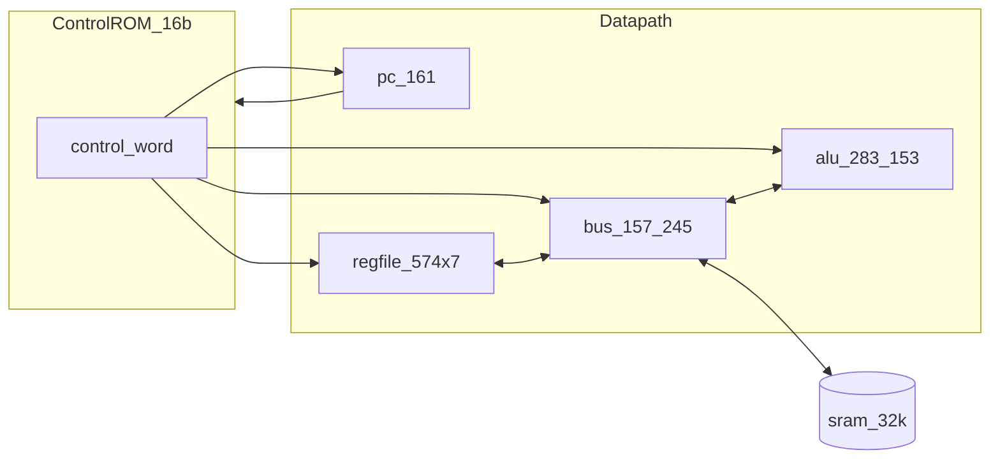
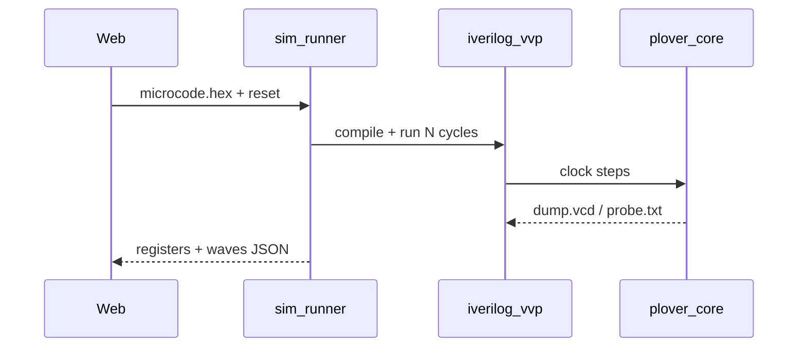

# Plover Verilog 시뮬레이터 계획

## 현재 상태

- 저장소는 [README.md](README.md), [BOM.md](BOM.md), [docs/](docs/) 설계 문서만 존재합니다. **실행 가능한 RTL/시뮬/툴체인 코드는 없습니다.**
- 목표 하드웨어: 16비트 VLIW 제어 워드(Flash×2 병렬) → ALU·7×574·버스·16b PC·32KB SRAM, **1사이클 = 1마이크로명령**, 2 MHz 목표.



## 시뮬레이션 엔진 선택 (Verilog 구동)

| 엔진 | 역할 | 웹 연동 |
|------|------|---------|
| **[Icarus Verilog](https://github.com/steveicarus/iverilog)** (`iverilog` + `vvp`) | 1차 개발·교육·CI. SystemVerilog 일부 지원, 설치 간단(Windows: MSYS2/Chocolatey 또는 WSL). | 로컬 **sim API**가 `iverilog` 실행 → VCD/상태 JSON 반환 → 웹 뷰어 |
| **[Verilator](https://www.veripool.org/verilator/)** | 고속 사이클 시뮬, C++ 모델 생성. 장기적으로 **WASM 빌드**로 브라우저 단독 실행 가능(참고: FPGA 계산기 + Qt Wasm + Verilator v4.x 패턴). | 2단계: `verilator --binary` + 작은 네이티브/WASM 런타임 |
| **cocotb** (선택) | Python으로 마이크로코드·ALU 회귀 테스트 작성 | CI 전용 |

**권장 경로:** RTL은 순수 Verilog-2001 스타일로 작성 → **Icarus로 전 구간 검증** → 성능·브라우저 내 실행이 필요해지면 Verilator + WASM를 추가. 브라우저에서 iverilog를 직접 돌리는 것은 비현실적이므로, **웹 UI는 로컬 sim-runner(또는 dev 시 Docker)를 호출**하는 구조가 1단계에 적합합니다.

## 아키텍처 고정 (시뮬 전에 문서화)

[README.md](README.md)의 16비트 필드를 **시뮬레이터의 단일 진실 소스**로凍結합니다. 새 파일 [`docs/microcode-spec.md`](docs/microcode-spec.md)에 다음을 명시:

| 필드 | 비트 | 시뮬에서의 의미 (초안) |
|------|------|------------------------|
| `alu_sel` | [3:0] | ADD, SUB, AND, OR, XOR, NOT, PASS_A, PASS_B, … (최대 16; README “32~64 opcode”는 **마이크로 루틴 조합**으로 해석) |
| `reg_sel` | [3:0] | 7개 574 중 src/dst 인코딩 (예: 3b reg + 1b read/write) |
| `bus_ctl` | [3:0] | 157/245: ALU→버스, REG→버스, MEM read/write, 주소 MUX |
| `branch` | [3:0] | PC+1, PC←imm, BEQ/BNE, carry/zero 플래그 래치, MMIO strobe |

- **레지스터 이름** (R0~R6 또는 ACC/TMP/PC_HOLD 등)과 **플래그** (C, Z)를 문서·어셈블러·RTL에서 동일하게 사용.
- 16비트/8비트 확장 연산(README 2사이클 시퀀스)은 **마이크로 프로그램 라이브러리**로 제공 (`lib/mul8.micro`, `lib/add16.micro`).

이상적(ideal) 1단계: `#delay` 없음, 콤비네이셜 ALU 출력은 클록 상승 직전에 안정화된다고 가정(실제 283 캐리 50ns는 2단계 `ifdef TIMING`으로 추가 가능).

## RTL 구조 (BOM 칩 → 행위 모델)

저장소 루트에 `rtl/`, `sim/`, `tools/`, `web/`, `sim-runner/` 디렉터리를 추가합니다.

```
rtl/
  alu/
    hc283_cascade.v    # 4b×2 → 8b 가산, Cout 체인
    hc153_mux4.v       # 듀얼 4:1 (산술/논리 경로 선택)
    alu8.v             # 86/08/32 + 283 + 153 통합, alu_sel 입력
  reg/
    hc574.v            # 8b 레지스터, clk, oe, we
    regfile.v          # ×7 인스턴스
  bus/
    hc157_mux2.v
    hc245_tris.v
    databus.v
  mem/
    control_rom.v      # 16b 폭, $readmemh, PC 주소
    sram256.v          # 32K×8, 단순 동기 RAM
  cpu/
    pc161.v            # 16b PC + branch
    plover_core.v        # 1사이클 FSM: fetch CW → execute
sim/
  tb_alu8.v            # ALU 단독 벡터 테스트
  tb_plover_core.v     # 전체 코어 + VCD
tools/
  microasm.py          # 텍스트 → .hex (control ROM)
  macroasm.py          # ADD R1,R2 → 마이크로 시퀀스 (2단계)
  pack_rom.py          # dual 8b flash 이미지 병합 (하위/상위 바이트)
sim-runner/
  main.py              # FastAPI: compile, run, parse VCD → JSON
web/
  (Vite + React)       # 블록 다이어그램, 메모리/마이크로코드 편집, Run/Step
```

### 구현 순서 (README 로드맵과 정렬)

1. **`alu8` + `tb_alu8`** — 283 캐스케이드, SUB(86 invert), AND/OR/XOR, 153 출력 MUX. BOM의 ALU 12 IC를 **하나의 `alu8` 모듈**로 추상화하되, 내부는 `hc283`/`hc153` 서브모듈로 “연결” 구조를 유지.
2. **`regfile` + `databus`** — 574 래치, 버스 충돌 검사(`$error` if multiple drivers).
3. **`control_rom` + `pc161` + `plover_core`** — 매 posedge: ROM[CW] → 필드 디코드 → ALU/REG/BUS/PC 갱신.
4. **`sram256`** — LOAD/STORE 마이크로명령 검증.
5. **MMIO / 138** — 스텁(디코드만, RP2350B·인터리브는 **Phase 2**, README 항목 5~6).



## 마이크로코드·프로그램 작성 흐름

### 1) 마이크로어셈블러 (`tools/microasm.py`)

예시 문법 (가독성 우선):

```text
; addr 0x0000
alu ADD | reg W=R1,R0=R2 | bus ALU_TO_R0 | pc INC
```

- 각 라인 → 16비트 워드 → `rom_low.hex` / `rom_high.hex` (SST39SF010A×2 병렬 모델).
- 웹 에디터: 4개 필드를 비트필드 UI + Monaco 텍스트 **양방향 동기화**.

### 2) 매크로 프로그램 (`tools/macroasm.py`, 2단계)

- 사용자가 익숙한 **의사 ISA** (ADD, LOAD, JMP …) → 마이크로 루틴 테이블 확장.
- 곱셈/16비트 연산은 README대로 **8~16 / 2 사이클** 루틴을 라이브러리로 링크.

### 3) 검증

- `sim/tb_*.v`: 고정 벡터 (ADD, SUB, branch).
- cocotb 또는 Python: `microasm` 출력을 ROM에 로드 후 golden cycle count 비교.

## 웹 UI ([사용자 선택: web](user choice))

**스택:** Vite + React + TypeScript, Monaco Editor, 커스텀 파형 뷰(VCD JSON) 또는 [wavedrom](https://wavedrom.com/) 임베드.

| 화면 | 기능 |
|------|------|
| **ALU Lab** | A/B/alu_sel 입력, 조합 결과·내부 283 Cout/Z/C 플래그 표시 (RTL `tb_alu8`와 동일 신호명) |
| **Core** | PC, 7 레지스터, SRAM 창, control ROM hex 그리드 |
| **Editor** | 마이크로코드 텍스트 + 16비트 필드 슬라이더 |
| **Run** | Reset / Step / Run N cycles, 클록 2 MHz 표시(시뮬은 실시간 wall-clock 무관) |
| **Waves** | VCD에서 추출한 ALU, bus, reg 신호 |

**로컬 실행:** `sim-runner` (FastAPI) + `web` dev proxy. Windows 개발 시 **WSL2에 iverilog 설치**하거나 MSYS2 패키지를 README에 명시.

**장기:** Verilator WASM으로 sim-runner 의존 제거(오프라인 단독 데모).

## 개발 환경·CI

- `Makefile` 또는 `justfile`: `make sim-alu`, `make sim-core`, `make rom`, `make web-dev`.
- GitHub Actions: Ubuntu + `apt install iverilog`, `make test` → RTL 회귀.
- [README.md](README.md) 상태 체크리스트에 “시뮬레이터 MVP” 항목 추가.

## 범위 밖 (의도적 연기)

- RP2350B, SN74LVC8T245, Apple II식 인터리브(φ0/φ1) — 문서만 링크, RTL 스텁.
- Flash JEDEC 프로그래밍(74HC595) — 실기 아두이노 플로우와 별도; 시뮬은 hex 파일만.
- 게이트 레벨 전파지연·74HC 데이터시트 `t_pd` — `TIMING` ifdef 2단계.

## 리스크·완화

| 리스크 | 완화 |
|--------|------|
| 16비트 필드가 하드웨어 배선 전이라 미정 | `docs/microcode-spec.md` 버전 필드 + 시뮬만 먼저 고정, 브레드보드 후 역동기화 |
| Windows에서 iverilog 설치 | WSL2 권장 + `sim-runner` Docker 이미지 |
| VLIW “opcode 64개” vs 4비트 ALU sel | **마이크로 루틴 = 여러 CW**로 정의; 단일 CW는 제어 신호 1세트 |

## 산출물 요약

| 산출물 | 사용자 가치 |
|--------|-------------|
| Verilog `alu8` → `plover_core` | BOM 연결 구조를 코드로 추적, 브레드보드 전 검증 |
| `microasm` + ROM hex | SST39SF010A에 넣을 비트 패턴 사전 검증 |
| 웹 ALU Lab / Core | 마이크로코드·프로그램 작성·단계 디버깅 |
| CI 테스트 | 회귀 방지 |

첫 마일스톤 완료 기준: **ALU Lab에서 ADD/SUB/AND가 iverilog와 웹에서 일치** → 이어서 **전체 코어에서 3~5줄 마이크로 프로그램이 PC·레지스터·SRAM을 기대대로 갱신**.
