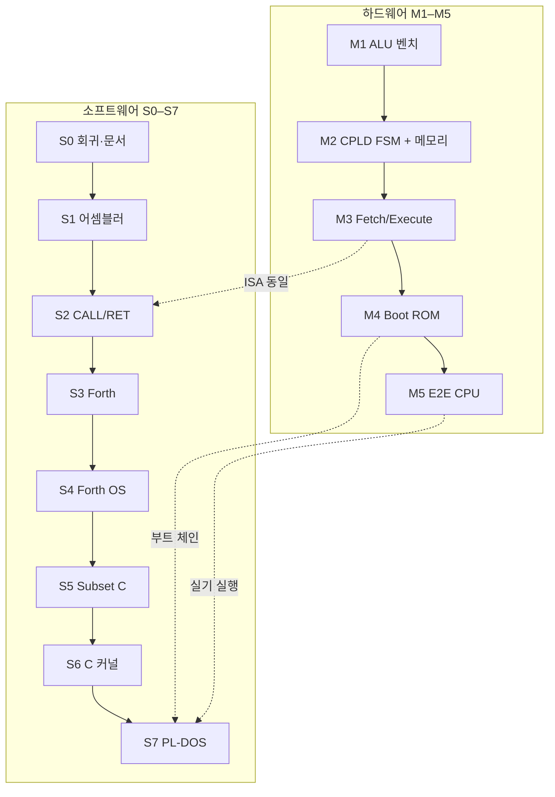

# Plover 프로젝트 백서

**Version:** 1.0 (Gi1) · **Date:** 2026-07-06  
**Status:** Normative overview — Gi1 (AC+MBR) v1.0; rev G (3-GPR·TFR) archived 2026-07  
**Audience:** 교육 설계자, 학습자, 기여자, 외부 검토자

**관련 정본:** [system-architecture.md](reference/hardware/system-architecture.md) (v1.0) · [software-roadmap.md](reference/software/software-roadmap.md) (S0–S7) · [hw-bringup/README.md](reference/hw-bringup/README.md) (M1–M5)

---

## 1. 이 문서가 하는 일

Plover는 **74HC 디스크리트 로직으로 만드는 8비트 CPU** 프로젝트입니다. 하드웨어 명세, 소프트웨어 로드맵, 부트 체인이 여러 문서에 나뉘어 있어 **한눈에 보기 어렵습니다.** 본 백서는 다음을 **한 문서**에 정리합니다.

| 주제 | 본 문서 § | 세부 정본 |
|------|-----------|-----------|
| 교육 목적·목표 | §2 | [compiler-isa-audit-v1.0.md](reference/software/compiler-isa-audit-v1.0.md) §10 |
| ALU | §4 | [alu-opcodes-timing.md](reference/hardware/alu-opcodes-timing.md) |
| 컴퓨터 구조 (조직) | §5 | [cpld-system-controller.md](reference/hardware/cpld-system-controller.md) |
| 컴퓨터 아키텍처 | §6 | [microcode-spec.md](reference/hardware/microcode-spec.md) |
| 어셈블러 | §7 | [plover-asm.md](reference/software/plover-asm.md) |
| 인터프리터 | §8 | [forth-system.md](reference/software/forth-system.md) |
| OS | §9 | [software-roadmap.md](reference/software/software-roadmap.md) |
| 검증 (bring-up) | §10 | [hw-bringup/README.md](reference/hw-bringup/README.md) |

**본 문서가 하지 않는 일:** 핀 배선표, BOM 수량, 마이크로코드 비트 필드, 개별 테스트 케이스 — 각 정본 문서를 따릅니다.

---

## 2. 교육 목적과 목표

### 2.1 프로젝트가 존재하는 이유

Plover는 **“컴퓨터가 어떻게 동작하는가”를 손으로 만지며 배우는** 것을 목표로 합니다. 현대 PC·스마트폰은 수억 게이트와 수십 년의 추상화 위에 있어, Fetch–Decode–Execute, ALU, 메모리 맵, MMIO, 부트로더, OS가 **관측 가능한 형태**로 남아 있지 않습니다.

Plover는 의도적으로 다음을 선택합니다.

| 원칙 | 교육적 의미 |
|------|-------------|
| **디스크리트 TTL + 빵판** | 논리 게이트·래치·버스를 눈과 멀티미터로 추적 |
| **단일 클럭·결정적 동작** | IRQ 없음 — 타이밍과 시퀀스를 스코프로 검증 |
| **얇은 추상화 계층** | Hex → Asm → Forth → Subset C → OS를 **단계적으로** 도입 |
| **현대 주변과의 접점** | RP2350 copro — MMIO·가상 FDD·디스플레이로 “작은 SoC” 경험 |

### 2.2 학습 목표 (역량)

학습자가 프로젝트를 끝까지 밟으면 다음을 **설명하고 실증**할 수 있어야 합니다.

1. **디지털 논리:** 조합 회로 지연, 래치 setup/hold, 2 MHz 반주기 예산
2. **ALU 설계:** 산술·논리 연산을 MUX·283 가산기·플래그로 구현
3. **컴퓨터 구조:** PC/MBR/레지스터 파일·데이터 버스·메모리 디코드
4. **컴퓨터 아키텍처:** ISA, 다중 마이크로 페이즈, 분기, MMIO
5. **시스템 소프트웨어:** 어셈블러, 스택 인터프리터(Forth), 호출 규약, 커널, 셸
6. **검증:** 실기 bring-up 게이트(M1–M5), 오실로스코프·LED 관측

### 2.3 교육 커리큘럼 (하드웨어 ↔ 소프트웨어 정렬)

두 축 — **실기 bring-up (M1–M5)** 와 **소프트웨어 스택 (S0–S7)** — 을 같은 ISA 위에서 맞춥니다.



| 교육 단계 | 하드웨어 초점 | 소프트웨어 초점 | 관측 가능한 결과 |
|-----------|---------------|-----------------|------------------|
| **1. Bare metal** | M1 ALU 단독 | Hex·수동 버스 | LED/스코프로 Y, C, Z |
| **2. Datapath** | M2 GPR·SRAM·ROM CE | `plover_asm` 1-pass | ADD 3-phase, LDA/STA |
| **3. Control** | M3 CPLD FSM·fetch | Forth primitives | BEQ, MMIO poll |
| **4. System** | M4 boot·Mailbox | Forth OS·Subset C | 부트 POST, vFDD |
| **5. OS** | M5 통합 CPU | PL-DOS shell | `.PLR` 실행, 쉘 |

**언어 진화 경로 (로드맵 채택안):**

```
기계어/Hex → Plover Assembly → Forth (인터프리터) → Subset C (컴파일) → PL-DOS (C 커널 + Forth 쉘)
```

### 2.3.1 S5/S6와 하드웨어 제약 (Subset 조건)

v1.0 normative 하드웨어는 **IRQ 없음**, **하드웨어 SP/프레임 포인터 데이터패스 없음**, **MMIO 폴링 전용**입니다. 소프트웨어 상위 단계는 이 부분 집합 위에서만 설계됩니다.

| 마일스톤 | 하드웨어 전제에 따른 제한 |
|----------|---------------------------|
| **S5 Subset C** | **정적 할당(Static Allocation)** — 재귀·가변 스택 없음; 지역 변수·매개변수는 고정 RAM 셀에 배치 ([subset-c.md](reference/software/subset-c.md)) |
| **S6 C microkernel** | **협력형(Cooperative)** 스케줄 + **폴링 I/O** — 선점형 멀티태스킹·IRQ 드라이버는 v1.0 범위 밖 (§2.4·§9.3) |

### 2.4 의도적으로 넣지 않은 것

교육 범위를 지키기 위해 **v1.0 normative**에서 제외된 항목:

| 항목 | 이유 |
|------|------|
| **IRQ / 선점형 스케줄** | 컨텍스트 저장·벡터 설계 부담; 협력형(Forth)으로 OS 입문 |
| **MMU / 페이징** | 미채택 — flat 64 KiB only |
| **범용 3-address ALU** | 8비트 ACC형 + **RAM 변수** (Gigatron식); Gi1 ADD→R0 |
| **C 전체** | Subset C(C0)로 커널·컴파일러 교육 목표 달성 |

---

## 3. 프로젝트 한눈에 보기

### 3.1 v1.0 시스템 스펙

| 항목 | 내용 |
|------|------|
| **CPU** | 8-bit TTL datapath: **alu8** (12×74HC DIP) + **ATF1504** 내부 **R0 (AC) only** (Gi1) |
| **제어** | **FSM-only** — CPLD phase FSM; Flash param 없음; **`alu8_decode` 블록 없음** |
| **Opcode field** | 프로그램 바이트 `opcode[7:0]`; **CPLD FSM 키 = `opcode[4:0]`** (5비트) |
| **idx5** | `fsm_index = (opcode[4:0] << 2) \| phase[1:0]` — **128 논리 슬롯, CPLD 내부만** |
| **IR[4]** | **574 IR → CPLD `OPC[4:0]`** (+1 제어 넷 vs archived idx4) |
| **Flash `$4000`** | **미배선·미소각** — boot/program ROM만 ([rom-architecture.md](reference/hardware/rom-architecture.md)) |
| **ISA** | Core `0x01–0x0F`; **`0x10–0x1F` reserved** (TFR removed); `0x0C` reserved |
| **메모리** | 64 KiB flat (2×32K SRAM, A15 뱅크); Boot ROM @ `$0000` |
| **I/O** | MMIO Mailbox `@$FF00–$FFFB` (폴링만) |
| **Copro** | RP2350 — vFDD, VDU, HID (별도 보드) |
| **클럭** | 2 MHz 목표 (Execute 반주기 250 ns) |

**CPLD 핀·FSM 정본:** [cpld-system-controller.md](reference/hardware/cpld-system-controller.md) · **Gi1 routing:** [cpld-dual-routing.md](reference/hardware/cpld-dual-routing.md) · **rev G archive:** [archive/rev-g-dual-3gpr/README.md](archive/rev-g-dual-3gpr/README.md)

### 3.2 제어·데이터경로 (FSM-only)

v1.0은 Flash param 행 없이 **fetch 경로 + CPLD FSM** 만으로 오퍼랜드·분기를 처리합니다.

**Fetch:** PC → ROM/SRAM → **IR(opcode byte)** + **MBR(operand/imm)**.

**Operand 라우팅 (Flash param 없음):**

| 매크로 | 오퍼랜드 출처 |
|--------|---------------|
| LDA, STA, CMP, LDIO, STIO | imm8/abs16 — **MBR** (fetch 시 래치) |
| ADD | imm8 → **MBR** → ALU B (`net_mbr`); result **R0** |
| BEQ, JMP | abs16 — MBR / operand latch |
| CALL | abs16 target — MBR; **return PC** pushed on software stack @ macro_end |
| RET | **popped return PC** → PC (not MBR); stack pop @ macro_end |

**분기:** CMP/ADD ph0에서 ALU가 **Z/C** 설정 → **574 FLG** → macro_end에서 `PC_LOAD_EN` (BEQ=`FLG_Z`, JMP/CALL/RET=무조건).

**CPLD 핀 요약** (Gi1 dual — 상세: [cpld-system-controller.md](reference/hardware/cpld-system-controller.md)):

| 칩 | In | Out SoC | Out G-IC / datapath |
|----|-----|---------|---------------------|
| **CPLD-CU** | `OPC[4:0]`, `FLG_Z`, `CLK` | 14 strobes → ALU/MEM/PC | G-IC **`reg_we`** → DP |
| **CPLD-DP** | `d_in[7:0]`, G-IC, `CLK` | `q_a[7:0]` → ALU A | MBR→`net_b` (off-chip) |

**G-IC:** `reg_we` only (CU→DP).

**Opcode → FSM:** ADD/CMP→`ALU_REG`, LDA/LDIO→`MEM_LD`, STA/STIO/STA16→`MEM_ST`, BEQ→`BEQ`, JMP/CALL/RET→`BRANCH`, HALT→`HALT`. Frozen idx5 LUT: **22 active rows** ([M3a-control-store.md](reference/hw-bringup/M3a-control-store.md) §2). **`0x10–0x1F` invalid** (no comb TFR).

### 3.3 검증 (학습자 경로)

| 계층 | 방법 | 검증 대상 |
|------|------|----------|
| **실기** | M1–M5 bring-up, 오실로스코프 | [hw-bringup/README.md](reference/hw-bringup/README.md) |
| **FSM 테이블** | opcode×phase 논리 일치 (bring-up 체크리스트) |

개발자용 사전 검증: [archive/MANIFEST.md](archive/MANIFEST.md).

---

## 4. ALU (Arithmetic Logic Unit)

### 4.1 역할

ALU는 CPU의 **순수 조합 데이터패스**입니다. 두 8비트 피연산자 A, B와 제어 신호(`cin`, `net_bctrl0..3`, `lgc`, `y_mux`)를 받아 결과 Y와 carry를 만듭니다. v1.0 SoC에서는 **제어가 CPLD FSM에서 직접** 나가며, 별도 `alu8_decode` SOP 블록은 사용하지 않습니다 (M1 벤치·P1 bypass용으로만 잔존). [control-and-decode.md](reference/hardware/control-and-decode.md)

### 4.2 연산 집합

12개 `alu_sel` 연산 (요약):

| Mnemonic | 동작 | 플래그 |
|----------|------|--------|
| NOP | Y = 0 | 유지 |
| ADD | Y = A + B | C, Z |
| SUB | Y = A − B (2의 보수) | C, Z |
| AND, OR, XOR, NOT | 비트 논리 | Z |
| PASS_A, PASS_B | 버스 통과 | Z |
| INC, DEC | A ± 1 | C, Z |
| CMP | SUB와 동일 (결과 버스 미구동) | C, Z |

정본: [alu-opcodes-timing.md](reference/hardware/alu-opcodes-timing.md) · 실기 치트시트: [b3-opcode.md](reference/hw-bringup/b3-opcode.md).

### 4.3 타이밍과 교육 포인트

- **Worst-case:** INC **153 ns** @ 74HC max — 250 ns Execute 반주기 내 **97 ns slack**; SUB/CMP **136 ns** (**114 ns** slack)
- **교육:** 학습자가 opcode별 경로(가산기 vs 논리)를 M1 스코프·[b3-opcode.md](reference/hw-bringup/b3-opcode.md)로 확인
- **Bring-up:** M1에서 ALU만 단독 조립·검증 후 M2에서 CPLD와 결선

### 4.4 ISA와의 연결

| 매크로 | ALU 사용 |
|--------|----------|
| ADD | 3-phase: R0→A, MBR→B, ADD→**R0** |
| CMP | CMP 연산, flags_only |
| BEQ | ph0에서 SUB로 Z 설정 |

---

## 5. 컴퓨터 구조 (Computer Organization)

**컴퓨터 구조**는 “부품과 배선” — 데이터가 **어디를 지나가는가**에 초점을 둡니다.

### 5.1 주요 블록

```text
  [PC 574] [MBR 574] [FLG 574]
         │                    │
  IR ──► CPLD (R0 + FSM) ──► alu8 ──► 데이터 버스
         │                    │
         └── q_a(R0) ─────────┘
              MBR 574 ────────► ALU B (off-chip)

  A[15:0] ──► 138×2 + glue ──► /CE ──► SRAM×2, SST39 Flash
                    │
                    └── Mailbox @ $FF00 (우선 디코드)
```

### 5.2 레지스터 파일 (cpld_ac_mbr, Gi1)

| 레지스터 | 읽기 포트 | 쓰기 |
|----------|-----------|------|
| **R0 (AC)** | 고정 → ALU A (`q_a`) | FSM `reg_we` (ph2 ADD, LDA, …) |
| **MBR 574** | 고정 → ALU B (`net_mbr`→`net_b`) | fetch operand latch only |

**Gi1**의 의미: ALU A는 CPLD **R0**만; ALU B는 **MBR**에서 직접 공급. 추가 GPR·`q_b` 없음. 변수·스크래치는 **RAM** ([calling-convention-v0.1.md](reference/software/calling-convention-v0.1.md)).

### 5.3 메모리·디코드

| 범위 | Boot 모드 | Run 모드 |
|------|-----------|----------|
| `$0000–$07FF` | Boot ROM | RAM |
| `$0800–$FEFF` | RAM | RAM |
| `$FF00–$FFFB` | Mailbox | Mailbox |
| `$FFFC–$FFFF` | ROM 벡터 | RAM 벡터 |

물리: **74HC138×2** + 08/32/04 glue — CPLD는 주소 디코드에 관여하지 않음 ([memory-map.md](reference/hardware/memory-map.md)).

### 5.4 시퀀서 하드웨어

| 부품 | 역할 |
|------|------|
| **574×3** | PC, MBR, FLG (PARAM 래치 없음) |
| **161** | PC 상위 비트 확장 |
| **ATF1504** | phase FSM, GPR, `PC_LOAD_EN`, ALU 제어 |

---

## 6. 컴퓨터 아키텍처 (Computer Architecture)

**컴퓨터 아키텍처**는 “프로그래머가 보는 기계” — **ISA, 명령 형식, 제어 흐름**에 초점을 둡니다.

### 6.1 명령 집합 (v1.0)

**Opcode 인코딩 (5비트 FSM 필드):**

| Class | Opcode range | 길이 | Operand |
|-------|--------------|------|---------|
| Core macro | `0x01–0x0F` (패킹된 subset) | 1–3 B | imm8 / abs16 / implied (RET, HALT) |
| Reserved / invalid | `0x10–0x1F`, `0x20+` | — | breadboard 미사용 (구 TFR 폐기) |

**코어 매크로 (`0x01–0x0F`):**

| Opcode | Mnemonic | 요약 |
|--------|----------|------|
| `0x01` | ADD | R0 ← R0 + imm |
| `0x02` | LDA | mem → R0 |
| `0x03` | STA | R0 → mem |
| `0x04` | BEQ | Z이면 분기 |
| `0x05` | JMP | 무조건 점프 |
| `0x06` | CALL | 서브루틴 (abs16; 리턴 PC 스택 push) |
| `0x07` | RET | 복귀 (스택 pop → PC) |
| `0x08`/`0x09` | LDIO/STIO | MMIO load/store |
| `0x0A` | HALT | 정지 |
| `0x0D` | CMP | R0 − imm, 플래그만 |
| `0x0F` | STA16 | 16-bit 절대 저장 |

`0x0C` (구 MOV) 및 **`0x10–0x1F` (구 TFR)** 는 breadboard에서 **reserved/invalid**. rev G TFR 정본: [archive/rev-g-dual-3gpr/README.md](archive/rev-g-dual-3gpr/README.md).

**물리 디코드:** IR[4:0] → CPLD idx5 FSM (**22-row** LUT); Flash `$4000` CW **미사용** ([microcode-spec.md](reference/hardware/microcode-spec.md)).

정본: [plover-whitepaper.md](plover-whitepaper.md) §6 → [microcode-spec.md](reference/hardware/microcode-spec.md).

### 6.2 제어: FSM-only (cw_fsm_only)

v1.0은 **CPLD FSM opcode 테이블**로 마이크로 시퀀스를 구동합니다. Flash `$4000` CW 인덱스는 **미사용** (boot/utility ROM만). idx5 control store: **22 active rows**; **no `tfr_valid`** (Gi1).

FSM 템플릿: `ALU_REG`, `MEM_LD`, `MEM_ST`, `BEQ`, `BRANCH` (JMP/CALL/RET), `HALT`. CALL/RET use **CU return-stack assist** @ macro_end ([microcode-spec.md](reference/hardware/microcode-spec.md) §2.3).

CPLD bitstream: WinCUPL fitter **Design fits** on ATF1504AS (64 macrocell device — part rating only; used MC count not recorded in project docs).

### 6.3 실행 모델

1. **Fetch** — PC → 주소 버스 → opcode → IR
2. **Decode** — opcode → CPLD FSM template 선택 (조합 decode 블록 없음)
3. **Execute** — 1–3 micro-phase; 각 phase에서 ALU/메모리/GPR strobes
4. **Commit** — 분기 시 `PC_LOAD_EN`; 매크로 종료 후 다음 fetch

### 6.4 부트·모드

1. Power-on — `MAP_MODE=Boot`
2. RESET — fetch `@$FFFC` → ROM 벡터 → boot @ `$0000`
3. Bootloader — POST, (선택) vFDD load, kernel → RAM `$0800+`, `JMP`
4. Run — 운영자 DIP 전환 + RESET

[bootloader.md](reference/boot/bootloader.md) · [rom-architecture.md](reference/hardware/rom-architecture.md).

### 6.5 Coprocessor 아키텍처

CPU는 **Mailbox MMIO**로 RP2350과 통신합니다. UART `IN/OUT` 대신 **메모리 맵 I/O** 패러다임을 가르칩니다 ([mailbox-protocol.md](reference/copro/mailbox-protocol.md)).

---

## 7. 어셈블러 (Assembler)

### 7.1 Plover Assembly (`plover_asm`)

| 항목 | 내용 |
|------|------|
| **마일스톤** | S1 |
| **역할** | ISA 1:1 니모닉 → 기계어; 라벨·`.ORG` |
| **출력** | `.hex` / 시나리오용 바이너리 |
| **정본** | [plover-asm.md](reference/software/plover-asm.md) |

### 7.2 교육적 위치

- **Phase 2 (Architecture):** 2-pass 어셈블러 개념 — 심볼 테이블, 재배치
- **Phase 3 (Interface):** 부트로더·드라이버를 asm으로 작성 — MMIO `LDIO`/`STIO`
- **호출 규약:** Gi1 v1.0 `CALL`/`RET` + [calling-convention-v0.1.md](reference/software/calling-convention-v0.1.md) · [microcode-spec.md](reference/hardware/microcode-spec.md) §2.3

### 7.3 예시 (개념)

```asm
        .ORG $0800
START:  LDA $42
        ADD $10        ; imm from MBR → R0 = R0 + imm
        STA $80
        HALT
```

---

## 8. 인터프리터 (Interpreter)

### 8.1 Forth — 1차 인터프리터

| 항목 | 내용 |
|------|------|
| **마일스톤** | S3 (core), S4 (OS services) |
| **왜 Forth인가** | 8비트에 맞는 스택 머신; 컴파일러·OS가 KB 단위; C 프롤로그 부담 없음 |
| **구현** | `forth/interpreter.py`, `crates/plover_forth` |
| **정본** | [forth-system.md](reference/software/forth-system.md) |

**S3 범위:** `DUP DROP SWAP`, `+ - *`, `.`, `:` … `;`, `eval_line`.

### 8.2 BASIC / vCPU (비로드맵·참고)

Tiny BASIC, vCPU 바이트코드는 아카이브 설계 노트에 **교육 대안**으로만 존재합니다. normative 스택은 **Asm → Forth → Subset C**입니다.

---

## 9. 운영체제 (OS)

### 9.1 소프트웨어 스택 개요

| Phase | 마일스톤 | 산출물 |
|-------|----------|--------|
| S4 | Forth OS | 블록 디바이스, 기본 I/O 서비스 — [forth-os-services.md](reference/software/forth-os-services.md) |
| S5 | `plover_cc` | **정적 할당 Subset C** — [subset-c.md](reference/software/subset-c.md) |
| S6 | C microkernel | **협력형·폴링** 커널 — [os-kernel.md](reference/software/os-kernel.md) |
| S7 | PL-DOS | vFDD, PLFS, `.PLR` 로더, Forth 쉘 — [pl-dos-roadmap.md](reference/software/pl-dos-roadmap.md) |

**S5 (Subset C):** 하드웨어에 스택·프레임 포인터 데이터패스가 없으므로, 재귀 호출을 제한하고 지역 변수·매개변수를 **정적 메모리(Static Allocation)** 에 할당하는 특화 규격을 타겟합니다.

**S6 (마이크로커널):** 선점형 멀티태스킹·IRQ를 배제하고, **폴링 I/O**와 **협력형 스케줄링** 기반 베어메탈 구조를 채택합니다.

### 9.2 PL-DOS 목표 구조

```text
  Boot ROM ($0000)
       │
       ▼
  Bootloader — POST, vFDD에서 커널 로드 (Mailbox)
       │
       ▼
  C microkernel @ RAM $0800+  — 메모리, 프로세스(협력형), FS
       │
       ▼
  Forth shell (S7d) — 대화형 명령, .PLR 실행
```

### 9.3 OS 교육 목표

| 주제 | v1.0로 가능 | 추가 하드웨어 필요 |
|------|--------------|-------------------|
| 부트 체인 | ✅ | — |
| MMIO 드라이버 | ✅ Mailbox poll | — |
| 파일 시스템 (PLFS) | ✅ vFDD (RP2350 copro) | — |
| 협력형 멀티태스킹 | ✅ Forth | — |
| **선점형 스케줄·IRQ** | ❌ | IRQ + 컨텍스트 저장 시퀀스 |

### 9.4 메모리 레이아웃 (소프트웨어)

소프트웨어 관점 RAM 사용: [software-memory-layout.md](reference/software/software-memory-layout.md) — SP @ `$0E00`, RP @ `$0F00` 등.

---

## 10. 검증과 품질

### 10.1 하드웨어 게이트 (bring-up)

- M1–M5 체크리스트 Pass ([hw-bringup/README.md](reference/hw-bringup/README.md))
- FSM opcode 테이블 일치 (M3 bring-up 체크리스트)

### 10.2 소프트웨어 게이트

마일스톤별 검증: [software-roadmap.md](reference/software/software-roadmap.md). 개발자 회귀 명령: [archive/MANIFEST.md](archive/MANIFEST.md).

### 10.3 문서 정합성

| 버전 라벨 | 의미 |
|-----------|------|
| **v1.0** | Normative breadboard 하드웨어 (Gi1 AC+MBR, FSM-only idx5) |
| **software v0.1** | S0–S7 소프트웨어 트랙 |

---

## 11. 문서 맵 (전체 색인)

### 11.1 이 백서에서 다룬 주제 → 정본

| 주제 | 정본 문서 |
|------|-----------|
| 교육·컴파일러 적합성 | [compiler-isa-audit-v1.0.md](reference/software/compiler-isa-audit-v1.0.md) |
| 시스템 아키텍처 | [system-architecture.md](reference/hardware/system-architecture.md) |
| ALU | [alu-opcodes-timing.md](reference/hardware/alu-opcodes-timing.md) |
| CPLD·GPR·FSM | [cpld-system-controller.md](reference/hardware/cpld-system-controller.md) |
| ISA·제어 | [microcode-spec.md](reference/hardware/microcode-spec.md) |
| 메모리 맵 | [memory-map.md](reference/hardware/memory-map.md) |
| Bring-up | [hw-bringup/README.md](reference/hw-bringup/README.md) |
| 소프트웨어 로드맵 | [software-roadmap.md](reference/software/software-roadmap.md) |
| BOM | [BOM.md](reference/project/BOM.md) |

### 11.2 문서 허브

- [reference/README.md](reference/README.md)
- [README.md](README.md) — 저장소 진입점

---

## 12. 변경 이력

| 날짜 | 변경 |
|------|------|
| 2026-07-06 | **Gi1 adoption** — R0 only, MBR→ALU B, TFR removed; rev G → archive |
| 2026-06-25 | v1.6 — 외부 공개 정화: §8.2 VM 삭제; 내부 도구·research 링크 제거 |
| 2026-06-24 | v1.5 — §3.2 제어·데이터경로(idx5); §3.3 검증 번호 이동; §6.1 인코딩 표 |
| 2026-06-24 | v1.5 — §2.3.1·§9.1 S5/S6 정적 할당·폴링 철학; §10.3 버전 라벨 표 확장 |
| 2026-06-24 | v1.5 — normative 라벨 v1.0 통일; 학습자 경로 정리 |
| 2026-06-24 | 초판 — 교육 목표, ALU, 구조, 아키텍처, asm, 인터프리터, OS 통합 백서 (v1.0 FSM-only + TFR) |
