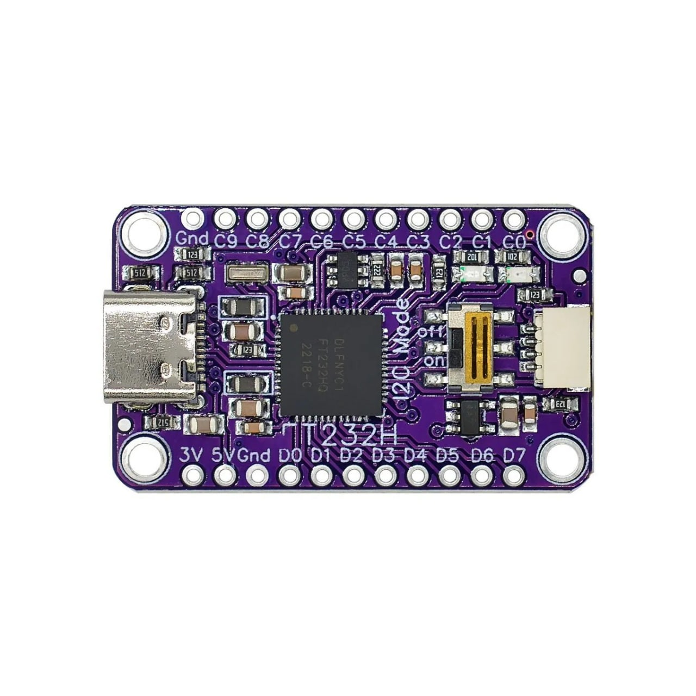

# CPLD JTAG flash wiring — FT232H ↔ ATF1504AS

Target: **ATF1504AS-10JU44** (PLCC-44) · probe: Adafruit-style **FT232H** (OpenOCD `um232h.cfg`).



## Board setup

| Item | Setting |
|------|---------|
| **I2C Mode** | **OFF** (MPSSE / JTAG) |
| CPLD VCC | **5 V** from FT232H **5V** pin |
| **3V** pin | **Do not** connect to CPLD VCC |
| Decoupling | **0.1 µF** between CPLD VCC and GND (socket/adapter) |
| Cable length | **≤ 10 cm** (M2a) |

## Direct wire table (PLCC pin numbers on chip body)

| FT232H silk | JTAG / power | ATF1504AS PLCC | Direction |
|-------------|--------------|----------------|-----------|
| **D0** | TCK | **32** | Host → CPLD |
| **D1** | TDI | **7** | Host → CPLD |
| **D2** | TDO | **38** | CPLD → Host |
| **D3** | TMS | **13** | Host → CPLD |
| **Gnd** | GND | **10, 22, 30, or 42** | Common |
| **5V** | VCCINT | **3, 15, 23, or 35** | Power |

OpenOCD mapping: D0=TCK, D1=TDI, D2=TDO, D3=TMS.

## ASCII

```text
FT232H              ATF1504AS (PLCC-44)
D0  ──────────────► 32  TCK
D1  ──────────────►  7  TDI
D2  ◄────────────── 38  TDO
D3  ──────────────► 13  TMS
Gnd ──────────────► GND
5V  ──────────────► VCC (5 V)
```

## Optional 2×5 JTAG header (1.27 mm, Atmel pinout)

| Header pin | Signal | FT232H |
|------------|--------|--------|
| 1 | TCK | D0 |
| 2 | GND | Gnd |
| 3 | TDO | D2 |
| 4 | VCC | 5V (target) |
| 5 | TMS | D3 |
| 9 | TDI | D1 |
| 10 | GND | Gnd |

## Verify before flash

```powershell
cd cpld_fsm/tools
./install-openocd.ps1
./jtag-probe.ps1
```

Expect: `tap/device found: 0x0150403f`
