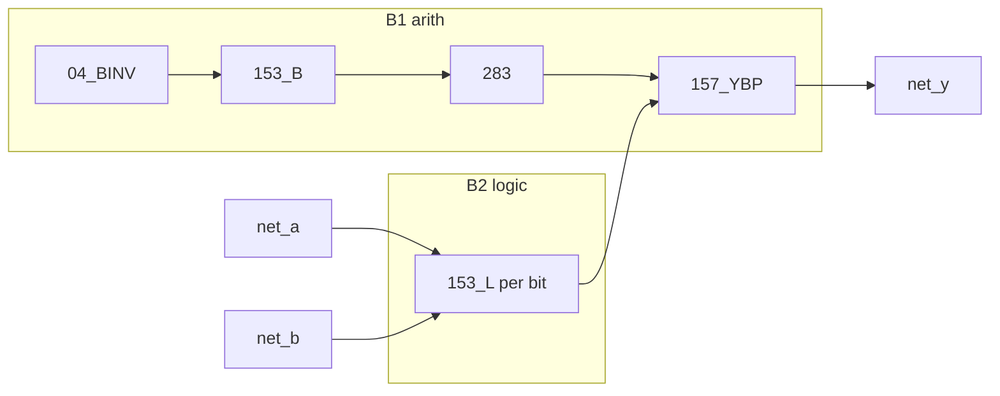

# ALU Phase B — Gigatron 153 logic + B1 arith bypass

**Status:** **implemented** (2026-06-02)  
**Netlist:** [`tools/gen_alu8_netlist.py`](../tools/gen_alu8_netlist.py) Phase B2

## Architecture

| Layer | Blocks | Role |
|-------|--------|------|
| **B1 (frozen)** | `153_B×4`, `04_BINV`, `283×2`, `157_YBP×2` | SUB/ADD/INC/DEC/CMP **Y** |
| **B2** | `153_L×8` (`ALU_153_SLICE`) | AND/OR/XOR/NOT/PASS via Gigatron mux trick |
| **CMP** | `ALU_CMP_SUB` | Z/C_GE from SUB (`Y==0`, `net_c_hi`) — no 7485 |
| **Glue** | `ALU_Y_MUX_SEL` | `net_y_mux_sel = s0 \| s1` → 157 picks sum vs logic |



## Gigatron 153 slice (per bit)

`sel = A | (B<<1)` where **A** = `net_a[i]`, **B** = `net_b[i]`:

| sel | A | B | C0 | C1 | C2 | C3 | Result |
|-----|---|---|----|----|----|-----|--------|
| 0 | 0 | 0 | * | * | * | * | C0 |
| 1 | 0 | 1 | * | * | * | * | C1 |
| 2 | 1 | 0 | * | * | * | * | C2 |
| 3 | 1 | 1 | * | * | * | * | C3 |

### Opcode → C0..C3 (`net_lgc0..3`, shared 8-bit)

| Op | lgc0 | lgc1 | lgc2 | lgc3 | Notes |
|----|------|------|------|------|-------|
| NOP | 0 | 0 | 0 | 0 | Y=0 |
| AND | 0 | 0 | 0 | 1 | A&B |
| OR | 0 | 1 | 1 | 1 | A\|B |
| XOR | 0 | 1 | 1 | 0 | A^B |
| NOT | 1 | 0 | 0 | 0 | ~A (B=0 in tests) |
| PASS_A | 0 | 0 | 0 | 1 | A&FF → use B=all 1 in stimulus |
| PASS_B | 0 | 0 | 0 | 1 | FF&B → use A=all 1 in stimulus |
| ADD/SUB/INC/DEC/CMP | * | * | * | * | Unused; `157_YBP` selects **sum** |

Golden vectors: [`tools/alu8_cases.py`](../tools/alu8_cases.py) — all 12 opcodes bit-exact in hwsim.

## Critical path (unchanged B1)

**SUB / CMP (Y)** @ max (hwsim):  
`net_b0` → `04_BINV` → `153_B` → `283` → `157_YBP` → `net_y0` — target **≤160 ns** (B1 measured **151 ns**).

## IC budget (DIP)

| Part | Qty |
|------|-----|
| 74HC283 | 2 |
| 74HC153 (B-path) | 4 |
| 74HC153 (logic slices, 1 mux/IC) | 4 |
| 74HC157 (YBP) | 2 |
| 74HC04 (~B) | 2 |
| **ALU total** | **14** |

(Logic uses 4 packages with one 4:1 mux each; B-path uses both muxes per package.)

## Regen

```bash
python tools/gen_alu_decode_netlist.py
python tools/gen_alu8_netlist.py
python tools/gen_alu_b3_netlist.py
python tools/gen_alu_b3_clock_netlist.py
python tools/gen_alu8_full_test.py
python tools/gen_alu8_opcode_timing.py
python tools/gen_opcode_cheatsheet.py
python -m hwsim run --all
```

## Optional future

Pack eight logic slices into fewer 153 packages with shared A/B per DIP (Gigatron 10-IC style) — optional BOM/wiring shrink; not required for 2 MHz timing closure.
