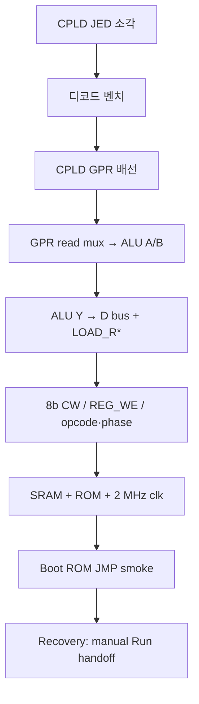

# CPLD 프로그래밍 시방서 (ATF1504AS)

> **Canonical:** [M2a-cpld-decode.md](../../hw-bringup/M2a-cpld-decode.md) (상세) · Boot G1–G5 → [M4b-boot-hardware.md](../../hw-bringup/M4b-boot-hardware.md).

| 항목 | 내용 |
|------|------|
| **대상 IC** | **ATF1504AS-10JU44** (PLCC-44, 64 매크로셀) |
| **역할** | 시스템 디코드, 메모리 CS, 메일박스, **`LOAD_R0..3`**, `REG_SEL`, 리셋 시 `$FFFC` |
| **논리 사양** | [cpld-system-controller.md](../../hardware/cpld-system-controller.md) |
| **hwsim** | [`cpld_system_ctrl.yaml`](../hw/netlist/blocks/cpld_system_ctrl.yaml) · `python -m hwsim run hw/tests/cpld_gpr_decode.yaml` |
| **GPR 저장** | **v1.0:** CPLD 내부 FF — [cpld-system-controller.md](../../hardware/cpld-system-controller.md). Legacy 574×4: [archive/pre-v0.1/](archive/pre-v0.1/README.md) |

> **저장소 상태:** v0.1 기준 **ABEL/JED/핀 락 파일은 아직 리포지터리에 없음**. 본 문서는 **하드웨어·툴체인·검증 절차** 시방이며, 비트스트림 확정 후 `hw/cpld/` 에 산출물을 추가하는 것을 권장합니다.

---

## 1. 왜 CPLD를 먼저 소각하는가

| 순서 | 이유 |
|------|------|
| **ALU 단독(B3a) 이후** | GPR·메모리 디코드 없이 ALU만으로는 시스템 통합 불가 |
| **574 GPR 이전** | `LOAD_R0..3` 없으면 레지스터에 쓸 수 없음 |
| **SRAM/ROM 이전** | `RAM1_CS_N`, `ROM_CS_N`, `MAILBOX_EN` 으로 잘못된 CS 방지 |

권장: **[ALU8 조립 완료](../../hw-bringup/alu8-assembly-spec.md) (B3a)** → **CPLD 소각·벤치 검증** → **[GPR datapath (v1.0)](../../hw-bringup/M2b-gpr-datapath.md)** (legacy 574×4: [hw-bringup-gpr-alu.md](hw-bringup-gpr-alu.md)) → SRAM/ROM/클록.

---

## 2. 필요 장비

| 항목 | 시방 |
|------|------|
| **프로그래머** | ATF1500 계열 ISP 지원 장비 (예: Microchip **Atmel-ICE**, 레거시 **USB Blaster** 호환 케이블 — **데이터시트·툴 호환표 확인**) |
| **소켓** | PLCC-44 **→ 2.54 mm DIP 어댑터** ([BOM.md](../BOM.md) #15) |
| **ISP 헤더** | **2×5, 1.27 mm** JTAG (짧은 배선, GND 근접) |
| **전원** | 프로그래밍 중 **3.3 V 또는 5 V** (빵판 CPU는 **5 V** — CPLD VCC와 프로그래머 IO 레벨 일치 필수) |
| **멀티미터** | 소각 후 핀 플로팅·전원 확인 |

---

## 3. JTAG / ISP 헤더 (일반 관례)

ATF1504 PLCC-44는 제조사 **ISP/JTAG** 핀 배치를 따릅니다. **반드시** 사용하는 어댑터·데이터시트의 **Pin Assignment** 표와 대조하세요.

| 신호 (일반명) | 기능 |
|---------------|------|
| **TCK** | 테스트 클록 |
| **TMS** | 모드 선택 |
| **TDI** | 데이터 입력 |
| **TDO** | 데이터 출력 |
| **VCC** | 타깃 전원 (프로그래밍 시 칩 전원 인가) |
| **GND** | 공통 접지 |

**배선 시방**

- 헤더 ↔ CPLD 어댑터: **각 10 cm 이하**, 꼬임쌍 또는 GND와 병행.  
- **0.1 µF** CPLD VCC–GND **최단** (어댑터 4면 권장, [cpld-system-controller.md](../../hardware/cpld-system-controller.md) §7).  
- 프로그래밍 중 **인접 74HC 클록/리셋** 배선이 길면 간섭 가능 — ISP 케이블을 클록 트리에서 멀리.

---

## 4. 소프트웨어 흐름

### 4.1 설계 입력

| 단계 | 내용 |
|------|------|
| 1 | [cpld-system-controller.md](../../hardware/cpld-system-controller.md) 포트·방정식을 **ABEL** 또는 **VHDL** 로 구현 |
| 2 | 핀 할당: `hw/netlist/blocks/cpld_system_ctrl.yaml` 넷 이름과 **CPLD 패드** 1:1 매핑 테이블 작성 |
| 3 | 타이밍: **10 ns** 급 (-10 speed grade) — 조합 경로만 (플립플롭 없음) |
| 4 | Fit → **매크로셀 ≤ 64**, 핀·전원 만족 확인 |

**Reg_Sel / LOAD_R* (필수 포함)**

```vhdl
-- microcode-spec.md / plover_vm/micro/reg_sel.py 와 동일 테이블
LOAD_R0 <= (not Reg_Sel(1) and not Reg_Sel(0)) and REG_WE;
LOAD_R1 <= (not Reg_Sel(1) and     Reg_Sel(0)) and REG_WE;
LOAD_R2 <= (    Reg_Sel(1) and not Reg_Sel(0)) and REG_WE;
LOAD_R3 <= (    Reg_Sel(1) and     Reg_Sel(0)) and REG_WE;
```

`Reg_Sel[1:0]` = f(`opcode[3:0]`, `phase[1:0]`) — ADD 예: ph0→00, ph1→01, ph2→10 ([microcode-spec.md](microcode-spec.md) §3).

### 4.2 산출물 (리포지터리 권장 경로)

| 파일 | 용도 |
|------|------|
| `hw/cpld/system_ctrl.abel` (또는 `.vhd`) | 소스 |
| `hw/cpld/system_ctrl.pin` | 핀 락 |
| `hw/cpld/system_ctrl.jed` | 프로그래밍 이미지 |
| `hw/cpld/README.md` | 툴 버전, 프로그래머, 소각 명령 |

### 4.3 소각 (툴별 개요)

| 툴 (예) | 절차 요약 |
|---------|-----------|
| **Microchip ProChip Designer** / 레거시 **WinCUPL** | Fit → Generate JED → Programmer로 Write |
| **Atmel ISP** (Studio / command line) | Device = ATF1504AS, JED/SVF 로드, Erase → Program → Verify |

**공통 Pass 기준**

- Verify **성공** (재읽기 일치).  
- Blank check 후 재소각 1회 권장(초기 bring-up).

---

## 5. 소각 후 벤치 검증 (CPLD 단독)

CPLD를 **574·ALU와 분리**한 상태에서도 디코드 출력을 측정할 수 있습니다.

### 5.1 hwsim 벡터 대조

```bash
python -m hwsim run hw/tests/cpld_gpr_decode.yaml
```

테스트 요약 ([`cpld_gpr_decode.yaml`](../hw/tests/cpld_gpr_decode.yaml)):

| 시각 | 자극 | 기대 |
|------|------|------|
| t≈120 ns | `REG_WE=1`, opcode/phase → Reg_Sel=10 | `LOAD_R2=1`, 다른 LOAD_* = 0 |
| t≈170 ns | `RESET_N=0` | `ADDR_FORCE_FFFC=1` |

**실기:** DIP·푸시로 `OPC*`, `PH*`, `REG_WE`, `RESET_N` 인가 후 LED/로직프로브로 `LOAD_R*`, `REG_SEL*`, `ADDR_FORCE_FFFC` 확인.

### 5.2 메모리 디코드 스모크

| 조건 | 측정 | 기대 |
|------|------|------|
| `MAP_MODE=0` (Boot), `A15=0`, `RESET_N=1` | `RAM1_CS_N` | 활성(로우) |
| `A` in `$FF00–$FFFB` | `MAILBOX_EN` | 1 |
| `A` = `$FFFC` | `MAILBOX_EN` | **0** (메일박스 비활성) |
| `RESET_N=0` | `ADDR_FORCE_FFFC` | 1 |

상세 맵: [memory-map.md](../../hardware/memory-map.md).

---

## 6. 통합 순서 (CPLD 이후)



### 6.1 Boot ROM bring-up (JMP product path)

| Step | Action | Gate |
|------|--------|------|
| **G1** | NOR: `boot_rom.hex` + `cw.hex` + `boot_vector.hex` | `python tools/gen_boot_fixtures.py` |
| **G2** | `MAP_MODE=0`, RESET → fetch `$0000` (ROM) | Logic probe / `plover_vm scenario hw/scenarios/vm/boot_jmp_handoff.yaml` |
| **G3** | RP2350 + vFDD: sector 0 READ → RAM `$0800` | Mailbox Busy/DataReady LED or serial log |
| **G4** | Auto `JMP $0800` — kernel HALT / GPIO | `tests/test_boot_jmp_handoff.py` |
| **G5** | Recovery: `boot_rom_manual.hex` or DIP Run + RESET | `tests/test_boot_handoff.py` |

Normative flow: [boot-jmp-handoff.md](boot-jmp-handoff.md). ROM layout: `hw/fixtures/sw/boot_rom_head.pls`, copy @ `$0120`, tail @ `$0600`.

GPR·ALU 상세: **[hw-bringup-gpr-alu.md](archive/bringup-legacy/hw-bringup-gpr-alu.md)**.

---

## 7. 오류·재작업

| 증상 | 조치 |
|------|------|
| Verify 실패 | 전원·JTAG 배선·속도(케이블 길이) |
| 전원만 소모, 출력 플로팅 | 잘못된 JED / 핀 락 불일치 |
| `LOAD_R*` 항상 0 | `REG_WE` 미연결, Reg_Sel PLA 누락 |
| RAM CS 반전 | Active-low vs 설계 의도 ([cpld-system-controller.md](../../hardware/cpld-system-controller.md) §4) |
| 소각 후 인접 IC 이상 | ISP GND 루프·클록 간섭 — 전원 OFF 후 재시도 |

---

## 8. 문서·코드 참조

| 리소스 | 경로 |
|--------|------|
| 시스템 아키텍처 | [system-architecture.md](../../hardware/system-architecture.md) |
| 마이크로코드·Reg_Sel | [microcode-spec.md](microcode-spec.md) |
| Reg_Sel 테이블 (Python) | [`plover_vm/micro/reg_sel.py`](../plover_vm/micro/reg_sel.py) |
| CW 패킹 검증 | `python tools/verify_control_store.py` |
| 구매 | [BOM.md](../BOM.md) #14–16 |

---

## 9. 개정 이력

| 날짜 | 내용 |
|------|------|
| 2026-06-02 | 초판 — ISP·소각·벤치 시방 (JED TBD) |
