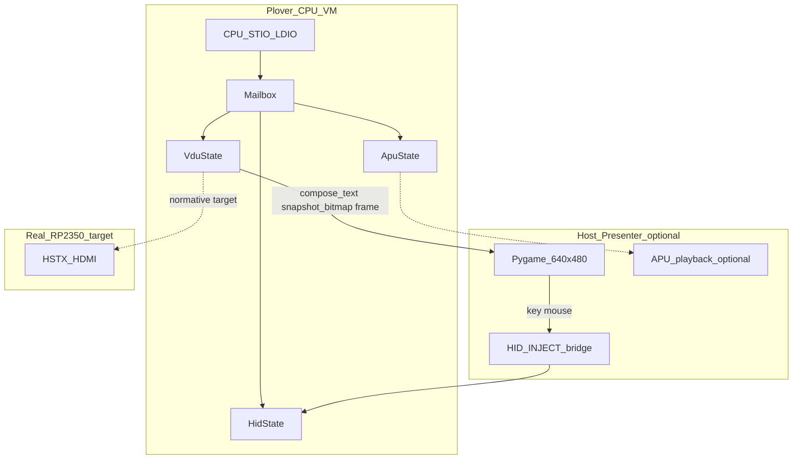

# Plover v0.1 VM Presenter(가상 디스플레이) 설계 질의서 — Pygame 중심

**작성 목적:** 상급 설계자 검토 — `plover_vm`에서 실기(RP2350 HDMI)와 유사하게 동작하는 **통합 VM 환경**(화면·입력·선택적 오디오)의 host Presenter 계층 확정  
**작성일:** 2026-06-08  
**프로젝트:** Plover (8-bit TTL CPU + RP2350B copro, PL-DOS / Forth / VM bring-up)  
**관련 normative:** [system-architecture.md](../../system-architecture.md), [display-console.md](../../display-console.md), [mailbox-protocol.md](../../mailbox-protocol.md), [input-hid.md](../../input-hid.md), [audio-apu.md](../../audio-apu.md)  
**선행 결정:** [Plover-APU-설계-질의-및-결정.md](Plover-APU-설계-질의-및-결정.md) (Mailbox-only copro I/O 패턴)

---

## 1. 배경 — 대화 맥락과 현재 상태

### 1.1 문제 인식 (이번 대화에서 도달한 합의)

Plover VM은 **Mailbox copro 시뮬레이션**(vFDD·VDU·APU·HID)까지 구현되었으나, **“눈에 보이는 통합 머신”** 은 아직 없습니다.

| 관찰 | 상세 |
|------|------|
| **별도 “가상 GPU” 불필요** | `VduState` + host **Presenter** 가 실기 RP2350 VDU/HSTX에 대응 |
| **PL-DOS `run` 출력** | 터미널에 `R0_xx` 한 줄만 — **게임 그래픽 자동 표시 없음** |
| **VDU 상태는 존재** | `.PLR`이 `STIO`로 `VDU_PUTCH`/`GFX_PLOT`을 써도 `VduState`만 갱신, 화면 미러 없음 |
| **입력 경로** | normative는 Mailbox HID `0x40–0x43`; `dos-shell`은 host `input()` (USB 미연동) |
| **오디오** | APU `ApuState` + `mix_samples()` 테스트용; **host 스피커 Deferred v0.2** |

즉 **시뮬레이터 정확도(register/Mailbox)** 와 **체험 품질(live window)** 이 분리되어 있습니다.

### 1.2 이미 확정·구현된 copro 스택 (2026-06-08 기준)

| Copro | Mailbox | VM state | Host driver | Forth | Smoke gate | 펌웨어 stub |
|-------|---------|----------|-------------|-------|------------|-------------|
| vFDD | `0x01/0x02` | `VirtualFdd` | `VfddDriver` | — | dos_boot | ✓ |
| VDU/GFX | `0x10–0x31` | `VduState` | `VideoDriver` | VCLS…GVSYNC | vdu_smoke | ✓ |
| HID | `0x40–0x43` | `HidState` | `InputDriver` | KEY, MOUSE? | hid_smoke | ✓ |
| APU | `0x50–0x53` | `ApuState` | `AudioDriver` | BEEP | apu_smoke | ✓ |

**테스트:** `pytest tests/` → **135 pass** (2026-06-08).  
**의존성:** 저장소 루트 기준 **stdlib + pytest만** ([reviewer-handoff.md](../../reviewer-handoff.md) §3).

### 1.3 Presenter가 없는 현재 CLI

| 명령 | 동작 |
|------|------|
| `plover_vm run` | CPU 실행, 화면 없음 |
| `plover_vm dos-shell` | host 터미널 REPL; VDU 텍스트 **미렌더** |
| `plover_vm vdu-demo` | `compose_text()` 1행 + 픽셀 hex **print** |
| `plover_vm apu-demo` / `hid-demo` | 레지스터/큐 상태 **print** |
| `plover_vm scenario` | YAML gate; assert only |

**`VduState` API (Presenter 입력 후보):**

- `compose_text()` → 40×25 ASCII
- `snapshot_bitmap()` → 320×200 RGB565 LE raw
- `frame` — `VDU_VSYNC`마다 증가
- `mode` — text / bitmap / both

---

## 2. 설계 목표 — “완벽한 VM 환경”이 의미하는 바

본 질의서에서 **완벽한 VM 환경**은 다음을 동시에 만족하는 host 런타임을 뜻합니다 (우선순위는 설계자 확정 필요).

| # | 목표 | 설명 |
|---|------|------|
| G1 | **실기 대응** | CPU는 여전히 Mailbox만 사용; VRAM/IRQ/host hook **CPU 맵에 없음** |
| G2 | **시각적 fidelity** | 320×240 논리 버퍼(텍스트 320×200 + 20px status) → **640×480 nearest 2×** (HDMI normative) |
| G3 | **VSYNC 경계** | `VDU_VSYNC` / `frame` 변화 시 Presenter 갱신 — 실기 30 Hz content |
| G4 | **입력 폐루프** | Pygame(또는 동급) 키/마우스 → `HidState` inject → CPU `HID_*` poll과 동일 경로 |
| G5 | **PL-DOS 통합** | `run GAME.PLR` 후 **창에서** 텍스트·픽셀 게임 확인 (셸 로그와 분리 또는 병행) |
| G6 | **CI/헤드리스** | GUI 없는 환경에서 기존 pytest·scenario **100% 유지** |
| G7 | **선택적 오디오** | APU `mix_samples()` → host playback (v0.2 후보; Presenter와 동기 여부 미정) |

**비목표 (v0.1 Presenter scope에서 제외 후보):**

- CPU ISA 변경, Mailbox 외 MMIO 추가
- 실기 RP2350 HSTX/PIO 타이밍 재현 (hwsim/cyclesim 담당)
- Steam급 입력 latency / vsync adaptive sync

---

## 3. 하드·소프트웨어 제약 (Presenter가 반드시 지켜야 할 것)

### 3.1 Normative 아키텍처

- **단일 I/O 창:** `$FF00–$FFFB` Mailbox, **폴링 only, IRQ 없음**
- **CPU 64 KiB 맵에 framebuffer 없음** — Presenter는 **host-side read-only mirror** of `VduState`
- **텍스트:** 40×25, 8×8 cell, 16색 attr palette
- **비트맵:** 320×200 RGB565; `VDU_MODE`로 text/bitmap/both
- **HDMI 파이프라인 (실기):** 320×240 @ 30 Hz → 2×2 block → 640×480 @ 60 Hz ([display-console.md](../../display-console.md))

### 3.2 VM 런타임 제약

| 항목 | 값 |
|------|-----|
| Python | 3.10+ |
| 현재 deps | stdlib + pytest |
| 엔진 | micro / macro / fast (`PloverMachine`) |
| 실행 모델 | 동기 `run(max_steps)` — **기본은 batch**; live는 **step + presenter tick** 필요 |
| `dos-shell` | blocking `input()` — **GUI 이벤트 루프와 충돌** (별 스레드/프로세스/모드 분리 검토) |

### 3.3 Pygame 도입 시 예상 제약

- **네이티브 의존성:** SDL2 바이너리 — CI Windows/Linux wheel 가용성
- **헤드리스 서버:** `SDL_VIDEODRIVER=dummy` 등 — 테스트 전략 필요
- **패키지 크기:** Pygame vs Pyglet vs Pillow-only — [reviewer-handoff](../../reviewer-handoff.md) “no external packages” 정책과 **충돌**
- **라이선스:** LGPL(Pygame) — 교육/오픈소스 프로젝트 호환성 확인

---

## 4. 제안 아키텍처 — Pygame `VduPresenter` (검토 요청)

대화에서 도출한 **권장 방향**: copro를 복제하지 않고 **Presenter 레이어만 추가**.



### 4.1 컴포넌트 초안

| 컴포넌트 | 책임 |
|----------|------|
| **`VduPresenter`** | `VduState` → pygame Surface; text layer(attr→RGB565 palette) + bitmap blit |
| **`PresenterClock`** | 30 Hz content tick vs 60 Hz window flip (temporal hold 2×) |
| **`HidBridge`** | pygame events → `InputDriver.inject_key/inject_mouse` |
| **`VmSession`** | `PloverMachine` + optional presenter; `step`/`run` interleave |
| **CLI `plover_vm play`** | `dos-shell` / `run` + live window (신규 서브커맨드 후보) |

### 4.2 Pygame 구현 스케치 (의사코드 수준)

```
Surface logical 320×240  # text 200px + status bar 40px (20px margin normative)
on VDU_VSYNC or frame change:
    blit text cells 8×8 font
    blit bitmap 320×200 if mode allows
    scale 2× nearest → 640×480
    pygame.display.flip()
each pygame frame (16ms or 33ms):
    pump events → HidBridge
    machine.run(N steps)  # 또는 VSYNC까지 micro-step
```

### 4.3 대안 (설계자가 Pygame 대신/병행 선택 가능)

| 옵션 | deps | 장점 | 한계 |
|------|------|------|------|
| **A. 터미널 ANSI 40×25** | 0 | CI·dos-shell 즉시 | RGB565 게임 불가 |
| **B. Pillow PNG 스냅샷** | 1 (가벼움) | 회귀 이미지 diff | live 입력·애니 없음 |
| **C. Pyglet** | 1 | 이벤트 루프·입력 깔끔 | Pygame과 유사한 “창 앱” 복잡도 |
| **D. Pygame** | 1 | 예제·팀 친숙도 | SDL 무게, dummy display 설정 |
| **E. 하이브리드** | 0+optional | text=ANSI, game=Pygame opt-in | 이중 코드 경로 |

**내부 논의:** 픽셀 게임 + 마우스 폐루프까지 “완벽”에 가깝게 가려면 **D 또는 C**; **교육·CI 우선**이면 **A → E → D** 단계적 도입.

---

## 5. 미해결 갭 (Presenter 설계 전 필수 정리)

| # | 갭 | 영향 |
|---|-----|------|
| U1 | **텍스트+비트맵 합성 규칙** | `MODE_BOTH`일 때 bitmap 위에 text overlay? RP2350 펌웨어 TBD — VM Presenter가 선행 정의할지 |
| U2 | **status bar 20px** | `VduState`에 status 영역 없음 — Presenter가 단색/프레임 카운터만? |
| U3 | **VSYNC-driven vs wall-clock** | CPU가 VSYNC 안 부르면 화면 정지 — `play` 모드에서 **강제 periodic VSYNC** 여부 |
| U4 | **dos-shell vs play 모드** | 동일 프로세스에서 REPL + pygame loop 불가에 가까움 — 프로세스 분리? |
| U5 | **HID 키맵** | pygame key → ASCII; modifier/shift; `MOUSE?` dx/dy 스케일 |
| U6 | **APU + Presenter 동기** | 22.05 kHz mix를 pygame.mixer와 맞출지, 무음 유지할지 |
| U7 | **의존성 정책** | optional `[presenter]` extra vs core dep 변경 |
| U8 | **테스트 전략** | surface buffer assert vs PNG golden vs scenario only |

---

## 6. 상급 설계자께 드리는 질문

### 6.1 범위·우선순위

1. **v0.1 Presenter normative 범위** — Pygame **전면 채택** vs **optional extra** vs **터미널-only 먼저** 중 무엇을 권하시는지?
2. **“완벽한 VM”의 최소 바(MVP)** — G1–G7 중 **필수 / 권장 / v0.2** 구분은?
3. **PL-DOS `run` 통합** — `play` 전용 CLI vs `dos-shell` 내 `mon gfx on` vs 별도 `plover_vm gui`?

### 6.2 기술 선택 (Pygame 중심)

4. **Pygame vs Pyglet** — Plover(30 Hz, 320×200, Mailbox HID inject) 기준 **단일 권장**은? 결정 기준표 제시 요청.
5. **640×480 창** — normative 2×2 block upscale을 Presenter에서 **필수**로 mirror할지, 320×240 1:1 창 허용할지?
6. **텍스트 렌더** — bitmap font 8×8 (실기 동형) vs pygame built-in font vs pygame.freetype?
7. **`MODE_BOTH` 합성** — bitmap 위 text attr overlay 알파/불투명 규칙?

### 6.3 런타임·동기

8. **실행 모델** — `run(max_steps)` batch 유지 + presenter **후처리 snapshot** vs **실시간 interleave** (매 VSYNC N steps)?
9. **VSYNC 없는 프로그램** — idle 화면 유지·강제 flip·wall-clock presenter 중 권장?
10. **30 Hz content / 60 Hz display** — temporal 2× hold를 Presenter가 **반드시** 구현할지 (실기 HSTX 동형)?
11. **APU playback** — Presenter v0.1에 **포함 / 제외 / optional flag**?

### 6.4 입력·출력 폐루프

12. **키보드** — pygame → ASCII 변환을 host에서 할지, scan code Mailbox 확장(`0x44+`)을 열지?
13. **마우스** — 창 좌표 → absolute position vs **HID normative dx/dy only** 유지?
14. **입력 latency** — key repeat, text field(PL-DOS)와 게임 raw key 분리 필요?

### 6.5 엔지니어링·품질

15. **의존성 정책** — `pyproject.toml` optional `presenter` group; CI 기본 job은 **헤드리스 유지** 동의 여부?
16. **헤드리스 테스트** — `SDL_VIDEODRIVER=dummy` + surface pixel assert vs PNG golden file 위치 (`tests/fixtures/png/`)?
17. **성능 예산** — 320×200 RGB565 blit + 2× scale @ 30 Hz — Python/Pygame **충분**한지 (RP2350이 아닌 host)?
18. **라이선스·배포** — Pygame LGPL이 교육용 키트 배포에 문제 없는지?

### 6.6 문서·롤아웃

19. **normative doc 신설** — `docs/vm-presenter.md` 승격 시기; `display-console.md` §6 VM host 표 갱신?
20. **롤아웃 순서** — VDU mirror only → HID bridge → APU audio → dos-shell 통합 중 권장 단계?
21. **펌웨어 정합** — RP2350 Core1 VDU compose 전 Presenter가 **reference implementation** 으로 acceptable한지?

---

## 7. 제안 롤아웃 단계 (내부 초안 — 설계자 수정 요청)

| 단계 | 산출물 | Pygame | deps |
|------|--------|--------|------|
| P0 | `VduPresenter` read-only; `plover_vm present --snapshot out.png` | 선택(Pillow만 가능) | 0–1 |
| P1 | Live 640×480 window; VSYNC hook | Pygame | optional |
| P2 | `HidBridge` — keyboard + mouse → Mailbox | Pygame | optional |
| P3 | `plover_vm play --pls GAME.PLR` | Pygame | optional |
| P4 | PL-DOS `run` 연동 / status bar | Pygame | optional |
| P5 | APU `pygame.mixer` 또는 stdlib wave | optional | optional |

---

## 8. 결정 기록란 (설계자 회신 후 채움)

| 항목 | 결정 | 비고 |
|------|------|------|
| Presenter 엔진 | *TBD* | Pygame / Pyglet / hybrid |
| deps 정책 | *TBD* | optional extra 권장 여부 |
| 창 해상도 | *TBD* | 640×480 vs 320×240 |
| 실행 모델 | *TBD* | batch vs interleave |
| APU playback | *TBD* | v0.1 포함 여부 |
| CI 전략 | *TBD* | dummy SDL / PNG golden |
| normative doc | *TBD* | `vm-presenter.md` |

---

## 9. 참고 — 실기 vs VM 대응표

| 실기 (RP2350) | VM (현재) | VM + Presenter (목표) |
|---------------|-----------|------------------------|
| Core1 VDU compose | `VduState` | `VduState` (변경 없음) |
| HSTX 640×480 HDMI | 없음 | Pygame window 2× upscale |
| Core0 USB HID | `HidState` + inject | Pygame → inject |
| Core0 APU PWM | `ApuState` | optional mixer |
| Mailbox 폴링 | `LDIO`/`STIO` | 동일 (CPU 경로 불변) |

---

## 10. 첨부 — 검토 시 실행 가능한 스모크

```bash
# 현재 (Presenter 없음)
python -m pytest tests/ -q
python -m plover_vm vdu-demo
python -m plover_vm scenario hw/scenarios/vm/vdu_smoke.yaml

# Presenter 구현 후 목표
python -m plover_vm present --scenario hw/scenarios/vm/vdu_smoke.yaml
python -m plover_vm play --pls hw/fixtures/sw/vdu_smoke.pls --origin 0x00E0
```

---

**회신 요청:** §6 질문에 대해 **Decide / Defer / Reject** 형식으로 답변해 주시면, `docs/vm-presenter.md` normative 초안 및 구현 PR 단위를 확정하겠습니다.
