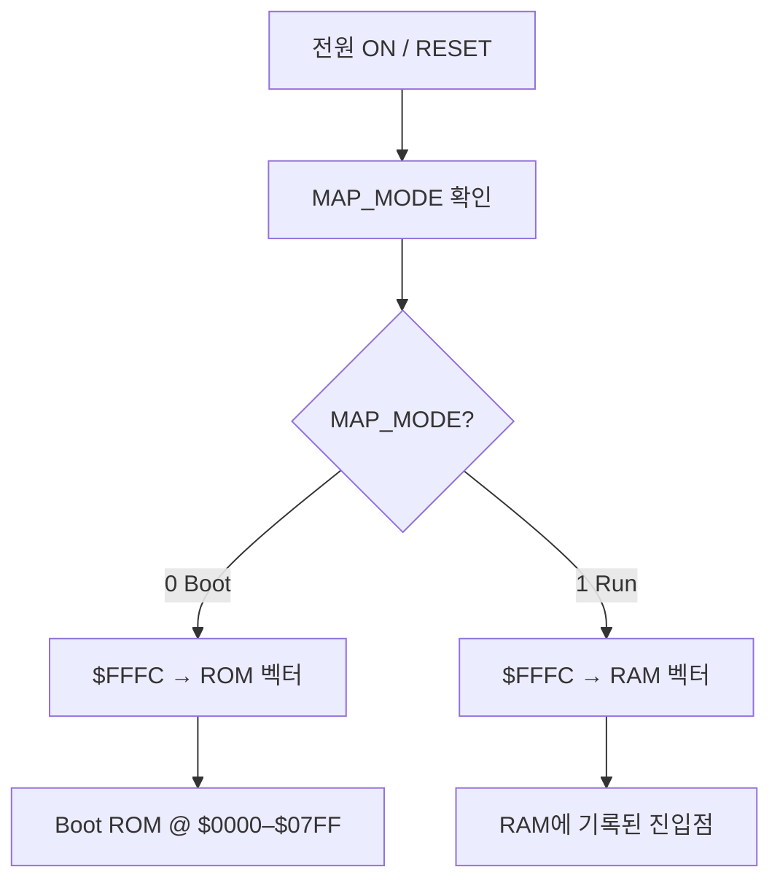
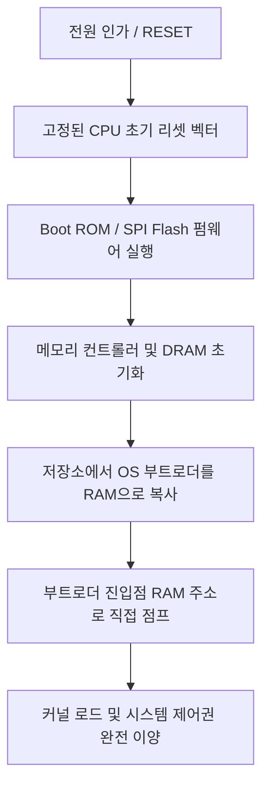
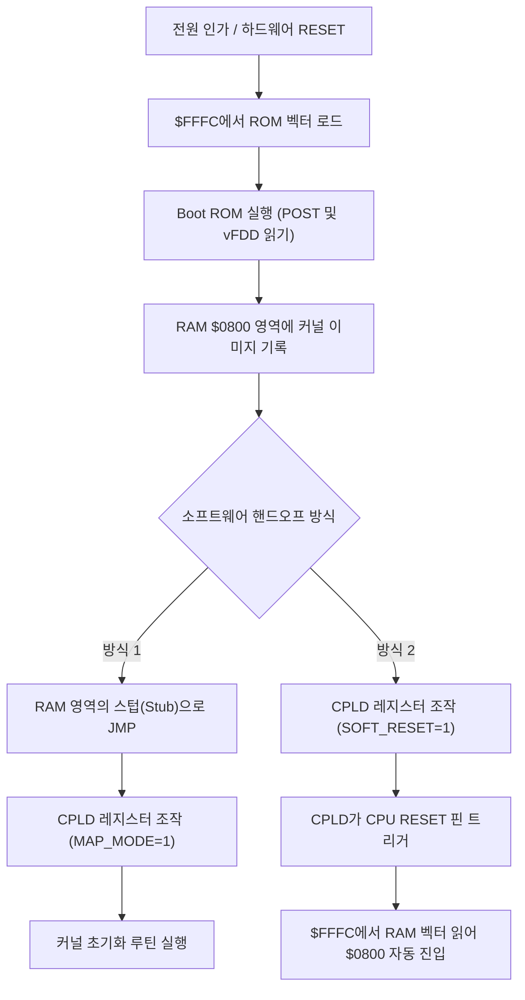

> From: https://gemini.google.com/app/d43424b6ab0d25dc

# you asked

message time: 2026-06-08 08:39:25

Plover의 부팅은 **하드웨어 리셋 → Boot ROM → (선택) OS 로드 → Run 모드 전환** 순서로 이해하면 됩니다. 핵심은 **MAP_MODE**라는 DIP 스위치로 메모리 맵을 바꾸고, 소프트웨어가 자동으로 전환하지 않는다는 점입니다.

---

## 공통: 전원/리셋 시 항상 같은 출발점

전원을 켜거나 RESET을 누르면 CPLD가 **조합 논리**로 CPU의 첫 fetch 주소를 `$FFFC`로 고정합니다. 상태 머신이나 OS 개입 없이, 항상 리셋 벡터부터 시작합니다.



| MAP_MODE | 스위치 | `$0000–$07FF` | `$FFFC–$FFFF` |
|----------|--------|---------------|---------------|
| 0 | **Boot** | ROM (Flash) | ROM 벡터 |
| 1 | **Run** | RAM | RAM 벡터 |

메모리 맵 상세: [memory-map.md](docs/memory-map.md)

---

## 1. OS가 없을 때 (Bare-metal)

이 경우 Boot ROM만 동작하고, RAM `$0800+`에 커널이 없거나 Run 모드로 넘기지 않습니다.

### 흐름

1. **전원 ON** — DIP 기본값 **Boot** (`MAP_MODE=0`)
2. **RESET** — `$FFFC`에서 ROM 벡터 읽기 → Boot ROM 진입 (`$0000` 또는 `$0100` 근처)
3. **Boot ROM이 하는 일**
   - **POST**: RAM spot check, Mailbox ping 등 최소 하드웨어 점검
   - **Stage1 GPIO smoke** (선택): 스위치 입력 → LED 출력 폴링으로 I/O 타이밍 검증 ([baremetal-gpio-smoke.md](docs/baremetal-gpio-smoke.md))
   - **halt** — 여기서 멈춤. MAP_MODE를 바꾸지 않음
4. **끝** — OS 로드·벡터 설치 없이 ROM 안에서만 동작

### 특징

- Flash(SST39)의 **Boot 세그먼트**(`$0000–$07FF`)만 사용
- vFDD(Mailbox `$FF00`)를 쓰지 않으면 디스크 이미지도 필요 없음
- GPIO smoke가 통과하면 “주소/데이터/제어 버스 + 기본 I/O”가 커널 없이도 검증된 상태

```
[Flash ROM]
  Boot code @ $0000
  Reset vec @ $FFFC → $0000
       │
       ▼
  POST → GPIO smoke → HALT
  (Run 모드 전환 없음)
```

---

## 2. OS가 있을 때 (커널 / PL-DOS)

OS가 있으면 Boot ROM이 **로더** 역할을 하고, 운영자가 Run 모드로 넘겨야 커널이 실행됩니다.

### Phase A — Boot 모드에서 ROM이 OS를 RAM에 올림

1. **전원 ON** — `MAP_MODE=0` (Boot)
2. **RESET** — ROM 벡터 → Boot ROM 진입
3. **Boot ROM**
   - POST
   - **vFDD 로드**: RP2350 코프로세서에 Mailbox(`$FF00`)로 `MB_CMD=READ`, 섹터 0 읽기 ([bootloader.md](docs/bootloader.md), [mailbox-protocol.md](docs/mailbox-protocol.md))
   - **RAM 복사**: 읽은 커널/유틸리티를 **`$0800+`**에 기록
   - **벡터 설치**: RAM `$FFFC–$FFFF`에 `$0800` 점프 기록 (Mode B용)
   - **halt** — 여전히 MAP_MODE는 0. 소프트웨어가 자동 전환하지 않음
4. 이 시점 RAM 상태:
   - `$0800+` — 커널/Forth/유틸리티
   - `$FFFC` — `0x00`, `$FFFD` — `0x08` → 진입점 `$0800`

### Phase B — 운영자가 Run 모드로 넘김

5. DIP → **Run** (`MAP_MODE=1`)
6. **RESET** 다시 누름
7. CPU가 `$FFFC`를 **RAM**에서 읽음 → **`$0800`**에서 커널 실행

```
[Boot 모드]                    [Run 모드]
ROM POST + vFDD load    →      RAM $0800 커널
RAM $0800 ← kernel             RAM $FFFC → $0800
RAM $FFFC ← $0800       →      (DIP Run + RESET)
       HALT
```

### OS 부팅 이후 (소프트웨어 스택)

Run 모드에서 `$0800`에 올라온 커널이 이어서 동작합니다. VM/시뮬 기준 흐름은 [os-kernel.md](docs/os-kernel.md), [software-memory-layout.md](docs/software-memory-layout.md)와 같습니다.

| 단계 | 동작 |
|------|------|
| 커널 `boot()` | `kernel_boot` 출력, `devmgr_scan()`으로 슬롯 시그니처 스캔 |
| 장치 등록 | vFDD(`0xA1`), GPIO(`0xC3`), Serial(`0xD4`) 등 |
| PL-DOS | Stage2에서 `COMMAND.PLR` 셸, `HELLO.PLR` 등 `.PLR` 실행 (`$2800+` 로드) |

RAM 레이아웃 요약:

| 영역 | 주소 | 용도 |
|------|------|------|
| 커널 + Forth | `$0800–$27FF` | Run 모드 진입점 |
| PLR 로드 | `$2800–$5FFF` | 사용자 프로그램 |
| Heap/FS | `$6000+` | `kmalloc`, PLFS 캐시 |

---

## 두 경우의 차이 한눈에

| | **OS 없음** | **OS 있음** |
|---|------------|------------|
| Boot ROM | POST + (선택) GPIO smoke | POST + vFDD 섹터 0 로드 |
| RAM `$0800+` | 비어 있거나 테스트용 | 커널 이미지 |
| RAM `$FFFC` | 갱신 안 함 | `$0800` 벡터 기록 |
| Run 모드 전환 | 불필요 | DIP → Run + RESET **필수** |
| 최종 실행 주소 | ROM (`$0000` 영역) | RAM `$0800` (커널) |
| 검증 시나리오 | `rom_gpio_smoke.yaml` | `boot_run.yaml`, `os_boot.yaml` |

---

## 코드/시뮬에서의 표현

`plover_vm`은 위 흐름을 그대로 모델링합니다. `reset()`은 `$FFFC`에서 16비트 진입 주소를 읽어 PC를 설정합니다.

```66:83:d:\Github\plover\plover_vm\machine.py
    def reset(self, map_mode: int | None = None) -> None:
        if map_mode is not None:
            self.bus.map_mode = map_mode & 1
        fa = 0xFFFC
        lo = self.bus.read_cpu(fa)
        hi = self.bus.read_cpu((fa + 1) & 0xFFFF)
        entry = lo | (hi << 8)
        ...
```

- **OS 없음 + Run 핸드오프만**: RAM에 벡터·스텁을 미리 쓰고 `map_mode=1`로 리셋 → PC=`0x0800` ([test_boot_handoff.py](tests/test_boot_handoff.py))
- **OS 있음**: `os_boot.yaml`에서 vFDD 섹터 0 로드 → `kernel.boot()` → 장치 스캔까지 검증

---

정리하면, Plover 부팅은 **항상 ROM 리셋 벡터에서 시작**하고, OS 유무에 따라 Boot ROM이 **halt(베어메탈)** 할지 **RAM에 커널을 올리고 halt(로더)** 할지가 갈립니다. OS가 있어도 커널은 **DIP를 Run으로 바꾸고 RESET**한 뒤에야 `$0800`에서 실행됩니다. 이 수동 핸드오프가 v0.1 설계의 핵심입니다.

이거 현대 범용 컴퓨터 x64나 arm64-vx 같은 데서는 어떻게 하고 있나요? 무슨 차이가 있는 상태일까요?

---

# gemini response

Plover 시스템과 현대 x64, ARM64 범용 컴퓨터의 부팅 아키텍처는 메모리 맵 전환 방식과 실행의 연속성 측면에서 큰 차이가 있습니다. 현대의 범용 시스템은 사용자의 물리적 스위치 조작이나 하드웨어 리셋 없이, 전적으로 소프트웨어와 칩셋 내부의 메모리 컨트롤러를 통해 부팅 단계를 전환합니다.

## 범용 컴퓨터의 부팅 흐름 (x64 및 ARM64)

현대 컴퓨터는 물리적인 메모리 맵 전환(`MAP_MODE` 스위치) 대신 체인 로딩(Chain Loading)이라는 소프트웨어 분기 방식을 사용합니다. 초기 ROM 코드가 다음 단계의 코드를 RAM에 적재한 뒤, 프로그램 카운터(PC)를 해당 RAM 주소로 직접 이동시켜 중단 없이 부팅을 이어갑니다.



### 1. x64 아키텍처 (UEFI 기준)
전원이 인가되면 칩셋이 마더보드의 SPI Flash(펌웨어)를 CPU의 첫 물리 주소(예: `0xFFFFFFF0`)에 매핑해 둡니다. CPU는 항상 이 주소에서 시작하여 초기 하드웨어를 설정합니다. UEFI 펌웨어가 내부적으로 캐시를 임시 RAM으로 사용하여 DRAM 컨트롤러를 초기화해 내면, 시스템 디스크의 ESP 파티션에서 OS 부트로더를 찾아 실제 메인 RAM으로 복사합니다. 이후 펌웨어가 Halt 상태로 대기하지 않고, 복사된 OS 부트로더의 진입점으로 즉시 점프하며, 부트로더가 OS 커널을 로드한 뒤 `ExitBootServices()`를 호출하여 펌웨어에서 OS로 모든 하드웨어 통제권을 넘기게 됩니다.

### 2. ARM64 아키텍처 (일반적인 SoC 기준)
스마트폰이나 싱글보드 컴퓨터 등에 쓰이는 ARM64 SoC는 칩 내부에 공장 출고 시 각인된 Mask ROM(Boot ROM)에서 실행을 시작합니다. 이 ROM 코드가 가장 먼저 실행되어 내부의 작은 고속 메모리(SRAM)를 활성화합니다. 이후 eMMC나 UFS 같은 외부 저장소에서 1차 부트로더(SPL 또는 TFA)를 SRAM으로 가져와 실행합니다. 이 1차 부트로더가 비로소 메인 DRAM 컨트롤러를 초기화하고, 다시 2차 부트로더(U-Boot 등)나 커널 자체를 DRAM에 올린 뒤 점프하여 권한을 넘겨주는 다단계 구조를 가집니다.

---

## Plover와 현대 아키텍처의 핵심 차이점

| 비교 항목 | Plover (v0.1) | 현대 범용 시스템 (x64 / ARM64) |
|---|---|---|
| **부트 플로우 제어** | Boot ROM 작동 후 `HALT` 상태로 중단 대기 | ROM에서 커널까지 끊김 없이 분기하며 연속 실행 |
| **메모리 맵 전환** | **하드웨어 기반:** DIP 스위치(`MAP_MODE`) 물리적 조작 | **소프트웨어 기반:** 메모리 컨트롤러 및 MMU 레지스터 설정 |
| **다음 단계 진입** | 운영자가 직접 리셋 버튼을 눌러 새 벡터 `$FFFC`를 읽음 | 소프트웨어가 다음 코드가 위치한 주소로 `Jump/Branch` 수행 |
| **RAM 초기화 주체** | CPLD 및 하드웨어적 버스 설계로 즉시 사용 가능 | Boot ROM 또는 초기 펌웨어 코드가 복잡한 메모리 훈련 수행 |
| **보안 검증 (Secure Boot)** | 물리적 스위치에 전적으로 의존 (RAM 내용 무조건 신뢰) | 각 단계가 다음 단계의 바이너리 암호학적 서명을 엄격히 검증 |

가장 근본적인 차이는 시스템 제어권 이양을 주도하는 주체에 있습니다. Plover는 시스템 운영자가 하드웨어 스위치를 통해 물리적으로 버스 논리를 변경하고 칩에 리셋 신호를 인가해야만 `$FFFC` 벡터가 변경되어 RAM 상의 커널을 바라보게 됩니다. 반면, 현대 범용 아키텍처는 CPU의 리셋 벡터 위치를 하드웨어적으로 고정해두는 대신, 소프트웨어(펌웨어)가 메모리 컨트롤러 레지스터를 조작해 물리적/논리적 메모리 공간을 유연하게 재배치하고 다음 부팅 단계로 알아서 점프하는 방식을 채택하고 있습니다.

현대 체인 로딩 기반의 부트 아키텍처(UEFI 및 Trusted Firmware)는 사용자의 물리적 개입을 완전히 배제하고 고도로 자동화된 확장성을 이룩하였으나, 비대해진 펌웨어 스택과 수많은 추상화 계층으로 인해 부트킷(Bootkit) 주입이나 서명 우회와 같은 심각한 소프트웨어적 보안 취약점 노출 위험을 수반합니다. 또한, 수십 가지의 주변 장치 드라이버 로드와 복잡한 메모리 훈련(Memory Training) 과정이 직렬로 처리됨에 따라 초기화 단계에서 병목 현상이 발생하고 있으며, 이를 완화하기 위해 최신 플랫폼들은 코어 간 병렬 초기화 및 상태 캐싱을 통한 부팅 단축(Fast Boot) 기술에 의존하고 있는 상태에 놓여 있습니다.

---

# you asked

message time: 2026-06-08 08:41:13

plover에 같은 시스템을 도입하려면 어떻게 해야하나요?

---

# gemini response

## 하드웨어 제어 레지스터 (MMIO) 도입

물리적 DIP 스위치에 의존하는 `MAP_MODE`를 소프트웨어로 제어하기 위해 CPLD 내부에 메모리 맵드 I/O(MMIO) 레지스터를 설계해야 합니다. Mailbox(`$FF00`)와 충돌하지 않는 주소 공간에 시스템 제어 레지스터를 할당합니다.

| 주소 | 레지스터 명칭 | 비트(Bit) | 기능 |
|---|---|---|---|
| `$FF08` | `SYS_CTRL` | `[0]` | `MAP_MODE` 전환 (0: Boot ROM 매핑, 1: RAM 매핑) |
| `$FF08` | `SYS_CTRL` | `[1]` | `SOFT_RESET` (1: CPU 하드웨어 리셋 핀 Active-Low 구동) |

## 소프트웨어 체인 로딩 아키텍처

ROM에서 vFDD 섹터 0 로드가 완료된 후, 운영자의 개입 없이 제어권을 RAM 기반 커널로 이양하기 위한 실행 흐름입니다.



### 방식 1: 메모리 상주 Trampoline 스텁 분기

Plover의 메모리 맵 특성상 `$0800–$FEFF` 구간은 `MAP_MODE`와 무관하게 항상 RAM으로 고정되어 있습니다. 이를 활용하여 리셋 사이클 없이 실행 흐름을 유지한 채 맵핑을 전환합니다.

```assembly
; Boot ROM ($0000 영역) 에서 커널 로드 완료 후 실행
JMP $0800         ; RAM에 적재된 커널 진입점으로 즉시 분기

; ---------------------------------------------------------
; RAM 커널 영역 ($0800 이상) 에서 실행되는 초기화 루틴
KERNEL_ENTRY:
    LDA #$01
    STA $FF08     ; CPLD SYS_CTRL 레지스터의 MAP_MODE 비트 설정
                  ; 이 명령어가 실행되는 즉시 $0000-$07FF는 RAM으로 덮어씌워짐
                  ; PC(Program Counter)는 여전히 $0800 이상을 가리키므로 크래시 없음
    ; 시스템 초기화 지속 진행
```

### 방식 2: 소프트웨어 유도 하드웨어 리셋

현재의 수동 리셋 메커니즘을 가장 완벽하게 모사하는 접근법입니다. 램에 벡터를 미리 작성하고 칩셋 단위에서 스스로를 재부팅합니다.

```assembly
; Boot ROM ($0000 영역) 에서 커널 로드 완료 후 실행
; 1. RAM 리셋 벡터 기록
LDA #$00
STA $FFFC
LDA #$08
STA $FFFD         ; $FFFC-$FFFD에 커널 진입점($0800) 기록

; 2. MAP_MODE 전환 및 CPU 리셋 트리거
LDA #$03          ; MAP_MODE(Bit 0) + SOFT_RESET(Bit 1) 동시 설정
STA $FF08         ; CPLD가 레지스터를 수신하고 CPU RESET 핀을 일정 클럭 동안 풀다운
                  ; CPU는 하드웨어 리셋 시퀀스를 시작하며 $FFFC(RAM)를 읽고 $0800으로 점프
```

소프트웨어 기반의 체인 로딩 및 메모리 맵 전환 아키텍처는 CPLD 내부의 가용 매크로셀(Macrocell) 자원 점유율을 증가시키며, MMIO 레지스터 접근 타이밍과 명령어 패치 사이클 간의 경합(Race condition)을 유발할 수 있는 구조적 위험을 내포하고 있습니다. 실행 흐름 도중 `MAP_MODE`가 변경될 경우 발생하는 버스 트랜잭션 오류 및 예기치 않은 옵코드(Opcode) 실행 문제를 방지하기 위해 CPU 클럭 엣지(Clock edge)와 하드웨어 상태 머신 간의 정밀한 동기화가 필수적이며, 현재의 단순 조합 논리(Combinational logic)에 의존하는 부트 시퀀스를 순차 논리(Sequential logic) 기반의 유한 상태 기계(FSM)로 전면 재설계하는 과정이 요구됩니다.