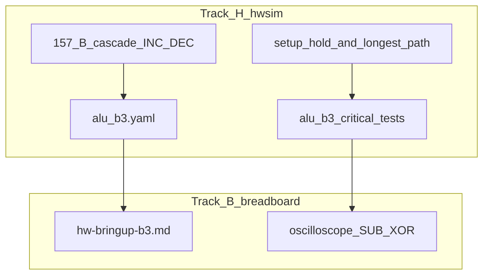

# B3 ALU 타이밍·통합·브링업 계획

## 배경 (현재 갭)

| 영역 | 현재 | 갭 |
|------|------|-----|
| [`hw/netlist/blocks/alu8.yaml`](hw/netlist/blocks/alu8.yaml) | 18 IC, 12 opcode | INC/DEC는 **stimulus가 `net_b` 직접 구동** |
| [`hw/netlist/blocks/reg574.yaml`](hw/netlist/blocks/reg574.yaml) | 574 단독 | ALU `net_y*` ↔ `net_d*` **미연결** |
| [`hwsim/simulator.py`](hwsim/simulator.py) | `_estimate_path_delay` 부분 hop; `check_setup()` **항상 True** | longest path·574 setup **미검증** |
| [`hw/tests/alu8_timing.yaml`](hw/tests/alu8_timing.yaml) | 283→153, 08→153 2경로 | SUB/XOR **전체 체인·574 미포함** |
| 트랙 B3 | roadmap 1행 | **실기 절차 문서 없음** |

목표 클록: **2 MHz** → 조합 경로 예산 **250 ns** (반주기), 574 `t_setup` **5–8 ns (max)** 추가 여유.

---

## 아키텍처 (3 트랙)

---

## 트랙 1 — hwsim 엔진 보강

### 1.1 실제 setup/hold 검사

[`hwsim/simulator.py`](hwsim/simulator.py) `SimContext`:

- `check_setup()` 구현: posedge 직전 `t_setup` 구간에 D(또는 데이터 핀) **wave 샘플**이 안정(0/1)인지 확인
- 위반 시 `ctx.violations`에 `{ref, pin, edge_ns, kind: setup|hold}` 기록
- [`Hc574`](hwsim/models/base.py) / `Hc74`는 기존 `check_setup` 호출 경로 활용

### 1.2 Longest-path slack (명시 경로 + 합산)

[`_estimate_path_delay`](hwsim/simulator.py) 확장:

- hop별 **핀→핀** 지연 테이블 (283는 `sum` vs `cout` 구분, 153/157/86/08/04/32 반영 — 일부는 이미 추가됨)
- 테스트 YAML에 **opcode별 canonical path** 정의 (추정 그래프 자동 탐색은 범위外)

**Worst-case 경로 (max timing, bit0 기준):**

| Opcode | Path (ref.pin hops) |
|--------|---------------------|
| **SUB** | `86_INV_0.A` → `86_INV_0.Y` → `157_B_0.1A/1B` → `157_B_0.1Y` → `157_B2_0.1A` → `157_B2_0.1Y` → `283_LO.B0/A0` → `283_LO.C4` → `283_HI.C4` → `153_0.1C0` → `153_0.1Y` |
| **XOR** | `86_XOR_0.A` → `86_XOR_0.Y` → `157_OUT_0.4A` → `157_OUT_0.4Y` → `153_0.1C3` → `153_0.1Y` |
| **B3 latch** | `153_0.1Y`(=D0) → `574_0.D0` + **setup** vs `574_0.CP` posedge @ 250 ns budget |

신규 check type (선택): `type: path_delay` with `from_net` / `to_net` — wave 기반 **실측 delay** (시뮬 이벤트 시간 차) vs datasheet 합산 **교차 검증**.

### 1.3 리포트

[`hwsim/report.py`](hwsim/report.py): longest path·setup violation을 `timing_report.json` / HTML에 표로 출력 (Wavedrom critical path는 후속).

---

## 트랙 2 — Netlist·테스트

### 2.1 INC/DEC: 157 2단 cascade (+2 IC)

**사용자 선택:** ALU 전용 **157 2단**으로 B / ~B / `0x01` / `0xFF` 4-way.

기존 [`U_ALU_157_B_0/1`](hw/netlist/blocks/alu8.yaml): **1단** — `B` vs `~B` (`net_b_sel` / `net_sub_en` 경로).

**신규 `U_ALU_157_B2_0/1` (74HC157 ×2):**

- `1A` ← 1단 `1Y`, `1B` ← `net_b_const0` (INC: GND, DEC: VCC per bit wiring)
- `S` ← `net_b_const_sel` (0=레지스터 경로, 1=INC/DEC 상수 패턴)
- `1Y` → `net_b_add0` (283 B 입력; 기존 1단 출력 net 이름 재배선)

상수 net (bit i):

- `net_b_inc_i` = (i==0) ? 1 : 0 — `pwr_vcc`/`pwr_gnd` 물리 tie
- `net_b_dec_i` = 1 — `pwr_vcc`

**제어 (VLIW 디코드 stub → 후속 Flash netlist):**

| `alu_sel` | `net_b_sel` | `net_b_const_sel` | `net_sub_en` |
|-----------|-------------|-------------------|--------------|
| INC (9) | 0 | 1 (inc pattern) | 0 |
| DEC (10) | 0 | 1 (dec pattern) | 0 |
| SUB/CMP | 1 | 0 | 1 |

[`alu8.md`](hw/netlist/blocks/alu8.md) · [`BOM.md`](BOM.md) 갱신: ALU 157 **4→6**, 시스템 157 **7→9**, **추가 구매 +2×74HC157 (~800 KRW)**.

### 2.2 통합 netlist `alu_b3.yaml`

신규 [`hw/netlist/blocks/alu_b3.yaml`](hw/netlist/blocks/alu_b3.yaml):

- [`alu8.yaml`](hw/netlist/blocks/alu8.yaml) 인스턴스 + 157_B2 + [`reg574`](hw/netlist/blocks/reg574.yaml) **`U_REG_574_ACC`**
- **`net_y0..7` → `net_d0..7`** (ALU 결과 → 574 D)
- **`net_clk2`** ← [`clock.yaml`](hw/netlist/blocks/clock.yaml) 분주 출력 또는 테스트 stimulus (2 MHz ideal square)
- A 피연산자: 1단계는 stimulus `net_a*` (후속: 574 Q → A)

`include` 스키마는 아직 없음 → **단일 flat YAML** (ref·net 충돌 없이 merge). [`docs/hw-schematic.md`](docs/hw-schematic.md)에 `U_REG_574_ACC` 추가.

### 2.3 테스트

| 파일 | 내용 |
|------|------|
| [`hw/tests/alu_b3_sub_critical.yaml`](hw/tests/alu_b3_sub_critical.yaml) | SUB 0x12−0x34; **full comb path slack** ≥ 0 @ 250 ns |
| [`hw/tests/alu_b3_xor_critical.yaml`](hw/tests/alu_b3_xor_critical.yaml) | XOR 0x12^0x34; C3 경로 slack |
| [`hw/tests/alu_b3_latch.yaml`](hw/tests/alu_b3_latch.yaml) | SUB/XOR 후 **574 posedge**; D setup + Q latch expect |
| [`hw/tests/alu_b3_inc_dec.yaml`](hw/tests/alu_b3_inc_dec.yaml) | INC/DEC via **157_B2** (stimulus는 `alu_sel` decode net만, **`net_b` 직접 구동 제거**) |

기존 [`alu8_full.yaml`](hw/tests/alu8_full.yaml) INC/DEC 케이스를 157 cascade 제어로 **수정**.

완료 기준: `python -m hwsim run --all` PASS (기존 5 + 신규 4 ≈ 9 tests).

---

## 트랙 3 — B3 브레드보드 브링업 (실기)

신규 [`docs/hw-bringup-b3.md`](docs/hw-bringup-b3.md):

### 실장 순서

1. **전원·디커플링** — ALU 18→20 IC (+157×2), 574×1, 클록(선택)
2. **alu8 core** — [`alu8.md`](hw/netlist/blocks/alu8.md) ref 순 (283 → 86 → 157 → 153 …)
3. **574 ACC** — `Y*` → `D*`, `CP` ← 2 MHz
4. **고정 벡터**: SUB `A=0x12,B=0x34`, XOR 동일

### 오실로스코프 (2 MHz = 500 ns 주기)

| 측정 | CH-A | CH-B | 트리거 | Pass 기준 |
|------|------|------|--------|-----------|
| **A→Y (comb)** | `net_y0` 또는 LED | `net_a0` | A edge | SUB/XOR 후 **Y stable < 250 ns** before next clk ↑ |
| **574 setup** | `net_d0` | `net_clk` | clk ↑ | D stable **≥ 5 ns** before clk ↑ (HC574 max) |
| **Longest visual** | `net_y7` | clk | clk ↑ | MSB settling margin |

장비 없을 때: hwsim `waves.json` + [`hw/viewer/index.html`](hw/viewer/index.html)로 **동일 probe** 확인.

### hwsim ↔ 실기 대응

| hwsim | 브레드보드 |
|-------|------------|
| `net_a*` stimulus | DIP / 574 Q (후속) |
| `net_b_const_sel` | CW 디코드 또는 DIP |
| `net_clk` 125 ns half | 74+04 분주 2 MHz |
| FAIL slack | 클록 **1 MHz**로 낮추거나 배선 shorten |

---

## BOM 영향 (이번 계획 추가분)

| 부품 | 이전 ALU | 이번 후 | 추가 |
|------|----------|---------|------|
| 74HC157 (ALU) | 2 | **4** (+B2 cascade) | **+2** |
| 74HC157 (시스템) | 7 | **9** | |
| 핵심 IC | 48 | **50** | |

---

## 권장 구현 순서

1. **hwsim** setup/hold + path hop 테이블
2. **157_B2** + `alu8`/`alu8_full` INC/DEC 수정 + BOM
3. **`alu_b3.yaml`** + critical/latch tests
4. **`docs/hw-bringup-b3.md`** + roadmap B3 완료 기준 갱신

---

## 범위外 (후속)

- Flash→CW 디코드 comb netlist (42 IC 통합)
- KiCad `sheet_alu` / `sheet_b3` 동기화
- breadboard **기생 C** net delay 모델
- bus 157(주소) + 245 + SRAM (B2)

---

## 완료 기준 (마일스톤)

- hwsim: SUB/XOR longest path slack ≥ 0 @ max, 574 setup check **실제 동작**
- INC/DEC: **157 cascade netlist**만으로 PASS (`net_b` stimulus 제거)
- 문서: B3 오실로스코프 체크리스트 + netlist 1:1 ref 표
