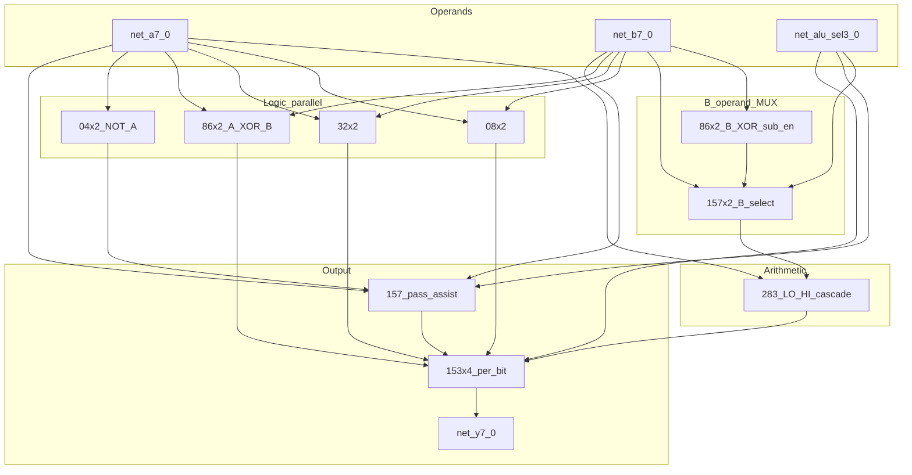

# BOM 74HC 8비트 ALU — netlist·hwsim·BOM 갱신

## 현재 상태

| 항목 | 상태 |
|------|------|
| [`hw/netlist/blocks/alu283.yaml`](hw/netlist/blocks/alu283.yaml) | 283×2 캐스케이드만 (8 IC 중 2) |
| [`hw/tests/alu283_carry.yaml`](hw/tests/alu283_carry.yaml) | ADD 캐리 전파·slack 1종 |
| [`hwsim/models/base.py`](hwsim/models/base.py) | 283/08/32/86 단일 게이트; **153·157 미구현** |
| [`archive/verilog-sim/rtl/alu/alu8.v`](archive/verilog-sim/rtl/alu/alu8.v) | 12 opcode **행위 기준**(golden); 153·INC/DEC용 283 3개는 BOM과 불일치 |
| [`archive/verilog-sim/docs/microcode-spec.md`](archive/verilog-sim/docs/microcode-spec.md) | `alu_sel` 0–11 정의 |

목표: **실제 결선 가능한 netlist** + **hwsim에서 12 opcode 벡터 PASS** + **구매 목록(BOM) 갱신**.

---

## BOM 갭 분석 (12 opcode)

| 요구 | 기존 BOM (ALU 12 IC) | 문제 |
|------|----------------------|------|
| SUB: `B` 2의 보수 | 86×2 (8 XOR) | 8 XOR 전부 `B^sub_en`에 쓰면 **A^B XOR 경로 없음** |
| XOR | 86×2 | 위와 충돌 → **+2× 74HC86** |
| NOT (~A) | (없음) | 8 NOT 필요 → **+2× 74HC04** (6 NOT/칩) |
| INC/DEC | 283×2 | `B=0x01` / `0xFF` 라우팅 필요 → **+2× 74HC157** (B 버스 4-way) |
| PASS_A/B, NOP | 153×4 | 4:1 출력 MUX만으로 부족 → 157로 **153 C-input 보조** (아래 구조) |
| CMP | 283+86 | SUB와 동일 데이터 경로, 플래그만 다름 (시뮬 동일) |

**INC/DEC는 283 2개로 충분** — archived RTL의 3번째 283는 hwsim netlist에서 **157 B-MUX + Cin**으로 대체 (BOM 준수).

---

## 제안 BOM 변경 (ALU 섹션)

| 부품 | 기존 | **변경 후** | 추가 구매 |
|------|------|-------------|-----------|
| 74HC283N | 2 | 2 | — |
| 74HC153 | 4 | 4 | — |
| 74HC86 | 2 | **4** | **+2** |
| 74HC08 | 2 | 2 | — |
| 74HC32 | 2 | 2 | — |
| 74HC157 | 5 (버스) | **7** | **+2** (ALU B-MUX·출력 보조) |
| 74HC04 | 1 (클록) | **3** | **+2** (ALU ~A, 클록 칩과 분리 권장) |

**ALU 블록 IC 합계: 12 → 18** (시스템 전체 핵심 IC: 42 → **48**).

추가 구매 요약 (단가는 [BOM.md](BOM.md) 기준):

- 74HC86 ×2 (~720 KRW)
- 74HC157 ×2 (~800 KRW)
- 74HC04 ×2 (~800 KRW)

`BOM.md` ALU 표·요약(18종→48 IC)·변경 이력에 반영.

---

## 8비트 ALU 데이터 경로



### `alu_sel` → 하드웨어 (블록 테스트·VLIW 공통)

| `alu_sel` | 연산 | B→283 | Cin | 153 S1:S0 | 비고 |
|-----------|------|-------|-----|-----------|------|
| 0 NOP | 0 | don't care | 0 | — | Y←GND |
| 1 ADD | A+B | B | 0 | 00 → sum | |
| 2 SUB | A-B | ~B (`86`+`sub_en=1`) | 1 | 00 → sum | C=~cout |
| 3 AND | | — | | 01 → and | |
| 4 OR | | — | | 10 → or | |
| 5 XOR | | — | | 11 → xor | |
| 6 NOT | | — | | 11 + 157 → ~A | 153 C3 대신 ~A 주입 |
| 7 PASS_A | | — | | 157 → A on path | |
| 8 PASS_B | | — | | 157 → B on path | |
| 9 INC | A+1 | 0x01 (157) | 0 | 00 → sum | |
| 10 DEC | A-1 | 0xFF (157) | 0 | 00 → sum | |
| 11 CMP | A-B | ~B | 1 | 00 → sum | SUB와 동일 Y |

블록 테스트 [`hw/tests/alu8_full.yaml`](hw/tests/alu8_full.yaml)에서는 `net_alu_sel0..3` 및 파생 `net_sub_en`, `net_b_mux_sel`, `net_153_s0/s1`을 **stimulus 테이블**로 구동 (전체 VLIW 디코더는 후속 PC/Flash netlist).

---

## hwsim 구현

### 1. 칩 모델 확장 — [`hwsim/models/base.py`](hwsim/models/base.py)

| 모델 | 내용 |
|------|------|
| **Hc153** | 듀얼 4:1; 핀 `1C0..3`, `2C0..3`, `1Y`, `2Y`, `A`, `B`, `1G`, `2G` (active-low enable) |
| **Hc157** | 쿼드 2:1; `1A/1B/1Y`…`4A/4B/4Y`, `S`, `OE` |
| **Hc08/32/86/04** | 인스턴스별 `gate: 1..4` (YAML) 또는 ref 접미사로 **칩당 4/6 게이트** 분리 |

`create_model()` 등록 + [`hwsim/netlist.py`](hwsim/netlist.py) `KNOWN_PARTS` 유지.

### 2. 메타데이터 — [`hw/models/`](hw/models/)

신규: `74hc153.yaml`, `74hc157.yaml`, `74hc04.yaml`(ALU NOT용 pin map). 기존 `74hc.yaml` 타이밍은 이미 153/157/04 포함.

### 3. Netlist — [`hw/netlist/blocks/alu8.yaml`](hw/netlist/blocks/alu8.yaml)

- 18 IC 전부 인스턴스 (`U_ALU_283_LO/HI`, `U_ALU_153_0..3`, `U_ALU_86_INV_0/1`, `U_ALU_86_XOR_0/1`, `U_ALU_08_0/1`, `U_ALU_32_0/1`, `U_ALU_04_0/1`, `U_ALU_157_B_0/1`, `U_ALU_157_OUT_0/1`)
- 네이밍: [`docs/hw-schematic.md`](docs/hw-schematic.md) `U_ALU_*` 규칙
- probe: `net_y0`, `net_y7`, `net_cout`, `net_sum*`, `net_carry_hi`
- [`alu283.yaml`](hw/netlist/blocks/alu283.yaml) **유지** (서브블록·회귀)

### 4. 테스트 — [`hw/tests/`](hw/tests/)

| 파일 | 내용 |
|------|------|
| **`alu8_full.yaml`** | 12 opcode 벡터; golden = [`tb_alu8.v`](archive/verilog-sim/sim/tb_alu8.v) + NOT/PASS/INC/DEC/CMP/NOP 추가 케이스 |
| **`alu8_timing.yaml`** | critical path: `A0 → 283 → 153 → Y0` 및 `A0 → 08 → 153`; slack ≥ 0 @ max, 500 ns window |
| `alu283_carry.yaml` | 기존 유지 |

완료 기준: `python -m hwsim run --all` **전 테스트 PASS**.

### 5. 문서·BOM

| 파일 | 변경 |
|------|------|
| [`BOM.md`](BOM.md) | ALU 18 IC, 시스템 48 IC, 추가 구매 6개 명시 |
| [`docs/hw-schematic.md`](docs/hw-schematic.md) | ALU ref·net 목록 |
| [`hw/README.md`](hw/README.md) | `alu8.yaml` 링크 |
| [`docs/roadmap-next.md`](docs/roadmap-next.md) | 기준선: ALU 12 opcode PASS |
| **`hw/netlist/blocks/alu8.md`** (신규, 짧게) | 결선 요약·BOM 매핑·`alu_sel` 표 |

---

## 검증 명령

```powershell
cd D:\Github\plover
python -m hwsim validate hw/netlist/blocks/alu8.yaml
python -m hwsim run hw/tests/alu8_full.yaml
python -m hwsim run --all
python -m hwsim export-svg hw/netlist/blocks/alu8.yaml -o build/hwsim/alu8/wiring.svg
```

---

## 범위 밖 (후속)

- KiCad `sheet_alu` 전체 18 IC 동기화 ([roadmap H](docs/roadmap-next.md))
- ALU + 574 래치 통합 netlist (B3 브링업)
- Verilog [`alu8.v`](archive/verilog-sim/rtl/alu/alu8.v)를 netlist와 맞추는 브릿지

---

## 리스크

| 리스크 | 완화 |
|--------|------|
| 153 4-input으로 12 op 라우팅 복잡 | 157 2개로 PASS/NOT/NOP 보조; `alu8.md`에 비트별 결선표 |
| 다게이트 IC YAML 장황 | `gate:` 필드 + ref 규칙 `U_ALU_08_0_G2` |
| SUB carry = ~cout | 테스트 `expect`에 borrow 플래그 명시; [`microcode-spec`](archive/verilog-sim/docs/microcode-spec.md) C 플래그 정의 따름 |
