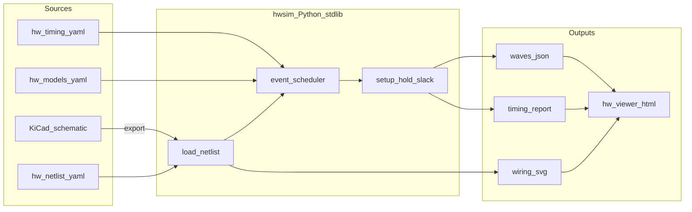

# Plover 전기·타이밍 시뮬레이션 계획 (v2)

## 범위

| 포함 | 제외 (후속 단계) |
|------|------------------|
| KiCad 결선도 + YAML netlist | Verilog RTL / Icarus / Verilator |
| 데이터시트 기반 74HC **전기 행위 모델** | ISA / 마이크로코드 / `.micro` |
| 이벤트 기반 ns 타이밍 시뮬 | `make`, WSL, MSYS2, 외부 EDA 런타임 |
| 블록 단위 검증 (클록→ALU→래치…) | 전체 42 IC CPU 통합 (후속) |
| 정적 브라우저 시각화 | 기존 web/sim-runner Core 탭 연동 |

**가정:** 5 V, 25 °C, 데이터시heet typ/max, C_L 명시. 기생 L/C·net delay = 0.

**목표 클록:** 2 MHz (500 ns 주기) — 블록 critical path가 half-period(250 ns) 이내인지 slack 리포트.

---

## 설계 원칙: make 없이 OS 독립

### 단일 진입점 (모든 OS 동일)

```text
python -m hwsim <command> [args]
```

- **Python 3.10+ stdlib만** — pip 의존성 없음 (CI·로컬 동일)
- Win / macOS / Linux에서 **동일 명령**
- `make`, `bash`, PowerShell 전용 스크립트 **사용하지 않음**

### 명령 체계

| 명령 | 역할 |
|------|------|
| `python -m hwsim validate hw/netlist/blocks/clock.yaml` | netlist·BOM·핀 규칙 검사 |
| `python -m hwsim diff-kicad hw/kicad/... hw/netlist/...` | KiCad netlist ↔ YAML |
| `python -m hwsim run hw/tests/clock_divider.yaml` | 테스트 벡터 + 타이밍 시뮬 |
| `python -m hwsim run --all` | `hw/tests/` 전체 |
| `python -m hwsim report build/run_id/` | slack JSON + Wavedrom + HTML |
| `python -m hwsim export-svg hw/netlist/blocks/alu.yaml` | 결선도 SVG |

### 시각화 (설치 0)

- [`hw/viewer/index.html`](hw/viewer/index.html) — `file://` 또는 임의 정적 서버로 열기
- `report`가 생성한 `waves.json`, `wiring.svg`, `timing_report.json`을 드래그·로드
- Node/Vite **불필요** (기존 [`web/`](web/)과 분리)

### 왜 Verilog/Icarus를 이번 단계에서 빼는가

- 전기 검증은 **핀·넷·데이터시트 지연**이 단일 진실 소스여야 함
- Verilog RTL은 **행위 추상화**가 섞여 netlist↔실기 불일치 추적이 어려움
- Icarus/Verilator/`make`는 OS·PATH·WSL 이슈를 만듦
- ISA는 “무슨 프로그램을 돌리나” 문제 — 클록·ALU·setup/hold 검증과 무관

후속 단계에서 hwsim netlist를 Verilog 생성(`tools/hwsim/to_verilog.py`)하는 **선택적 브릿지**만 열어 둠 (이번 계획에 구현하지 않음).

---

## 아키텍처



---

## 디렉터리 구조

```text
hw/
  netlist/
    schema.yaml              # netlist 스키마 버전
    blocks/
      clock.yaml             # OSC→74→04→2MHz
      alu283.yaml            # 283×2 캐스케이드
      reg574.yaml            # 574 래치 경로
      ...                    # 점진 확장
  timing/
    74hc.yaml                # t_pd, t_su, t_h (typ/max, source URL)
    memory.yaml              # Flash/SRAM access
  models/
    74hc283.yaml             # 핀→행위 (comb, ripple carry chain)
    74hc574.yaml             # posedge latch
    74hc161.yaml
    74hc74.yaml
    74hc04.yaml
    74hc157.yaml
    74hc245.yaml             # tri-state
    74hc138.yaml
    ...
  tests/
    clock_divider.yaml       # stimulus + expected + max_time_ns
    alu283_carry.yaml
    reg574_setup.yaml
  viewer/
    index.html               # SVG + canvas waves + slack table
    app.js                   # vanilla JS, no build
  kicad/
    plover/                  # 계층 KiCad (사람용 결선도)
tools/
  hwsim/
    __main__.py              # python -m hwsim
    cli.py
    netlist.py               # YAML load/validate
    scheduler.py             # priority queue, ns time
    models/                  # 칩별 evaluate()
    report.py                # slack, Wavedrom JSON
    kicad_diff.py
    export_svg.py
docs/
  hw-sim.md                  # 스키마·CLI·칩 모델 규칙
  hw-schematic.md            # KiCad↔YAML 네이밍
```

---

## 데이터 형식 (개념)

### netlist (`hw/netlist/blocks/clock.yaml`)

```yaml
version: 1
block: clock
instances:
  - ref: U_CLK_OSC
    part: OSC_4M
    pins: { OUT: net_osc }
  - ref: U_CLK_74
    part: 74HC74
    pins: { CLK: net_osc, Q: net_clk2, Q_bar: net_clk2_n, ... }
nets:
  - name: net_clk2
    width: 1
    probes: [clk2]          # 파형 덤프 대상
```

### timing (`hw/timing/74hc.yaml`)

```yaml
74HC283:
  t_pd:
    sum:   {typ_ns: 30, max_ns: 45}
    cout:  {typ_ns: 30, max_ns: 45}
  source: "TI/Nexperia datasheet ..."
74HC574:
  t_pd_q: {typ_ns: 15, max_ns: 23}
  t_setup: {typ_ns: 5}
  t_hold:  {typ_ns: 0}
```

### test (`hw/tests/clock_divider.yaml`)

```yaml
netlist: ../netlist/blocks/clock.yaml
timing: max                    # typ | max
duration_ns: 2000
stimulus:
  - at_ns: 0
    set: { net_osc: 0 }
  - at_ns: 125
    toggle: net_osc
expect:
  - at_ns: 500
    net_clk2: 1
checks:
  - type: frequency
    signal: net_clk2
    target_hz: 2000000
    tolerance_pct: 1
  - type: slack
    path: [U_CLK_OSC.OUT, U_CLK_74.CLK, U_CLK_74.Q]
    min_slack_ns: 0
```

---

## hwsim 엔진 (직접 구현)

### 이벤트 스케줄러

- 시간: 정수 **ns** (float 금지 — 부동소수 오차 방지)
- 조합 IC: 입력 edge → `now + t_pd`에 출력 예약 (inertial: 동일 출력 재스케줄 시 이전 이벤트 취소)
- 순차 IC: `posedge clk` 샘플 시 setup/hold 검사 → 위반 시 `X` 또는 `violation` 플래그
- Tri-state (245): `OE`/`DIR`에 따른 Z/H/L 전환 + `t_pz`, `t_pl` (데이터시트 값)
- **Net delay = 0** — 모든 지연은 IC 모델 내부만

### 칩 모델 우선순위 (BOM·로드맵 B1~B3 대응)

| 순서 | 블록 | IC | 검증 목표 |
|------|------|-----|-----------|
| 1 | 클록 | OSC, 74HC74, 74HC04 | 4→2 MHz, 50% duty, 파생 clk |
| 2 | ALU | 74HC283×2, 86, 153, 08, 32 | 캐리 전파 최장 경로, 250 ns 이내 |
| 3 | 레지스터 | 74HC574 | setup/hold @ 2 MHz |
| 4 | PC | 74HC161×4 | 카운트·carry timing |
| 5 | 버스 | 157, 245 | MUX·tri-state 전환 |
| 6 | 디코드 | 138 | CS 디코드 delay |
| 7 | 메모리 | SST39SF010A, IS62C256 | read access vs clk |

복합 IC(283, 153)는 **내부를 데이터시트 블록 다이어그램 수준**으로 모델 (게이트 레벨 전개는 선택·후속).

### ngspice/KiCad SPICE

- **이번 단계 주력 아님** — hwsim이 단일 진실
- KiCad는 **결선도·netlist export·ERC** 용도
- 필요 시 ALU283만 ngspice spot-check (optional, CI 비포함)

---

## 구현 단계

### E0 — 스키마·문서 (~3일)

- `hw/netlist/schema.yaml`, `docs/hw-sim.md`, `docs/hw-schematic.md`
- BOM([BOM.md](BOM.md)) part name ↔ model name 매핑 테이블

### E1 — hwsim 코어 (~1주)

- `scheduler.py`, `netlist.py`, `models/base.py`
- 칩: `74HC74`, `74HC04`, `74HC283`, `74HC574` (MVP 4종)
- `python -m hwsim run hw/tests/clock_divider.yaml` 통과

### E2 — CLI·리포트 (~3일)

- `validate`, `diff-kicad`, `run --all`, `report`, `export-svg`
- 출력: `build/hwsim/<test_id>/waves.json`, `timing_report.json`

### E3 — 블록 netlist·테스트 (~2주, BOM 순)

- `clock`, `alu283`, `reg574` netlist + tests
- max delay 모드 slack 리포트 — **2 MHz PASS/FAIL** 명확히

### E4 — KiCad 결선도 (~2주, netlist와 병렬)

- `hw/kicad/plover/` — `sheet_clock`, `sheet_alu`, `sheet_reg`
- `python -m hwsim diff-kicad` — CI gate

### E5 — 정적 viewer (~1주)

- `hw/viewer/` — SVG pan/zoom, net hover, 파형 캔버스, slack 표
- Wavedrom embed (CDN) — critical path 요약

### E6 — CI (~1일)

- [`.github/workflows/hw-sim.yml`](.github/workflows/hw-sim.yml):
  - matrix: `ubuntu-latest`, `windows-latest`, `macos-latest`
  - step: `python -m hwsim run --all`
  - **make / apt iverilog 없음**

---

## 기존 저장소와의 관계

| 경로 | 이번 계획 |
|------|-----------|
| [Makefile](Makefile), [rtl/](rtl/), [sim/](sim/) | **건드리지 않음** — 별도 트랙 |
| [sim-runner/](sim-runner/), [web/](web/) | ISA/Verilog UI — 후속 연동 |
| [docs/roadmap-next.md](docs/roadmap-next.md) | 트랙 B(하드웨어)와 정합 — Verilog(A1/A4)는 hwsim PASS 후 |

---

## 완료 기준 (이번 계획)

1. **OS 3종 CI**에서 `python -m hwsim run --all` green (make 없음)
2. **clock 블록:** 2 MHz ±1% 주파수 + slack ≥ 0 (max delay)
3. **alu283 블록:** 8비트 carry worst case slack 리포트
4. **reg574 블록:** 2 MHz clk에서 setup/hold violation 0
5. **viewer:** `timing_report.json` + SVG를 브라우저에서 열어 확인
6. **KiCad↔YAML:** clock·alu 시트 diff 0 mismatch

---

## 리스크·완화

| 리스크 | 완화 |
|--------|------|
| 74HC283/153 내부 모델 부정확 | 데이터시heet block diagram + ngspice spot-check (optional) |
| Python 미설치 환경 | viewer는 HTML만으로 리포트 열람 가능; CI는 Python 내장(ubuntu) |
| 42 IC 전체 netlist 부담 | 블록 단위만; 통합은 netlist `include`로 후속 |
| KiCad CI 무거움 | diff-kicad만 필수; ERC는 로컬 |

---

## 후속 (명시적 비범위)

- Verilog RTL / `` `ifdef TIMING`` / Icarus
- 마이크로코드·ISA·macroasm
- `make` → `python -m hwsim`으로 RTL 트랙도 점진 이전 (별 PR)
- hwsim → Verilog netlist 생성 (브릿지)

---

## 권장 실행 순서

1. **E0** — 스키마·문서
2. **E1+E2** — hwsim MVP + CLI
3. **E3** — clock 테스트 (첫 마일스톤)
4. **E5** — viewer (clock 파형 확인)
5. **E3** — alu283, reg574
6. **E4+E6** — KiCad + CI

**한 줄:** KiCad 결선도 + YAML netlist + **Python stdlib hwsim** + **정적 browser viewer** — make·Verilog·ISA 없이 전기·타이밍만 검증.
