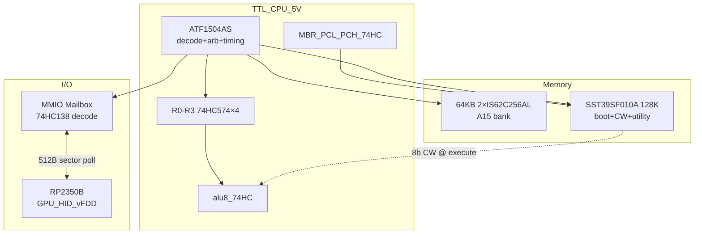
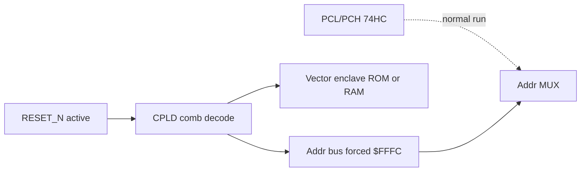
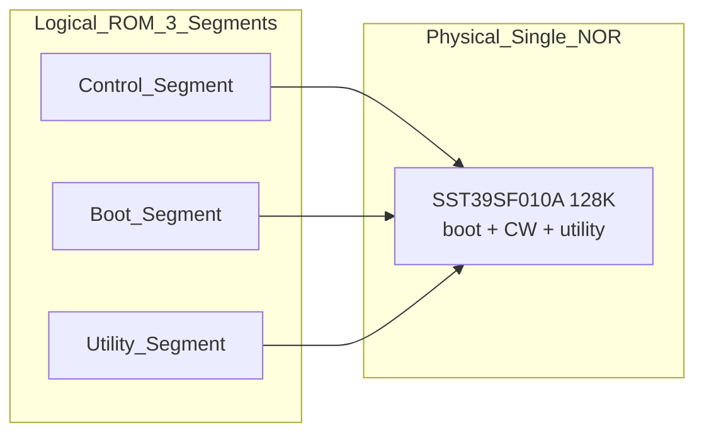
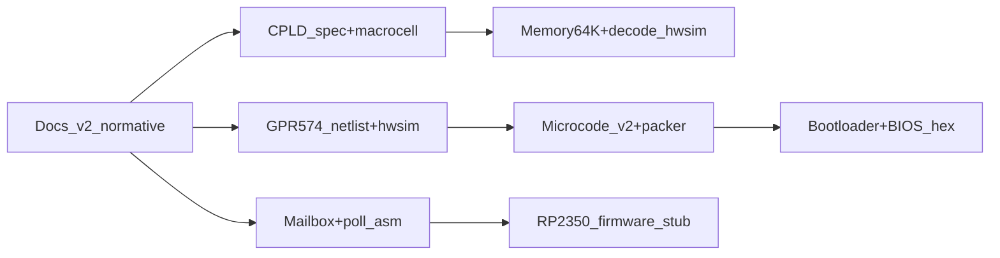

# 최종 시스템 사양 전체 반영 계획

## 확정 아키텍처 (사용자 결정 반영)



| 구분 | 최종 결정 | 현재 repo 상태 |
|------|-----------|----------------|
| CPU | 8-bit ALU + **4×GPR (74HC574 TTL)** | [cpld-hybrid-v1.3.md](docs/cpld-hybrid-v1.3.md) CPLD regfile — **폐기** |
| CPLD | **디코드 + 버스 아비트 + 타이밍 + REG_WE decode** | `cpld_regfile.yaml` — **역할 전환** |
| RAM | **2×`IS62C256AL`** — A15 bank `$0000–$7FFF` / `$8000–$FFFF` | BOM **×1** only |
| **Control Word** | **8-bit** from Flash (see § CW map) | 16-bit v0.2 / pack_control_store v1.0 |
| **NOR Flash** | **`SST39SF010A ×1`** boot+CW+utility | BOM **×2** |
| 제어 | **Single `SST39SF010A`** 8b CW + boot/fonts | [pack_control_store.py](tools/pack_control_store.py) 16b · Flash×2 |
| I/O | MMIO Mailbox, **IRQ 없음** | [microcode-spec-v1.1.md](docs/microcode-spec-v1.1.md) §4에 `STAT`/`DATA` **1줄만** |
| 코프로 | RP2350B (GPU/HID/vFDD) | [archive/gemini](docs/archive/gemini/) brainstorm만, **normative 없음** |
| **Reset** | **`$FFFC` 하드와이어드** (CPLD comb, **상태 레지스터 없음**) | **미반영** |
| **Memory map** | **MAP_MODE DIP** — Mode A ROM `$0000–$07FF` / Mode B full RAM | **미반영** |
| **Mailbox** | **`$FF00–$FFFB`** — layout § Mailbox | **미반영** |

---

## 8-bit Control Word (확정)

Flash(Control Segment) 출력 **8-bit** → TTL 데이터패스 + CPLD `REG_WE` decode.

| Bit | Signal | Function |
|-----|--------|----------|
| **B7** | `ALU_OP3` | ALU opcode MSB |
| **B6** | `ALU_OP2` | ALU opcode |
| **B5** | `ALU_OP1` | ALU opcode |
| **B4** | `ALU_OP0` | ALU opcode LSB → [`alu8`](hw/netlist/blocks/alu8.md) 12 op |
| **B3** | `REG_WE` | GPR write enable → **CPLD** drives 574 latch enables |
| **B2** | `Y_OE` | ALU/result bus output buffer enable |
| **B1** | `MEM_RD` | Memory or **Mailbox read** strobe |
| **B0** | `MEM_WR` | Memory or **Mailbox write** strobe |

- Index: `{opcode[3:0], phase[1:0]}` → **8-bit CW** @ Flash internal addr (2048 entries max).
- **`REG_WE`** = CW bit B3; **`Reg_Sel[1:0]`** = separate comb decode from same `{opcode, phase}` (§ GPR).
- **Single `SST39SF010A`** — 8-bit data bus, **not** Flash×2 parallel ([§ NOR Flash](#nor-flash--sst39sf010a-단일-확정)).

---

## 64KB RAM — 2× `IS62C256AL` (확정)

재고 **`IS62C256AL-45ULI-TR` ×2** — **A15 bank decode** (단일 512K 칩 **미사용**).

| Chip | Enable | Address range |
|------|--------|---------------|
| **RAM_1** | `A15 = 0` | `$0000 – $7FFF` |
| **RAM_2** | `A15 = 1` (except mailbox window) | `$8000 – $FFFF` |

### CPLD RAM `/CE` — Mailbox priority (pseudo-VHDL)

```vhdl
-- Active-high CS disable signals shown; normalize to /CE active-low in ABEL
-- MAILBOX_EN: A in $FF00-$FFFB (full 16-bit match)
RAM1_CS <= A15 OR RESET_N;
RAM2_CS <= (NOT A15) OR MAILBOX_EN OR RESET_N;
```

- **`MAILBOX_EN`** asserted → **RAM_2 forced off** at `$FF00–$FFFB` — no bus fight with MMIO.
- `$FFFC–$FFFF`: vector enclave — **not** mailbox; RAM2 or ROM per `MAP_MODE`.

### Physical layout notes (normative in cpld-system-controller-v2.0)

- Shared addr/data bus to both SRAMs — **star topology** for CS/OE/WE from CPLD (matched length).
- Optional **22–33 Ω** series damping on CPLD-driven control lines if stubs long.
- **0.1 µF** per SRAM at VCC pin (BOM #29 decap budget).

---

## Mailbox register map (확정)

Base **`$FF00`**, span **252 bytes** (`$FF00 – $FFFB`).

| Offset | Register | Function |
|--------|----------|----------|
| **+0x00** | `MB_STATUS` | Bit0 DataReady · Bit1 Busy · Bit2 Error |
| **+0x01** | `MB_CMD` | RP2350 cmd: 0=NOP, 1=Read, 2=Write |
| **+0x02** | `MB_PARAM` | Param (e.g. sector number) |
| **+0x03** | *(reserved)* | Future |
| **+0x04 – 0xFB** | `MB_BUFFER` | **248-byte** payload (512B sector may span multiple ops) |

Poll loop: `LDA MB_STATUS / AND #1 / BEQ` → `LDA MB_CMD` … — no IRQ.

---

## GPR — **74HC574 ×4** + CPLD `Reg_Sel` (확정)

### Physical — flow-through bus

- **574×4** side-by-side: **D-bus in → through chips → Q-bus out** (no rabbit-ear routing).
- One **8-bit GPR per 574** (R0–R3); 32-bit total retention.

### `Reg_Sel` + `REG_WE` → `LOAD_R*` (CPLD comb)

| Register | Decode | CPLD output |
|----------|--------|-------------|
| R0 | `Reg_Sel=00` | `LOAD_R0` |
| R1 | `Reg_Sel=01` | `LOAD_R1` |
| R2 | `Reg_Sel=10` | `LOAD_R2` |
| R3 | `Reg_Sel=11` | `LOAD_R3` |

```vhdl
-- Reg_WE = CW bit B3; active-high LOAD shown
LOAD_R0 <= (NOT Reg_Sel(1) AND NOT Reg_Sel(0)) AND Reg_WE;
LOAD_R1 <= (NOT Reg_Sel(1) AND     Reg_Sel(0)) AND Reg_WE;
LOAD_R2 <= (    Reg_Sel(1) AND NOT Reg_Sel(0)) AND Reg_WE;
LOAD_R3 <= (    Reg_Sel(1) AND     Reg_Sel(0)) AND Reg_WE;
```

### Opcode × Phase → `Reg_Sel` (예: ADD = `0001`)

| Opcode[3:0] | Phase[1:0] | Reg_Sel[1:0] | Reg_WE | 동작 |
|-------------|------------|--------------|--------|------|
| 0001 (ADD) | 00 | 00 (R0) | 0 | Load A ← R0 |
| 0001 (ADD) | 01 | 01 (R1) | 0 | Load B ← R1 |
| 0001 (ADD) | 10 | 10 (R2) | 1 | Store Y → R2 |

- **12 opcode × phases** full table → [microcode-spec-v2.0.md](docs/microcode-spec-v2.0.md) (CPLD comb PLA / macrocell-minimized).
- `Reg_Sel` = **pure comb** `{opcode, phase}` inside CPLD — **no internal state**.

---

## NOR Flash — **`SST39SF010A` 단일** (확정)

**MPN:** `SST39SF010A-70-4C-PHE` · **128K×8** · **parallel NOR** · **×1 chip** (Flash×2 **폐기**).

| Rationale | |
|-----------|--|
| Parallel NOR | Power-on execute — **no SPI init**; passive CPLD philosophy |
| Single 8b device | Avoids 8b×2 bus split, loading, CPLD width glue |
| 128 KB | Boot + BIOS + fonts + **8b microcode table** + headroom |

### Flash internal layout (physical addr, draft)

| Flash offset | Segment | CPU map (Mode A) |
|--------------|---------|------------------|
| `$0000–$07FF` | Boot + bootloader | **`$0000–$07FF` ROM** |
| `$0800–…` | Fonts, Utility, extended BIOS | direct / copy sources |
| `$x000–…` | **8b CW store** `{opcode,phase}` | separate addr mux @ execute (not CPU PC) |
| `$FFFC–$FFFF` | Reset vector image | **`$FFFC` vector enclave** |

- **No bank switch** within Flash for boot window — linear lower 2 KB pinned to CPU `$0000`.
- **Dedicated NOR only** — no 3rd SD/SPI boot device.

---

## CPLD 설계 철학 (확정) reset·map 전환에 **내부 레지스터/상태 FSM 없음**. 버스 위상(φ1/φ2)은 **외부 74HC74**에서 공급; CPLD는 위상·핀·스위치 입력을 **게이트로만** 해석.

| 항목 | 결정 사양 | 철학 |
|------|-----------|------|
| **Reset** | **`$FFFC` 고정** — `RESET_N` active 시 어드레스 버스를 `$FFFC`로 **하드와이어드 강제** | 수동적 CPLD; PC 래치 대신 **comb addr override** |
| **Memory map** | **`MAP_MODE` 핀** ← 보드 **DIP 스위치/점퍼** | 기억 장치 없는 **순수 조합** map |
| **Execution** | ROM boot → RAM copy → **operator DIP→Run** → **RESET** → RAM kernel | ROM/RAM **영역 분리 실행** |

### 확정 주소 맵 (전체)

| Address range | Mode A (Boot) | Mode B (Run) | Decode priority |
|---------------|---------------|--------------|-----------------|
| **`$0000–$07FF`** | **Boot ROM** (2 KB) | **RAM** | Main map |
| **`$0800–$FEFF`** | **RAM** (copy destination) | **RAM** | Main map |
| **`$FF00–$FFFB`** | **Mailbox MMIO** (252 B) | **Mailbox MMIO** | **Highest** — full `A15–A0` match |
| **`$FFFC–$FFFF`** | **Reset vector → ROM** | **Reset vector → RAM** | **Never Mailbox** — vector enclave |

**CPLD decode rule:** `Mailbox_CS = (A >= $FF00) ∧ (A <= $FFFB)` on full 16-bit addr. `$FFFC–$FFFF` **excluded** from mailbox.

### Reset — `$FFFC` 하드와이어드



- `RESET_N` active: fetch addr **comb forced to `$FFFC`**.
- Mode A: vector from **ROM** → target in **`$0000–$07FF`** boot ROM.
- Mode B (operator Run + RESET): vector from **RAM** → kernel @ **`$0800+`** (bootloader pre-writes `$FFFC–$FFFF`).

### Mode A — Boot ROM `$0000–$07FF` (2 KB)

- POST + HW init + bootloader + Utility subset.
- Copy target: **RAM `$0800+`**.
- ROM vector `@ $FFFC` → entry inside `$0000–$07FF`.

### MAP_MODE — Operator Manual Only + RESET handoff

| Mode | `MAP_MODE` | Switch | `$0000–$07FF` | `$0800–$FEFF` | `$FFFC–$FFFF` |
|------|------------|--------|---------------|---------------|---------------|
| **A — Boot** | 0 | **Boot** | **ROM** | RAM | **ROM** |
| **B — Run** | 1 | **Run** | RAM | RAM | **RAM** |

1. Power **Boot** → ROM bootloader → copy to `$0800+` → install RAM vector → **halt**.
2. Operator **DIP → Run** (no auto switch).
3. **RESET** → fetch `$FFFC` from RAM → kernel run.

### 버스 아비트·데드타임 (CPLD 범위 재정의)

| 기능 | 구현 | CPLD register? |
|------|------|----------------|
| Reset addr `$FFFC` | comb on `RESET_N` | **No** |
| ROM/RAM/MMIO decode | comb on `{A15..0, MAP_MODE, RESET_N}`; **Mailbox last** `$FF00–$FFFB` only | **No** |
| CPU vs RP2350 bus | **φ1/φ2** 외부 클록 → comb DIR/OE/MUX | **No** (위상은 74HC74) |
| Dead-time / XOR flush | comb delay line or gate network on phase edges | **No** (optional ext RC; 문서화) |
| **GPR WE** | `REG_WE` from 8b CW + `{opcode,phase}` bank decode | **No** |

*이전 계획의 "CPLD 내부 arb FSM"은 **폐기** — 위상 기반 comb arb로 대체.*

---

## ROM 아키텍처 — 반영 현황 (사용자 3-segment 모델)

> **질문 답:** 언급을 생략한 것이 아니라, repo에 **통합 ROM 내러티브가 없고** 역할 1만 fragment로 존재합니다. 역할 2·3은 계획 gap에 포함됐으나 **"시스템의 의지"라는 단일 ROM 철학**으로는 정리되지 않았습니다.

### 세 역할 vs 현재 repo

| Segment | 사용자 정의 | active docs/tools | 상태 |
|---------|-------------|-------------------|------|
| **Control** | Opcode→데이터패스 CW 테이블 | [microcode-spec-v1.0.md](docs/microcode-spec-v1.0.md) §1: SST39×2 = `{opcode,phase}`→16b CW; [pack_control_store.py](tools/pack_control_store.py); [microarch-throughput.md](docs/microarch-throughput.md) §4.4 | **부분 반영** — Flash는 **프로그램 fetch와 별도 주소 버스**; 8b CW·GPR opcode 미동기화 |
| **Boot** | Reset→POST→vFDD OS→RAM shadow | gap §B "부트로더"; archive Gemini shadow-RAM 아이디어 | **미반영** — reset vector, POST, vFDD load 시퀀스 없음 |
| **Utility** | 폰트·수학 테이블·고정 루틴 | archive Gemini `0x1000–0x7FFF` static assets **1줄** | **완전 공백** — normative 없음 |

### 현재 설계와의 구조적 긴장

active v1.x는 ROM을 **두 갈래**로 취급합니다:

1. **제어 ROM (Flash×2)** — CPU가 **fetch하지 않음**; IR+phase로 comb CW 출력 ([microcode-spec-v1.0.md](docs/microcode-spec-v1.0.md) §1: "프로그램 아님")
2. **프로그램** — **SRAM(Von Neumann)** 에만 존재; [macroasm.py](tools/macroasm.py) → `.sram.hex`

사용자 모델은 ROM을 **CPU가 reset 시 fetch하는 단일 "법전"** 으로 서술합니다. v2.0에서 이를 통합하려면:



- **Single `SST39SF010A`** — Control + Boot + Utility segments (128 KB linear)
- Boot **`$0000–$07FF`** CPU map; CW indexed by `{opcode,phase}` on execute addr mux
- 부팅: Mode A workflow (§ CPLD) → operator Run + **RESET**

### v2.0 문서에 추가할 ROM 명세 (`docs/rom-architecture-v2.0.md`)

- 3-segment 표; Boot ROM **2 KB @ `$0000–$07FF`**
- Reset vector **`$FFFC`** → entry in boot ROM; RAM vector install before Run
- **Operator manual MAP_MODE** + **RESET after Run** — no auto switch
- Utility shadow to **`$0800+`**
- Control vs Program ROM 물리 분리 (Flash CW bus vs BIOS NOR)

---

## 비어 있는 부분 (Gap Analysis)

### A. 하드웨어 — 명세·회로·시뮬 모두 공백

| 항목 | 필요 산출물 | 현재 |
|------|-------------|------|
| **버스 아비트레이션** | φ1/φ2 comb MUX: CPU vs RP2350, dead-time gates, `245` DIR/OE — **CPLD 내부 FSM 없음** | 없음 |
| **주소 디코딩** | ROM / RAM(64K) / Mailbox MMIO truth table, `138` 또는 CPLD 내부 decode | BOM에 `74HC138` 1개만, **주소 범위 미정** |
| **64KB RAM 배치** | **2×`IS62C256AL`**, A15 bank, `MAILBOX_EN` gates RAM2 | BOM ×1 |
| **GPR TTL datapath** | **`574×4`** R0–R3 + `REG_WE` | archived regfile |
| **CPLD 매크로셀 예산** | decode+arb+timing 합성 가능성 검증 (64 MC) | regfile만 가정한 v1.3 |

### B. 펌웨어·제어 테이블

| 항목 | 필요 산출물 | 현재 |
|------|-------------|------|
| **Microcode CW** | **8b map + single Flash** | pack_control_store 16b |
| **GPR decode** | **574×4 + LOAD_R*** truth table | — |
| **NOR Flash BOM** | **SST39SF010A ×1** | BOM **×2** micro-CW |
| **GPR ISA** | R0–R3 `r_sel`/`w_sel` CW 필드, LDA/STA/CALL/RET multi-phase | [microcode-spec-v1.1.md](docs/microcode-spec-v1.1.md)는 **ACC-only** |
| **부트로더 (Boot Segment)** | Reset comb `$FFFC` → POST → copy → **MAP_MODE→Run** | **없음** |
| **BIOS ROM 이미지** | vector @ `$FFFC`, boot copy routine, Utility ROM layout | **없음** |
| **MAP_MODE hardware** | DIP/jumper → CPLD `MAP_MODE` pin; Mode A/B truth table | **없음** |
| **Utility Segment** | font table, sin/log LUT, fixed ROM routines (CALL targets) | **완전 공백** |
| **ROM 통합 narrative** | Control/Boot/Utility = deterministic "Code of Law" | **fragment만** — v1.0 CW vs v1.1 SRAM program 분리 |

### C. 소프트웨어 프로토콜

| 항목 | 필요 산출물 | 현재 |
|------|-------------|------|
| **Mailbox 규약** | **`$FF00` layout 확정** — poll loop, RP2350 handler | repo **0건** |
| **폴링 루틴** | OS main loop: STAT mask, RP2350 cmd dispatch, vFDD sector I/O | v1.1 §4 **의사코드 1줄**; `v1_monitor_poll` test **미생성** |
| **RP2350 펌웨어 API** | GPU frame push, HID event, vFDD read/write sector | archive Gemini만 |

### D. 문서·도구·테스트 정합성

| 불일치 | 영향 |
|--------|------|
| README/BOM = v1.3 CPLD regfile | 사용자 최종 = **TTL GPR + system CPLD** |
| [docs/README.md](docs/README.md) v1.2 "권장" vs README v1.3 | 인덱스 혼란 |
| [roadmap-next.md](docs/roadmap-next.md) "v1.1 ACC" | GPR·64KB·Mailbox 미반영 |
| [macroasm.py](tools/macroasm.py) BEQ=`0x10` vs v1.1 BEQ=`0x04` | fixture·µcode 불일치 |
| hwsim `CpldRegfile` PASS | **`CpldSystemCtrl` + `Regfile574`** |
| `cpu_v1` generators | **574 GPR + system CPLD + 2×SRAM** |

---

## 문서 체계 재편

### 신규 normative 문서 (필수)

1. **[docs/system-architecture-v2.0.md](docs/system-architecture-v2.0.md)** — 단일 진실 원천(Single Source of Truth)
   - CPU, CPLD 역할 분리, 메모리 맵, I/O, RP2350, 부팅 흐름
   - ROM 3-segment 개요 → [rom-architecture-v2.0.md](docs/rom-architecture-v2.0.md) 링크
   - v1.0~v1.3 superseded 선언

1b. **[docs/rom-architecture-v2.0.md](docs/rom-architecture-v2.0.md)** — **신규 (사용자 ROM 철학 normative화)**
   - Control / Boot / Utility segment 정의·물리 매핑·reset·shadow·XIP 정책
   - "CPU = 연산장치, ROM = 법전" 결정론적 부팅 narrative

2. **[docs/memory-map-v2.0.md](docs/memory-map-v2.0.md)** — **확정 표**

   | Address | Mode A (Boot) | Mode B (Run) | Notes |
   |---------|---------------|--------------|-------|
   | `$0000–$07FF` | Boot ROM 2 KB | RAM | POST, bootloader, Utility subset |
   | `$0800–$FEFF` | RAM | RAM | Kernel / OS / data |
   | `$FF00–$FFFB` | Mailbox 252 B | Mailbox 252 B | RP2350 MMIO; **full addr decode** |
   | `$FFFC–$FFFF` | ROM vector | RAM vector | **Never Mailbox** |
   | Micro-CW | Flash int addr `{opcode,phase}` | same | **Same SST39 chip**, exec-phase addr mux |

   - CPLD: `Mailbox_CS` priority over main map for `$FF00–$FFFB` only
   - **64KB**: RAM_1 `$0000–$7FFF`, RAM_2 `$8000–$FFFF` via **A15**; RAM_2 off when `MAILBOX_EN`

3. **[docs/cpld-system-controller-v2.0.md](docs/cpld-system-controller-v2.0.md)** — v1.3 [cpld-hybrid-v1.3.md](docs/cpld-hybrid-v1.3.md) **대체**
   - **Design rule: no CPLD state registers** for reset/map (comb only)
   - Inputs: `RESET_N`, `MAP_MODE`, `A[15:0]`, `phi_cpu`, `phi_cop`, 8b CW `REG_WE`
   - Outputs: `ram1_ce`, `ram2_ce`, `rom_ce`, `mailbox_en`, `addr_override_fffc`, `bus_dir`, `reg_we*` (574 enables)
   - **RAM CS pseudo-VHDL** + active-low `/CE` normalization
   - Truth tables: Mode A / Mode B / Reset; star-topology layout notes

4. **[docs/mailbox-protocol-v2.0.md](docs/mailbox-protocol-v2.0.md)**
   - **`MB_STATUS` / `MB_CMD` / `MB_PARAM` / `MB_BUFFER[248]`** @ `$FF00`
   - RP2350 cmd 0/1/2; sector xfer via buffer; poll contract

5. **[docs/rp2350-coprocessor-v2.0.md](docs/rp2350-coprocessor-v2.0.md)**
   - LVC245 data path; phase interleaving; mirrors `MB_*` registers

6. **[docs/microcode-spec-v2.0.md](docs/microcode-spec-v2.0.md)**
   - **8-bit CW** + **opcode×phase → Reg_Sel** full table (ADD example + 11 opcodes)
   - Flash image layout in single `SST39SF010A`

7. **[docs/bootloader-v2.0.md](docs/bootloader-v2.0.md)**
   - ROM image: boot code `@ $0000–$07FF`, vector `@ $FFFC` → ROM entry
   - Copy kernel/Utility → RAM `$0800+`; install RAM vector `@ $FFFC` for Mode B
   - Halt; **operator DIP→Run**; **RESET**; verify fetch from RAM vector

### 기존 문서 갱신

| 파일 | 변경 |
|------|------|
| [README.md](README.md) | v2.0 one-liner, 아키텍처 표, 상태 체크리스트 |
| [BOM.md](BOM.md) | **574×7**, **IS62C256×2**, **SST39×1**, MAP_MODE DIP, CPLD system_ctrl |
| [docs/README.md](docs/README.md) | v2.0 index; v1.x → Superseded |
| [docs/roadmap-next.md](docs/roadmap-next.md) | M8 Mailbox, M9 Boot, M10 RP2350 bring-up |
| [docs/v1.1-implementation-plan.md](docs/v1.1-implementation-plan.md) | 상단 "superseded by v2.0 plan" + 링크 |
| [docs/alu-opcodes-timing.md](docs/alu-opcodes-timing.md) | §3.4 E2E = 8b CW + 574 GPR + system CPLD |

### Supersede (내용 보존, active 아님)

- [cpld-hybrid-v1.3.md](docs/cpld-hybrid-v1.3.md) → archive note
- [microcode-spec-v1.1.md](docs/microcode-spec-v1.1.md) ACC-only → v2.0 GPR로 대체

---

## BOM 변경 요약

| MPN | 현재 | v2.0 |
|-----|------|------|
| `IS62C256AL` | ×1 | **×2** — A15 bank |
| **`SST39SF010A`** | ×2 | **×1** — boot + 8b CW + fonts (128K NOR) |
| `74HC574` | ×3 | **×7** (+4 GPR R0–R3) |
| `ATF1504AS` | regfile | **system_ctrl** |
| **MAP_MODE DIP** | — | **+1** |
| `RP2350B` | BOM 외 | **+1** |

---

## 구현·검증 로드맵



| Phase | 산출 | Gate |
|-------|------|------|
| **P0 Docs** | system-arch, memory-map, cpld-system, mailbox, microcode v2 | 리뷰 승인 |
| **P1 CPLD** | comb decode spec: RESET→`$FFFC`, MAP_MODE A/B, phase bus mux | synthesis fit ≤64 MC, **0 internal seq cells for map/reset** |
| **P2 GPR hwsim** | `regfile_574.yaml`, `REG_WE`, dual-read + ALU | slack ≥ 0 @ 250 ns |
| **P3 Memory** | Mode A/B decode, `$0000–$07FF` ROM, mailbox `$FF00–$FFFB`, `$FFFC` enclave | decode truth table PASS |
| **P4 µcode** | `pack_control_store_v2.py`, 8b CW, GPR opcodes | `control/*.hex` + hwsim fetch |
| **P5 SW proto** | mailbox `@ $FF00–$FFFB`, poll loop, `v2_monitor_poll` | MMIO stub PASS |
| **P6 Boot** | 2KB ROM + vector; copy `$0800+`; Run DIP + RESET sim | kernel @ reset from RAM |
| **P7 RP2350** | copro firmware stub, sector 0 loopback | end-to-end sector xfer |

---

## hwsim / tools 변경 포인트

- **`hwsim/models/base.py`**: `CpldRegfile` → deprecate; add `CpldSystemCtrl`, `Regfile574`, `DualSram256`
- **`hw/netlist/blocks/`**: `cpld_system_ctrl.yaml`, `regfile_574.yaml`, `sram256_dual.yaml`
- **`tools/pack_control_store_v2.py`**: 8b CW bit map; 2048-word hex
- **`tools/gen_cpu_v2_netlist.py`**: 574 GPR + system CPLD + 2×SRAM

기존 ALU 테스트 12건 + `cpld_regfile_dual_read`는 **regression baseline**으로 유지; v2 테스트는 별도 prefix `v2_*`.

---

## 설계 사양 — **닫힘 (v2.0 baseline)**

모든 architecture placeholder **확정**. P0 문서화 시 유일한 확장 작업:

- **12 opcode × phase** → `Reg_Sel` / `REG_WE` **전체 진리표** (ADD 예시 확장) in microcode-spec-v2.0
- Flash **physical offset** for CW region (within 128K map) — draft in plan § NOR Flash

---

## 권장 작업 순서 (이번 반영)

1. **P0**: normative v2.0 문서 6~7개 작성 + README/BOM/roadmap/index 일괄 갱신
2. **P0b**: v1.3 CPLD-regfile 문서 supersede + cpld_regfile hwsim에 "legacy" 주석
3. **P1–P2**: CPLD system spec + **574** regfile hwsim
4. **P3–P4**: memory map + µcode v2 packer
5. **P5–P7**: mailbox, boot, RP2350 (소프트웨어 프로토콜 공백)

ALU·타이밍([alu-opcodes-timing.md](docs/alu-opcodes-timing.md))은 **변경 없이 재사용** — SUB/CMP 169 ns critical path는 v2 CPU E2E budget 입력으로만 인용.
