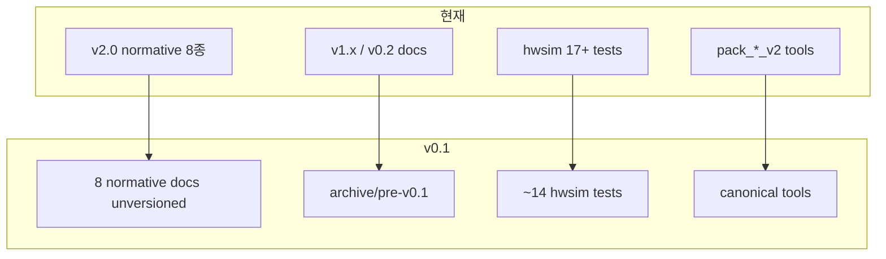

# Plover v0.1 문서·코드 통일 계획

## 목표와 원칙

| 결정 | 내용 |
|------|------|
| **Baseline** | 현재 [v2.0 아키텍처](docs/system-architecture-v2.0.md) 내용 유지, 라벨만 **v0.1**로 통일 |
| **레거시** | v0.1 gate + **ALU bringup 최소**만 남기고 나머지 삭제 |
| **압축** | normative 문서는 **버전 접미사 없는 단일 파일명** + 본문 `Version: 0.1`; 구세대 `-vX.Y` 문서는 `docs/archive/`로 이동 후 active tree에서 제거 |



---

## Phase 1 — Normative 문서 리브랜드 (v2.0 → v0.1)

### 1.1 파일 rename (내용은 v2.0 유지, 헤더·상호링크만 갱신)

| 현재 | v0.1 (active) |
|------|----------------|
| `system-architecture-v2.0.md` | [`docs/system-architecture.md`](docs/system-architecture.md) |
| `memory-map-v2.0.md` | `docs/memory-map.md` |
| `rom-architecture-v2.0.md` | `docs/rom-architecture.md` |
| `cpld-system-controller-v2.0.md` | `docs/cpld-system-controller.md` |
| `microcode-spec-v2.0.md` | `docs/microcode-spec.md` |
| `mailbox-protocol-v2.0.md` | `docs/mailbox-protocol.md` |
| `rp2350-coprocessor-v2.0.md` | `docs/rp2350-coprocessor.md` |
| `bootloader-v2.0.md` | `docs/bootloader.md` |

각 문서 상단: `**Version:** 0.1` · “Supersedes archived pre-v0.1 specs” 한 줄.

### 1.2 인덱스·가이드 통합

- [`README.md`](README.md): 모든 `v2.0` → `v0.1`, 링크를 unversioned 경로로
- [`docs/README.md`](docs/README.md): **Active (v0.1)** 표 1개 + **Archive** 표 (`docs/archive/pre-v0.1/`)
- [`docs/reviewer-handoff.md`](docs/reviewer-handoff.md): 버전·경로·도구명 일괄 갱신
- [`BOM.md`](BOM.md): §1 헤더 `v0.1`, Ref `cpu_v2` → `cpu`, 링크 갱신
- [`docs/roadmap-next.md`](docs/roadmap-next.md): `Version: 0.1`, mermaid 노드 `V2` → `Gate` 등

### 1.3 신규 단일 구현 계획

- **추가:** [`docs/implementation-plan-v0.1.md`](docs/implementation-plan-v0.1.md) — 현재 v2 gate 상태 + B3 실기 + `cpu` 통합 + CALL/RET/LDIO/STIO CW 패킹
- **삭제(또는 archive):** `v0.2-implementation-plan.md`, `v1.0-implementation-plan.md`, `v1.1-implementation-plan.md`

### 1.4 Archive 이동 (active tree에서 제거)

`docs/archive/pre-v0.1/`로 이동:

- `microcode-spec-v0.2.md`, `microcode-spec-v1.0.md`, `microcode-spec-v1.1.md`, `microcode-spec-v1.2.md`
- `cpld-hybrid-v1.3.md`, `arch-bom-tradeoffs-v1.1.md`, `microarch-throughput.md`
- 구 implementation plan 3종
- (선택) bringup Phase1–3 문서(`hw-bringup-p1/p2/p3-*.md`) — ALU bringup [`hw-bringup-b3.md`](docs/hw-bringup-b3.md)만 active 유지

**유지·v0.1 표기만:** [`alu-opcodes-timing.md`](docs/alu-opcodes-timing.md), [`hw-sim.md`](docs/hw-sim.md), [`purchase-devicesmart.md`](docs/purchase-devicesmart.md)

---

## Phase 2 — 도구·fixture·패키지 rename

| 현재 | v0.1 |
|------|------|
| `tools/pack_control_store_v2.py` | `tools/pack_control_store.py` |
| `tools/verify_control_store_v2.py` | `tools/verify_control_store.py` |
| `tools/gen_cpu_v2_netlist.py` | `tools/gen_cpu_netlist.py` |
| `hw/fixtures/control/cw_v2.hex` | `hw/fixtures/control/cw.hex` |
| `tests/test_control_store_v2.py` | `tests/test_control_store.py` |

- [`plover_vm/`](plover_vm/) docstring·주석: `v2.0` → `v0.1`
- [`plover_vm/memory/nor.py`](plover_vm/memory/nor.py), [`machine.py`](plover_vm/machine.py): import를 `tools.pack_control_store`로
- pytest·CI 스크립트에서 `--build-fixtures` 경로 갱신
- [`tools/verify_control_store.py`](tools/verify_control_store.py) 내 `SPEC_DOC_ROWS` 주석: `microcode-spec.md` 참조

### 삭제할 레거시 도구

- `tools/pack_control_store.py` (구 v1 16b) — rename 전 **먼저** v1 파일 삭제, v2를 canonical 이름으로 승격
- `tools/gen_cpu_v1_netlist.py`, `tools/gen_v1_tests.py`
- `tools/gen_p1_tests.py`, `gen_p2_tests.py`, `gen_p3_tests.py`
- 삭제 netlist 전용 generator: `gen_pc_*`, `gen_rom_fetch_*`, `gen_regfile_*`, `gen_cpu_datapath_p*`, `gen_control_store_netlist.py`, `gen_ir/phase/cycle/addr_mux/sram` (v1 CPU 경로만 쓰는 것)

**유지 generator (ALU + v0.1 CPU):** `gen_alu8_*`, `gen_alu_b3_*`, `gen_cpu_netlist.py`, `gen_boot_fixtures.py`, `macroasm.py`, fib demo runners

### Fixture 정리

- **삭제:** `hw/fixtures/control/rom_low.hex`, `rom_high.hex`, `rom_words.hex` (v1 16b CW 잔재)
- **유지:** `cw.hex`, `nor_cw_region.hex`, boot/SRAM fixtures

---

## Phase 3 — hwsim netlist·테스트 압축

### 3.1 v0.1 gate tests (rename)

| 현재 | v0.1 |
|------|------|
| `v2_cpld_gpr_decode.yaml` | `cpld_gpr_decode.yaml` |
| `v2_regfile_574.yaml` | `regfile_574.yaml` |
| `v2_mem_decode.yaml` | `mem_decode.yaml` |
| `v2_monitor_poll.yaml` | `monitor_poll.yaml` |
| `v2_boot_handoff.yaml` | `boot_handoff.yaml` |

### 3.2 ALU bringup tests (유지, 10건)

`alu8_full`, `alu8_timing`, `alu283_carry`, `alu_b3_{sub,xor,inc_dec,latch}`, `alu_decode_{full,timing}`, `bringup_b3c_clock`

### 3.3 삭제 대상 (~42 tests)

- `v1_*`, `m1_*`, `p1_*`, `p2_*`, `p3_*`
- `pc_*`, `rom_fetch_*`, `regfile_*` (574 gate 제외), `cpld_regfile_dual_read`
- `local_ctrl_*`, `flg_we_*`, `cmp_flg_*`, `clock_divider`, `reg574_setup`, `p1_viewer_demo` 등

### 3.4 netlist 삭제

**유지 blocks:**

- ALU: `alu8`, `alu283`, `alu_b3`, `alu_b3_clock`, `alu8_decode`, `alu_decode`
- v0.1 CPU: `cpld_system_ctrl`, `regfile_574`, `sram256_dual`, `cpu_v2` → **`cpu.yaml`**
- (통합 전) `clock.yaml` — bringup 참조 시

**삭제 blocks:** `cpu_v1*`, `cpld_regfile`, `cpu_datapath_p*`, `control_store`, `regfile*.yaml`, `pc*.yaml`, `rom_fetch*`, `local_ctrl`, `flg_latch`, `ir_latch`, `addr_mux`, `cycle_fsm`, `phase_cnt`, `sram256` (single-bank legacy), `reg574`, `regfile_halt` 등

### 3.5 hwsim 모델 정리 ([`hwsim/models/base.py`](hwsim/models/base.py))

- **`CpldRegfile` 클래스 삭제** 및 chip registry에서 `CPLD_REGFILE` / `ATF1504AS` → `CpldRegfile` 매핑 제거
- v0.1: `CPLD_SYSTEM_CTRL` → `CpldSystemCtrl`, `REGFILE_574_GPR`, `MAILBOX_MMIO`만 유지
- [`hw/timing/cpld.yaml`](hw/timing/cpld.yaml): legacy `CPLD_REGFILE` 타이밍 엔트리 제거(미사용 시)

### 3.6 [`docs/hw-sim.md`](docs/hw-sim.md) 테스트 표

- Gate 5 + ALU 10 = **15 tests** 기준으로 재작성
- `legacy`/`v2` 용어 제거

---

## Phase 4 — 전역 참조 sweep

한 번에 grep 후 수정:

```bash
rg -l 'v2\.0|_v2|pack_control_store_v2|microcode-spec-v2|system-architecture-v2|cw_v2|cpu_v2|v1\.|v0\.2' --glob '!docs/archive/**' --glob '!.cursor/**'
```

주요 타겟:

- [`tests/*.py`](tests/) — import·subprocess 경로
- [`hw/scenarios/vm/*.yaml`](hw/scenarios/vm/)
- [`hw/netlist/blocks/cpu.yaml`](hw/netlist/blocks/cpu.yaml) 내부 `cpu_v2` 참조
- [`tools/macroasm.py`](tools/macroasm.py) 헤더 (`v1.0` → `v0.1`)

**건드리지 않음:** [`.cursor/plans/`](.cursor/plans/) — 과거 계획 스냅샷으로 보존 (사용자 규칙)

---

## Phase 5 — 검증 게이트

| Gate | 명령 | 기대 |
|------|------|------|
| Control store | `python tools/verify_control_store.py` | PASS (11 packed rows) |
| Unit tests | `python -m pytest tests/ -q` | 전체 PASS |
| hwsim | `python -m hwsim run --all` | **15/15 PASS** |
| VM demo | `python tools/run_fib_demo.py` | Fib 144 |
| Doc links | 수동 또는 `rg 'microcode-spec-v2'` | active tree 0건 |

---

## 위험·완화

| 위험 | 완화 |
|------|------|
| 외부 북마크·PR 링크 깨짐 | `docs/README.md` archive 표에 old→new 매핑 1표 |
| `macroasm` / v1 SRAM hex | VM fetch 순서는 이미 수정됨; fixture 재생성 후 `test_add_imm` 확인 |
| 대량 삭제 후 generator 부재 | ALU netlist는 yaml 직접 유지; CPU netlist는 `gen_cpu_netlist.py`만 canonical |
| Archive 문서 내부 상대링크 | archive README에 “frozen, do not link from active docs” |

---

## 작업 순서 (권장)

1. **Archive 이동** — active docs 비우기 (rename 충돌 방지)
2. **v2 normative → unversioned rename** + 본문 v0.1 패치
3. **도구 rename** (v1 packer 삭제 → v2 승격)
4. **fixture rename** + pytest/hwsim import 수정
5. **테스트·netlist 삭제** + gate rename
6. **hwsim model/registry 정리**
7. **README/BOM/reviewer-handoff/roadmap** 최종 sweep
8. **implementation-plan-v0.1.md** 작성
9. **전체 gate 실행**

예상 결과: active `docs/` normative **~12파일**, hwsim **15 tests**, 버전 문자열 **v0.1 단일**, 레거시는 `docs/archive/pre-v0.1/` + 삭제된 hw/tests·netlist.
