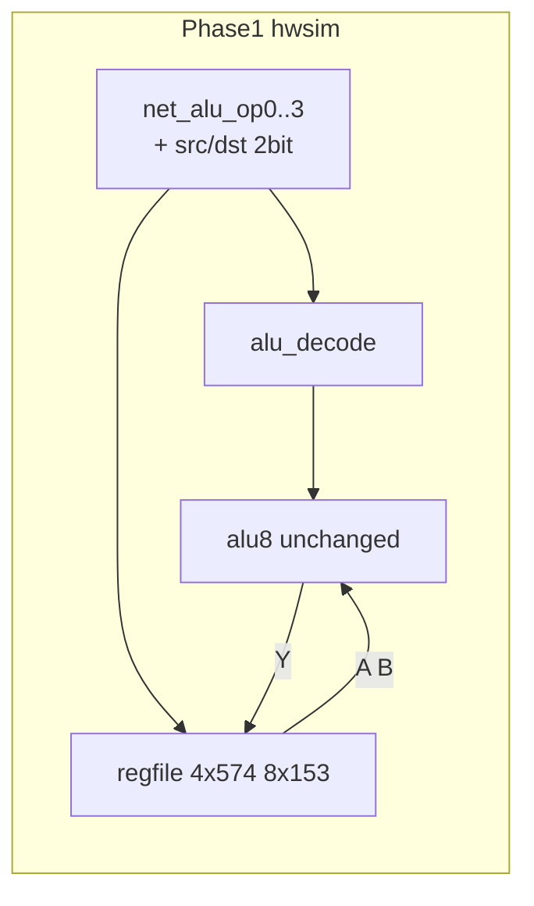

# v0.2 × ALU hwsim 제1단계 계획

## 목표와 범위

**목표:** v0.2 결정판([`docs/microcode-spec-v0.2.md`](docs/microcode-spec-v0.2.md))의 **데이터경로 핵심**—`alu_op` + **4-GPR regfile**—을 [`alu8.yaml`](hw/netlist/blocks/alu8.yaml)에 **게이트 레벨 netlist**로 연결하고, `python -m hwsim run`으로 **12 opcode RMW + 타이밍**을 검증한다.

**포함 (사용자 선택: decode + regfile):**

| 서브단계 | 내용 |
|----------|------|
| **1A** | `alu_op[3:0]` → ALU 14 제어선 + `net_cmp_n` (V1 decode) |
| **1B** | 4×574 + 8×153 A/B MUX + CP/IMM/CMP 게이트 (V2 regfile) |
| **1C** | decode + regfile + alu8 통합 + 2 MHz RMW 테스트 |

**제외 (제2단계 이후):**

- Flash 16bit CW fetch, PC 161, LOCAL 분기, 245/SRAM, `pack_rom` / microasm
- 브레드보드 실기 (문서 포인터만)

**불변:** [`alu8.yaml`](hw/netlist/blocks/alu8.yaml) / B3 IC 20개 **수정 없음**. A/B는 reg MUX 출력이 `net_a*` / `net_b*`에 **결선만** 대체.



---

## 기준선 (이미 있음)

| 자산 | 역할 |
|------|------|
| [`tools/alu8_cases.py`](tools/alu8_cases.py) | 12 opcode → `ctrl()` 진리표 **단일 소스** |
| [`hw/tests/alu8_full.yaml`](hw/tests/alu8_full.yaml) | 14선 수동 + A/B → Y |
| [`tools/gen_regfile_slack_test.py`](tools/gen_regfile_slack_test.py) | regfile+ALU **1bit** SUB slack 스텁 |
| [`hw/netlist/blocks/regfile_rmw_4x153.yaml`](hw/netlist/blocks/regfile_rmw_4x153.yaml) | 타이밍 검증용 (1×574, B0만) |

**갭:** `alu_op` 4bit만 바꿔도 ALU가 동작해야 함; regfile은 **8비트 전체** + **4 레지** + **CMP CP mask**.

---

## 1A — ALU 디코드 (V1)

### 설계

- **입력:** `net_alu_op0` … `net_alu_op3` (추후 CW `[15:12]`와 동일 네이밍)
- **출력:** [`hw-bringup-b3-opcode.md`](docs/hw-bringup-b3-opcode.md)의 14선 + **`net_cmp_n`** (`alu_op=11` → CMP active low)
- **진리표:** [`alu8_cases.CASES`](tools/alu8_cases.py)에서 자동 추출 (치트시트·테스트 DRY)

### 구현 방식 (권장)

- **`tools/alu_opcode_decode.py`**: opcode → `{sub,cin,s0,s1,b_sel,c3_sel,b_const_sel,b_const_hi,cmp}`
- **`tools/gen_alu_decode_netlist.py`**: 진리표 → **74HC04/08/32** 조합 논리 netlist 생성  
  - hwsim에 behavioral decode 모델 **추가하지 않음** (브레드보드 정합)
  - 12–15 entry, 8개 제어 신호 → 소형 PLA; IC 수는 생성 후 [`BOM.md`](BOM.md)에 **decode 섹션**으로 기록 (ALU 20개와 분리)
- **`hw/netlist/blocks/alu_decode.yaml`**: decode 전용 블록
- **`tools/gen_alu8_decode_netlist.py`**: `alu_decode` + `alu8` 인스턴스 **병합** → [`hw/netlist/blocks/alu8_decode.yaml`](hw/netlist/blocks/alu8_decode.yaml) (패턴: [`gen_alu_b3_netlist.py`](tools/gen_alu_b3_netlist.py))

### 테스트

| 파일 | 내용 |
|------|------|
| `tools/gen_alu_decode_test.py` | `alu8_cases` 기반 stimulus: **`net_alu_op*`, A, B** 만 설정 |
| `hw/tests/alu_decode_full.yaml` | 12 opcode × `expect net_y*` — **기존 alu8_full과 동일 벡터** |
| `hw/tests/alu_decode_timing.yaml` | decode hop + SUB critical slack (budget 250 ns) |

### 1A 완료 기준

- `alu_decode_full` **12/12 PASS**
- `alu8.yaml` **diff 없음**
- `net_cmp_n=0` iff opcode 11 (hwsim `expect` 또는 `final_nets` 체크)

---

## 1B — Regfile (V2)

### 설계 ([`microcode-spec-v0.2.md`](docs/microcode-spec-v0.2.md) § 레지스터 파일)

| 요소 | 구현 |
|------|------|
| GPR | `U_REG_R0` … `U_REG_R3` (74HC574) |
| A MUX | 4×153 (`1Y`/`2Y`로 8bit) |
| B MUX | 4×153 |
| CP | `net_dst_reg0/1` → 138 (또는 2→4 디코드) → 각 574 `CP` |
| CMP | `net_cmp_n` AND CP enable |
| IMM | `net_bus_en=11` 시 CP **R2 강제**; `IMM[7:0]={dst_reg,ctrl}` — Phase1에서는 **ctrl/bus 스tub net**으로 시험 |
| clk | `net_clk` (기존 B3c와 동일) |

**스텁 nets (Phase1):** Flash 없이 테스트용

- `net_alu_op0..3`, `net_src_reg0..1`, `net_dst_reg0..1`
- `net_bus_en0..1`, `net_ctrl0..5` (IMM/CP 강제용)

### Netlist / generator

- **`hw/netlist/blocks/regfile.yaml`**: 4×574 + 8×153 + CP decode + IMM override + cmp gate
- **`tools/gen_regfile_netlist.py`** (선택): 153 반복 구조 생성
- **`hw/netlist/blocks/regfile.md`**: 핀·net 요약 ( [`alu8.md`](hw/netlist/blocks/alu8.md) 스타일)

### 테스트 (regfile 단독)

| 파일 | 내용 |
|------|------|
| `hw/tests/regfile_mux.yaml` | MUX 선택: R0→A, R2→B 등 |
| `hw/tests/regfile_cmp_mask.yaml` | CMP 시 Q 유지, non-CMP 시 latch |
| `regfile_rmw_4x153_slack.yaml` | 기존 스텁을 **full regfile** 경로로 갱신 또는 대체 |

### 1B 완료 기준

- regfile 단독 테스트 PASS
- E2E comb ≤ 220 ns + setup 8 ns (기존 slack study와 **동일 경로** 유지)

---

## 1C — 통합 (decode + regfile + alu8)

### Netlist

- **`hw/netlist/blocks/cpu_datapath_p1.yaml`** (이름 가칭): `alu_decode` + `regfile` + `alu8` + `net_clk`
- **`tools/gen_cpu_datapath_p1_netlist.py`**: 위 블록 병합

### 테스트

| 파일 | 시나리오 |
|------|----------|
| `hw/tests/p1_rmw_add.yaml` | `alu_op=ADD`, src=R0, dst=R2 → `R2←R2+R0` 1clk |
| `hw/tests/p1_rmw_sub.yaml` | SUB worst + slack |
| `hw/tests/p1_cmp_no_latch.yaml` | CMP: Y 계산, **R2 Q 불변**, `FLG_WE`는 Phase2 stub 가능 |
| `hw/tests/p1_rmw_clock.yaml` | 2 MHz, [`bringup_b3c_clock`](hw/tests/bringup_b3c_clock.yaml) 패턴 |

**Stimulus 패턴:** `at_ns:0`에 `net_alu_op*`, `net_src/dst_reg*`, `net_clk` 설정; `expect`는 clk rise 후 `net_r2_q*` / `net_y*`.

### 1C 완료 기준

- `python -m hwsim run --all` — 기존 13 + 신규 P1 테스트 **전부 PASS**
- [`docs/microcode-spec-v0.2.md`](docs/microcode-spec-v0.2.md) § 구현 게이트: V1·V2 hwsim → **완료** 표시
- [`docs/roadmap-next.md`](docs/roadmap-next.md): Phase1 마일스톤 1줄 추가

---

## 문서·BOM (경량)

| 작업 | 파일 |
|------|------|
| opcode 치트시트에 **`alu_op` 4bit** 열 추가 | [`gen_opcode_cheatsheet.py`](tools/gen_opcode_cheatsheet.py), [`hw-bringup-b3-opcode.md`](docs/hw-bringup-b3-opcode.md) |
| Phase1 bring-up 초안 | `docs/hw-bringup-p1-datapath.md` (CW 스tub + scope 포인트) |
| decode IC 수 (생성 후) | [`BOM.md`](BOM.md) — ALU와 별도 라인; **+8×153는 regfile만** (이미 §V2) |

---

## 권장 작업 순서

```text
1A.1  alu_opcode_decode.py (truth table)
1A.2  gen_alu_decode_netlist.py → alu_decode.yaml
1A.3  gen_alu8_decode_netlist.py → alu8_decode.yaml
1A.4  gen_alu_decode_test.py → alu_decode_full.yaml → run PASS

1B.1  regfile.yaml (4×574, 8×153, CP, cmp_n, IMM→R2)
1B.2  regfile 단독 tests → PASS
1B.3  slack test 경로를 full regfile로 업데이트

1C.1  cpu_datapath_p1.yaml 병합
1C.2  p1_rmw_* + p1_rmw_clock tests
1C.3  run --all, spec/roadmap 갱신
```

**병렬:** 1A.4 PASS 후 1B 시작 (regfile는 A/B만 alu8에 붙이면 됨).

---

## 리스크와 완화

| 리스크 | 완화 |
|--------|------|
| decode gate 폭발 | generator + IC 수 상한 검토; 필요 시 2×138 + 패치 보드 |
| hwsim YAML 병합 실수 | `gen_*` 단일 스크립트, `hwsim validate` |
| CMP + FLG_WE 동시 | Phase1 CMP 테스트는 **Q 불변만**; Z latch net은 Phase2 |
| IMM 6bit+2bit | Phase1: `bus_en`/`ctrl` **수동 고정** net으로 1케이스만 |
| 153 +8 미입고 | 1B는 netlist·test 먼저; 실기는 부품 후 |

---

## 제2단계 예고 (본 계획 밖)

- PC 161 + LOCAL `ctrl[5:0]` 분기
- 245/SRAM `bus_en`
- Flash CW fetch + `pack_rom.py` v0.2
