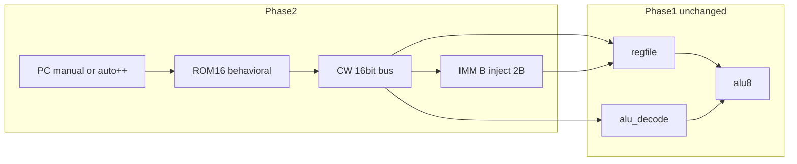

# VLIW v0.2 Phase2 — CW 공급 (Flash → 내�部 버스) 설계

## 목표·범위

**목표:** 매 `net_clk2` 사이클에 **ROM에서 읽은 16bit CW**가 Phase1 datapath를 구동한다. 수동 `net_alu_op*` / `net_src_reg*` 스텁을 제거하고, **프로그램(ROM hex) → 1clk RMW**를 hwsim으로 증명한다.

**전제 (Phase1 완료):**
- [`cpu_datapath_p1_clock.yaml`](hw/netlist/blocks/cpu_datapath_p1_clock.yaml) — decode + regfile + alu8, 2 MHz
- 22 tests PASS (`p1_rmw_*`, `p1_viewer_demo`, …)
- [`microcode-spec-v0.2.md`](docs/microcode-spec-v0.2.md) CW frozen

**Phase2 포함:**

| ID | 내용 |
|----|------|
| **2A** | ROM 16b fetch → CW 버스 (`alu_op`, `src/dst`, `bus_en`, `ctrl`) |
| **2B** | IMM (`bus_en=11`) — `ctrl`+`dst` → ALU B, R2 CP |
| **2T** | `pack_rom.py` v0.2 + hex fixture (microasm는 스텁/후속) |

**Phase2 제외 (Phase3+):**
- PC `74HC161` 체인 + LOCAL 분기 (BEQ/JMP)
- `FLG_WE` / Z latch
- 245/SRAM MEM (`bus_en` 01/10)
- Flash 실기 프로그래밍 (B-ROM 문서 포인터만)



---

## CW 버스 네이밍 (Phase1 → Phase2)

Phase1 스텁 net을 ROM 출력으로 **대체** (병렬 구동 금지 — ROM fetch가 유일 CW 소스).

| CW bit | Phase1 (stub) | Phase2 (ROM-driven) |
|--------|---------------|---------------------|
| 15:12 | `net_alu_op0..3` | 동일 |
| 11:10 | `net_src_reg0..1` | 동일 |
| 9:8 | `net_dst_reg0..1` | 동일 |
| 7:6 | `net_bus_en0..1` | 동일 |
| 5:0 | *(미연결)* | **`net_ctrl0..5` 신규** |

[`alu_decode.yaml`](hw/netlist/blocks/alu_decode.yaml) / [`alu8.yaml`](hw/netlist/blocks/alu8.yaml) **무변경**. 변경은 **rom_fetch + regfile IMM B + merge** 만.

---

## 2A — Flash 16bit CW fetch

### hwsim ROM 모델 (권장)

실 Flash(`SST39SF010A`) 타이밍은 **Phase2 hwsim에서 생략**; [`KNOWN_PARTS`](hwsim/netlist.py)에 이름만 있고 **모델 없음**.

| 항목 | 설계 |
|------|------|
| Part | `ROM16` (behavioral) — 테스트 YAML / hex에서 이미지 로드 |
| 입력 | `A0..A7` ← `net_pc0..7` |
| 출력 | `D0..D15` → CW 필드 분배 (bit slice 또는 157 없이 직접 net) |
| 지연 | comb `t_pd` 25–40 ns (157 1단과 동급) — slack 예산 내 |
| 이미지 | `rom_low.hex` + `rom_high.hex` 또는 단일 `rom_words.hex` (16bit/line) |

**필드 분배:** `D[15:12]`→`net_alu_op*`, `D[11:10]`→`net_src_reg*`, … `D[5:0]`→`net_ctrl*`.

### PC 스텁 (사용자 선택: **둘 다**)

| 모드 | 용도 | 구현 |
|------|------|------|
| **Manual** | `rom_fetch_word.yaml` — 주소 N → CW 검증 | stimulus가 `net_pc0..7` 설정 |
| **Auto++** | `p2_rom_program.yaml` — 4워드 시퀀스 | behavioral `PC8`: `net_clk2` posedge마다 `PC←PC+1`, 출력 → ROM 주소 |

Auto PC는 **161/분기 없음** — Phase3에서 161 출력으로 교체. Phase2 netlist에 `U_PC_STUB` / `U_PC_AUTO` **택일 merge** 또는 test별 netlist variant.

### 타이밍 (spec §1사이클)

- **clk low:** PC→ROM→CW→MUX→ALU comb 안정
- **clk rise:** 574 CP latch
- ROM comb 추가 ≤ ~40 ns → 기존 E2E 228 ns + ROM **≤ 268 ns** (250 ns 예산 **근접**)
- **완화:** ROM 출력을 clk **하강 초**에 주소 확정; `rom_fetch_timing.yaml` slack check

### 산출물

| 파일 | 역할 |
|------|------|
| [`hw/netlist/blocks/rom_fetch.yaml`](hw/netlist/blocks/rom_fetch.yaml) | ROM16 + CW split + (optional) PC8 |
| [`tools/gen_rom_fetch_netlist.py`](tools/gen_rom_fetch_netlist.py) | 생성기 |
| [`tools/gen_cpu_datapath_p2_netlist.py`](tools/gen_cpu_datapath_p2_netlist.py) | clock + rom_fetch + Phase1 blocks |
| [`hw/netlist/blocks/cpu_datapath_p2.yaml`](hw/netlist/blocks/cpu_datapath_p2.yaml) | 통합 |
| [`hw/netlist/blocks/cpu_datapath_p2_clock.yaml`](hw/netlist/blocks/cpu_datapath_p2_clock.yaml) | + OSC/74 |
| [`hw/tests/rom_fetch_word.yaml`](hw/tests/rom_fetch_word.yaml) | manual PC, 1 word |
| [`hw/tests/p2_rom_rmw_add.yaml`](hw/tests/p2_rom_rmw_add.yaml) | ROM 1× ADD CW = Phase1 `p1_rmw_add` 동일 결과 |
| [`hw/tests/p2_rom_program.yaml`](hw/tests/p2_rom_program.yaml) | auto PC++, 4 words = `clock_add_demo` |
| [`hw/tests/rom_fetch_timing.yaml`](hw/tests/rom_fetch_timing.yaml) | ROM on critical path slack |

### 2A 완료 기준

- ROM word → CW nets **게이트/버스만** (stimulus로 `net_alu_op*` 직접 구동 **없음**)
- `p2_rom_rmw_add` / `p2_rom_program` PASS
- `alu8.yaml` diff 없음
- `python -m hwsim run --all` 기존 22 + 신규 **전부 PASS**

---

## 2B — IMM (`bus_en = 11`)

### 명세 ([§ IMM](docs/microcode-spec-v0.2.md))

- **IMM[7:0]** = `{ dst_reg[9:8], ctrl[5:0] }` → ALU **B** 포트
- **CP** → **R2 고정** (regfile [`U_DST*_MUX`](tools/gen_regfile_netlist.py) 골격 이미 있음)
- 권장 `alu_op` = PASS_B 또는 ADD+Src=R2

### 구현

| 작업 | 내용 |
|------|------|
| B literal MUX | `bus_en=11`일 때 `net_b0..7` ← IMM bits; 그 외 기존 153 B MUX |
| `ctrl` wiring | ROM `net_ctrl0..5` → IMM 하위 6bit; `net_dst_reg*` → IMM 상위 2bit |
| regfile | [`gen_regfile_netlist.py`](tools/gen_regfile_netlist.py) — 157 per bit on B 또는 8×157 (BOM 여유 157 있음) |

**Phase2 IMM 테스트 1케이스:** `R2 ← 0xA5` via PASS_B + bus_en=11 (spec 예시 패턴).

| 테스트 | 내용 |
|--------|------|
| [`hw/tests/p2_imm_load.yaml`](hw/tests/p2_imm_load.yaml) | ROM CW with bus_en=11, ctrl encodes literal |
| regfile 단독 | IMM B override without ALU (optional fast path) |

**선행:** 2A (동일 CW 버스). **병렬 착수:** regfile B-MUX 설계는 2A와 독립 가능.

---

## 2T — ROM 도구 (v0.2)

[`archive/verilog-sim/tools/pack_rom.py`](archive/verilog-sim/tools/pack_rom.py)는 raw hex만 지원 → **active `tools/pack_rom.py`** 신규.

```python
# CW pack (spec bit order MSB first in 16-bit word)
def pack_cw(alu_op, src, dst, bus_en, ctrl) -> int:
    return (alu_op << 12) | (src << 10) | (dst << 8) | (bus_en << 6) | ctrl
```

| 기능 | 설명 |
|------|------|
| CLI | `python tools/pack_rom.py --add R0,R2,LOCAL,0` 또는 hex line file |
| 출력 | `hw/fixtures/rom/*.hex` + hwsim test `rom_image:` 참조 |
| Round-trip | spec 예제 3–5 CW → pack → ROM16 read → nets match |

**microasm v0.2:** Phase2에서는 **수동 hex + pack_rom**만; parser는 Phase3/5와 병렬 후속.

---

## 통합 netlist 병합 순서

```text
cpu_datapath_p2_clock =
  clock.yaml
  + rom_fetch.yaml      # ROM16, CW split, PC8 optional
  + alu_decode.yaml
  + regfile.yaml        # + IMM B mux (2B)
  + alu8.yaml
```

Generator 패턴: [`gen_cpu_datapath_p1_clock_netlist.py`](tools/gen_cpu_datapath_p1_clock_netlist.py) 확장.

---

## p1-viewer / serve 확장 (Phase2 후)

[`hwsim/serve.py`](hwsim/serve.py) + [`hw/p1-viewer/`](hw/p1-viewer/):

| 변경 | 내용 |
|------|------|
| `/api/simulate` | `preset: "rom_program"` — ROM hex + auto PC |
| UI | CW 패널 → **ROM address / program** 탭; Flash stub 블록 diagram 활성 |
| netlist | `cpu_datapath_p2_view.yaml` (probes: `net_pc*`, `net_ctrl*`) |

Phase2 **필수 아님** — hwsim PASS 후 추가.

---

## 권장 작업 순서

```text
2T.1  tools/pack_rom.py + fixture hex (병렬)
2A.1  hwsim ROM16 model + rom_fetch.yaml
2A.2  gen_cpu_datapath_p2 + rom_fetch_word (manual PC)
2A.3  PC8 auto + p2_rom_program
2A.4  p2_rom_rmw_add + rom_fetch_timing
2B.1  regfile IMM → B mux + p2_imm_load
2B.2  cpu_datapath_p2 merge regen + run --all
2.doc hw-bringup-p2-rom.md (CW from ROM scope)
2.gate microcode-spec § ROM fetch gate TODO → 완료
```

**병렬:** 2T.1 ↔ 2A.1 · 2B.1 regfile generator ↔ 2A.2 (2A PASS 후 2B 통합 테스트).

---

## 검증 매트릭스

| 테스트 | PC | ROM words | 검증 포인트 |
|--------|-----|-----------|-------------|
| `rom_fetch_word` | manual | 1 | CW bit = pack_rom |
| `p2_rom_rmw_add` | manual/auto | 1 (+ preload INC*) | = `p1_rmw_add` R2 |
| `p2_rom_program` | auto++ | 4 | = `p1_rmw_clock` R2=0x02 |
| `p2_imm_load` | manual | 1 | R2 = literal |
| `rom_fetch_timing` | manual | 1 | slack ≥ 0 |

\* preload: Phase2에서 INC 시퀀스를 **ROM에 여러 워드**로 넣거나, 초기 Q=0에서 짧은 ROM program 사용 (Phase1 `gen_p1_tests` INC 패턴 → `pack_rom` program).

---

## 리스크·완화

| 리스크 | 완화 |
|--------|------|
| E2E > 250 ns with ROM | ROM comb budget; `rom_fetch_timing`; max timing mode |
| CW vs stimulus fight | merge script **제거** Phase1 stub drivers; tests migrate to ROM |
| IMM 8×157 vs 153 B | 8×157 per bit on B only when `bus_imm`; reuse BOM 157 |
| PC auto++ vs Phase3 161 | `U_PC_STUB` ref 이름 고정 → Phase3 swap |
| Long ROM programs in viewer | Phase2 cap 16 words / 8 µs |

---

## spec 게이트 갱신 (완료 시)

[`docs/microcode-spec-v0.2.md`](docs/microcode-spec-v0.2.md) § 구현 게이트:

| 게이트 | Phase2 후 |
|--------|-----------|
| ROM fetch | **완료** — `rom_fetch`, `p2_rom_*` |
| Tool pack_rom | **완료** — v0.2 `pack_cw` |
| IMM→R2 B path | **완료** — `p2_imm_load` |

[`docs/v0.2-implementation-plan.md`](docs/v0.2-implementation-plan.md)에 Phase2 마일스톤 1줄 추가 (Phase1 viewer 줄과 동일 형식).

---

## 문서 (Phase2 산출)

| 파일 | 내용 |
|------|------|
| `docs/hw-bringup-p2-rom.md` | ROM→CW scope, PC stub, scope 포인트 (Flash 실기는 B4 포인터) |
| [`docs/hw-viewer-p1.md`](docs/hw-viewer-p1.md) | Phase2 ROM preset 섹션 (serve 갱신 후) |

---

## Phase3 예고 (본 설계 범위外)

2A의 PC8 → **161 + LOCAL `ctrl` 분기**; `net_ctrl0..5` → **LOCAL 디코드** (FLG_WE, BEQ, …). Phase2에서 `ctrl` net은 ROM에 연결만 하고 **Phase3 전까지 의미 디코드 없음** (LOCAL=0 가정 테스트 가능).
