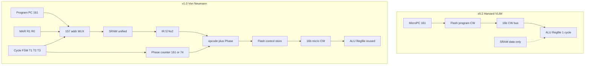
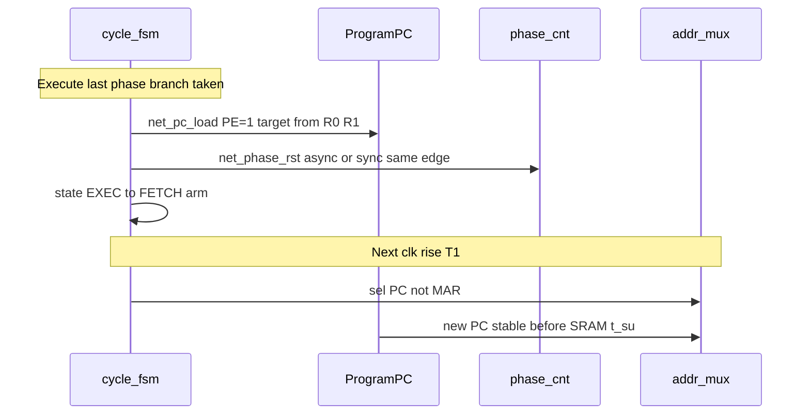
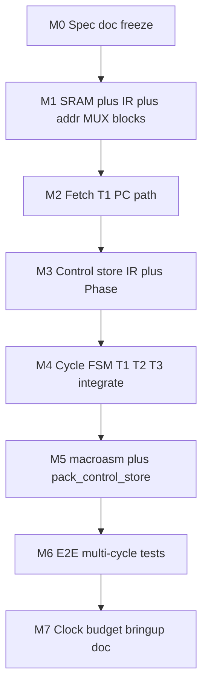

# Plover v1.0 — 다중 사이클 폰 노이만 아키텍처 전환 계획

## 결정 사항 (확정)

| 항목 | 선택 |
|------|------|
| 매크로 ISA | **16비트** — `74HC574×2` IR |
| 실행 데이터패스 | **v0.2 재사용** — [`alu8.yaml`](hw/netlist/blocks/alu8.yaml), [`alu_decode.yaml`](hw/netlist/blocks/alu_decode.yaml), [`regfile_halt.yaml`](hw/netlist/blocks/regfile_halt.yaml), [`flg_latch.yaml`](hw/netlist/blocks/flg_latch.yaml) |
| 마이크로 제어 워드 | **v0.2 CW 16비트 포맷 유지** — Flash는 프로그램이 아닌 **제어 저장소** |
| v0.2 Phase 4–5 | **중단·보관** — [`docs/v0.2-implementation-plan.md`](docs/v0.2-implementation-plan.md) Phase 4(MEM)·5(cpu_v0.2) 미진행 |

---

## 아키텍처 대비 (Before → After)



### 메모리·주소 역할 재정의

| 신호 | v0.2 | v1.0 |
|------|------|------|
| **Flash (SST39×2)** | `PC[7:0]` → VLIW 프로그램 | `{opcode[7:0], phase[2:0]}` → **마이크로 CW** (2048 words) |
| **SRAM (IS62C256)** | 데이터만 (`bus_en` MEM) | **코드 + 데이터** — fetch 시 PC, execute 시 `{R1,R0}` |
| **PC (161×4)** | Flash 주소 + 분기 | **프로그램 PC** — T1 fetch에서만 SRAM 주소·INC |
| **IR (574×2)** | 없음 | T1에서 SRAM 데이터 버스 → 16b 매크로 명령 래치 |
| **Phase** | 없음 | T3..Tn 내 마이크로 스텝 — Flash 하위 주소 |

### 16비트 ISA 인코딩 (초안 — spec에서 확정)

```
IR[15:0] = { opcode[7:0], operand[7:0] }
```

- **제어 저장소 주소:** `{IR[15:8], phase[2:0]}` — directive의 `{IR[7:0], Phase}`와 동일 11비트 폭; 16비트 ISA에서는 **상위 바이트 = opcode**, 하위 바이트 = 즉값/레지스터/주소 오프셋.
- operand는 execute phase에서 기존 **IMM 경로**(`bus_en=11`) 또는 regfile 경로로 소비 — v0.2 [`pack_rom.py`](tools/pack_rom.py) IMM helper 재활용.

### 다중 사이클 타이밍 (마스터 `net_clk2`)

**Baseline FSM (3+ 사이클):**

| Phase | 이름 | 동작 |
|-------|------|------|
| **T1** | Fetch | AddrMUX ← PC; SRAM `OE`; **clk ↓** 에 IR latch; PC++ |
| **T2** | Decode | IR → Flash 주소 상위; phase←0; control-store CW 안정화 대기 |
| **T3..Tn** | Execute | AddrMUX ← `{R1,R0}` (MEM micro-op 시); CW → datapath; phase++ |
| **T_end** | | `phase==last` → T1 복귀; branch micro-op 시 PC load + **phase 강제 리셋** (§분기) |

**Optimized FSM (2+ 사이클 — M4 게이트에서 채택 여부 결정):**

| Phase | 이름 | 동작 |
|-------|------|------|
| **T1** | Fetch+Decode | 위 T1과 동일; **IR latch 직후** `{IR[15:8], phase=0}` → Flash comb read |
| **T2..Tn** | Execute | Baseline T3..Tn과 동일 (인덱스만 1 clk 앞당김) |

T2 생략 조건 (hwsim `setup_hold`로 검증):

```
T1_clk_fall + t_pd(IR→ROM_addr) + t_acc(Flash 70ns) + t_pd(ROM→CW) + t_su(datapath) ≤ T_clk_period
```

- Flash `t_acc` 70 ns ([`hw/timing/memory.yaml`](hw/timing/memory.yaml))는 SRAM 45 ns보다 여유 있음 → T1 **하강 에지 이후** 남은 half-period(≈125 ns @ 2 MHz) 안에 phase-0 CW가 안정화될 **가능성 있음**.
- 채택 시 CPI −1, fetch+decode critical path가 **한 사이클 예산**에 합산 → M4에서 baseline vs optimized **A/B netlist** 및 slack 비교 후 spec에 고정.
- 채택 불가 시 baseline 유지; spec에 “T2 mandatory” 명시.

**클록 목표:** 2 MHz는 **stretch 목표**로 문서화. fetch 경로 = `161 → 157×4 → SRAM(45ns) → 245 → 574(IR) [→ Flash 70ns]` — hwsim critical-path로 **500 kHz–1 MHz** 현실 상한을 Phase M7에서 측정·기록.

### 분기(Branch) — Phase 카운터·FSM 동기화

분기 micro-op(PC load)이 **Execute** 마지막 phase에서 실행될 때:



- **`net_phase_rst`:** branch-taken (및 JMP unconditional) micro-CW에서 **phase ← 0**, execute 서브루프 즉시 종료.
- **`net_cycle_next`:** `phase==last OR branch_taken` → 다음 clk edge에서 **T1(Fetch)** 로 전이 (추가 decode clk 없음 — optimized FSM에서는 T1=fetch+decode).
- **Setup:** PC 161 `PE` load → Q stable → 다음 T1에서 AddrMUX PC 입력 **SRAM address setup** ([`IS62C256 t_aa`](hw/timing/memory.yaml)) 만족 — M6 `v1_branch_pc_setup` 테스트로 검증.
- **Delay slot:** v0.2 `Z_prev` 패턴 유지 — compare phase와 branch phase 분리; branch micro-op은 **항상 micro-sequence 마지막 phase** (M0 spec 표에 고정).

---

## 재사용 vs 교체 매트릭스

### 그대로 재사용

- [`hwsim/`](hwsim/) 프레임워크 — YAML 테스트, slack/setup_hold, viewer
- [`alu8.yaml`](hw/netlist/blocks/alu8.yaml), [`alu_decode.yaml`](hw/netlist/blocks/alu_decode.yaml), [`regfile_halt.yaml`](hw/netlist/blocks/regfile_halt.yaml), [`flg_latch.yaml`](hw/netlist/blocks/flg_latch.yaml), [`clock.yaml`](hw/netlist/blocks/clock.yaml)
- [`tools/alu8_cases.py`](tools/alu8_cases.py), CW 비트 레이아웃 ([`docs/microcode-spec-v0.2.md`](docs/microcode-spec-v0.2.md) §16비트)
- Phase 0–1 단위 테스트 21건 — ALU/regfile/regression baseline

### 보관 (frozen reference, 삭제하지 않음)

- [`cpu_datapath_p2*.yaml`](hw/netlist/blocks/cpu_datapath_p2_clock.yaml), [`cpu_datapath_p3*.yaml`](hw/netlist/blocks/cpu_datapath_p3.yaml)
- [`rom_fetch.yaml`](hw/netlist/blocks/rom_fetch.yaml), [`local_ctrl.yaml`](hw/netlist/blocks/local_ctrl.yaml) — v0.2 PC-at-CW 분기 모델
- v0.2 Phase 2–3 테스트 (`p2_*`, `p3_*`, `pc_*`, `local_ctrl_*`) — `run --all`에서 **v02** 태그 그룹으로 분리 유지

### 신규 작성 (v1.0 제어 평면)

| 블록 | 생성기 | 역할 |
|------|--------|------|
| `sram256.yaml` | `gen_sram_netlist.py` | IS62C256 + 245 데이터 버스 |
| `ir_latch.yaml` | `gen_ir_latch_netlist.py` | 574×2, T1 CP |
| `addr_mux.yaml` | `gen_addr_mux_netlist.py` | 157×4 — PC vs `{R1,R0}` → SRAM A[15:0] |
| `phase_cnt.yaml` | `gen_phase_cnt_netlist.py` | 161×1 또는 74×2 — phase[2:0], last-step detect |
| `cycle_fsm.yaml` | `gen_cycle_fsm_netlist.py` | T1/T2/EXEC 상태, SRAM OE/WE, IR/phase load enable, **`net_phase_rst` on branch**, baseline vs fetch-decode-merge variant |
| `control_store.yaml` | `gen_control_store_netlist.py` | ROM16: `A = {opcode, phase}` → CW bus (rom_fetch 대체) |
| `cpu_v1_fetch.yaml` | `gen_cpu_v1_netlist.py` | 위 + 재사용 datapath merge |

---

## hwsim 모델 확장

[`hwsim/models/base.py`](hwsim/models/base.py)에 추가:

1. **`Sram256`** — [`archive/verilog-sim/rtl/mem/sram256.v`](archive/verilog-sim/rtl/mem/sram256.v)와 동일 semantics: `sram_image[addr]`, `t_aa` 45 ns ([`hw/timing/memory.yaml`](hw/timing/memory.yaml))
2. **`Rom16` 주소 입력** — 기존 `A0..7` → **`A0..10`** (11-bit) 또는 behavioral `addr = (opcode<<3)|phase` net 병합
3. **`CYCLE_FSM`** (선택 behavioral) — T1/T2/EXEC 전이, **`branch_taken → phase_rst + next=T1`**; 초기에는 테스트 stimulus로 phase 수동 구동 후 FSM 모델로 승격
4. **Fetch-decode merge variant** — 동일 FSM에 `skip_decode_cycle` 파라미터; M4 A/B timing gate

테스트 스키마 확장:

```yaml
sram_image: [0x....]           # 16-bit little-endian pairs or byte stream
sram_image_file: ../fixtures/sram/...
control_store_file: ../fixtures/control/...
# rom_image → control_store (rename alias for compat)
```

---

## 도구 체인 개편

### `pack_control_store.py` (evolve from [`pack_rom.py`](tools/pack_rom.py))

- 입력: `(opcode: int, phases: list[CWSpec])` — opcode당 1..8 micro-step
- 출력: `control_store.hex` — index `(opcode << 3) | phase`
- v0.2 `pack_cw`, `cw_add`, `cw_cmp_flg` **그대로** micro-step 빌더로 사용
- **`pack_rom.py`**: v0.2 fixture 빌드용 유지; v1.0은 새 CLI 서브커맨드 `pack-control`

### `macroasm.py` (신규)

- 16비트 ISA mnemonics → `program.sram.hex` (SRAM 이미지) + opcode 테이블
- 1차 목표 ISA (최소): `ADD_IMM`, `LOAD`, `STORE`, `BEQ`, `JMP`, `HALT` — 각 opcode당 control-store 시퀀스는 spec 부록

### Fixture 레이아웃

```
hw/fixtures/
  control/          # Flash 제어 저장소 (was rom/)
  sram/             # 통합 프로그램+데이터
  v02/rom/          # 기존 v0.2 (이동)
```

---

## BOM 변경 ([`BOM.md`](BOM.md))

| 부품 | v0.2 | v1.0 Δ | 용도 |
|------|------|--------|------|
| 74HC574 | 7 | **+2 → 9** | IR 16b (2 IC) |
| 74HC157 | 11 | **+4 → 15** | 16b 주소 MUX (fetch PC / exec MAR); **48선 집중** — M7 실기 § |
| 0.1µF 디커플링 | 30 | **+8 → 38** | 157×4 MUX 구역 **IC당 2개** (VCC + 출력단 근처) 추가 예비 |
| 74HC161 | 4 | **+1 → 5** (또는 74×2) | phase counter (PC 161×4는 유지) |
| 74HC245 | 2 | 유지 | 데이터 버스 (fetch→IR, MEM R/W) |
| SST39SF010A | 2 | 역할 변경 | 제어 저장소 (용량 여유) |
| IS62C256 | 1 | **역할 확대** | 코드+데이터 |

Flash/SRAM **물리 수량 변경 없음** — 배선·디코딩 논리만 변경.

---

## 문서 작업

| 문서 | 조치 |
|------|------|
| **신규** [`docs/microcode-spec-v1.0.md`](docs/microcode-spec-v1.0.md) | ISA, cycle FSM, control-store map, CW reuse § |
| **신규** [`docs/v1.0-implementation-plan.md`](docs/v1.0-implementation-plan.md) | Phase M0–M7 (아래) |
| [`docs/microcode-spec-v0.2.md`](docs/microcode-spec-v0.2.md) | 상단 **Archived — superseded by v1.0** 배너 |
| [`docs/v0.2-implementation-plan.md`](docs/v0.2-implementation-plan.md) | Phase 4–5 **Cancelled**; 완료 Phase 0–3 보존 기록 |
| [`README.md`](README.md) | 아키텍처 다이어그램·한 줄 요약 v1.0 반영 |
| [`docs/roadmap-next.md`](docs/roadmap-next.md) | v1.0 pivot changelog |

---

## 구현 단계 (Phase M0–M7)



### M0 — 명세·동결 (1–2일)

- v1.0 spec 초안: ISA opcode table, per-opcode micro-sequence 표 (예: `ADD_IMM` = 3 execute phases)
- **FSM dual-mode:** baseline (T1/T2/Execute) vs optimized (fetch-decode merge) — M4 gate 전 provisional
- **Branch §:** phase_rst, last-phase branch micro-op, next-T1 PC setup 요구사항
- v0.2 문서 archived 표시; implementation plan 분기

### M1 — hwsim 원시 블록 (3–5일)

- `Sram256` model + `sram256.yaml` + `sram_read_timing.yaml`
- `ir_latch.yaml` + `ir_latch_test.yaml`
- `addr_mux.yaml` + PC vs MAR switching test

### M2 — Fetch 경로 (3–4일)

- Program PC: v0.2 [`pc.yaml`](hw/netlist/blocks/pc.yaml)에서 **ROM 주소 배선 제거**, T1에서만 count/load
- `cpu_v1_fetch.yaml` = clock + pc + addr_mux + sram + ir_latch
- 테스트: SRAM `@0x0000 = ADD_IMM opcode`, T1 후 IR=expected, PC=1

### M3 — Control store (3–4일)

- `control_store.yaml`: `{IR[15:8], phase[2:0]}` → CW[15:0]
- `phase_cnt.yaml`: reset on T2 (baseline) or T1 end (optimized); **async/sync reset on `net_phase_rst`** (branch)
- 테스트: 고정 IR + phase sweep → CW vector match `pack_control_store`

### M4 — 통합 cycle FSM (5–7일)

- `cycle_fsm.yaml`: baseline T1→T2→T3..→T1; SRAM OE/WE, regfile CP gating
- **T2 생략 게이트:** `cpu_v1_fdmerge.yaml` variant — T1 clk ↓ IR latch 후 Flash 70 ns + CW fan-out slack; PASS 시 optimized FSM을 default로 승격
- **Branch FSM:** `net_phase_rst`, `branch_taken → next_state=T1` (same or next clk — hwsim으로 선택); PC load와 phase reset **동일 execute phase**
- Merge: `cpu_v1.yaml` = M2 + M3 + alu_decode + regfile + alu8 + flg_latch
- **`local_ctrl` v0.2 분기는 execute micro-CW로 이전** — BEQ/JMP/HALT는 opcode별 micro-sequence **마지막 phase**에서 `pack_local_ctrl` 호출
- 테스트: `ADD_IMM` (baseline 3 macro-cycle vs optimized 2 macro-cycle); `v1_branch_phase_rst` stub

### M5 — 도구 (4–6일, M3와 병렬 가능)

- `pack_control_store.py` + `--build-fixtures`
- `macroasm.py` minimal + `hw/fixtures/sram/add_imm.sram.hex`
- CI: `python -m hwsim run --all` — v02 + v1 그룹

### M6 — E2E (3–5일)

- Fibonacci-iterative (GPR-only) 또는 counter loop in SRAM
- Branch delay: v0.2 `Z_prev` 패턴을 execute phase 2-cycle sequence로 명세화
- **`v1_branch_pc_setup`:** BEQ taken → PC load → **다음 T1** AddrMUX→SRAM 주소가 새 PC와 일치; `setup_hold` check on PC Q → MUX → SRAM A
- **`v1_branch_not_taken`:** phase normal increment, PC++ only at prior fetch
- Negative: MEM fetch vs execute addr collision, HALT CP freeze, branch with incomplete phase_rst

### M7 — 타이밍·실기 (ongoing)

- Critical path: fetch vs execute 분리 slack report; **fetch-decode merge** 채택 시 단일-cycle 예산 표
- [`docs/hw-bringup-v1-fetch.md`](docs/hw-bringup-v1-fetch.md) — 브레드보드 배선 가이드:
  - **Addr MUX 독립 구역:** 74HC157×4를 MB-102 **별도 구역**(전원/클록 칩과 분리); 48선(입력 32 + 출력 16) star wiring·최단 배선
  - **디커플링:** 157 **IC당 0.1µF×2** — (1) VCC–GND 최단 (2) MUX 출력 버스 인근
  - **그라운드:** MUX 출력 16선 아래 **연속 GND jumper** (return path)
  - 배선 순서: 클록·전원 → MUX 구역 → SRAM → IR → Flash control store
- 클록 **목표 vs 측정** 표 기록; MUX 구역 scope ring/overshoot 체크리스트

---

## 테스트 전략

| 그룹 | 범위 | `run --all` |
|------|------|-------------|
| **baseline** | alu8, regfile, clock (기존) | PASS 유지 |
| **v02** | p1/p2/p3, pc_*, local_ctrl_* | regression archive |
| **v1** | m1_*, fetch_*, control_*, v1_add_imm, v1_branch_*, v1_fdmerge_timing | 신규 18–22 tests |

테스트 클록: v0.2와 동일 **500 ns period, manual `net_clk2` step** — integrated OSC skew 회피 ([`docs/hw-bringup-p3-ctrl-pc.md`](docs/hw-bringup-p3-ctrl-pc.md) 교훈).

---

## 리스크·완화

| 리스크 | 완화 |
|--------|------|
| Fetch critical path > 250 ns | half-period fetch / full-period execute **비대칭 클록** 검토 (spec 부록); 또는 클록 목표 하향 |
| **T2 생략(fetch-decode merge) 불가** | M4 A/B hwsim gate; 실패 시 baseline 3-cycle FSM 유지 — **기능·타이밍 둘 다 spec에 dual-mode 기록** |
| **157×4 주소 MUX — 48선 크로스토크** | **실기 1순위 실패 요인** — M7 독립 구역 배치, IC당 bypass×2, GND return; hwsim wiring.svg fan-out 검증 |
| **Branch taken → 다음 T1 PC setup** | `net_phase_rst` + FSM 즉시 T1 arm; M6 `v1_branch_pc_setup` setup_hold; branch micro-op = sequence **last phase** |
| v0.2/local_ctrl 의미 충돌 | v1.0에서 branch는 **macro opcode micro-sequence**; v0.2 테스트 분리 |
| SRAM model 없음 | M1 최우선 — Phase 4 v0.2 계획의 MEM 블록을 v1 fetch와 **통합** 구현 |
| Control store 2048 words 부족 | opcode 8bit × 8 phase; 복잡 op는 sub-page 또는 phase extension (spec 예약) |

### 검토 반영 요약 (Reviewer addenda)

| # | 주제 | 계획 반영 위치 |
|---|------|----------------|
| ① | T2 decode **1 clk 절약** — T1 ↓ IR latch 후 Flash 70 ns로 phase-0 CW comb | §다중 사이클 타이밍 Optimized FSM, M4 gate, 리스크 |
| ② | 157×4 MUX **물리 병목** — 48선, crosstalk, bypass×2/IC | M7 bringup, BOM 디커플링 +8, 리스크 |
| ③ | Branch **phase 강제 리셋** — PC load → 다음 T1 setup | §분기 FSM, cycle_fsm, M4/M6 tests, 리스크 |

---

## v0.2 대비 capability (목표)

| 기능 | v0.2 Phase 3 | v1.0 M6 완료 시 |
|------|--------------|-----------------|
| 코드 저장 | Flash only | **SRAM** |
| 일반 프로그램 실행 | ROM CW only | **macroasm → SRAM** |
| LOAD/STORE | 미구현 (Ph4) | fetch/exec addr MUX로 **내장** |
| 분기 | LOCAL per-CW | execute micro-sequence |
| Fibonacci(n) in SRAM | 불가 | **M6 E2E 목표** |

---

## 권장 착수 순서 (첫 PR 범위)

1. M0: `microcode-spec-v1.0.md` + v0.2 archived banners + `v1.0-implementation-plan.md`
2. M1: `Sram256` + `ir_latch` + `addr_mux` netlists and unit tests
3. M2: `cpu_v1_fetch` — single T1 fetch proof

이 3단계까지가 **아키텍처 리셋의 검증 가능한 최소 기준선**이며, 이후 M3–M7은 control-store 통합과 도구/E2E로 이어진다.
