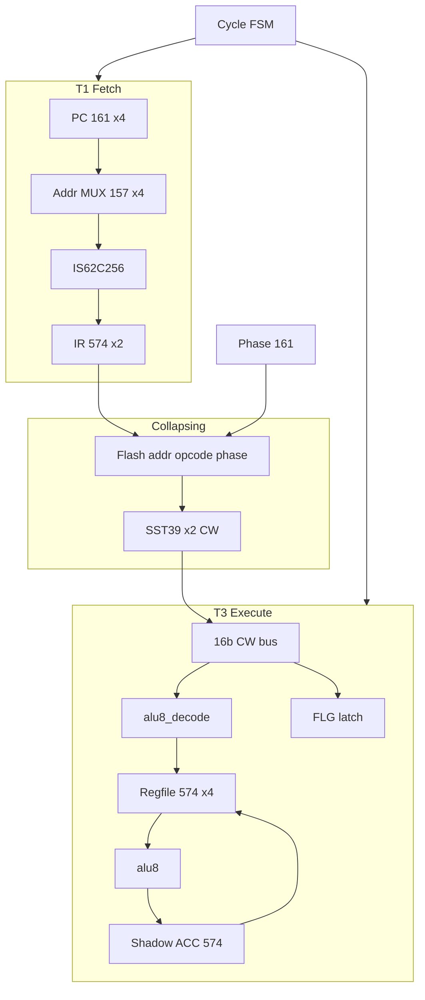

# Plover v1.0 — 전체 구현 계획

> **Superseded by [v1.1-implementation-plan.md](v1.1-implementation-plan.md)** — 4-GPR regfile 폐기, ACC-only.

**버전:** 1.0 · **기준일:** 2026-05-31  
**상태:** ALU 블록 hwsim PASS (11 tests) → **CPU 통합 재개**

| 문서 | 역할 |
|------|------|
| [microcode-spec-v1.0.md](microcode-spec-v1.0.md) | ISA · CW · FSM |
| [microarch-throughput.md](microarch-throughput.md) | Collapsing + Shadow ACC · MIPS · 타이밍 gate |
| [hw-bringup-b3.md](archive/bringup-legacy/hw-bringup-b3.md) | ALU 실기 (선행) |
| [BOM.md](../BOM.md) | 부품·구매 단계 |

---

## 1. 목표

| 항목 | 목표 |
|------|------|
| 아키텍처 | **다중 사이클 Von Neumann** — 공유 SRAM, Flash 제어 ROM |
| ISA | **16-bit** `{opcode, operand}` |
| 클록 | **2.0 MHz** (stretch; hwsim slack gate) |
| 성능 | **1.0 MIPS** floor · **~1.33 MIPS** stretch (code mix) |
| 최적화 | **Phase Collapsing** + **Shadow ACC** (Prefetch **미채택**) |
| 검증 | `python -m hwsim run --all` + DSO bring-up |

### 재사용 (hwsim 검증済)

| 블록 | netlist |
|------|---------|
| ALU 12 opcode | [`alu8.yaml`](../hw/netlist/blocks/alu8.yaml) |
| CW → 제어선 | [`alu8_decode.yaml`](../hw/netlist/blocks/alu8_decode.yaml) |
| Shadow ACC + clk | [`alu_b3_clock.yaml`](../hw/netlist/blocks/alu_b3_clock.yaml) |
| 클록 2 MHz | [`clock.yaml`](../hw/netlist/blocks/clock.yaml) |

### 신규 구축

Fetch (PC, AddrMUX, SRAM, IR) · Control store (Flash+phase) · Cycle FSM · Regfile · FLG · 통합 `cpu_v1.yaml`

---

## 2. 아키텍처 개요



**타이밍 (교정):** T1↑ fetch → T1↓ IR latch + Flash addr → **T3↑** execute reg setup. T1↓→T3↑ **250 ns** — Flash 70 ns + datapath slack hwsim 필수 ([microarch §4.3](microarch-throughput.md)). FAIL 시 **T3↓ 래치** 또는 **CW 중간 래치** (Plan B).

---

## 3. 구현 단계 (M0–M7)


### 선행: B3 실기 (병렬 가능)

| 단계 | 산출 | gate |
|------|------|------|
| B3a/b/c | ALU 20 IC + ACC @ 2 MHz | [hw-bringup-b3.md](archive/bringup-legacy/hw-bringup-b3.md) 체크리스트 |

---

### M0 — 명세 동결 ✅

- [x] [microcode-spec-v1.0.md](microcode-spec-v1.0.md)
- [x] [microarch-throughput.md](microarch-throughput.md) v0.3
- [x] [v1.0-implementation-plan.md](v1.0-implementation-plan.md) (본 문서)
- [x] [BOM.md](../BOM.md) v1.0 갱신

---

### M1 — hwsim 원시 블록 (3–5일)

| 산출 | generator | 테스트 |
|------|-----------|--------|
| `sram256.yaml` | `gen_sram_netlist.py` | `m1_sram_read.yaml` |
| `ir_latch.yaml` | `gen_ir_latch_netlist.py` | `m1_ir_latch.yaml` |
| `addr_mux.yaml` | `gen_addr_mux_netlist.py` | `m1_addr_mux.yaml` |
| hwsim `Sram256` model | `hwsim/models/base.py` | — |

**검증:** AddrMUX PC vs `{R1,R0}` 전환; SRAM `t_aa` 45 ns; IR setup/hold.

---

### M2 — Fetch 경로 (3–4일)

| 산출 | 내용 |
|------|------|
| `pc_v1.yaml` | Program PC 161×4 — T1 count/load only (Flash addr **미연결**) |
| `cpu_v1_fetch.yaml` | clock + pc + addr_mux + sram + ir_latch |
| `m2_fetch_t1.yaml` | SRAM `@0` = test insn → T1↓ IR match, PC++ |

---

### M3 — Control store (3–4일)

| 산출 | 내용 |
|------|------|
| `control_store.yaml` | `{IR[15:8], phase[2:0]}` → CW[15:0] |
| `phase_cnt.yaml` | phase[2:0], last detect, `phase_rst` (branch) |
| `pack_control_store.py` | opcode × phases → `hw/fixtures/control/*.hex` |
| `m3_control_store.yaml` | IR+phase sweep → CW vector |

---

### M4 — Cycle FSM + 통합 (5–7일) ★ gate

| 산출 | 내용 |
|------|------|
| `cycle_fsm.yaml` | **Optimized:** T1→T3 (T2 없음); branch sync |
| `cpu_v1.yaml` | fetch + ctrl + regfile + alu8_decode + alu8 + flg + **shadow ACC** |
| `regfile.yaml` | 4×574 GPR + 8×153 + **4×153 B-src** (ACC) |
| `flg_latch.yaml` | Z/C, `Z_prev` for branch delay |

**hwsim gate (M4 exit):**

| 테스트 | PASS 조건 |
|--------|-----------|
| `v1_fdmerge_timing` | T1↓→T3↑ Flash+datapath slack ≥ 0 **또는** Plan B documented |
| `v1_add_imm` | ADD_IMM E2E, 2 macro-cycle |
| `v1_branch_phase_rst` | taken → phase_rst → T1 |
| `v1_branch_pc_setup` | next T1 PC→SRAM setup_hold |
| `shadow_acc_rmw` | ACC chain without SRAM B |

**Plan B (slack FAIL):** T3↓ execute latch · CW pipeline 574 · ~1.7 MHz 문서화.

---

### M5 — 도구·fixture (4–6일, M3 병렬)

| 도구 | 역할 |
|------|------|
| `macroasm.py` | ISA → `program.sram.hex` |
| `pack_control_store.py` | micro-sequence → Flash image |
| `gen_v1_tests.py` | E2E test skeleton |

```
hw/fixtures/
  control/     # Flash CW hex
  sram/        # 프로그램+데이터
```

**CI:** `python -m hwsim run --all` — alu regression + v1_* 그룹.

---

### M6 — E2E (3–5일)

| 테스트 | 시나리오 |
|--------|----------|
| `v1_fib_loop` | ACC-heavy counter in SRAM |
| `v1_load_store` | MEM `{R1,R0}` path |
| `v1_branch_not_taken` | PC++ only |
| Negative | HALT CP freeze, addr collision, incomplete phase_rst |

---

### M7 — 실기 bring-up (5–7일)

| 과제 | 산출 |
|------|------|
| 클록 | 74HC14 Schmitt tree; DSO duty/skew log |
| AddrMUX | 157×4 decoupling (IC당 0.1µF×2) |
| 문서 | `docs/hw-bringup-v1-fetch.md` |
| KiCad | `sheet_cpu_v1` ↔ YAML diff |

---

## 4. 테스트 목표 (완료 시)

| 그룹 | tests | 비고 |
|------|-------|------|
| ALU regression | 11 | 현재 PASS 유지 |
| v1 unit | ~8 | M1–M3 |
| v1 integrate | ~6 | M4 |
| v1 E2E | ~5 | M6 |
| **합계** | **~30** | |

---

## 5. 리스크·완화

| 리스크 | 완화 |
|--------|------|
| Flash 70 + regfile 228 > 250 ns | Plan B latch; hwsim before breadboard |
| Falling-edge IR + jitter | 74HC14; short wires |
| Branch SSO on 157 | Extra decoupling; stagger `pc_load` |
| Prefetch 유혹 | **미채택** — 단일 SRAM bus contention |
| alu_decode IC 폭 | Flash CW 직접 필드 → decode 축소 검토 (실기) |

---

## 6. 마일스톤 일정 (개략)

| Phase | 기간 | 누적 |
|-------|------|------|
| M1 | 3–5 d | ~1 w |
| M2 | 3–4 d | ~2 w |
| M3 | 3–4 d | ~2.5 w |
| M4 | 5–7 d | ~4 w |
| M5 | 4–6 d | (M3 병렬) |
| M6 | 3–5 d | ~5 w |
| M7 | 5–7 d | ~6–7 w |

*B3 실기는 M1–M2와 병렬 권장.*

---

## 7. 완료 정의 (Definition of Done)

- [ ] `python -m hwsim run --all` — ALU + v1 전부 PASS
- [ ] ADD_IMM + branch + fib loop E2E PASS
- [ ] `microarch-throughput` 타이밍 gate 문서화 (PASS 또는 Plan B)
- [ ] B3 + CPU fetch 브레드보드 smoke @ 2 MHz (또는 문서화된 하향 clk)
- [ ] BOM 실장 수량과 netlist instance 일치

---

## 변경 이력

| 날짜 | 내용 |
|------|------|
| 2026-05-31 | v1.0 — M0–M7, Collapsing+ACC, ALU 재사용, hwsim gate |
