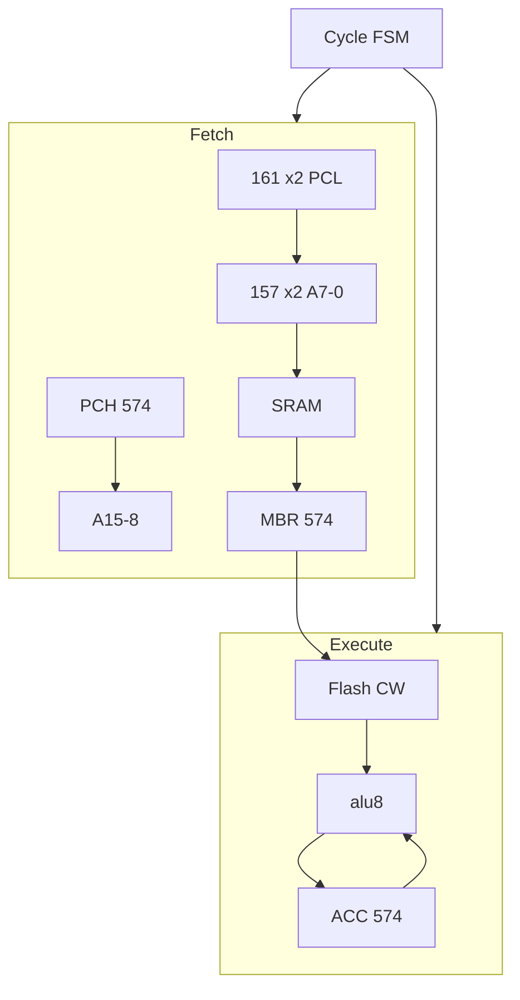

# Plover v1.1 — 구현 계획 (ACC · BOM 경량)

> **Superseded by [system-architecture-v2.0.md](system-architecture-v2.0.md)** and v2 hwsim milestones.

**버전:** 1.1 · **권장 CPU:** [v1.3 CPLD hybrid](cpld-hybrid-v1.3.md) (~48 74HC + ATF1504AS) · fallback [v1.2 ACC+TMP](microcode-spec-v1.2.md)

| 문서 | 역할 |
|------|------|
| [arch-bom-tradeoffs-v1.1.md](arch-bom-tradeoffs-v1.1.md) | 타협·BOM Δ·성능 |
| [microcode-spec-v1.1.md](microcode-spec-v1.1.md) | ISA · ACC · SW stack |
| [microarch-throughput.md](microarch-throughput.md) | Collapsing 타이밍 (ACC path 단순화) |
| [BOM.md](../BOM.md) | v1.1 IC ~48 |

---

## 1. 목표 (v1.1)

| 항목 | v1.1 |
|------|------|
| 아키텍처 | Von Neumann · **ACC-only** · MBR 시분할 |
| OS 목표 | 64KB · CALL/RET · MMIO poll — **Apple II “minimal”** |
| 클록 | 2.0 MHz (stretch) |
| 성능 | **~0.5 MIPS** realistic · **1.0 MIPS** ACC loop stretch |
| BOM (Track A) | **~48** 74HC (+ Flash/SRAM) |
| 최적화 | Phase Collapsing · **Prefetch/LUT/serial 배제** |

### 재사용

| 블록 | netlist |
|------|---------|
| ALU | `alu8`, `alu8_decode`, `alu_b3_clock` (ACC = B3c) |
| Clock | `clock.yaml` |

### v1.0에서 **제거**

`regfile.yaml`, 16b IR×2, 157×4 addr MUX, Shadow B-src 153×4, `{R1,R0}` MAR.

---

## 2. 블록 diagram

---

## 3. Phase M0–M7 (v1.1)

### M0 — 명세 ✅

- [x] [arch-bom-tradeoffs-v1.1.md](arch-bom-tradeoffs-v1.1.md)
- [x] [microcode-spec-v1.1.md](microcode-spec-v1.1.md)
- [x] [BOM.md](../BOM.md) v1.1
- [x] 본 문서

### M1 — 원시 블록 (3–4일)

| 산출 | 테스트 |
|------|--------|
| `sram256.yaml` | `m1_sram_read` |
| `mbr.yaml` (574×1, phase WE) | `m1_mbr_fetch0/1` |
| `pch.yaml` + `addr_lo_mux.yaml` (157×2) | `m1_addr_page` |
| `acc.yaml` (574×1) | `m1_acc_hold` |

### M2 — Fetch (3일)

| 산출 | gate |
|------|------|
| `pc_v1.yaml` (PCL 161×2) | PCL++ each byte fetch |
| `cpu_v1_fetch.yaml` | 2-byte hdr → MBR opcode+operand |

### M3 — Control store (3일)

| 산출 | gate |
|------|------|
| `control_store.yaml` | opcode from MBR |
| `phase_cnt.yaml` | multi-phase LDA/STA/CALL |

### M4 — 통합 ★

**Target: v1.2 ACC+TMP** ([microcode-spec-v1.2.md](microcode-spec-v1.2.md)). v1.1 pure ACC = fallback.

| 산출 | gate |
|------|------|
| **`cpld_regfile.yaml`** | ✅ dual-port read/write (12 tests) |
| `cpu_v1.yaml` | fetch + ctrl + **cpld_regfile** + alu8 + flg |
| `cpld_regfile_timing` | async read 10 ns + ALU path slack @ 250 ns |
| `cycle_fsm.yaml` | T1→T3 collapsing |
| `v1_add_imm`, `v1_reg_rmw` | GPR RMW 1 macro-cycle |

**Fallback (hwsim FAIL):** `acc_tmp.yaml` — v1.2 ACC+TMP path.

**Plan B:** T3↓ latch — [microarch §4.3](microarch-throughput.md)

### M5 — 도구

- `macroasm.py` — ACC ISA, zp stack asm  
- `pack_control_store.py`  
- `hw/fixtures/sram/`, `control/`

### M6 — E2E

| 테스트 | 내용 |
|--------|------|
| `v1_call_ret` | SW stack zp |
| `v1_beq` | Z flag |
| `v1_ldx_zp` | indirect |
| `v1_monitor_poll` | MMIO stub |

### M7 — Bring-up

- 74HC14, DSO  
- `docs/hw-bringup-v1-acc.md`  
- **Track B** (LUT ALU) — optional lab note only

---

## 4. 테스트 목표

| 그룹 | count |
|------|-------|
| ALU regression | 11 |
| v1.1 unit | ~10 |
| v1.1 integrate/E2E | ~8 |
| **합계** | **~29** |

---

## 5. v1.0 계획 처리

| v1.0 | v1.1 |
|------|------|
| [v1.0-implementation-plan.md](v1.0-implementation-plan.md) | **superseded** (GPR) |
| [microcode-spec-v1.0.md](microcode-spec-v1.0.md) | **superseded** |
| Shadow ACC + GPR | **ACC only** (B3c = prod ACC) |

---

## 6. Definition of Done

- [ ] hwsim ALU 11 + v1.1 ~19 PASS  
- [ ] ADD_IMM, LDA/STA, CALL/RET on ACC  
- [ ] Collapsing slack documented  
- [ ] BOM ~48 IC vs netlist match  
- [ ] Breadboard: fetch 2-byte + ACC @ clk

---

## 변경 이력

| 날짜 | 내용 |
|------|------|
| 2026-05-31 | v1.1 — ACC, MBR, BOM 경량, OS minimal |
