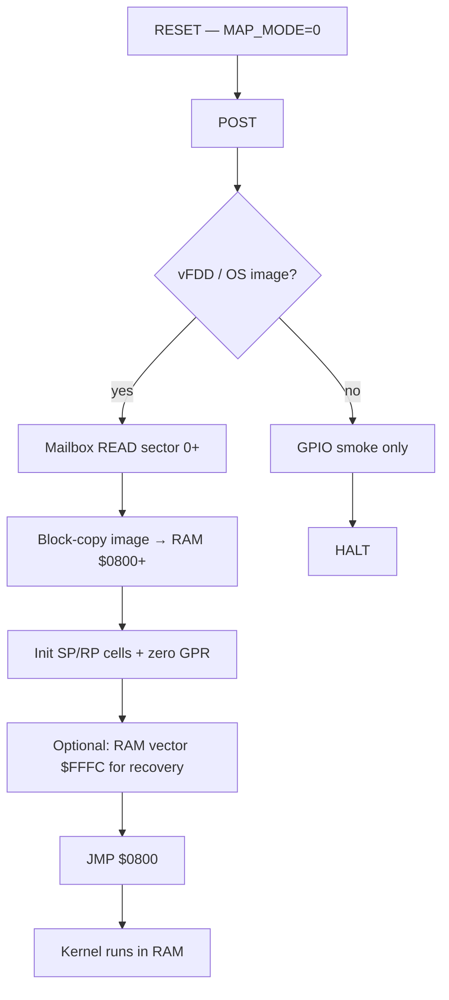

# Boot JMP handoff (software chain load)

**Related:** [bootloader.md](bootloader.md) · [memory-map.md](../hardware/memory-map.md) · [software-memory-layout.md](../software/software-memory-layout.md)

Software-only boot handoff: Boot ROM loads the kernel into RAM and **`JMP`s to `$0800`** without operator DIP/RESET or CPLD changes. This is **방식 1** from the modern-boot comparison notes in [archive/gemini/Plover-부팅과-현대-시스템-비교.md](archive/gemini/Plover-부팅과-현대-시스템-비교.md).

---

## 1. Purpose

| Goal | JMP handoff | Manual handoff ([bootloader.md](bootloader.md) §3) |
|------|-------------|-----------------------------------------------------|
| First boot to kernel | Automatic | Operator: DIP → Run, RESET |
| CPLD / board change | **None** | None |
| Continuous execution | ROM → RAM, no halt | ROM → halt → reset → RAM |
| Warm reset into kernel | No (see §6) | Yes, after Run + RESET |

Use JMP handoff when the product path is **power-on → OS/shell** with v0.1 hardware. Keep manual handoff as a **bring-up and recovery** option.

---

## 2. Why it works on v0.1 hardware

`MAP_MODE` only affects how **`$0000–$07FF`** and **`$FFFC–$FFFF`** decode. The kernel region is always RAM:

| Range | Mode A (Boot) | Mode B (Run) |
|-------|---------------|--------------|
| `$0000–$07FF` | ROM | RAM |
| `$0800–$FEFF` | **RAM** | **RAM** |
| `$FFFC–$FFFF` | ROM vector | RAM vector |

After Boot ROM copies the image to **`$0800+`**, a single **`JMP $0800`** keeps the PC in the always-RAM band. No map switch is required for the first kernel instruction fetch.

Decode reference: [plover_vm/decode.py](../plover_vm/decode.py) (same rules as hwsim CPLD stub).

### ISA addressing note

Normative **`LDA`/`STA`** use an **8-bit absolute** operand (`$00–$FF` only). In **Boot** mode, that band maps to **ROM** for reads and ignores writes. RAM constants at **`$0800+`** are **not** reachable with a single `LDA`. Likewise, **`STA` cannot target `$0800`, `$0E00`, or `$FFFC`** directly. Boot ROM must use a **block-copy primitive** (§5) for 16-bit destinations.

---

## 3. Boot ROM flow



### Step table

| Step | Action | Notes |
|------|--------|-------|
| 1 | POST | RAM spot check, mailbox ping — unchanged |
| 2 | Load | `MB_CMD=READ` → **block-copy** payload to **`$0800+`** ([bootloader.md](bootloader.md)) |
| 3 | Pre-init | Zero **GPR**; write **SP/RP** cells at **`$0E00`/`$0F00`** (§5) — before `JMP` |
| 4 | Vector install (optional) | RAM **`$FFFC–$FFFF`** ← `$0800` — for **manual** Run+RESET recovery only; needs block-copy |
| 5 | **Handoff** | **`JMP`** to kernel entry (default **`$0800`**) — replaces **HALT** |
| 6 | — | Boot ROM does **not** change `MAP_MODE` |

Bare-metal smoke ([baremetal-gpio-smoke.md](baremetal-gpio-smoke.md)) with no OS image still ends in **HALT**; JMP applies only when a RAM entry point is valid.

---

## 4. ISA and encoding

`JMP` is macro opcode **`0x05`**, 16-bit **absolute** target, **little-endian** operand ([plover-asm.md](plover-asm.md), [microcode-spec.md](microcode-spec.md) § JMP).

| Mnemonic | Bytes (hex) | PC after |
|----------|-------------|----------|
| `JMP $0800` | `05 00 08` | `$0800` |

### Minimal Boot ROM tail (conceptual)

```asm
        .ORG $0100          ; example: after POST + block-copy routines

KERNEL_ENTRY  .EQU $0800

handoff:
        ; GPR/SP/RP already initialized by boot_copy + boot_sanitize (§5)
        JMP  KERNEL_ENTRY   ; 05 00 08 — chain load; no HALT
```

Assemble with `plover_asm` and pack into the Boot segment (`$0000–$07FF`) per [rom-architecture.md](rom-architecture.md).

### Teaching fixture (smoke)

For VM gates without vFDD, a minimal image can jump immediately:

```asm
        .ORG $0000
        JMP  $0800
```

Pair with a RAM program at `$0800` (e.g. `HALT` or kernel stub). Host/sim may pre-init **`$0E00`/`$0F00`** and GPR via `ram_init` / fixture load. This matches the spirit of `hw/scenarios/vm/boot_run.yaml` but stays in **Boot** map mode.

---

## 5. Init contract and JMP handoff rules

Plover v0.1 **8-bit direct addressing** and **Boot-mode low-page ROM masking** define a **hardware–software split**. RAM (`$0800+`) constants are not loadable with `LDA`; **16-bit RAM writes** are Boot ROM's job via a block-copy primitive.

### 5.1 Responsibility table

| Context | Owner | When | Notes |
|---------|-------|------|-------|
| Stack cells (`$0E00` SP, `$0F00` RP) | **Boot ROM** | Before `JMP $0800` | 16-bit LE values — region bases **`$E000`**, **`$F600`** ([software-memory-layout.md](../software/software-memory-layout.md)) |
| GPR (R0–R3) | **Boot ROM** | Before `JMP $0800` | `LDA` from ROM constants (`$00–$FF` read band) + `MOV`; not `LDA zero` in `$0800+` image |
| Z/C flags | **RAM kernel** | Before first `BEQ`/branch | **Normative:** at least one **`CMP`** (or equivalent flags-only ALU op) so flags do not depend on Boot ROM leftovers |
| `HERE`, `HEAP`, `DP` | **RAM kernel** | Before `KERNEL_MAIN` | Linker/placement in **`$0800+`** image or second boot table sector — not single `STA` to `$0E00+` from kernel entry |

### 5.2 Boot ROM block-copy primitive (implemented)

Targets **`$0800+`**, **`$0E00`/`$0F00`** use **`LDIO`** (Mailbox offset) + **`STA16`** (abs16 store). Unrolled copy lives at ROM **`$0120`** in `boot_rom.hex` (generated by [tools/gen_boot_fixtures.py](../tools/gen_boot_fixtures.py)).

| Source | Role |
|--------|------|
| `hw/fixtures/sw/boot_rom_head.pls` | POST, READ poll, `JMP $0120` |
| Generated copy @ `$0120` | 248× `LDIO`/`STA16` + `JMP $0600` |
| `hw/fixtures/sw/boot_rom_tail.pls` | Sanitize, SP/RP, `JMP $0800` |
| ROM constants @ `$00F0` | `LDA` reach band (generator patches) |

### 5.3 Minimum kernel entry stub

Assumes Boot ROM completed §5.1 Boot ROM rows before `JMP`.

```asm
        .ORG $0800
KERNEL_BOOT:
        ; GPR (R0–R3) and SP/RP cells preset by Boot ROM (§5.1).

        CMP  $00            ; normative: force deterministic Z/C before any BEQ
        ; branch not taken when R0 == 0 after Boot ROM sanitize

        JMP  KERNEL_MAIN
```

Host-side `Kernel.boot()` in `kern/kernel.py` models **post-entry** setup (device scan, `kprint`); native RAM code must satisfy §5.1 before relying on MMIO or stacks.

### 5.4 Implementation coupling

Boot ROM, vFDD/kernel image, and linker layout **must ship together**. A version skew (e.g. SP cell layout vs copy loop) is an **implementation risk** — boot fails without a matching binary set. Document the set version in release notes or image header (TBD).

---

## 6. Limitations (vs manual or soft-reset handoff)

| Topic | JMP handoff | After manual Run + RESET |
|-------|-------------|---------------------------|
| `$0000–$07FF` as RAM | No — **static capacity** loss, not a MIPS bottleneck | Yes |
| `$FFFC` fetch source | ROM (ignored while PC ∈ `$0800+`) | RAM vector |
| Press RESET while running | Boots back into **Boot ROM** | Jumps to **`$0800`** if RAM vector intact |
| MAP_MODE | Stays **Boot** until DIP change | **Run** |
| Dynamic IRQ vectors | **Not applicable** in v0.1 (no IRQ) — becomes a **roadmap** issue when IRQ is added | RAM vector under Run map |

If warm reset into the kernel, full low-page RAM, or runtime vector tables are required, use manual handoff ([bootloader.md](bootloader.md) §3) or a future **SYS_CTRL soft-reset** path (hardware v0.2+).

---

## 7. Verification checklist

Prove JMP handoff integrity and hardware regression in `plover_vm` / `hw/scenarios/vm/`.

| Check | Method / expected result |
|-------|--------------------------|
| **JMP continuity and vector regression** | With **`map_mode=0`**, no DIP change: PC reaches **`$0800`** after Boot ROM `JMP`. **Hardware RESET** while still Boot mode: fetch **`$FFFC`** (ROM) → Boot ROM POST entry. |
| **Boot ROM preconditions** | Immediately before `JMP`: GPR **`R0–R3 == 0`** (or documented values); **`$0E00`/`$0F01`** = **`$E000`** LE; **`$0F00`/`$0F01`** = **`$F600`** LE (bus read or sim trace). |
| **Combined init integrity** | After kernel **`KERNEL_BOOT`**: stack cells unchanged; post-**`CMP`** flags deterministic before first **`BEQ`**. |
| **Boot-mode low-page write ignore** | Kernel **`STA`** to **`$0000–$07FF`** is a bus **no-op** (RAM/ROM contents unchanged). |
| **Flag determinism** | Trace Z/C from kernel entry through mandatory **`CMP`** — independent of Boot ROM flag leftovers. |
| **Mailbox coprocessor sync** | After vFDD sector READ and JMP: RP2350 / `Mailbox` model **Idle** — kernel **`MB_CMD`** accepted. |

### Logic VM procedure

1. Load Boot ROM + CW fixtures.
2. Apply Boot ROM preconditions (fixture `ram_init` or simulated block-copy).
3. Load kernel stub at **`$0800`**.
4. Keep **`map_mode=0`**.
5. `reset()` then `run()` — expect PC at kernel entry without map change.

Existing manual-handoff gate: [tests/test_boot_handoff.py](../tests/test_boot_handoff.py) (`map_mode=1`). Add or extend a test with **`map_mode=0`** and Boot ROM ending in **`JMP $0800`**.

### Scenario sketch (`hw/scenarios/vm/`)

```yaml
engine: fast
map_mode: 0
load:
  nor: hw/fixtures/boot/boot_rom_jmp.hex
  cw: hw/fixtures/control/cw.hex
ram_init:
  - addr: 0x0E00
    bytes: [0x00, 0xE0]       # SP = $E000 (Boot ROM pre-init stand-in)
  - addr: 0x0F00
    bytes: [0x00, 0xF6]       # RP = $F600
  - addr: 0x0800
    bytes: [0x0A]             # HALT — continuity smoke; full KERNEL_BOOT via plover_asm
actions:
  - type: reset
    map_mode: 0
expect:
  pc: 0x0800
  halted: true
```

### Fixtures

| File | Role |
|------|------|
| `hw/fixtures/boot/boot_rom.hex` | v0.1 image (may gain JMP tail via `tools/gen_boot_fixtures.py`) |
| `hw/fixtures/boot/ram_kernel.hex` | Expected RAM after load |
| `hw/fixtures/boot/boot_rom_jmp.hex` | *(optional)* JMP-handoff variant for gates |

---

## 8. Migration from HALT

| Layer | Change |
|-------|--------|
| Boot ROM source | Block-copy + pre-init (§5) + **`JMP $0800`** instead of **HALT** |
| [bootloader.md](bootloader.md) | JMP as product path; §3 manual path as recovery |
| [tools/gen_boot_fixtures.py](../tools/gen_boot_fixtures.py) | Emit `05 00 08` handoff; document pre-init offsets |
| `docs/hardware/system-architecture.md` §4 | Automatic chain load |
| Tests | §7 checklist gates + regression on manual `boot_run.yaml` |

No changes to CPLD, BOM, or [cpld-system-controller.md](cpld-system-controller.md).

---

## 9. Comparison summary

```
Manual (v0.1 default)     JMP handoff (this doc)     Soft reset (future v0.2)
─────────────────────     ──────────────────────     ─────────────────────────
ROM load → HALT           ROM load → pre-init → JMP   ROM load → SYS_CTRL → RESET
DIP + RESET               (none)                      (none)
Run map + clean reset     Boot map, ROM-sanitized GPR Run map + clean reset
CPLD: comb only           CPLD: comb only             CPLD: FSM + MMIO
```

### Current state vs roadmap

JMP chain loading is the **stable current-state** bootstrap for v0.1: no CPLD macrocell spend, no board spin. Delegating **16-bit pointer and GPR pre-init** to Boot ROM is the correct split under the 8-bit ISA, but it **raises coupling** between boot ROM, disk image, and linker output.

Fixed **`MAP_MODE=0`** masks the low **2 KB** as non-RAM — a **static map capacity** limit, not an execution bandwidth problem. When **async IRQ** enters the roadmap, static **`$FFFC`** binding and Boot-mode vectors become a structural constraint; plan **v0.2** MMIO map control and soft-reset sequences at that milestone.

---

## Change log

| Date | Note |
|------|------|
| 2026-06-08 | Initial normative doc — software JMP chain load on v0.1 |
| 2026-06-08 | §5 init contract, §5.2 block-copy, §7 verification checklist |
| 2026-06-08 | Implementation: boot_rom.hex, LDIO/STIO/MOV/STA16, VM gates |
