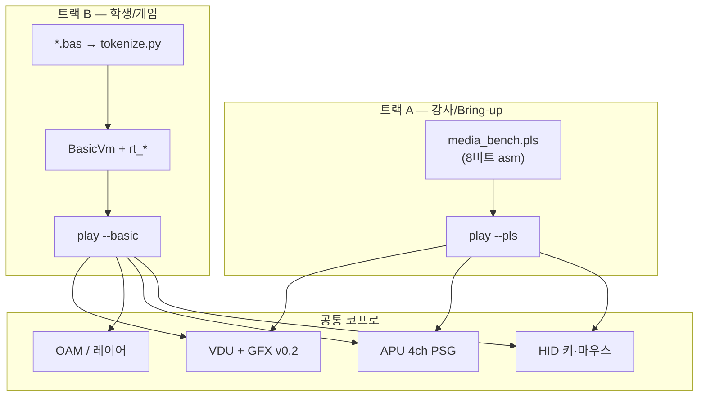

# 개발 데모 프로그램 명세 요약

**대상:** 데모·워크숍·I/O 검증 프로그램을 만드는 개발자  
**Related:** [vm-rust.md](../simulation/vm-rust.md) · [runtime-api.md](runtime-api.md) · [basic-system.md](basic-system.md) · [game-api.md](game-api.md) · [mailbox-protocol.md](../copro/mailbox-protocol.md)

Plover에서 “데모 프로그램”은 **화면·소리·입력**을 사람이 직접 확인하거나, CI가 최소 동작을 게이트하는 **체험/검증용 소프트웨어**를 말합니다. 게임 본편·벤치마크와 목적이 다릅니다.

---

## 1. 용어 (혼동 금지)

| 용어 | 목적 | 예 |
|------|------|-----|
| **Benchmark** | CPU 성능 측정 | `fib_to_200.pls`, `fib_to_20000.pls` |
| **Smoke test** | 자동 pass/fail 최소 게이트 | `vdu_smoke.yaml`, `apu_smoke`, `hid_smoke`, `sprite_layer_smoke`, `basic_boot` |
| **Diagnostic / `*-demo` CLI** | 호스트에서 빠른 단일 서브시스템 확인 | `vdu-demo`, `apu-demo`, `hid-demo` |
| **Integration / `play`** | Presenter(창·키보드·오디오)까지 묶은 통합 체험 | `play --pls …`, `play --basic …` |
| **Tech demo / media bench** | VDU+APU+HID NES-style diagnostic | `media_bench.pls` |
| **학생 게임 데모** | BASIC으로 좌표·타일만 바꿔 게임 만들기 | `pong.bas`, `shooter.bas` |

**관례:** 자동 게이트 → `*_smoke.yaml` + (선택) `.pls` · 수동 CLI → `*-demo` · 창/스피커 체험 → **`play`**.

---

## 2. 데모 두 트랙

데모는 **역할**에 따라 두 갈래로 나뉩니다. 같은 Mailbox v0.2 하드웨어를 공유합니다.



| 트랙 | 언어 | 로더 | 적합한 경우 |
|------|------|------|-------------|
| **A. Media bench** | Plover asm (`.pls`) | `play --pls` | “하드웨어가 된다” 시연, I/O bring-up, 키 echo + 비프 |
| **B. BASIC 게임** | Tiny BASIC (`.bas`) | `play --basic` | 학생 워크숍, 스프라이트·레이어·사운드 게임 |

**Forth / Subset C:** REPL·컴파일 체인 검증용. `play` 창 데모에는 **`.pls` 또는 `--basic`** 을 우선 사용합니다.

---

## 3. 실행 방법 (복사용)

### 3.1 통합 Presenter (`play`)

```bash
# asm 데모 (headless / CI)
cargo run -p plover_vm -- play --pls hw/fixtures/sw/vdu_smoke.pls --headless

# asm media bench (작성 후)
cargo run -p plover_vm --features sdl,audio -- play \
  --pls hw/fixtures/sw/media_bench.pls --audio

# BASIC 학생 게임
cargo run -p plover_vm --features sdl,audio -- play \
  --basic hw/fixtures/basic/pong.bas --audio

# headless BASIC (프레임·텍스트 확인)
cargo run -p plover_vm -- play --basic hw/fixtures/basic/pong.bas --headless --max-steps 500
```

`play`는 **`--pls` 또는 `--basic` 중 하나만** 지정합니다. Windows에서 SDL/오디오는 `--features sdl,audio` 필요.

### 3.2 단일 서브시스템 CLI

```bash
cargo run -p plover_vm -- vdu-demo
cargo run -p plover_vm -- apu-demo
cargo run -p plover_vm -- hid-demo
```

### 3.3 자동 smoke 게이트

```bash
cargo run -p plover_vm -- scenario hw/scenarios/vm/vdu_smoke.yaml
cargo run -p plover_vm -- scenario hw/scenarios/vm/sprite_layer_smoke.yaml
cargo run -p plover_vm -- scenario hw/scenarios/vm/basic_boot.yaml
cargo run -p plover_vm -- scenario hw/scenarios/vm/rt_lib_smoke.yaml
cargo test -p plover_scenario
pytest tests/test_sprite_layer.py
```

### 3.4 BASIC 토큰만 따로 빌드

```bash
python basic/tokenize.py hw/fixtures/basic/pong.bas pong.tok
```

바이트코드는 RAM **`$2800`** 에 적재됩니다 (변수 `A`–`Z` → **`$0E10`–`$0E29`**).

---

## 4. 아키텍처 (데모 작성 시 알아둘 것)

### 4.1 I/O 경로

모든 그래픽·오디오·입력은 **Mailbox** (`$FF00`–`$FFFB`) 경유. CPU는 `LDIO`/`STIO` 또는 런타임 syscall이 `MB_CMD` / `MB_PARAM` / `MB_BUFFER`를 채웁니다.

| 서브시스템 | 명령 범위 | 데모에서 자주 쓰는 것 |
|------------|-----------|------------------------|
| VDU 텍스트 | `0x10`–`0x17` | `VDU_CLS`, `VDU_PRINT`, `VDU_PUTCH`, `VDU_VSYNC` |
| GFX / 게임 | `0x20`–`0x2D` | `GFX_FILLRECT`, `GFX_FRAME_FLUSH`, `GFX_OAM_WRITE`, `GFX_LAYER_CFG`, `GFX_TILEMAP_SET`, `GFX_SET_TILE_PAL` |
| APU | `0x50`–`0x57` | `APU_SET_CTRL`, `APU_CH_WRITE`, `APU_NOTE_ON`, `APU_CH_SYNC` |
| HID | `0x40`–`0x43` | `HID_KEY_READ`, `HID_MOUSE_READ`, `HID_INJECT` (테스트) |

상세: [mailbox-protocol.md](../copro/mailbox-protocol.md) §2.6 GFX v0.2, §2.4 APU v0.2.

### 4.2 공통 런타임 `rt_*` (트랙 B·향후 Forth/C)

BASIC builtin과 asm syscall이 **같은 주소**를 목표로 합니다.

| 영역 | 주소 | 내용 |
|------|------|------|
| 벡터 테이블 + `rt_*` 코드 | `$1000`–`$17FF` | [`hw/fixtures/sw/rt_lib.pls`](../hw/fixtures/sw/rt_lib.pls) |
| BASIC VM (CPU stub) | `$1800`–`$1FFF` | [`hw/fixtures/sw/basic_vm.pls`](../hw/fixtures/sw/basic_vm.pls) — v0.1은 호스트 `BasicVm` |
| 토큰 프로그램 | `$2800`+ | `.tok` / `.bas` 컴파일 결과 |

호스트 측 Rust parity: `crates/plover_basic/src/runtime.rs`.  
명세: [runtime-api.md](runtime-api.md).

### 4.3 Presenter / 오디오

- **화면:** 내부 320×200 → 640×480 upscale, ~30 Hz 콘텐츠 / 60 Hz 창.
- **입력:** SDL `play` 루프가 `HidBridge`로 Mailbox HID 큐에 주입.
- **오디오:** `play --audio`는 VM의 `ApuState`를 매 프레임 AudioBridge와 **동기화** (clone 고정 버그 수정됨).

---

## 5. 트랙 A — `media_bench.pls` (Plover Diagnostic)

**상태:** **v0.2 완료** — [`hw/fixtures/sw/media_bench.pls`](../hw/fixtures/sw/media_bench.pls). NES Diagnostic 카트리지처럼 **자동 PASS/FAIL 테스트**와 **HID 대화형 RUN**을 한 프로그램에 묶습니다 (HALT 없음).

> **ZP:** syscall 상수 `$E3–$FF` (29B + pad). 부트 `JMP` @ `$E0`, 코드 @ `$0100`. 문자열은 `LDA 0` / `ADD imm` / `STIO`로 MB 버퍼에 채운 뒤 `VDU_PRINT`.

### 5.1 부트 화면

1. `VDU_CLS` (attr `0x07`)
2. `VDU_PRINT` — `"PLOVER DIAGNOSTIC"` (attr `0x17`)
3. `VDU_PRINT` — 구분선 `"--------------------"` (attr `0x18`)
4. 시작 비프 + `VDU_VSYNC`

### 5.2 자동 테스트 (부트 직후 1회)

| 항목 | 검증 | 결과 행 |
|------|------|---------|
| VDU TEXT | `PUTCH 'X'` → `CURSORGET` col==1 | `VDU TEXT ........ PASS/FAIL` |
| VDU VSYNC | `VDU_VSYNC` 호출 | `VDU VSYNC ....... PASS` |
| GFX | 8×8 빨강 `FILLRECT` @ (10,20) → `GETPIX` hi==`$F8` | `GFX FILL/READ ... PASS/FAIL` |
| APU CH0 | square ~1 kHz + `APU_SYNC` | `APU CH0 ......... PASS` |

### 5.3 HID 대화형 (RUN → PASS)

1. `HID KEY ......... RUN` / `HID MOUSE ....... RUN` 행 표시
2. 무한 루프: `HID_POLL`
3. **첫 키** → `HID KEY ......... PASS`, 이후 키 echo + 비프
4. **첫 마우스** → `HID MOUSE ....... PASS` (motion마다 `M` 출력하지 않음)
5. 각 이벤트 후 `VDU_VSYNC`

참고: [`vdu_smoke.pls`](../hw/fixtures/sw/vdu_smoke.pls), [`apu_smoke.pls`](../hw/fixtures/sw/apu_smoke.pls), [`monitor_poll.pls`](../hw/fixtures/sw/monitor_poll.pls).

### 5.4 성공 기준

- 640×480 창에 타이틀 + PASS/FAIL/RUN 행 + 빨간 사각형
- 키 입력 echo + **가청 비프** (`play --audio`)
- Headless: `cargo test -p plover_vm media_bench_play` — 타이틀 `'P'`, 픽셀 `(10,20)==0xF800`, `frame>=1`, HALT 없음
- `cargo test --workspace` / `pytest tests/` 회귀 유지

---

## 6. 트랙 B — BASIC 학생 데모 명세

**상태:** v0.1 구현 완료.

### 6.1 지원 문법 (요약)

| PC | Game |
|----|------|
| `PRINT`, `LET`, `GOTO`, `CLS` | `SPRITE`, `DRAW`, `SOUND`, `LAYER`, `TILE` |
| `K = INKEY()`, `IF INKEY() <> n THEN GOTO` | |
| `LET X = X + n` | |

변수는 **`A`–`Z` 한 글자**만 (`SPRITE 0, X, Y, …`).  
전체 문법: [basic-system.md](basic-system.md) · 게임 API: [game-api.md](game-api.md).

### 6.2 템플릿

| 파일 | 수정 포인트 (학생) |
|------|---------------------|
| [`pong.bas`](../hw/fixtures/basic/pong.bas) | `X`/`Y` 좌표, tile id, `SOUND` (추가 가능) |
| [`shooter.bas`](../hw/fixtures/basic/shooter.bas) | 스프라이트 2개, `LAYER` 스크롤, `TILE` 배경 |

### 6.3 게임 루프 패턴

```basic
10 LET X = 50
20 SPRITE 0, X, Y, 1, 0
30 DRAW
40 IF INKEY() <> 32 THEN GOTO 30
50 LET X = X + 2
60 GOTO 20
```

Space(32)를 누르고 있을 때만 이동 — `IF INKEY() <> 32 THEN GOTO` 로 구현.

### 6.4 성공 기준 (S_BASIC-3)

`play --basic pong.bas --audio` 로 **스프라이트 이동 + 키 입력 + 효과음** 확인.  
Headless 게이트: [`basic_boot.yaml`](../hw/scenarios/vm/basic_boot.yaml).

---

## 7. 언어 선택 가이드 (한 줄)

| 목적 | 선택 |
|------|------|
| 창 띄우는 I/O 통합 데모 (강사) | **`.pls`** + `play --pls` |
| 학생 게임 / 좌표만 바꾸는 워크숍 | **`.bas`** + `play --basic` |
| REPL로 Mailbox 실험 | **Forth** (`forth_boot.yaml`, `run_forth_demo.py`) |
| 컴파일러 smoke | **Subset C** (`cc_smoke.c`) |
| CPU 속도 측정 | **`.pls` fib** (데모 아님) |

---

## 8. 파일·크레이트 인덱스

| 산출물 | 경로 |
|--------|------|
| asm syscall 라이브러리 | `hw/fixtures/sw/rt_lib.pls` |
| asm smoke / bench | `hw/fixtures/sw/*_smoke.pls`, `media_bench.pls` |
| BASIC 소스 | `hw/fixtures/basic/*.bas` |
| 토크나이저 | `basic/tokenize.py` |
| BASIC VM (Rust) | `crates/plover_basic/` |
| 시나리오 게이트 | `hw/scenarios/vm/*.yaml` |
| `play` CLI | `crates/plover_vm/src/main.rs` |

---

## 9. 수업 / 시연 권장 순서

1. **Media bench** — `play --pls media_bench.pls --audio` 로 “입출력이 살아 있다” 시연 (강사)
2. **Pong** — `pong.bas`에서 숫자·타일만 수정 (학생)
3. **Shooter** — `LAYER`/`TILE`로 배경 스크롤 (심화)
4. **Smoke 회귀** — PR 전 `cargo test -p plover_scenario`, `pytest tests/`

---

## 10. 알려진 제한 (v0.1)

- BASIC: `DATA`/`READ`, 배열, float, on-CPU 파서 없음
- `media_bench.pls` (Plover Diagnostic): ZP 29B + `LDA 0`/`ADD imm` 문자열 빌드; 재생성 `python tools/gen_media_bench.py`
- CPU상 `basic_vm.pls`는 HALT stub; 실제 해석은 호스트 `BasicVm`
- 프레임율 ~30 Hz 전제; 학생 게임은 레트로 스타일
- `rt_input_num`, `rt_peek`/`rt_poke` asm stub — BASIC/문서에 “planned”

---

## 11. 변경 시 같이 갱신할 문서

| 변경 내용 | 문서 |
|-----------|------|
| Mailbox 명령 추가 | `mailbox-protocol.md` |
| `rt_*` 주소·시그니처 | `runtime-api.md`, `software-memory-layout.md` |
| BASIC 문법 | `basic-system.md`, `tokenize.py`, `plover_basic/src/tokens.rs` |
| `play` CLI 옵션 | `vm-rust.md`, 본 문서 §3 |
| 새 smoke 게이트 | `hw/scenarios/vm/*.yaml`, `plover_scenario` tests |

---

*작성 기준: BASIC 런타임(S_BASIC) v0.1 + media bench 트랙 A v0.1.*
