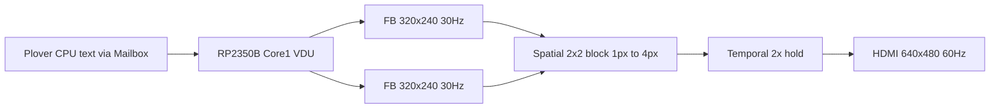

# Display and console (VDU v0.1)

**Related:** [rp2350-coprocessor.md](rp2350-coprocessor.md) · [mailbox-protocol.md](mailbox-protocol.md) · [dos-shell.md](dos-shell.md) · [software-memory-layout.md](software-memory-layout.md)

Normative text console and HDMI output for Plover v0.1. The **8-bit CPU does not own a framebuffer**; the **RP2350B** coprocessor renders and drives HDMI via HSTX.

---

## 1. Text console (normative)

| Parameter | Value | Notes |
|-----------|-------|-------|
| Columns | **40** | C64-class width; PLFS `dir` fits three 11-char names per row |
| Rows | **25** | One more than Apple II (24); matches classic home-computer feel |
| Cell size | **8×8 px** | Bitmap font in copro firmware |
| Active text raster | **320×200** | 40×8 by 25×8 |
| Line buffer (host/Forth) | **256 B** | TIB — [software-memory-layout.md](software-memory-layout.md) |

**PL-DOS / serial bring-up:** Until HDMI firmware ships, `plover_vm dos-shell` and UART log the same **40×25** semantics; long lines wrap or truncate at column 40.

---

## 2. Logical framebuffer (copro render target)

| Parameter | Value |
|-----------|-------|
| Resolution | **320×240** |
| Refresh (content) | **30 Hz** |
| Pixel format | **RGB565** (v0.1 default) |
| Text area | 320×200 centered vertically |
| Margin | **20 px** bottom bar (status / scanline border); top margin 0 in v0.1 |

320×240 is **QVGA**. It matches **40×8** horizontal pitch exactly and leaves integer cell height (8 px) for 25 rows plus a fixed **20 px** status band—no fractional scanlines.

```
+-- 320 px ------------------------+
| 25 rows × 8 px  (text 320×200)    |
|                                   |
+-- 20 px status / border ----------+
  240 px total
```

**Alternative rejected for v0.1:** 40×30 @ 8×8 (= 320×240 full bleed) — extra five rows break C64/MS-DOS muscle memory and PL-DOS `help` layout.

---

## 3. HDMI output (spatial + temporal upscale)

The RP2350B maintains **two RGB565 buffers** (double buffering). Core1 composites text/attributes into the **320×240 @ 30 Hz** back buffer, then the display pipeline upscales for HDMI:



| Stage | In | Out | Method |
|-------|-----|-----|--------|
| **Render** | Character cells | 320×240 | Font blit + border |
| **Spatial upscale** | 320×240 | **640×480** | **2×2 block replicate** — each source pixel → **4** output pixels (2 wide × 2 tall); no interpolation |
| **Temporal upscale** | 30 Hz frames | **60 Hz** | **Each content frame shown twice** (no interpolation) |

**Spatial rule (normative):** for each `(x, y)` sample in the 320×240 buffer, output the same colour to `(2x, 2y)`, `(2x+1, 2y)`, `(2x, 2y+1)`, `(2x+1, 2y+1)` in the 640×480 scan-out buffer.

```
Source 1×1     HDMI 2×2 block
   #      →    ## ##
               ## ##
```

**Output timing:** **640×480 @ 60 Hz** — standard VGA-style mode, widely accepted by HDMI sinks (640×480p via EDID).

### Why 320×240 @ 30 Hz is acceptable

1. **Integer text grid** — 8 px cells, no sub-pixel font clipping.
2. **Copro RAM budget** — two RGB565 planes: 320×240×2 × 2 ≈ **300 KiB** (fits RP2350 SRAM with headroom for font, HID, vFDD).
3. **CPU stays light** — Plover only writes characters/attributes through Mailbox; no VRAM on the 64 KiB map.
4. **Retro look** — 2×2 block upscale (1→4 pixels) keeps square chunky tiles on 640×480 HDMI (C64/Apple II aesthetic).
5. **60 Hz HDMI** — panel sees smooth refresh; **content** updates at 30 Hz (same class as NTSC-era machines).

### What we are not doing in v0.1

- 480p/720p native render on the CPU
- Motion interpolation or blending between 30 Hz frames
- 80-column text without a separate font/mode switch

---

## 4. RP2350 firmware responsibilities

| Task | Core | Notes |
|------|------|-------|
| Mailbox poll (vFDD, VDU cmd) | Core0 or shared | Existing [mailbox-protocol.md](mailbox-protocol.md) |
| Font + text matrix 40×25 | Core1 | Internal `char_buf[25][40]` + attributes |
| 320×240 compose @ 30 Hz | Core1 | Double-buffer flip |
| HSTX / DVI HDMI 640×480@60 | Core1 PIO/HSTX | Spatial + temporal upscale |
| HID → Mailbox | Core0 | USB keyboard/mouse → FIFO; CPU polls READ cmds |

VDU/GFX mailbox commands are normative in [mailbox-protocol.md](mailbox-protocol.md) §2.1–2.3 (`0x10–0x31`). CPU writes text via `VDU_PUTCH` / `VDU_PRINT` and bitmap via `GFX_PLOT` / `GFX_BLIT`; RP2350 composes layers into the 320×240 back buffer.

Reference stub: [`firmware/rp2350/mailbox_stub/main.c`](../firmware/rp2350/mailbox_stub/main.c) (vFDD + VDU handshake). VM model: [`plover_vm/memory/vdu.py`](../plover_vm/memory/vdu.py).

---

## 5. PLFS and 40-column `dir`

PLFS names are **8.3** (11 bytes on disk). On a **40-column** display:

| Layout | Example row |
|--------|-------------|
| One name per line | `HELLO.PLR` (9 chars) |
| Three columns × ~11 chars | `HELLO.PLR README.TXT COMMAND.PLR` (33 + spaces) |

Normative PL-DOS `dir` formatting (future): trim padding, insert `.` before extension, three columns when `mon vfdd` is not verbose.

---

## 6. VM / bring-up (until HDMI)

| Layer | Console |
|-------|---------|
| `plover_vm dos-shell` | Host terminal; wrap at 40 columns (soft) |
| UART / serial module | Byte stream, `\n` after 40 cols optional |
| hwsim / breadboard | LED/post only; no bitmap gate in M4 |

---

## Change log

| Date | Note |
|------|------|
| 2026-06-08 | v0.1 normative: 40×25, 320×240@30 → 640×480@60 HDMI on RP2350B |
