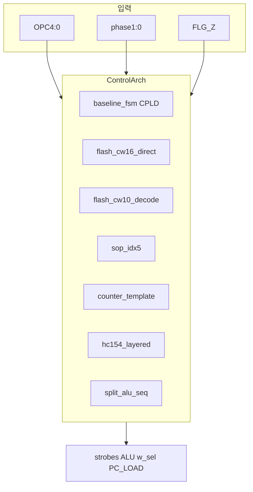

# CPLD 제어 로직 74HC 분리 탐색 보고서

**날짜:** 2026-06-25  
**범위:** GPR은 ATF1504 유지 · phase FSM/ALU/버스 제어만 외부 74HC(또는 Flash CW)로 분리  
**도구:** `python tools/cpld_ctrl_search.py --pareto` → `build/cpld_ctrl_pareto.json` (로컬 생성, gitignored)  
**Research (not normative):** [design-rationale-v1.0.md](research/design-rationale-v1.0.md) · **Normative:** [cpld-system-controller.md](cpld-system-controller.md) · [system-architecture.md](system-architecture.md)

---

## 0. Scope

| 항목 | 내용 |
|------|------|
| **본 보고서** | CPLD 내부 FSM(~12 MC)을 빼고 74HC/Flash로 대체하는 후보 비용 |
| **고정** | GPR 3fixed(R0–R2)는 CPLD에 유지 (~26 MC) |
| **고정** | CE 138×2, mailbox, MBR/PC/FLG 574 — 변경 없음 |
| **베이스라인** | v1.0 normative: `baseline_fsm` (GPR+FSM 통합, Flash CW 0행) |

> **독자 규칙:** 빵판 bring-up은 [cpld-system-controller.md](cpld-system-controller.md) normative만 따릅니다. 본 문서는 **연구·교육 대안** 기록입니다.

---

## 1. 분리 대상 인벤토리

CPLD가 레지스터 외에 담당하는 제어 ([plover-whitepaper.md](../project/plover-whitepaper.md) §3.2, [cpld-system-controller.md](cpld-system-controller.md) §3–7):

| 블록 | 신호 | 비트 수 | 타이밍 |
|------|------|---------|--------|
| Phase sequencer | `phase[1:0]`, template, macro_end | 내부 | CLK 등록 |
| Bus strobes | `REG_WE`, `MEM_RD`, `MEM_WR`, `Y_OE` | 4 | CLK 등록 |
| ALU control | `cin`, `b_sel`, `b_const_sel`, `lgc3:0`, `y_mux_sel` | 9 | CLK 등록 |
| Write target | `w_sel[1:0]` | 2 | 내부 → 외부화 시 핀 필요 |
| Branch | `PC_LOAD_EN` (+ BEQ `FLG_Z`) | 1+1 | macro_end |
| XFER | `regs(src)` → `d_in` | 2 (src) | 1-phase |

**진리표:** 16 opcode × phase = **26 활성 행** (idx5 논리 슬롯 26/128).  
생성: `tools/cpld_ctrl_model.py` — `FSM_OPCODE_TABLE` + §7 템플릿 strobes.

---

## 2. 탐색 방법

### 2.1 아키텍처 후보



| ID | 74HC / Flash 구성 | Flash 행 | CPLD MC |
|----|-------------------|----------|---------|
| `baseline_fsm` | 추가 0 (FSM in CPLD) | 0 | 38 |
| `flash_cw16_direct` | 574×2 + addr mux; CW→ALU 직결 | 26 | 26 |
| `flash_cw10_decode` | 574 + `alu8_decode` SOP + glue | 26 | 26 |
| `sop_idx5` | idx7 SOP(08/32/04) × strobes+ALU + 574×2 | 0 | 26 |
| `counter_template` | 161 phase + template glue + 153 w_sel | 0 | 26 |
| `hc154_layered` | idx SOP strobes + 154 ALU decode | 0 | 26 |
| `split_alu_seq` | idx SOP strobes + `alu8_decode` SOP | 0 | 26 |

**Pareto 축:** `(추가 DIP, delay_max_ns, flash_rows)` — baseline 대비 **추가** 74HC만 카운트.

**검증:** `pytest tests/test_cpld_ctrl_search.py`

### 2.2 CLI

```bash
python tools/cpld_ctrl_search.py --pareto
python tools/cpld_ctrl_search.py --pareto --json build/cpld_ctrl_pareto.json
python tools/cpld_ctrl_search.py --arch counter_template,flash_cw16_direct --top 5
```

---

## 3. 결과 (2026-06-25 실행)

### 3.1 코너

| 코너 | 추가 DIP | delay | Flash | CPLD MC | gates | feasible |
|------|----------|-------|-------|---------|-------|----------|
| **baseline** (`baseline_fsm_idx5`) | 0 | 141 ns | 0 | 38 | 0 | ✅ |
| **min DIP 순수 74HC** (`counter_template_idx4`) | **9** | 144 ns | 0 | 26 | 94 | ✅ |
| **min DIP Flash 포함** (`flash_cw16_direct_idx4`) | **3** | 136 ns | 26 | 26 | 0 | ✅ |

### 3.2 전체 feasible 구성 (추가 DIP 오름차순)

| key | DIP | delay | flash | MC | gates | pure_74hc |
|-----|-----|-------|-------|-----|-------|-----------|
| `flash_cw16_direct_idx4` | 3 | 136 ns | 26 | 26 | 0 | |
| `flash_cw16_direct_idx5` | 4 | 136 ns | 26 | 26 | 0 | |
| `counter_template_idx4/idx5` | 9 | 144 ns | 0 | 26 | 94–129 | ✅ |
| `flash_cw10_decode_idx4/idx5` | 12 | 151 ns | 26 | 26 | 0 | |
| `sop_idx5_idx4` | 69 | 149 ns | 0 | 26 | 302 | ✅ |
| `hc154_layered_idx4` | 70 | 151 ns | 0 | 26 | 301 | ✅ |
| `split_alu_seq_idx4` | 76 | 151 ns | 0 | 26 | 294 | ✅ |
| `hc154_layered_idx5` | 91 | 151 ns | 0 | 26 | 395 | ✅ |
| `split_alu_seq_idx5` | 97 | 151 ns | 0 | 26 | 388 | ✅ |
| `sop_idx5_idx5` | 90 | 149 ns | 0 | 26 | 396 | ❌ (DIP/gate budget) |

**Pareto front (추가 DIP 기준):** `baseline_fsm_idx5` 단독 — 외부 제어는 **어떤 경로도 추가 DIP 0을 이기지 못함**.

### 3.3 MC·배선 trade-off

| 항목 | baseline | 제어 분리 (예: cw16) |
|------|----------|----------------------|
| CPLD MC | 38 | **26** (−12, FSM 해제) |
| wire_hops (모델) | 118 | 122–128 |
| Flash `$4000` | 미사용 | 26 CW 행 소각 |

---

## 4. 아키텍처별 해석

### 4.1 `flash_cw16_direct` — Flash+최소 74HC

- **추가 DIP 3–4** (574×2 + idx mux)로 [cpu-4axis-arch-search-report.md](cpu-4axis-arch-search-report.md) H2와 정합.
- `alu8_decode` 9 DIP 불필요; 지연 136 ns (CPLD FSM 등록 +5 ns 대비 유리).
- **단점:** Flash `$4000` CW 영역 복원; boot ROM과 분리 관리.

### 4.2 `counter_template` — 순수 74HC 최저

- **161** phase counter + opcode→template **08/32** glue + **153** `w_sel` + **574** 제어 래치.
- 교육적으로 **phase·template이 눈에 보임** — M3 시퀀스 디버그에 유리.
- SOP 전개 시 ~280+ 게이트; 구조화 glue로 **9 DIP**에 수렴 (추정).

### 4.3 `sop_idx5` — 완전 SOP

- idx7 `(opcode[4:0], phase)` → 17출력 SOP: **idx4에서 69 DIP / 302 gates**, idx5는 **90 DIP / infeasible**.
- 128 슬롯 sparse라도 **7입력 SOP는 빵판 비현실** — 연구 한계점으로 기록.

### 4.4 `hc154_layered` / `split_alu_seq`

- Strobes는 여전히 idx-SOP 지배 (~70+ DIP).
- ALU만 [alu-decode-architecture-study.md](../archive/pre-v1.1b/alu-decode-architecture-study.md) 154/SOP로 분리해도 **총 DIP ≈ 70** — 시퀀서 SOP가 병목.

### 4.5 `baseline_fsm` — normative 유지 근거

| 목표 | baseline | 최선 외부화 |
|------|----------|-------------|
| 추가 74HC | **0** | 3 (cw16) ~ 9 (counter) |
| Flash CW | 0 | 26행 |
| CPLD MC headroom | 38/64 | 26/64 (+26 여유) |
| 제어 관측성 | CPLD 블랙박스 | counter_template 우수 |

**결론:** DIP·Flash·배선 Pareto에서는 **FSM-in-CPLD 유지**가 우세. MC 여유(26 슬롯)나 **시퀀스 가시화**가 목표일 때만 외부 제어를 연구 후보로 검토.

---

## 5. 권고

| 시나리오 | 권고 |
|----------|------|
| **Normative v1.0 빵판** | `baseline_fsm` 유지 |
| **CPLD MC 여유 확보** | `flash_cw16_direct` (추가 DIP 3, MC 26) |
| **교육: phase FSM 관측** | `counter_template` (순수 74HC 9 DIP) |
| **회피** | `sop_idx5` 전 SOP, `hc154_layered` (strobes SOP 병목) |

---

## 6. 구현 체크리스트 (외부 제어 채택 시)

- [ ] CPLD JED: GPR-only, `w_sel`/`REG_WSEL` 패키지 핀 복원 검토
- [ ] `tools/pack_control_store.py` / `cpld_ctrl_model.py` CW 행 일치
- [ ] M2a bring-up: LDA ph0 `MEM_RD`, BEQ `PC_LOAD_EN` vs `FLG_Z`
- [ ] hwsim: `hw/tests/cpld_seq_*.yaml` 외부 제어 변형 YAML
- [ ] `verify_control_store.py --v1.0` + `pytest tests/test_cpld_ctrl_search.py`

---

## 7. 도구·파일

| 파일 | 역할 |
|------|------|
| [tools/cpld_ctrl_model.py](../../tools/cpld_ctrl_model.py) | FSM → 제어 진리표 |
| [tools/cpld_ctrl_arch.py](../../tools/cpld_ctrl_arch.py) | 아키텍처 DIP/지연/MC 채점 |
| [tools/cpld_ctrl_search.py](../../tools/cpld_ctrl_search.py) | Pareto CLI |
| [tests/test_cpld_ctrl_search.py](../../tests/test_cpld_ctrl_search.py) | 회귀 테스트 |

---

## Change log

| 날짜 | 변경 |
|------|------|
| 2026-06-25 | 초판 — GPR 고정 제어 분리 탐색, 7아키텍처 Pareto |
