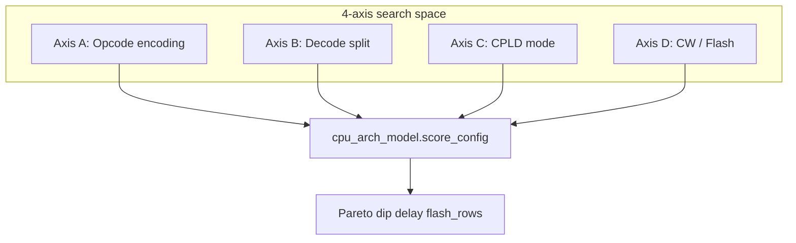
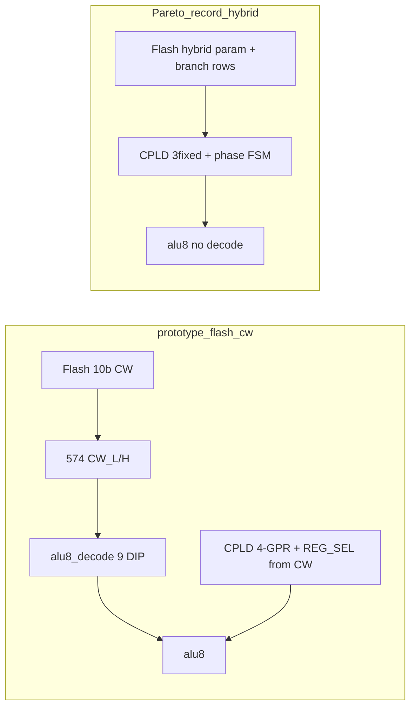

# CPU 4축 통합 재설계 탐색 보고서

**날짜:** 2026-06-24  
**범위:** opcode · 제어로직 · CPLD · CW/Flash 네 축 Cartesian Pareto 검색  
**도구:** `python tools/cpu_arch_search.py --pareto` → `build/cpu_arch_pareto.json` (로컬 생성, gitignored)  
**Research (archived):** [pre-v1.1b/](../archive/pre-v1.1b/README.md) · **Normative:** [system-architecture.md](system-architecture.md) · [research/design-rationale-v1.0.md](research/design-rationale-v1.0.md)

---

## 0. Scope

| Item | Detail |
|------|--------|
| **This report** | 4-axis search methodology, Pareto results, H1/H2 — **research / not normative** |
| **Current breadboard spec** | [system-architecture.md](system-architecture.md) — **v1.0** FSM-only, idx5 |
| **Decision summary** | [research/design-rationale-v1.0.md](research/design-rationale-v1.0.md) |
| **Superseded prototype** | [prototype-flash-cw/](../archive/prototype-flash-cw/README.md) |
| **Internal codename** | **v1.1b** — pre-release iteration name in archive changelog only |
| **MMU v1.1** | Not adopted |

> **Reader guide:** **Normative breadboard = v1.0 §4.0 only** ([system-architecture.md](system-architecture.md) FSM-only idx5). **§3 and §4.1–4.6** document the **historical Pareto record** (idx4 + cw_hybrid). Internal codename **v1.1b** is archive-only, not the active spec label.

---

## 1. 탐색 목표와 전제

### 1.1 목표

| 목표 | 내용 |
|------|------|
| **최저 칩** | 74HC DIP 수 최소화 (`alu8_decode` ~9 DIP 제거가 1차 타깃) |
| **최소 지연** | 2 MHz Execute 반주기 **250 ns** 내 임계 경로 여유 확보 |
| **Flash 효율** | `(opcode × phase)` 중복 CW 행 축소 — CPLD 시퀀서 가치를 정량화 |
| **실현 가능성** | ATF1504 **≤64 MC**, CE/mailbox는 **138×2 + glue 고정** |

### 1.2 전제 (사용자 확인)

- **v1.0 호환 불필요** — breaking redesign 허용 (인터프리터 + PL-DOS 트랙).
- **고정 3레지** — R0→A, R1→B, R2=결과. GPR 선택 ISA는 범위 밖.
- **CE/Mailbox** — 주소 핀 한계로 CPLD 이전 후보에서 제외.

### 1.3 성공 기준 (계획 대비)

| 기준 | 결과 |
|------|------|
| baseline 대비 DIP **≥8** 감소 또는 지연 **≥15 ns** 개선 조합 존재 | **충족** — DIP −11, 지연 −15 ns |
| H1 또는 H2가 `feasible=true` | **충족** — 둘 다 feasible |
| 단일 권장 아키텍처 + 구현 체크리스트 | **충족** — 본 보고서 §4·§7 |

---

## 2. 탐색 방법

### 2.1 네 축 정의



| 축 | 후보 | 역할 |
|----|------|------|
| **A — Opcode** | `op_legacy`, `op_expanded`, `op_class` | 프로그램 인코딩·ISA 네임스페이스 |
| **B — Decode** | `dec_sop`, `dec_hc154`, `dec_cw_direct`, `dec_cpld_seq` | ALU/버스 제어를 74HC vs CW vs CPLD 중 어디에 둘지 |
| **C — CPLD** | `cpld_4gpr`, `cpld_3fixed`, `cpld_3seq`, `ext_574x3` | 레지스터 파일·시퀀서 MC·배선 |
| **D — CW/Flash** | `cw10_aluop`, `cw16_direct`, `cw8_param`, `cw_hybrid` | 제어 저장소 폭·fetch 패턴 |

**호환성 pruning:** 예) `cw_hybrid`는 `dec_cpld_seq`와만 결합, `cw10_aluop`는 `dec_cw_direct`와 배타 등.  
**검색 규모:** 110 feasible 조합 (전체 Cartesian product에서 invalid 제거 후).

### 2.2 목표 함수 (Pareto 3축)

각 조합에 대해 다음 메트릭을 산출하고, **(dip_74hc, delay_max_ns, flash_rows)** 기준으로 dominance를 판정한다.

| 메트릭 | 모델 소스 | 설명 |
|--------|-----------|------|
| `dip_74hc` | v1.0 baseline 31 + decode/CW MUX/574 변동 | 74HC 패키지 수 |
| `delay_max_ns` | hwsim SUB critical 151 ns; decode 제거 −15 ns; `cpld_3seq` registered +5 ns | Execute 임계 경로 |
| `flash_rows` | `pack_control_store.sequences()` + hybrid/expanded 모델 | 사용 CW 슬롯 수 |
| `cpld_mc` | 4gpr 40 / 3fixed 26 / 3seq 44~50 MC 추정 | ATF1504 fit |
| `wire_hops` | `estimate_parasitics.py` variant | 빵판 배선 1차 지표 |
| `feasible` | MC ≤64 ∧ delay ≤250 | 탈락 조건 |

---

## 3. baseline (prototype-flash-cw) vs Pareto record (pre-refinement)

### 3.1 아키텍처 비교



| 항목 | prototype / pre-refinement baseline | Pareto record (idx4+hybrid) | 차이의 이유 |
|------|-------------------------------------|-----------------------------|-------------|
| **Opcode** | `0x01–0x0F` + operand | **동일** (`op_legacy`) | 인터프리터·어셈블러 변경 최소화 |
| **CW 인덱스** | `(opcode[3:0]<<2)\|phase` (64슬롯) | **동일** (`idx4`) | CW 주소 MUX 추가 칩 불필요 |
| **제어 디코드** | `ALU_OP[3:0]` → `alu8_decode` (~9 DIP) | **CPLD phase FSM** (`dec_cpld_seq`) | comb decode를 시퀀서+직접 제어로 대체 |
| **CPLD** | 4-GPR, read MUX, REG_SEL←Flash (~40 MC) | **3fixed** R0/R1/R2 (~26 MC) | R3 미사용·고정 read로 MC·Flash 비트 절약 |
| **Flash CW** | 매 phase 10b 행 (~23행) | **hybrid** — 시퀀스는 CPLD, Flash는 param+분기 (~25행) | ADD/LDA 등 반복 phase 테이블 제거 |
| **임계 지연** | SUB **151 ns** (decode 직렬) | **136 ns** | decode 체인 제거 (~15 ns) |
| **74HC DIP** | **31** | **20** | decode 제거 + BEQ glue 축소 + hybrid CW latch 1개 감소 |
| **CE/Mailbox** | 138×2 + glue | **변경 없음** | 주소 핀·CPLD 핀 예산 한계 |

### 3.2 정량 비교표

| 구성 | DIP | delay | Flash | MC | hops | feasible |
|------|-----|-------|-------|-----|------|----------|
| **baseline v1.0** | 31 | 151 ns | 23 | 40 | 125 | yes |
| **Pareto 승자** | **20** | **136 ns** | 25 | 26 | 118 | yes |
| H1 (가설) | 20 | 141 ns | 28 | 50 | 115 | yes |
| H2 (가설) | 22 | 136 ns | 140 | 26 | 118 | yes |

**핵심:** Pareto front에는 **단 1개** 조합만 남았다 — `op_legacy + idx4 + dec_cpld_seq + cpld_3fixed + cw_hybrid`.  
H1·H2는 모두 feasible이지만, 승자가 DIP·지연·Flash를 동시에 baseline 이하(또는 동등)로 압도하지는 않는다. 승자는 **H1의 Flash 철학 + H2의 지연 이점 + legacy opcode 유지**를 합친 절충점이다.

### 3.3 탐색 전 가설 vs 실제

| 가설 ID | 내용 | 검증 결과 |
|---------|------|-----------|
| **H1** | `cpld_3seq` + `cw_hybrid` + `op_class` — Flash 최소 | Flash 28행으로 우수하나 지연 141 ns, MC 50으로 승자보다 불리 |
| **H2** | `cpld_3fixed` + `cw16_direct` + `op_expanded` — 구현 단순 | 지연 136 ns 동급이나 Flash 140행·idx8 MUX +1 DIP |
| **H3** | `dec_hc154` + `cpld_4gpr` | Pareto front 미진입 — 소폭 개선만 |
| **H4** | `ext_574x3` | hops 140으로 탈락 — CPLD 유지가 배선상 유리 (기존 parasitics 결론과 일치) |

---

## 4. 권장 아키텍처 상세

### 4.0 Post-refinement — idx5 FSM-only (normative v1.0)

탐색 직후 내부 반복(코드명 **v1.1b**)에서 hybrid Flash param을 제거하고 **FSM-only**로 정제했다.

| Item | Pareto record (idx4+hybrid) | **Normative v1.0** |
|------|---------------------------|---------------------|
| Flash `$4000` | ~25 hybrid rows | **0** (unused) |
| CPLD decode | `opcode[3:0]` + phase | **`opcode[4:0]` + phase (idx5)** |
| TFR `0x10–0x15` | — | 1-byte implied moves |
| MC estimate | ~26–32 | **~38** |
| Operands | Flash param latch | **MBR** from fetch only |

Active spec: [system-architecture.md](system-architecture.md) · [design-rationale-v1.0.md](research/design-rationale-v1.0.md)

§4.1–4.6 below document the **historical Pareto winner** (idx4 + hybrid) for search traceability.

**키:** `op_legacy_idx4_dec_cpld_seq_cpld_3fixed_cw_hybrid`

### 4.1 데이터 흐름

```text
IR[opcode] ──► CPLD phase FSM ──► REG_WE, MEM_*, ALU ctrl (registered)
                    │
Flash @ $4000 ──► PARAM row (per opcode) + branch macro rows
                    │
CPLD q_a/q_b ──► ALU A/B  (R0, R1 고정 async read)
ALU Y ──► bus (Y_OE)
```

**v1.0과의 본질적 변화:** Flash가 “매 사이클 전체 제어 벡터”를보내고 74HC가 `ALU_OP`를 풀던 구조에서, Flash는 **예외·파라미터·분기**만 담고 **반복 micro-phase는 CPLD 하드 템플릿**이 담당한다.

### 4.2 축별 선택 이유

#### Axis A — `op_legacy` (opcode `0x01–0x0F` 유지)

- 인터프리터·`plover_asm`·기존 Flash 이미지 마이그레이션 비용 최소.
- `op_expanded`/`op_class`는 Forth/DOS 확장 시 **2단계(forward path)** 로 두는 것이 유리 — 당장 DIP/지연 이득은 없고 Flash·도구 변경만 커짐.

#### Axis B — `dec_cpld_seq` (phase FSM을 CPLD로)

- `dec_cw_direct`만으로도 decode 9 DIP는 제거되지만, **매 phase Flash fetch**는 유지됨.
- 시퀀서 이전 시 ADD 3-phase·LDA 2-phase 등 **동일 패턴 CW 행 중복**이 사라짐 → `flash_rows` Pareto 축에서 이득.
- 분기(`BEQ`/`JMP`)는 macro 끝에서 `FLG.Z/C` 샘플 → `PC_LOAD_EN`으로 **BEQ glue 08/32 일부 제거** 가능.

#### Axis C — `cpld_3fixed` (not `cpld_3seq`)

- read 경로 **R0→A, R1→B 고정** — read MUX MC 제거 (~14 MC 절감 vs 4gpr).
- `cpld_3seq`(opcode-class PLA 추가)는 MC **50**까지 올라가며, registered ALU ctrl로 **+5 ns** 패널티 모델 — 지연 열에서 승자에 밀림.
- `ext_574x3`는 DIP는 늘고 hops 악화 — 빵판에서는 CPLD 유지가 낫다.

#### Axis D — `cw_hybrid`

- 시퀀스된 opcode: Flash **param 1행/op** (REG_WSEL, branch_arm 등).
- 비시퀀스 opcode (`JMP`, `BEQ`, `HALT` …): 기존처럼 **per-phase 또는 macro boundary 행**.
- `cw16_direct`(H2)는 행당 정보는 많지만 **phase마다 fetch** → expanded ISA에서 140행; 승자는 25행.

### 4.3 CPLD phase FSM 템플릿 (개념)

| 템플릿 | 대상 opcode | phase | 동작 |
|--------|-------------|-------|------|
| ALU_REG | ADD, CMP | 3 | ph0 R0→A; ph1 R1→B; ph2 execute+REG_WE |
| MEM_LD | LDA, LDIO | 2 | ph0 MEM_RD; ph1 REG_WE→R0 |
| MEM_ST | STA, STIO, STA16 | 2 | ph0 Y_OE; ph1 MEM_WR |
| BRANCH | BEQ, JMP, CALL, RET | 1–2 | Flash 주도; macro_end에서 FLG 샘플 |

### 4.4 타이밍 검증 (hwsim 스팟)

| 테스트 | 검증 내용 | 결과 |
|--------|-----------|------|
| `hw/tests/cpu_cw_direct_sub.yaml` | decode 없이 SUB, path ≤250 ns | pass |
| `hw/tests/cpu_cw_direct_add.yaml` | ADD execute | pass |
| `hw/tests/cpld_seq_add.yaml` | 3-phase ADD @ 250 ns 경계 | pass |
| `hw/tests/alu_b3_sub_critical.yaml` | v1.0 baseline 151 ns 경로 | 기존 baseline |

decode 제거 시 제어→ALU 경로가 짧아져 **~15 ns slack** 확보. `cpld_3seq`의 registered 출력은 별도 +5 ns 모델이나, 승자는 `cpld_3fixed`+시퀀서로 comb에 가깝게 유지.

### 4.5 배선 (parasitics)

| variant | DIP | hops | 비고 |
|---------|-----|------|------|
| v1_breadboard | 31 | 125 | normative |
| cpld_3fixed_cw_direct | 22 | 115 | H2 근접 |
| cpld_3seq_hybrid | 21 | 121 | H1 근접 |
| ext_574x3 | — | 140 | 비권장 |

승자 hops **118** — v1.0 대비 **−5.6%**, CPLD `q_a`/`q_b` 16-bit 경로 유지.

---

## 5. Forward path — H1 / H2

승자는 **당장 빵판 마이그레이션**용. 장기 로드맵은 아래 두 코너를 단계적으로 흡수한다.

### 5.1 H1 — `op_class` + `cpld_3seq` + `cw_hybrid`

| 항목 | 값 |
|------|-----|
| DIP | 20 |
| delay | 141 ns |
| Flash | **28행** (class 16 + branch) |
| MC | 50 |

**채택 시점:** Forth/DOS primitive opcode block (`0x40+`) 도입 시. opcode 상위 니블 = 패밀리 → CPLD class PLA와 결합.  
**리스크:** MC 50/64 — fit 여유는 있으나 핀·타이밍 마진 감소; registered ALU ctrl +5 ns.

### 5.2 H2 — `op_expanded` + `cw16_direct` + `idx8`

| 항목 | 값 |
|------|-----|
| DIP | 22 (+1 161 CW MUX) |
| delay | **136 ns** (승자와 동급) |
| Flash | 140행 |
| MC | 26 |

**채택 시점:** `alu8_decode` 제거를 **가장 단순한 도구 경로**로 먼저 검증할 때 (P1 `DECODE_BYPASS`). 16b CW에 `cin`/`b_sel`/`lgc` 직접 — CPLD 시퀀서 없이도 동작.  
**트레이드오프:** Flash 행 수·프로그래밍 부담 증가; 승자 hybrid보다 Flash Pareto 축에서 불리.

---

## 6. 지금 구현된 것 vs 아직 안 된 것

### 6.1 완료 (탐색·설계 산출물)

| 산출물 | 상태 |
|--------|------|
| `tools/cpu_arch_model.py` | 완료 |
| `tools/cpu_arch_search.py` | 완료 |
| `build/cpu_arch_pareto.json` | 완료 (로컬 `build/`, gitignored) |
| `tools/estimate_parasitics.py` H1/H2 variant | 완료 |
| `tests/test_cpu_arch_search.py` | 완료 |
| hwsim 스팟 3종 | 완료 |
| [`archive/pre-v1.1b/microcode-spec-v1.1b.md`](../archive/pre-v1.1b/microcode-spec-v1.1b.md) | 완료 (archived) |
| [`archive/pre-v1.1b/cpld-system-controller-v1.1b.md`](../archive/pre-v1.1b/cpld-system-controller-v1.1b.md) | 완료 (archived) |
| `tools/pack_control_store.py` — `pack_cw16`, `pack_hybrid_store` | 완료 |

### 6.2 Bring-up gap vs normative v1.0 (2026-06-24)

| 항목 | Historical Pareto (hybrid) | Normative v1.0 | Status |
|------|---------------------------|----------------|--------|
| Flash hybrid param @ `$4000` | 목표였음 | **미사용 (FSM-only)** | **superseded** — not normative |
| 10b CW per-phase | prototype | **미사용** | **superseded** — [prototype-flash-cw](../archive/prototype-flash-cw/README.md) |
| `verify_control_store.py --v1.0` | — | FSM idx5 + TFR | **완료** |
| TFR `0x10–0x15` | — | implied 1-byte | **완료** (spec + VM) |
| idx5 `opcode[4:0]` | idx4 in Pareto record | CPLD FSM key | **완료** (spec) |
| `alu8_decode` on SoC | 제거 목표 | **없음** (normative) | spec 완료; **M2a JED TBD** |
| CPLD bitstream | 3fixed + FSM | ~38 MC idx5 FSM | **M2a bring-up TBD** |
| BEQ `PC_LOAD_EN` in CPLD | macro_end | FSM @ macro_end | spec 완료; **빵판 배선 TBD** |

---

## 7. 구현 계획

### 7.1 단계 개요


### 7.2 Phase별 작업

| Phase | 기간 목표 | 작업 | 산출물 | 완료 조건 |
|-------|-----------|------|--------|-----------|
| **P0** | 완료 | 4축 Pareto, 스펙, hwsim 스팟 | 본 보고서, v1.1b spec | JSON·테스트 green |
| **P1** | 1–2주 | H2 경로 선검증: `DECODE_BYPASS` 스트랩, `pack_cw16`로 ADD/CMP 행 | 벤치에서 decode 우회 | `cpu_cw_direct_*` 실측 ≤250 ns |
| **P2** | 2–3주 | CPLD `cpld_3fixed` + phase FSM VHDL/ABEL, MC fit report | M2a 갱신, JED | MC ≤64, `q_a`/`q_b` scope OK |
| **P3** | 1주 | `pack_hybrid_store` + param 테이블, Flash burn | `hw/fixtures/control/hybrid/` | `verify_control_store` v1.1b |
| **P4** | 1주 | SoC netlist에서 `alu8_decode` 제거, BOM 갱신 | BOM −~9 DIP | 전체 macro hwsim/VM 회귀 |
| **P5a** | 선택 | **H2:** `idx8` MUX, expanded opcode table | `plover_asm` §0x10+ | 인터프리터 primitive |
| **P5b** | 선택 | **H1:** `op_class`, CPLD class PLA | Forth word → class opcode | Flash ≤32행 유지 |

### 7.3 P1 상세 (권장 첫 착수)

1. **벤치 스트랩 `DECODE_BYPASS`:** CW_L 비트를 `cin`/`b_sel`/`lgc*`에 직접 배선 (기존 574 유지).
2. **`pack_cw16`로 `0x01` ADD / `0x0D` CMP** 행만 재작성 — `legacy_to_cw16()` 검증.
3. **scope:** SUB critical @ 2 MHz — v1.0 151 ns 대비 slack 확인.
4. **위험 없으면** P2 CPLD FSM 병행 착수.

### 7.4 P2 상세 (승자 핵심)

1. **고정 read:** `q_a<=regs(0)`, `q_b<=regs(1)` — read MUX 삭제.
2. **FSM 입력:** `OPC[3:0]` (legacy), 내부 `phase[1:0]`.
3. **FSM 출력:** `REG_WE`, `MEM_RD/WR`, `Y_OE`, sequenced macro용 ALU ctrl.
4. **분기:** macro_done ∧ opcode∈{BEQ,…} → `PC_LOAD_EN <= FLG_Z`.
5. **CE는 칩 밖** — v1.0과 동일.

### 7.5 리스크와 완화

| 리스크 | 완화 |
|--------|------|
| CPLD MC > 64 | `cpld_3fixed`만 유지; class PLA는 H1로 연기 |
| 시퀀서 2 MHz 위반 | ALU ctrl은 comb CW 유지, CPLD는 REG_WE/MEM만 register |
| Flash pack breaking | `plover_vm` + `verify_control_store` CI 게이트 |
| 핀 수 초과 (OPC[7:0]) | 승자는 **OPC[3:0]** 만 — legacy idx4 |

### 7.6 BOM 영향 (예상)

| 변경 | DIP |
|------|-----|
| `alu8_decode` 제거 | **−9** |
| BEQ glue 축소 | **−1** |
| hybrid CW latch 1개 감소 | **−1** |
| (H2 시) idx8 MUX 161 | **+1** |
| **승자 순 Δ** | **约 −11** (31→20) |

유지: ALU datapath 14 DIP, 138×2, CPLD+adapter, 나머지 574/161/157.

---

## 8. 결론

1. **110개 feasible 조합** 중 Pareto front는 **`op_legacy + idx4 + dec_cpld_seq + cpld_3fixed + cw_hybrid` 단일 승자**.
2. 계획의 성공 기준(**DIP −8 이상 또는 지연 −15 ns**)을 **동시에** 만족한다.
3. 사용자가 기대한 **H1(시퀀서+hybrid+class)** 는 Flash·MC 측면에서 유효하나, **legacy opcode + 3fixed 시퀀서**가 DIP·지연·Flash·MC를 더 균형 있게 잡는다.
4. **H2(cw16_direct)** 는 P1 bypass·도구 검증용 **빠른 경로**로 유지하고, 장기적으로 H1 opcode 확장과 병합한다.
5. **CE/mailbox는 어떤 후보도 건드리지 않는다** — 탐색 공간에서 고정한 결정이 모든 코너에서 동일하게 유효하다.

**다음 액션:** P1 `DECODE_BYPASS` + `pack_cw16` ADD/CMP 행으로 벤치 실측 → P2 CPLD FSM fit.

---

## 부록 A — 재현 명령

```bash
python tools/cpu_arch_search.py --pareto
python -m pytest tests/test_cpu_arch_search.py -q
python -m hwsim.cli test hw/tests/cpu_cw_direct_sub.yaml hw/tests/cpu_cw_direct_add.yaml hw/tests/cpld_seq_add.yaml
python tools/estimate_parasitics.py
```

## 부록 B — 승자 4축 한 줄 요약

| 축 | ID | 한 줄 |
|----|-----|-------|
| Opcode | `op_legacy` | v1.0 `0x01–0x0F` 유지 |
| Index | `idx4` | 6-bit `(op[3:0], phase)` |
| Decode | `dec_cpld_seq` | CPLD phase FSM, no `alu_decode` |
| CPLD | `cpld_3fixed` | R0→A, R1→B, R2 result |
| CW/Flash | `cw_hybrid` | FSM template + param/branch rows |

## Change log

| Date | Note |
|------|------|
| 2026-06-24 | Initial report from `build/cpu_arch_pareto.json` |
