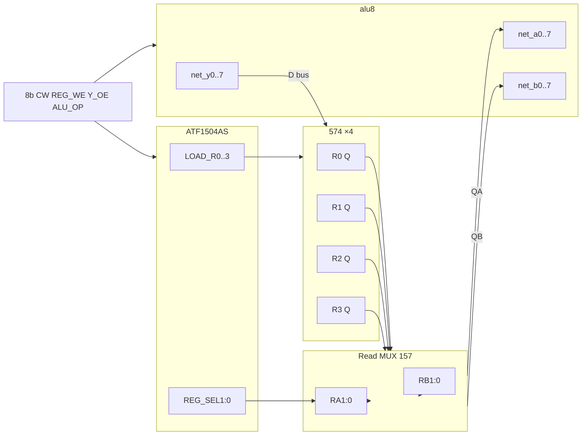

# GPR ↔ ALU 연결 시방서 (archived — external 574×4)

> **v1.0 normative:** CPLD GPR — [M2b-gpr-datapath.md](hw-bringup/M2b-gpr-datapath.md) · [breadboard-wiring.md](hw-bringup/breadboard-wiring.md).  
> Below documents **legacy external GPR** ([archive/pre-v0.1/](archive/pre-v0.1/README.md)).

# GPR(574×4) ↔ ALU 연결 시방서 (legacy)

> **Canonical:** [hw-bringup/M2b-gpr-datapath.md](hw-bringup/M2b-gpr-datapath.md) (G0–G6) · [M2b-memory.md](hw-bringup/M2b-memory.md) · fetch → [M3b-fetch-execute.md](hw-bringup/M3b-fetch-execute.md).

| 항목 | 내용 |
|------|------|
| **범위** | v0.1 CPU 데이터패스 — **R0–R3 (74HC574×4)** 와 **alu8 (74HC×16, Phase B2)** 연결 |
| **전제** | ALU 단독 검증 완료 ([hw-bringup-alu8-assembly-spec.md](hw-bringup-alu8-assembly-spec.md) B3a) |
| **CPLD** | `LOAD_R0..3`, `REG_SEL`, `REG_WE` ([hw-bringup-cpld-programming.md](hw-bringup-cpld-programming.md)) |
| **hwsim** | `regfile_574` · `alu8` · (통합 시) `cpld_gpr_decode` |

---

## 1. 신호 흐름 개요



| 경로 | 넷 (YAML) | 방향 |
|------|-----------|------|
| 읽기 포트 A | `net_qa0..7` → **`net_a0..7`** | GPR → ALU 피연산자 A |
| 읽기 포트 B | `net_qb0..7` → **`net_b0..7`** | GPR → ALU 피연산자 B |
| 쓰기 데이터 | **`net_y0..7`** → `net_d0..7` → 574 D | ALU 결과 → 레지스터 |
| 쓰기 스로브 | `net_reg_we` + `net_load_r0..3` | CPLD → 각 574 CP 게이트 |
| 읽기 주소 | `net_ra0..1`, `net_rb0..1` | Reg_Sel / phase 디코드 → MUX |

논리 블록: [`regfile_574.yaml`](../hw/netlist/blocks/regfile_574.yaml) (동작 모델 1개 = 물리 574×4).

---

## 2. 물리 IC 배치

| Ref (권장) | Part | 역할 |
|------------|------|------|
| `U_GPR_R0` … `U_GPR_R3` | 74HC574 | 8비트 GPR ×4 |
| `U_ALU_*` | (alu8) | [alu8.md](../hw/netlist/blocks/alu8.md) |
| `U_GPR_MUX_A_LO/HI` | 74HC157 ×2 | read port A (4+4 bit) |
| `U_GPR_MUX_B_LO/HI` | 74HC157 ×2 | read port B |
| `U_CPLD` | ATF1504AS | LOAD_R*, REG_SEL |

**BOM 참고:** 시스템 **574×7** = GPR×4 + MBR/PCH/FLG 등. 본 시방은 **GPR 4개** 만 ALU에 집중.

---

## 3. 574 GPR — 공통 규칙

### 3.1 핀 (74HC574)

| 574 핀 | 연결 | 비고 |
|--------|------|------|
| D0–D7 | `net_d0..7` | 공유 데이터 버스 |
| CP | **게이트된 클록** (§3.2) | posedge 래치 |
| OE | **GND** | Q 항상 구동 (read MUX로 선택) |
| VCC, GND | 5 V, GND | **0.1 µF** |

DIP 핀 번호: `python -m hwsim pinout 74HC574`

### 3.2 쓰기 클록 (`LOAD_R*`)

CPLD 출력 (액티브 하이 가정, 설계에 맞게 반전 가능):

```text
CP_Rn = net_clk2 AND net_reg_we AND net_load_rn
```

- **`net_clk2`**: 2 MHz ([hw-bringup-b3.md](hw-bringup-b3.md) B3c). B3b 수동 브링업: **푸시버튼** 1회 = 574 CP 펄스.  
- **`net_reg_we`**: 8b CW **B3** ([microcode-spec.md](microcode-spec.md)).  
- **`net_load_rn`**: CPLD **LOAD_R0..3** — 한 사이클에 **하나만** 1.

**hwsim 타이밍:** D setup ≥ 5 ns before CP ↑ (`regfile_574` 테스트).

### 3.3 데이터 버스 `net_d0..7` (다중 구동 주의)

| 구동원 | 조건 | 비고 |
|--------|------|------|
| **ALU Y** | `Y_OE` (CW B2) = 1 | `net_y*` → `net_d*` |
| **SRAM** | `MEM_RD` = 1 | 74HC245 경유 ([system-architecture.md](system-architecture.md)) |
| **(없음)** | 그 외 | 버스 홀드 — 플로팅 방지용 **풀다운/풀업** 또는 245 Z |

**시방:** 동시에 **하나의 구동원만** 활성. 마이크로시퀀스가 `Y_OE` 와 `MEM_RD` 를 겹치지 않게 설계됨 ([microcode-spec.md](microcode-spec.md)).

---

## 4. 읽기 포트 — 574 Q → ALU A/B

4개 574의 Q는 **동시에** 토글되므로, **MUX** 로 `net_a*`, `net_b*` 를 선택합니다.

### 4.1 주소 `RA[1:0]`, `RB[1:0]`

| RA/RB | 선택 레지스터 |
|-------|----------------|
| 00 | R0 |
| 01 | R1 |
| 10 | R2 |
| 11 | R3 |

**ADD (`0x01`) 마이크로페이즈** ([microcode-spec.md](microcode-spec.md)):

| Phase | Reg_Sel | 읽기/쓰기 | RA | RB | CPLD |
|-------|---------|-----------|----|----|------|
| 0 | 00 | A ← R0 | 00 | × | `REG_SEL`=00 |
| 1 | 01 | B ← R1 | × | 01 | `REG_SEL`=01 |
| 2 | 10 | R2 ← Y | (쓰기) | | `LOAD_R2`=1, `REG_WE`=1 |

**브링업 초기:** `RA`, `RB` 를 **DIP 2bit×2** 로 수동 설정 → MUX 출력을 ALU에 연결.

**통합 후:** `REG_SEL0/1` (CPLD) → `RA`; phase/opcode 별 **RB** 는 동일 PLA 확장 또는 phase 디코드 74HC161 출력과 조합 (설계 확정 시 `hw/cpld/` 핀표에 명시).

### 4.2 157 MUX 배선 (8비트 × 2포트)

각 포트 **574HC157 ×2** (하위 4bit + 상위 4bit):

| 157 입력 | 연결 |
|----------|------|
| 1A0–1A3, 2A0–2A3 | R0 Q0–Q3, R1 Q0–Q3 (또는 계층 4:1) |
| 1B0–1B3, 2B0–2B3 | R2, R3 |
| S | `net_ra0` (하위/상위 단계별로 ra0, ra1 조합 — 2단 157 또는 153 고려) |

**단순 브링업:** 1단 MUX 4:1 × 8비트는 **157 4개(A) + 157 4개(B)**. BOM 여유 157이 부족하면 **한 포트만** 먼저 MUX하고 B는 DIP 직결.

**출력**

- MUX A → `net_a0..7`  
- MUX B → `net_b0..7`  

ALU 쪽 핀은 [alu8.md](../hw/netlist/blocks/alu8.md): 왼쪽 열 핀은 **왼쪽으로** 배선 스텁 ([export-schematic](hw-bringup-alu8-assembly-spec.md) 측).

---

## 5. ALU 제어 — CW / 디코드

### 5.1 피연산자 (A/B)

| 모드 | `net_a*`, `net_b*` 소스 |
|------|-------------------------|
| **통합 CPU** | GPR MUX → ALU |
| **ALU 단독 (B3a)** | DIP (제거 또는 MUX 입력에 DIP 병렬) |

### 5.2 ALU 내부 제어

| 신호 | 소스 (통합) |
|------|-------------|
| `net_cin`, `net_153_s0/s1`, `net_b_sel`, `net_b_const_sel`, `net_b_const_bit*`, `net_lgc0..3` | **8b CW B7–B4 (`ALU_OP`)** → [`alu8_decode`](../hw/netlist/blocks/alu8_decode.yaml) 또는 Flash 병렬 로드 |
| `net_cmp_z`, `net_cmp_c_ge` | CMP — SUB 경로 (`net_y`, `net_c_hi`) · [`alu8_cmp_sub`](../hw/tests/alu8_cmp_sub.yaml) |

| CW bit | 신호 |
|--------|------|
| B7–B4 | `ALU_OP[3:0]` → 디코드 → alu8 제어 |
| B3 | `REG_WE` |
| B2 | `Y_OE` |
| B1 | `MEM_RD` |
| B0 | `MEM_WR` |

**INC/DEC:** `net_b0..7` **에 GPR MUX 출력을 연결하되**, ALU 내부는 **`b_const_sel`** 경로만 사용 — B 레지스터 값은 무시 ([hw-bringup-b3-opcode.md](hw-bringup-b3-opcode.md)).

### 5.3 결과 Y → 레지스터

| 연결 | 시방 |
|------|------|
| `net_y0..7` → `net_d0..7` | **직접** (짧은 배선) |
| `Y_OE` = 1 | ADD ph2 등 래치 사이클 ([microcode-spec.md](microcode-spec.md) ADD ph2: CW=`1C`) |
| 동시 | `LOAD_R2` (예) + CP ↑ |

B3b 단일 ACC 실험: [hw-bringup-b3.md](hw-bringup-b3.md) — GPR 4개 중 **한 개**만 써도 동일 원리.

---

## 6. 단계별 실장·검증

| 단계 | 작업 | Pass |
|------|------|------|
| **G0** | CPLD 소각, `LOAD_*` LED 스모크 | [hw-bringup-cpld-programming.md](hw-bringup-cpld-programming.md) §5 |
| **G1** | 574×4 + DIP→R0, 수동 CP, Q LED | R0 = DIP 패턴 |
| **G2** | Read MUX + DIP `RA`/`RB` → ALU `A`/`B` LED (ALU 미장착 시 MUX 출력 LED) | RA=0 → R0 데이터 |
| **G3** | ALU B3a + MUX: `A`,`B` from GPR, 제어는 DIP/치트시트 | SUB/XOR 스모크 |
| **G4** | `Y` → `D`, `LOAD_R2`, 수동 CP: R2에 결과 | R2_Q = Y |
| **G5** | `REG_WE`, `opcode`, `phase` → CPLD → `LOAD_*` | hwsim `cpld_gpr_decode` |
| **G6** | 8b CW + `alu8_decode` + 2 MHz | ADD 3-phase 연속 |

```bash
python -m hwsim run hw/tests/regfile_574.yaml
python -m hwsim run hw/tests/alu8_full.yaml
python -m hwsim run hw/tests/cpld_gpr_decode.yaml
```

---

## 7. ADD 한 사이클 체크리스트 (통합 목표)

마이크로 3페이즈 @ 2 MHz (500 ns period, comb ≤ 250 ns):

| Ph | REG_WE | Y_OE | ALU_OP | LOAD_R* | 동작 |
|----|--------|------|--------|---------|------|
| 0 | 0 | 1 | ADD | 0 | R0 → A, ALU comb |
| 1 | 0 | 1 | ADD | 0 | R1 → B, ALU comb |
| 2 | 1 | 1 | ADD | R2 | Y → D, CP↑ 래치 |

**예:** R0=`12`, R1=`34` → Y=`46` → ph2 후 R2=`46`.

---

## 8. 넷 이름 · KiCad

| 도메인 | 넷 |
|--------|-----|
| GPR D | `net_d0..7` |
| GPR read A/B | `net_qa0..7`, `net_qb0..7` |
| ALU | `net_a0..7`, `net_b0..7`, `net_y0..7` |
| CPLD | `net_load_r0..3`, `net_reg_sel0..1`, `net_reg_we` |
| 클록 | `net_clk2` |

[hw-schematic.md](hw-schematic.md) · 배선도: `python -m hwsim export-schematic …`

---

## 9. 고장 분리

| 증상 | 확인 |
|------|------|
| A/B 항상 0 | MUX S선, 574 OE, RA/RB DIP |
| Y는 맞는데 R2 안 바뀜 | `LOAD_R2`, `REG_WE`, CP 게이트, D↔Y 배선 |
| INC/DEC 이상 | `b_const_sel`, **B DIP 직접 구동 금지** |
| ADD만 틀림 | ALU 제어 vs GPR — [hw-bringup-alu8-assembly-spec.md](hw-bringup-alu8-assembly-spec.md) |
| hwsim OK, 실기 NG | `Y_OE`/`MEM_RD` 버스 충돌, setup (CP 전 Y 안정) |

---

## 10. 관련 문서

| 문서 | 내용 |
|------|------|
| [hw-bringup-alu8-assembly-spec.md](hw-bringup-alu8-assembly-spec.md) | ALU 14 IC 조립 순서 (Phase B2) |
| [hw-bringup-b3.md](hw-bringup-b3.md) | 574 ACC · 2 MHz |
| [hw-bringup-b3-opcode.md](hw-bringup-b3-opcode.md) | ALU opcode DIP |
| [cpld-system-controller.md](cpld-system-controller.md) | CPLD 포트 |
| [microcode-spec.md](microcode-spec.md) | CW · Reg_Sel |

---

## 11. 개정 이력

| 날짜 | 내용 |
|------|------|
| 2026-06-02 | 초판 — 574×4, MUX, CW, ADD 시퀀스 |
