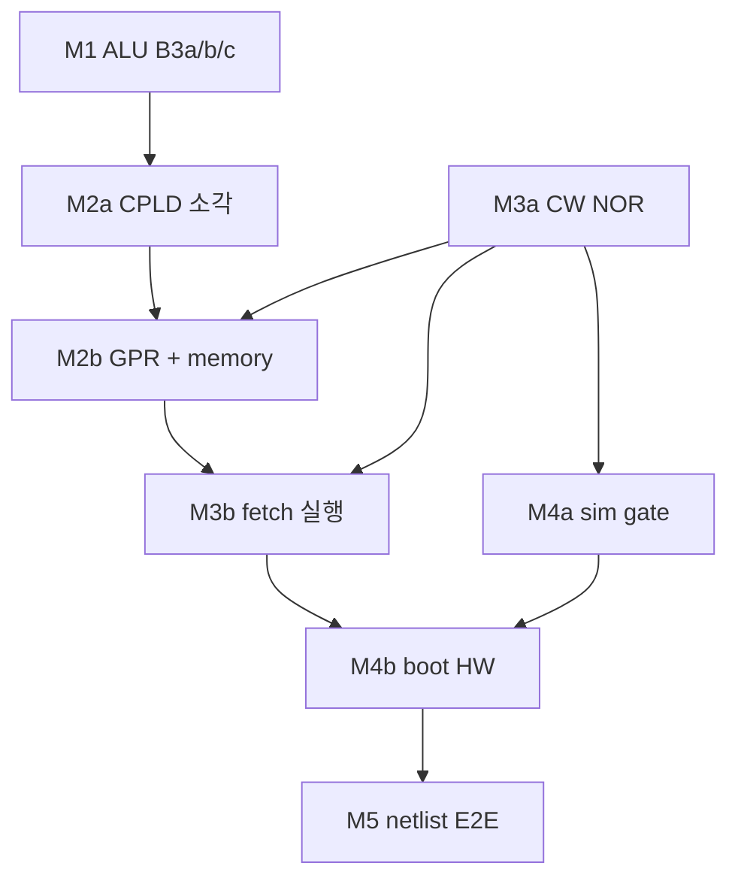

# Plover v0.1 — Hardware bring-up index

**마일스톤 계획:** [implementation-plan-v0.1.md](../implementation-plan-v0.1.md)  
**아키텍처:** [system-architecture.md](../system-architecture.md)

초보 작업자도 **문서만 따라** 빵판 CPU를 올릴 수 있도록 단계별 시방서입니다.  
각 마일스톤 = **개요(체크리스트)** + **상세 절차(배선·DIP·Pass)**.

---

## 처음 시작하는 사람 — 읽는 순서



| 순서 | 할 일 | 시작 문서 |
|------|-------|-----------|
| 1 | ALU 납땜 + Y LED | [M1-alu.md](M1-alu.md) → [M1-b3-procedure.md](M1-b3-procedure.md) |
| 2 | CPLD 프로그래밍 | [M2a-cpld-decode.md](M2a-cpld-decode.md) |
| 3 | GPR·SRAM·NOR | [M2b-gpr-memory.md](M2b-gpr-memory.md) |
| 4 | CW Flash 소각 | [M3a-control-store.md](M3a-control-store.md) |
| 5 | ROM fetch 실행 | [M3b-fetch-execute.md](M3b-fetch-execute.md) |
| 6 | (PC) 부트 sim | [M4a-boot-sim.md](M4a-boot-sim.md) — **빵판 없이** |
| 7 | 부트 실기 | [M4b-boot-hardware.md](M4b-boot-hardware.md) |
| 8 | netlist 고정 | [M5-cpu-e2e.md](M5-cpu-e2e.md) |

---

## 문서 목록

### M1 — ALU

| 문서 | 내용 |
|------|------|
| [M1-alu.md](M1-alu.md) | 마일스톤 개요·sign-off |
| [M1-b3-procedure.md](M1-b3-procedure.md) | **B3a/b/c 상세** (배선·smoke·스코프) |
| [../hw-bringup-alu8-assembly-spec.md](../hw-bringup-alu8-assembly-spec.md) | 14 IC **단계별 조립** (한국어) |
| [../hw-bringup-b3-opcode.md](../hw-bringup-b3-opcode.md) | 12 opcode DIP 표 |

### M2 — CPU gate

| 문서 | 내용 |
|------|------|
| [M2a-cpld-decode.md](M2a-cpld-decode.md) | ISP·벤치·ADD phase DIP 워크스루 |
| [M2b-gpr-memory.md](M2b-gpr-memory.md) | M2b 개요 |
| [M2b-gpr-datapath.md](M2b-gpr-datapath.md) | **G0–G6** GPR/MUX/ALU |
| [M2b-memory.md](M2b-memory.md) | SRAM·NOR·MAP_MODE |

### M3 — Microcode

| 문서 | 내용 |
|------|------|
| [M3a-control-store.md](M3a-control-store.md) | pack·verify·NOR 소각·CW DIP 표 |
| [M3b-fetch-execute.md](M3b-fetch-execute.md) | **F0–F6** PC·phase·첫 ROM 프로그램 |

### M4 — Boot

| 문서 | 내용 |
|------|------|
| [M4a-boot-sim.md](M4a-boot-sim.md) | pytest·scenario gate (상세) |
| [M4b-boot-hardware.md](M4b-boot-hardware.md) | **G1–G5** 빵판 부트 |

### M5 — E2E netlist

| 문서 | 내용 |
|------|------|
| [M5-cpu-e2e.md](M5-cpu-e2e.md) | cpu.yaml·cpu_e2e test (TBD) |

---

## 검증 명령 모음

```bash
# M1
python -m hwsim run hw/tests/alu8_full.yaml
python -m hwsim run hw/tests/alu_b3_latch.yaml

# M2
python -m hwsim run hw/tests/cpld_gpr_decode.yaml
python -m hwsim run hw/tests/mem_decode.yaml
python -m hwsim run hw/tests/regfile_574.yaml

# M3
python tools/pack_control_store.py --build-fixtures
python tools/verify_control_store.py
python -m pytest tests/test_engine_parity.py -q

# M4a
python -m pytest tests/test_boot_jmp_handoff.py -q
python -m plover_vm scenario hw/scenarios/vm/boot_jmp_handoff.yaml

# 전체
python -m hwsim run --all
python -m pytest tests/ -q
```

---

## 레거시 경로 (상세 유지)

| 이전 경로 | 현재 canonical |
|-----------|----------------|
| [hw-bringup-b3.md](../hw-bringup-b3.md) | [M1-b3-procedure.md](M1-b3-procedure.md) |
| [hw-bringup-cpld-programming.md](../hw-bringup-cpld-programming.md) | [M2a-cpld-decode.md](M2a-cpld-decode.md) |
| [hw-bringup-gpr-alu.md](../hw-bringup-gpr-alu.md) | [M2b-gpr-datapath.md](M2b-gpr-datapath.md) |

---

## Change log

| Date | Note |
|------|------|
| 2026-06-08 | Milestone index M1–M5 |
| 2026-06-08 | 상세화 — M1-b3, M2b split, M3b F0–F6, M4 gate 워크스루 |
