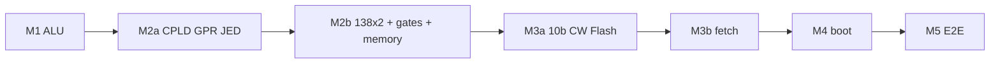

# Plover hardware bring-up index

> **Normative v1.0:** CPLD GPR + 138×2 + 10b CW — [system-architecture.md](../hardware/system-architecture.md).  
> Wiring reference: [breadboard-wiring.md](breadboard-wiring.md).

**마일스톤 계획:** [implementation-plan-v0.1.md](../project/implementation-plan-v0.1.md)  
**아키텍처:** [system-architecture.md](../hardware/system-architecture.md) v1.0

초보 작업자도 **문서만 따라** 빵판 CPU를 올릴 수 있도록 단계별 시방서입니다.

---

## 읽는 순서



| 순서 | 할 일 | 시작 문서 |
|------|-------|-----------|
| 1 | ALU 납땜 + Y LED | [M1-alu.md](M1-alu.md) → [M1-b3-procedure.md](M1-b3-procedure.md) |
| 2 | CPLD GPR 소각 | [M2a-cpld-decode.md](M2a-cpld-decode.md) |
| 3 | 138×2 · GPR datapath · SRAM/NOR | [M2b-gpr-memory.md](M2b-gpr-memory.md) · [breadboard-wiring.md](breadboard-wiring.md) |
| 4 | 10b CW Flash 소각 | [M3a-control-store.md](M3a-control-store.md) |
| 5 | ROM fetch 실행 | [M3b-fetch-execute.md](M3b-fetch-execute.md) |
| 6 | (PC) 부트 sim | [M4a-boot-sim.md](M4a-boot-sim.md) |
| 7 | 부트 실기 | [M4b-boot-hardware.md](M4b-boot-hardware.md) |
| 8 | netlist 고정 | [M5-cpu-e2e.md](M5-cpu-e2e.md) |

---

## 문서 목록

### M1 — ALU

| 문서 | 내용 |
|------|------|
| [M1-alu.md](M1-alu.md) | 마일스톤 개요 |
| [M1-b3-procedure.md](M1-b3-procedure.md) | B3a/b/c 상세 |

### M2 — CPU gate

| 문서 | 내용 |
|------|------|
| [M2a-cpld-decode.md](M2a-cpld-decode.md) | CPLD GPR-only ISP |
| [M2b-gpr-memory.md](M2b-gpr-memory.md) | M2b 개요 |
| [M2b-gpr-datapath.md](M2b-gpr-datapath.md) | CPLD q_a/q_b ↔ ALU |
| [M2b-memory.md](M2b-memory.md) | SRAM·NOR·MAP_MODE |
| [breadboard-wiring.md](breadboard-wiring.md) | 138×2 · gates · CW latch |

### M3 — Microcode

| 문서 | 내용 |
|------|------|
| [M3a-control-store.md](M3a-control-store.md) | 10b pack · dual 574 latch |
| [M3b-fetch-execute.md](M3b-fetch-execute.md) | PC·phase·첫 ROM 프로그램 |

### M4 / M5

| 문서 | 내용 |
|------|------|
| [M4a-boot-sim.md](M4a-boot-sim.md) | pytest·scenario |
| [M4b-boot-hardware.md](M4b-boot-hardware.md) | 빵판 부트 |
| [M5-cpu-e2e.md](M5-cpu-e2e.md) | breadboard composite netlist |

---

## 검증 명령

```bash
# M1
python -m hwsim run hw/tests/alu8_full.yaml

# M2 (v1.0 breadboard)
python -m hwsim run hw/tests/cpld_gpr_decode_breadboard.yaml
python -m hwsim run hw/tests/mem_decode_breadboard.yaml

# M3
python tools/pack_control_store.py --build-fixtures
python tools/verify_control_store.py

# 전체
python -m hwsim run --all
python -m pytest tests/test_mem_decode_breadboard.py tests/ -q
```

Legacy hwsim tests under `hw/tests/archive/tier0/`.

---

## Change log

| Date | Note |
|------|------|
| 2026-06-10 | v1.0 single breadboard path; tier2-migration archived |
| 2026-06-08 | Milestone index M1–M5 |
