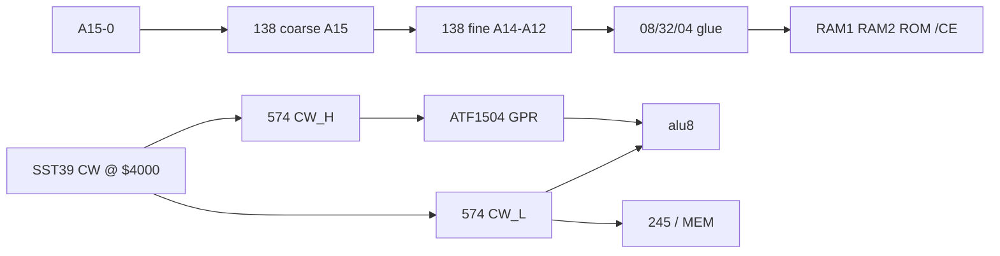

# Breadboard v1.0 wiring reference

**Normative:** [system-architecture.md](../hardware/system-architecture.md) · [memory-map.md](../hardware/memory-map.md) · [cpld-system-controller.md](../hardware/cpld-system-controller.md)

Single breadboard target — **one normative path**. CPLD = GPR only (~40 MC); CE and mailbox = **138×2 + 08/32/04 glue**; control = **10b CW** from Flash via dual **574** latch.

---

## Block placement (logical)

---

## 10b control word latch

| Latch | Bits | Destination |
|-------|------|-------------|
| **CW_L** (574) | B7–B0 | ALU decode, `REG_WE`, `Y_OE`, `MEM_RD`, `MEM_WR` — **direct** (no CPLD) |
| **CW_H** (574) | B9–B8 `REG_SEL[1:0]` | CPLD GPR `w_sel` / `r_sel` |

Flash slot `index = (opcode<<2)|phase`:

- Byte @ `$4000 + 2×index` → CW_L
- Byte @ `$4000 + 2×index + 1` → CW_H (REG_SEL in bits 1:0)

Pack: `python tools/pack_control_store.py --build-fixtures`

---

## 74HC138×2 CE tree

| Stage | Inputs | Role |
|-------|--------|------|
| **I1** (coarse) | `A15`, `E3` from glue | Low 32 KiB vs high 32 KiB bank |
| **I2** (fine) | `A14–A12`, enables from I1 | RAM1 / RAM2 / ROM coarse select |

Glue (`hw/logic/mem_glue.py`, `decode_ce_breadboard`) combines:

- Mode A/B (`MAP_MODE`)
- Mailbox window `$FF00–$FF0F`
- Boot vector enclave `$FFFC`
- 138 `Y*` → active-low `/CE`

**hwsim gate:** `mem_decode_breadboard.yaml`

---

## Gate budget (mailbox / MAP)

| IC | Qty | Function |
|----|-----|----------|
| 74HC08 | 2 | AND terms for MAP + mailbox |
| 74HC32 | 2 | OR combine 138 outputs + glue |
| 74HC04 | 1 | Inversions (shared with ALU) |

No GAL. BEQ uses **574 FLG** (Z/C) + existing 08/32 glue per [microcode-spec.md](../microcode-spec.md).

---

## CPLD GPR (ATF1504 TQFP-100)

| Port | Dir | Notes |
|------|-----|-------|
| `REG_SEL[1:0]` | In | From CW_H latch |
| `REG_WE` | In | From CW_L |
| `d_in[7:0]` | In | Data bus (write) |
| `q_a`, `q_b` | Out | Dual async read → ALU A/B |
| `CLK` | In | 2 MHz system clock |

**Not in CPLD:** opcode/phase decode, `/CE`, `MAILBOX_EN`, bus 245 drive.

Fit target **≤40 MC** — [cpld-system-controller.md](../hardware/cpld-system-controller.md). Reset `$FFFC` MUX: **157 recommended** until fit report; optional CPLD stub 4–8 MC.

---

## 574 inventory (v1.0)

| # | Role |
|---|------|
| PC, MBR | Program counter path |
| CW_L, CW_H | 10b CW latch |
| FLG | Z/C for BEQ |

GPR **not** external 574×4 — registers inside CPLD.

---

## Bring-up order

See [README.md](README.md): M1 ALU → M2a CPLD GPR JED → M2b 138×2 + memory → M3a 10b CW Flash → M3b fetch → M4/M5.

Legacy external-GPR path: [archive/pre-v0.1/](../archive/pre-v0.1/README.md) only.
