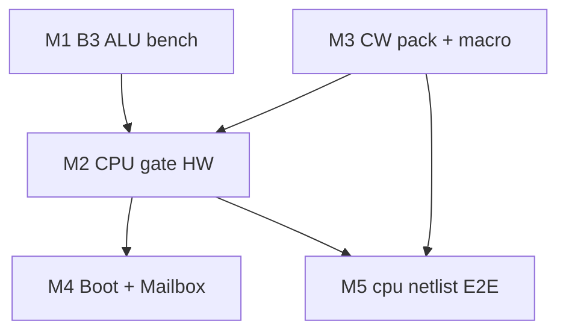

# Plover v0.1 — Implementation Plan

**Version:** 0.1 · **Date:** 2026-06-01  
**Normative:** [system-architecture.md](system-architecture.md)

Single active milestone document. Supersedes archived [v0.2 / v1.x plans](archive/pre-v0.1/README.md).

---

## 1. Goal

Deliver a **breadboard-prototype 8-bit CPU** with:

- 574×4 GPR + ATF1504AS system CPLD
- Single SST39SF010A (boot + 8b CW + utility)
- 2× IS62C256 (64 KB via A15)
- MMIO Mailbox @ `$FF00` (polling, no IRQ)
- RP2350 coprocessor board (stretch)

**Parallel track (optional):** FPGA / Verilog on education boards or external ROM/RAM — [fpga-target-guide.md](fpga-target-guide.md) (planning; RTL not in tree yet).

Verification: `python -m hwsim run --all` (15) · `python -m pytest tests/ -q` · `python tools/verify_control_store.py`

---

## 2. Current status

| Milestone | Status | Evidence |
|-----------|--------|----------|
| ALU bringup hwsim | Done | 17 tests — `alu8_*`, `alu_b3_*`, `cmp_y_oe_bus`; B3c clock = scope only |
| Normative docs v0.1 | Done | 8 unversioned specs + BOM |
| CPU gate hwsim | Done | `cpld_gpr_decode`, `regfile_574`, `mem_decode`, `monitor_poll`, `boot_handoff` |
| Control store pack | Done | `tools/pack_control_store.py` → `cw.hex` (ADD–HALT packed) |
| Logic VM | Done | `plover_vm/` + Fibonacci demos |
| B3 ALU breadboard | Pending | [hw-bringup-b3.md](hw-bringup-b3.md) |
| Full `cpu` netlist | Stub | [cpu.yaml](../hw/netlist/blocks/cpu.yaml) composite only |
| CALL/RET/LDIO/STIO CW | Draft in spec | Not in `cw.hex` yet |

---

## 3. Work packages

### M1 — B3 real hardware

- Wire ALU per [hw-bringup-b3.md](hw-bringup-b3.md) and [alu-opcodes-timing.md](alu-opcodes-timing.md)
- Scope: 12-opcode ALU + 2 MHz clock divider
- Gate: DSO checks on critical paths (SUB, XOR, INC/DEC)

### M2 — CPU gate on breadboard

- 574×4 GPR + ATF1504AS decode + 64 KB SRAM + single NOR
- MAP_MODE switch, reset @ `$FFFC`
- Gate: mem decode matches [memory-map.md](memory-map.md)
- Wiring: [hw-bringup-cpld-programming.md](hw-bringup-cpld-programming.md) · [hw-bringup-gpr-alu.md](hw-bringup-gpr-alu.md)

### M3 — Microcode + macro bring-up

- Pack remaining opcodes: CALL, RET, LDIO, STIO ([microcode-spec.md](microcode-spec.md) §3 TBD)
- Macro assembler / VM parity for normative ISA `0x01–0x0A`
- Gate: `verify_control_store.py` + `test_engine_parity.py`

### M4 — Boot + Mailbox

- ROM image per [bootloader.md](bootloader.md)
- Handoff: Boot → Run, RAM vector @ `$FFFC`
- RP2350 firmware stub per [mailbox-protocol.md](mailbox-protocol.md)

### M5 — Integrated cpu netlist

- Expand [cpu.yaml](../hw/netlist/blocks/cpu.yaml): ALU + GPR + CPLD + dual SRAM + NOR fetch
- End-to-end hwsim scenario (fetch → execute micro-phase)
- Gate: new hwsim test in `hw/tests/`

---

## 4. Dependency graph

---

## 5. Out of scope (v0.1)

- v0.2 16-bit VLIW CW / ACC-only machine (archived)
- CPLD-internal GPR regfile (v1.3 — archived)
- VM-only fast-path opcodes (`0x0B+`) as hardware ISA

---

## Change log

| Date | Note |
|------|------|
| 2026-06-01 | v0.1 unified plan — rebrand from v2.0 baseline |
