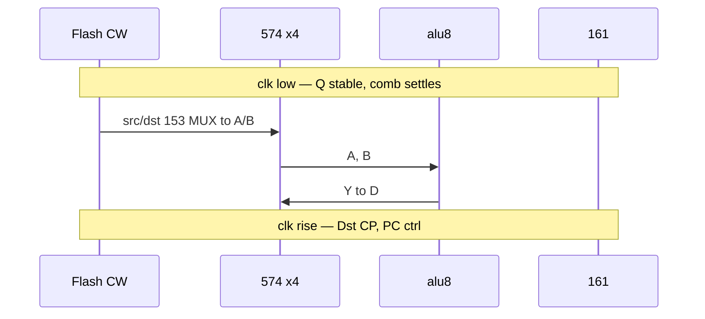

# Plover 마이크로코드 명세 v0.2 (결정판)

**상태:** Frozen (breadboard active) · **기준일:** 2026-06-01  
**대상:** hwsim netlist, 브레드보드 74HC, [`pack_rom.py`](../archive/verilog-sim/tools/pack_rom.py) (후속 갱신)

**이전 버전:** [microcode-spec v0.1](../archive/verilog-sim/docs/microcode-spec.md) (Verilog·웹 시뮬, archive)

> **버전 주의:** 본 문서의 **v0.2** = VLIW 제어 워드(CW) 명세. [`roadmap-next.md`](roadmap-next.md) changelog의 v0.x는 **로드맵 문서 개정 번호**와 별개.

v0.2는 **16비트 CW 안에서 1사이클 Reg–ALU–Reg (2-주소 RMW)** 를 브레드보드에서 성립시키기 위한 **확정 명세**이다.  
ALU 12 opcode(`alu_op` 4비트) 및 [alu8](../hw/netlist/blocks/alu8.yaml) netlist는 **v0.1과 동일**하며 B3까지 hwsim·bring-up 검증 완료.

---

## 16비트 제어 워드 (CW)

SST39SF010A ×2 병렬: `rom_low[addr]` = CW[7:0], `rom_high[addr]` = CW[15:8].

```
CW[15:0] = { alu_op[3:0], src_reg[1:0], dst_reg[1:0], bus_en[1:0], ctrl[5:0] }
```

| 비트 | 필드 | 폭 | 설명 |
|------|------|-----|------|
| 15:12 | `alu_op` | 4 | ALU 연산 → [opcode 치트시트](hw-bringup-b3-opcode.md) |
| 11:10 | `src_reg` | 2 | ALU **A** 포트 — `R0`–`R3` |
| 9:8 | `dst_reg` | 2 | ALU **B** (2-주소) + **쓰기** 대상 — `R0`–`R3` |
| 7:6 | `bus_en` | 2 | 245/SRAM/IMM 버스 (아래 §) |
| 5:0 | `ctrl` | 6 | **`bus_en`에 따라 디코딩 의미 변경** (시간 다중화) |

### 레지스터 파일 (확정)

| 항목 | 규격 |
|------|------|
| GPR | **4×74HC574** (`R0`–`R3`) |
| A/B read MUX | **4×74HC153/port** (듀얈 4:1, 8비트) → **합계 8 IC** |
| CP 디코드 | `74HC138` + `dst_reg`; IMM 시 R2 강제 (§ IMM) |
| 클록 | 공통 `net_clk2` (2 MHz) |

**hwsim:** SUB worst + reg MUX → E2E **228 ns**, slack **22 ns** @ 2 MHz max ([§ 타이밍](#타이밍-hwsim-근거)).

---

## 2-주소 연산 (Implicit B = Dst)

**3-주소(`ADD Rd, Rs1, Rs2`) 1clk는 채택하지 않는다.** 16비트·MUX 예산상 **2-주소 RMW** 고정.

```
Dst ← Dst OP Src
```

| 신호 | 물리 연결 |
|------|-----------|
| `src_reg` | A포트 4:1 MUX → ALU `net_a*` |
| `dst_reg` | B포트 4:1 MUX → ALU `net_b*` (또는 B cascade) |
| `dst_reg` | CP 디코드 → **해당 574만** CP ↑ |
| ALU Y | 모든 574 D 공통 |

**동일 사이클 RMW:** CP ↑ 전 Q는 **이전 값** → B로 읽고 결과를 같은 레지에 latch.

### 1사이클 예 (4-GPR)

| 마이크로 연산 | 1 CW | 비고 |
|---------------|------|------|
| `R2 ← R2 + R0` | OK | ACC += R0 |
| `R2 ← R2 + R1` | **불가** (R1≠R2) | 2 CW (copy + op) |
| `R0 ← R0 + 1` | OK | `alu_op=INC`, Src=Dst=R0 |
| LOAD / STORE | `bus_en` ≠ LOCAL | § MEM |

### ALU·버스 예외

| `alu_op` | A | B | 쓰기 |
|----------|---|---|------|
| INC / DEC | `Src` | 157 B2 const | `Dst` |
| NOT / PASS_A | `Src` | — | `Dst` |
| PASS_B | — | `Dst` Q | `Dst` |
| CMP | `Src` | `Dst` Q (SUB) | **CP 억제** (§ CMP) |
| IMM (`bus_en=11`) | — | `IMM[7:0]` | **R2 고정** |

---

## GPR 관례 (Architecture Convention)

하드웨어는 2bit `src`/`dst`만 해석한다. 아래는 **어셈블러·컴파일러 권장** (위반 시 경고).

| Reg | 이름 | 역할 |
|-----|------|------|
| R0 | ADDR_L | `{R1,R0}` 주소 low |
| R1 | ADDR_H | `{R1,R0}` 주소 high; **MEM 없는 구간** 임시 사용 가능 |
| R2 | ACC | 기본 누산기; **IMM 목적지 고정** |
| R3 | TMP | 스크래치, 분기 준비, 플래그 백업 |

**Spill:** zero-page (`0x00`–`0xFF`)를 shadow register로 — `MEM_RD`/`MEM_WR` CW 추가. 물리 GPR 부족은 **메모리 트래픽**으로 상쇄.

---

## ALU Op (`alu_op`)

v0.1과 **동일** (→ [hw-bringup-b3-opcode.md](hw-bringup-b3-opcode.md)).

| 값 | 이름 | 비고 |
|----|------|------|
| 0–10 | NOP … DEC | alu8 netlist |
| 11 | CMP | SUB + Z/C; **Dst CP 마스크** |
| 12–15 | — | NOP |

플래그 **Z/C**는 `ctrl` LOCAL **`FLG_WE`(bit3)** 시에만 latch.

---

## CMP — Dst CP 마스크

| 계층 | 동작 |
|------|------|
| **V1 ALU 디코드** | `alu_op=CMP` → `~CMP` (active low) |
| **V2 regfile** | `CP_enable = decode(dst) & WE_global & ~CMP` |
| **플래그** | 동사이클 `FLG_WE=1` → Z/C 갱신; **Dst latch 없음** |

**분기 타이밍:** 조건 분기(BEQ/BNE)는 **직전 사이클** latch된 **Z_prev** 사용 → `CMP` 다음 CW에 `BEQ`/`BNE` (1-delay slot).

---

## `bus_en` [7:6]

245 **DIR/OE**, SRAM OE/WE. **MEM 사이클과 LOCAL 분기·PC 변경은 동일 CW에서 금지.**

| 값 | 이름 | 동작 |
|----|------|------|
| `00` | LOCAL | 245 Hi-Z, SRAM 격리 — ALU↔reg, PC/분기 (§ LOCAL `ctrl`) |
| `01` | MEM_RD | `{R1,R0}` → SRAM OE; 데이터 → **`dst_reg` latch** |
| `10` | MEM_WR | `{R1,R0}` 주소; **`src_reg`** → 245 → SRAM WE |
| `11` | IMM | 8bit literal 합성 + **R2 강제 쓰기** (§ IMM) |

**541 미사용** — **74HC245 DIR** (검토 확정).

---

## `ctrl` [5:0] — `bus_en`별 디코딩

### LOCAL (`bus_en = 00`)

#### bit5 / bit4 — PC·분기 (통합 인코딩)

| bit5 | bit4 | 상태 | Taken (PE active) | Not-taken |
|------|------|------|-------------------|-----------|
| 0 | 0 | Normal | — | `bit2=1` → PC+1; `bit2=0` → **HOLD** |
| 0 | 1 | BEQ | Z_prev=1 → PC←{R1,R0} | **bit2 무관 PC+1** |
| 1 | 0 | JMP | PC←{R1,R0} | (always taken) |
| 1 | 1 | BNE | Z_prev=0 → PC←{R1,R0} | **bit2 무관 PC+1** |

Taken 시 **CEP/CET 억제** (병렬 load). Not-taken 시 **CEP/CET 강제** (하드와이어 PC+1).

#### LOCAL 비트맵

| Bit | 이름 | 규범 |
|-----|------|------|
| 5 | Branch MSB | bit4와 BEQ/JMP/BNE 디코드 |
| 4 | Branch LSB | |
| 3 | FLG_WE | Z/C latch; **동사이클 분기는 Z_prev** |
| 2 | INC | Normal(00)에서만; 분기 평가 시 **override** |
| 1 | HALT | **최우선** — bit5–2 무시; 클록/PC·reg CP 동 freeze |
| 0 | IRQ mask | 외부 IRQ 억제 (옵션, V2+) |

#### LOCAL 우선순위

1. **HALT** (bit1)  
2. **JMP** (10) — INC·BEQ/BNE 무시  
3. **BEQ/BNE** (01/11) — not-taken auto PC+1  
4. **Normal** — bit2 INC / HOLD  

**INC2 제외:** 8bit IMM (`bus_en=11`)이 1 CW literal을 처리 — LOCAL `INC2` 불필요. 16bit 상수·원거리 주소는 **2 CW 이상** macro.

---

### MEM_RD (`bus_en = 01`) / MEM_WR (`bus_en = 10`)

**분기·JMP·FLG_WE 동시 사용 금지** (하드웨어 무시 또는 정의하지 않음).

#### CS 2-tier (`ctrl[5:3]`)

| `[5:3]` | 대상 |
|---------|------|
| `000` | **SRAM** — 138 Y0 → SRAM CE; 주소 `{R1,R0}` |
| `001`–`111` | **MMIO** — SRAM CE off; 138 Y1–Y7 |

`ctrl[2:0]`: SRAM(`000`)일 때 **don't-care**; MMIO일 때 서브채널.

| 모드 | `[2:0]` (MMIO) | `[5:0]` (SRAM) |
|------|----------------|----------------|
| MEM_RD | 읽기 채널 | don't-care |
| MEM_WR | 쓰기 채널 | don't-care |

---

### IMM (`bus_en = 11`)

| 항목 | 규칙 |
|------|------|
| **목적지** | **R2 (ACC) 하드와이어** — `dst_reg[9:8]` 무시, CP 디코드 전단 2→R2 |
| **IMM[7:0]** | `{ dst_reg[9:8], ctrl[5:0] }` — 핀 병렬 → 버스/ALU B |
| **`alu_op`** | **`PASS_B`** (권장) → R2←IMM; 또는 **`ADD`** + Src=R2 → R2←R2+IMM |
| **컴파일러** | IMM CW는 **항상 R2 clobber** |

---

## 1사이클 타임라인



**조합 예산 (max):** 574 Q 23 + 153 28 + ALU SUB 169 + 574 setup 8 ≈ **228 ns** < 250 ns half @ 2 MHz.

**분기 경로:** Z_prev + bit5/4 → 161 PE/CEP (~15–20 ns) — ALU critical path와 **분리**; bring-up에서 scope 검증.

---

## 마이크로어셈블리 (v0.2)

```text
; R2 <- R2 + R0  (one cycle)
@0000
alu ADD | src R0 | dst R2 | bus LOCAL | ctrl FLG_WE,INC

; CMP R2 vs R0; next CW branch
@0001
alu CMP | src R0 | dst R2 | bus LOCAL | ctrl FLG_WE,INC
@0002
alu NOP | src R0 | dst R2 | bus LOCAL | ctrl BEQ    ; Z_prev, target in R1:R0

; Load R3 from [R1:R0]
@0010
alu PASS_B | src R3 | dst R3 | bus MEM_RD | ctrl 0

; IMM: R2 <- 0xA5  (imm = {dst,ctrl} encoded in CW)
@0020
alu PASS_B | src R2 | dst R2 | bus IMM | ctrl 0x25  ; example bit pattern
```

필드: `alu`, `src`, `dst`, `bus`, `ctrl`. v0.1 `reg`/`bus_ctl`/`branch` **deprecated**.

---

## ROM 이미지

`rom_low.hex`, `rom_high.hex` — [`pack_rom.py`](../archive/verilog-sim/tools/pack_rom.py) **v0.2 필드 인코딩 갱신 예정**.

---

## 타이밍 (hwsim 근거)

**방법:** `alu_b3_sub_critical` (169 ns) 앞에 reg MUX 1bit + 전 ALU netlist.  
**재현:** `python tools/regfile_slack_study.py` · `regfile_rmw_*_slack.yaml`

| 토폴로지 | Reg | MUX IC | E2E (ns) | slack | **v0.2** |
|----------|-----|--------|----------|-------|----------|
| **4 reg · 4×153/port** | 4 | **8** | **228** | **22** | **채택** |
| 8 reg · 8×151/port | 8 | 16 | 228 | 22 | 확장안 (§) |
| 8 reg · 153+157 2단 | 8 | 24 | 246 | 4 | **기각** |

**BOM (V2 regfile 추가):** [BOM.md § V2 regfile](../BOM.md#v2-regfile-추가-구매-v02-2026-06-01) — **+8×74HC153** (~4,000 KRW). 574·151 추가 **불필요**.

---

## 확장 가능성 — 8-GPR (미채택)

브레드보드 **2차 보드·면적 여유** 시 검토 가능한 대안:

| | v0.2 (확정) | 8-GPR 확장안 |
|---|-------------|--------------|
| GPR | 4 | 8 |
| CW reg 필드 | 2+2 bit | 3+3 bit (CW 재배치 필요) |
| MUX | 8×153 | 16×151 (1단 8:1) |
| hwsim E2E @ max | 228 ns | **228 ns** (동일 1단 28 ns) |
| 배선 fan-out | 64 가닥/port | 128 가닥/port |

**채택하지 않은 이유:** IC·점퍼·크로스토크·1면 배치 — **22 ns slack은 동일하나 물리 여유 감소**. ISA 밀도 이득은 **zero-page spill**로 v0.2에서 대부분 상쇄 가능.

hwsim: `regfile_rmw_8x151_slack.yaml` (참고 테스트).

---

## v0.1 대비 요약

| 항목 | v0.1 (archive) | v0.2 (active) |
|------|----------------|---------------|
| CW | 4+4+4+4 균등 | 4+2+2+2+6 |
| 레지 | `reg_idx` + we | **`src` + `dst`**, 4×574 |
| B | bus_ctl + 같은 idx | **Implicit B = Dst** |
| 버스/분기 | 별도 4bit | `bus_en` + **`ctrl` 시간 다중화** |
| ALU / Flash | 16 bit | **동일** alu8 |

---

## 구현 게이트

| 단계 | 내용 | 상태 |
|------|------|------|
| B3 | alu8 + 574 ACC, 2 MHz | hwsim PASS |
| V1 | `alu_op` → ALU 제어선 + `~CMP` | **완료** — [`alu_decode.yaml`](../hw/netlist/blocks/alu_decode.yaml), `alu_decode_full` |
| V2 | 4×574 + 8×153 regfile, IMM→R2, CP mask | **완료** — [`regfile.yaml`](../hw/netlist/blocks/regfile.yaml), `regfile_*`, [`cpu_datapath_p1.yaml`](../hw/netlist/blocks/cpu_datapath_p1.yaml) |
| ROM fetch | ROM16 → CW bus, PC stub | **완료** — [`rom_fetch.yaml`](../hw/netlist/blocks/rom_fetch.yaml), `rom_fetch_*`, `p2_rom_*` |
| IMM→R2 B | `bus_en=11`, 8×157 B mux | **완료** — `p2_imm_load` |
| Tool | `pack_rom.py` v0.2 | **완료** — [`tools/pack_rom.py`](../tools/pack_rom.py), [`hw/fixtures/rom/`](../hw/fixtures/rom/) |
| V3 | PC 161 + LOCAL 분기 조합 | **완료** — [`cpu_datapath_p3.yaml`](../hw/netlist/blocks/cpu_datapath_p3.yaml), `local_ctrl_*`, `pc_*`, `p3_*` — [hw-bringup-p3-ctrl-pc.md](hw-bringup-p3-ctrl-pc.md) |
| Bring-up | regfile 1면 U-routing, scope setup/slack | TODO |

---

## 관련 문서

| 문서 | 역할 |
|------|------|
| [microcode-spec v0.1](../archive/verilog-sim/docs/microcode-spec.md) | Archive Verilog |
| [hw-bringup-b3-opcode.md](hw-bringup-b3-opcode.md) | `alu_op` → ALU 핀 |
| [roadmap-next.md](roadmap-next.md) | V1→V2 마일스톤 |
| [v0.2-implementation-plan.md](v0.2-implementation-plan.md) | Phase2–5 구현 단계·의존 관계 |
| [hw-bringup-p3-ctrl-pc.md](hw-bringup-p3-ctrl-pc.md) | Phase3 LOCAL·FLG·161 PC |
| [alu8.md](../hw/netlist/blocks/alu8.md) | ALU netlist |
| [BOM.md](../BOM.md) | 부품 |

---

## 변경 이력

| 날짜 | 내용 |
|------|------|
| 2026-06-01 | v0.2 draft — 2-주소, 8-reg 검토 초안 |
| 2026-06-01 | hwsim 8 vs 4 — 4×153 / 8×151 동일 228 ns |
| 2026-06-01 | **v0.2 결정판** — 4-GPR, 8×153, ctrl 6bit, LOCAL/MEM/IMM/CMP 확정; 8-GPR는 확장안 |
