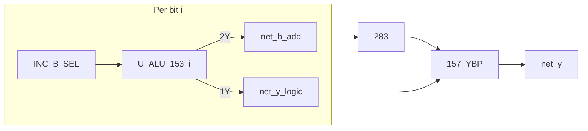

# ALU Phase B — Gigatron 153 bit-slice (logic + B_CTRL)

**Status:** **implemented** (2026-07)  
**Netlist:** [`tools/gen_alu8_netlist.py`](../../../tools/gen_alu8_netlist.py) pure B_CTRL bit-slice

## Architecture

| Layer | Blocks | Role |
|-------|--------|------|
| **B-path** | `U_ALU_153_i` mux2, `283×2`, `157_YBP×2` | SUB/ADD/INC/DEC/CMP **Y** |
| **Logic** | `U_ALU_153_i` mux1 (Gigatron) | AND/OR/XOR/NOT/PASS via operand select |
| **INC glue** | `ALU_INC_B_SEL`, `ALU_INC_2C2` | INC only — B-select + per-bit `2C2` |
| **CMP** | `ALU_CMP_SUB` | Z/C_GE from SUB (`Y==0`, `net_c_hi`) — no 7485 |
| **Glue** | `ALU_Y_MUX_SEL` | `net_y_mux_sel = s0 \| s1` → 157 picks sum vs logic |

Each bit `i` uses one **74HC153** (`U_ALU_153_i`):

| Mux | Pins | Role |
|-----|------|------|
| **mux1** | `1C0..3` = `net_lgc*`, `1Y` = `net_y_logic[i]` | Gigatron logic |
| **mux2** | `2C0..3` = `net_bctrl*`, `2Y` = `net_b_add[i]` | B_CTRL data inputs |
| **A/B** | `net_a[i]`, `net_b153_sel[i]` | Operand select (+ INC B override) |



## Operand select (shared 153 A/B pins)

All opcodes: `A = net_a[i]`, `B = net_b153_sel[i]` (INC forces B=1 via glue).  
`sel = A | (B<<1)` drives both mux1 and mux2.

## Gigatron mux1 (per bit)

| sel | A | B | Result |
|-----|---|---|--------|
| 0 | 0 | 0 | C0 |
| 1 | 0 | 1 | C1 |
| 2 | 1 | 0 | C2 |
| 3 | 1 | 1 | C3 |

### Opcode → C0..C3 (`net_lgc0..3`, shared 8-bit)

| Op | lgc0 | lgc1 | lgc2 | lgc3 | Notes |
|----|------|------|------|------|-------|
| NOP | 0 | 0 | 0 | 0 | Y=0 |
| AND | 0 | 0 | 0 | 1 | A&B |
| OR | 0 | 1 | 1 | 1 | A\|B |
| XOR | 0 | 1 | 1 | 0 | A^B |
| NOT | 1 | 0 | 0 | 0 | ~A (B=0 in tests) |
| PASS_A | 0 | 0 | 0 | 1 | A&FF → use B=all 1 in stimulus |
| PASS_B | 0 | 0 | 0 | 1 | FF&B → use A=all 1 in stimulus |
| ADD/SUB/INC/DEC/CMP | * | * | * | * | Unused; `157_YBP` selects **sum** |

Golden vectors: [`tools/alu8_cases.py`](../../../tools/alu8_cases.py) — all 12 opcodes bit-exact in pre-flight sim.

## B_CTRL mux2 (`net_bctrl3..0` → `2C3..2C0`)

| Opcode | bctrl[3:0] | Behaviour |
|--------|------------|-----------|
| ADD | `1100` | B[i] pass |
| SUB/CMP | `0011` | ~B[i] (no 74HC04) |
| DEC | `1111` | constant 1 |
| INC | — | `net_inc_en=1` + `ALU_INC_2C2` per-bit tie |

## Critical path

**SUB / CMP (Y)** @ max (pre-flight sim):  
`net_b0` → `U_ALU_153_0.B` → `2Y` → `283` → `157_YBP` → `net_y0` — **~133 ns** (04 hop removed).

**Logic** @ max: `U_ALU_153_0.1Y` → `157_YBP` — **46 ns**.

## IC budget (DIP)

| Part | Qty |
|------|-----|
| 74HC283 | 2 |
| 74HC153 (bit-slice) | **8** |
| 74HC157 (YBP) | 2 |
| **ALU total** | **12** |

(Plus behavioral glue: `INC_B_SEL`, `INC_2C2`, `Y_MUX_SEL`, `CMP_SUB`.)

## Regen

```bash
python tools/gen_alu_decode_netlist.py
python tools/gen_alu8_netlist.py
python tools/gen_alu_b3_netlist.py
python tools/gen_alu_b3_clock_netlist.py
python tools/gen_alu8_full_test.py
python tools/gen_alu8_opcode_timing.py
python tools/gen_opcode_cheatsheet.py
```
