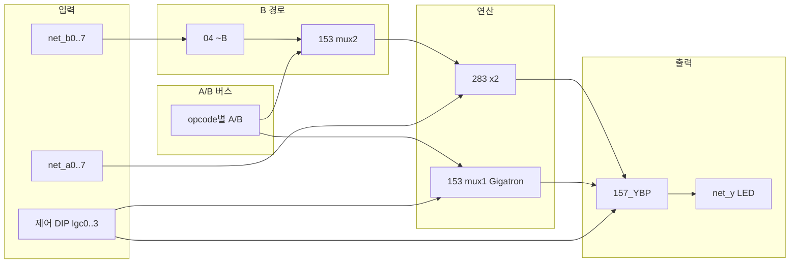

# ALU8 브레드보드 조립 시방서 (단계별 실장)

| 항목 | 내용 |
|------|------|
| **대상** | Plover v1.0 breadboard — 8비트 ALU 코어 (`alu8.yaml`) |
| **규모** | 74HC DIP **14개** (`U_ALU_153_0..7`×8, `157_YBP`×2, `283`×2, `04`×2; CMP via SUB) |
| **전원** | **5 V** 단일 레일 (본 문서는 5 V 빵판 ALU만) |
| **목표** | 신호 흐름 순으로 IC를 **한 덩어리씩** 올려, 매 단계에서 **LED로 검증** |
| **후속** | [M1-b3-procedure](M1-b3-procedure.md) → [M2a](M2a-cpld-decode.md) → [M2b-gpr-datapath](M2b-gpr-datapath.md) |

**관련 문서**

| 문서 | 용도 |
|------|------|
| [M1-b3-procedure.md](M1-b3-procedure.md) | B3a/b/c 전체 브링업 |
| [b3-opcode.md](b3-opcode.md) | 12 opcode DIP/타이 값 |
| [M2a-cpld-decode.md](M2a-cpld-decode.md) | CPLD GPR 소각 (v1.0) |
| [M2b-gpr-datapath.md](M2b-gpr-datapath.md) | CPLD q_a/q_b ↔ ALU |
| [hw/netlist/blocks/alu8.md](../../hw/netlist/blocks/alu8.md) | IC 맵 · 제어 넷 |
| [BOM.md](../../BOM.md) | 구매 수량 |
| [hw/pinout/](../../hw/pinout/) | DIP 핀 번호 |

**도구 (배선 전)**

인터랙티브 배선도: `build/alu8-schematic.html` — **12 DIP** (`U_ALU_153_0..7` 1:1). glue: `Y_MUX_SEL`; **CMP** = `net_y` + `net_c_hi` (no 7485). 제어 넷 주황색.

---

## 1. 원칙 — 왜 순서가 중요한가

ALU는 **한 번에 14개를 꽂으면** 어느 구간에서 깨졌는지 찾기 어렵습니다. 아래 순서는:

1. **데이터가 흐르는 방향** (피연산자 → 가산기/논리 → 출력 MUX) 과 같고  
2. **이전 단계 출력을 다음 단계 입력으로 재사용** 하며  
3. 각 단계마다 **관측 가능한 노드**(LED·DIP)가 있게 설계되어 있습니다.

---

## 2. 공통 준비 (모든 단계 전)

### 2.1 전원·디커플링

| 항목 | 시방 |
|------|------|
| 레일 | 5 V / GND — **짧고 굵은** 빨강·검정 버스 |
| 디커플링 | **0.1 µF / IC 1개** (VCC–GND, IC 가까이) |
| 벌크 | **10 µF** (보드 1~2곳) |
| 최초 전원 | **전류 제한** 어댑터 또는 순간 전압 확인 후 풀가동 |

### 2.2 관측·스티뮬러스 (가능한 한 0단계에서 설치)

| 블록 | 연결 | 비고 |
|------|------|------|
| 피연산자 A | DIP 8bit → `net_a0..7` | 330 Ω~1 kΩ 직렬 권장 |
| 피연산자 B | DIP 8bit → `net_b0..7` | INC/DEC 단계 전까지 사용 |
| 제어 | DIP 또는 **고정 타이** | [opcode 치트시트](b3-opcode.md) |
| 결과 Y | LED ×8 ← `net_y0..7` | MSB=y7, LSB=y0 |
| 캐리(선택) | LED ← `net_c_hi` | SUB/CMP 디버그용 |

### 2.3 제어선 기본값 (미사용 시)

타이 하지 않은 제어 입력은 **GND**. 예외는 치트시트에 **VCC** 로 적힌 핀만 5 V.

**INC/DEC 주의:** `net_b0..7` 을 INC/DEC용으로 바꾸지 말 것. INC=`cin=1` + `bctrl=0000` (A+0+1); DEC=`net_bctrl=1111` ([opcode 치트시트](b3-opcode.md)).

### 2.4 배선 습관

- **왼쪽 열 핀 → 왼쪽으로**, **오른쪽 열 핀 → 오른쪽으로** 먼저 뻗은 뒤 버스로 연결 (칩 관통 배선 방지).  
- 한 넷은 **한 색**; VCC 빨강, GND 검정, 신호는 색 8~12가지 로테이션.  
- 283 **캐리 연쇄**(LO C4→HI)와 SUB 경로는 **짧게** (타이밍 여유 최소 구간).

---

## 3. 단계별 실장 시방

각 단계: **(가) IC 장착 → (나) 전원·디커플링 → (다) 해당 넷만 배선 → (라) 검증 → (마) 다음 단계**.

완료되지 않으면 **다음 IC를 추가하지 않음**.

### 단계 0 — 전원 스모크 (IC 0개)

| 항목 | 내용 |
|------|------|
| 작업 | 5 V/GND 버스, 벌크·여분 0.1 µF만 |
| Pass | 멀티미터로 레일 5 V ±0.2 V, 핫스왑 없음 |

---

### 단계 1 — 8비트 가산기만 (IC +2: 74HC283 ×2)

| Ref | Part |
|-----|------|
| `U_ALU_283_LO`, `U_ALU_283_HI` | 74HC283 |

**배선 요점**

- `net_a0..7` → 283 A  
- **임시:** `net_b_add0..7` ← B DIP (157 없이 **B를 가산기에 직결**하는 **브링업 전용**; 이후 단계 2에서 끊고 153 mux2 경유로 전환)  
- LO **C4** → HI **C4** (캐리 연쇄)  
- `net_cin` ← GND (ADD), SUB 검증 시 단계 4에서 VCC  
- `net_sum0..7`, `net_c_hi` 관측

**제어 (ADD 스모크)**

| net | 값 |
|-----|-----|
| `net_153_s0`, `net_153_s1` | 0 (나중에 153 장착 전에는 sum을 LED에 **점퍼로 직결**해도 됨) |
| `net_cin` | GND |

**검증**

| 테스트 | A | B | 기대 sum (Y에 직결 시) |
|--------|---|---|------------------------|
| 0+0 | 00 | 00 | 00 |
| 12+34 | 12 | 34 | 46 |
| FF+01 | FF | 01 | 00, C_hi=1 |

**pre-flight sim:** developer verification gate (서브블록)

**Pass 기준:** 캐리 연쇄 포함 8비트 덧셈 3케이스 일치.

---

### 단계 2 — ~B + 153 bit-slice (IC +10: 04 BINV + 153×8)

| Ref | Part |
|-----|------|
| `U_ALU_153_0..7` | 74HC153 ×8 — mux1=logic, mux2=B-path |

**배선**

- `net_b*` → 04 BINV → `net_b_inv*`  
- Per bit `i`: **mux2** `2C0`=`net_b[i]`, `2C1`=`net_b_inv[i]`, `2C2/2C3`=INC/DEC (netlist 하드와이어), `2Y`→`net_b_add[i]`; **mux1** `1C0..3`=`net_lgc0..3`, `1Y`→`net_y_logic[i]`; `1G`/`2G`→GND  
- `net_b_add*` → **283 B** (**단계 1 B 직결 제거**)

**A/B 버스 (153 공통 A/B 핀)** — 산술/논리 opcode마다 소스가 달라 **점퍼 또는 선택 157×2** 로 전환:

| `net_y_mux_sel` (= s0\|s1) | `net_153_a[i]` | `net_153_b[i]` |
|----------------------------|----------------|----------------|
| 1 (논리) | `net_a[i]` | `net_b[i]` |
| `net_bctrl0` … `net_bctrl3` | 153 mux2 data (B_CTRL) |

브링업 Phase 1: opcode 클래스별로 위 표대로 **8비트 버스 점퍼** (산술 스모크 vs 논리 스모크 전환).  
선택 Phase 2: `U_ALU_157_AB_0/1` ×2 — 4비트씩 2:1 MUX, SEL=`net_y_mux_sel` ([alu8-phase-b.md](../hardware/alu8-phase-b.md)).

**검증 (B-path)**

| Op | cin | bctrl3:0 | A | B | 기대 Y (sum 경로) |
|----|-----|----------|---|---|-------------------|
| ADD | 0 | 1100 | 12 | 34 | 46 |
| SUB | 1 | 0011 | 12 | 34 | DE |
| INC | 1 | 0000 | 12 | × | 13 |
| DEC | 0 | 1111 | 12 | × | 11 |

**검증 (logic, AB 버스 논리 모드 + YBP 미장착 시 `net_y_logic` LED)**

| Op | A | B | lgc | 기대 `net_y_logic` |
|----|---|---|-----|---------------------|
| AND | 12 | 34 | 0001 | 10 |
| XOR | 12 | 34 | 0110 | 26 |
| NOT | 12 | 00 | 1000 | ED |

**Pass:** ADD/SUB/INC/DEC + AND/XOR/NOT 스모크. B DIP는 INC/DEC에서 **의미 없음**.

**CMP 플래그 (7485 없음):** `net_cmp_z` ← Y LED all zero; `net_cmp_c_ge` ← `net_c_hi` LED — SUB/CMP opcode 시 ([`alu8_cmp_sub`](../../hw/tests/alu8_cmp_sub.yaml)).

---

### 단계 3 — 출력 (`157_YBP`, IC +2)

| Ref | Part |
|-----|------|
| `U_ALU_157_YBP_0/1` | 74HC157 ×2 — **arith bypass** |

**배선**

- **157_YBP:** `A`=`net_sum*`, `B`=`net_y_logic*`; **`S`=`net_y_mux_sel`** (= s0 OR s1)  
- `S`=0 → **sum**; `S`=1 → logic → `net_y*`  
- `net_y0..7` → **Y LED**

**검증 — 12 opcode 전체**

[b3-opcode.md](b3-opcode.md) 표를 한 줄씩 따라감.

**우선 스모크 3개 (반드시)**

| Op | A | B | Y |
|----|---|---|---|
| SUB | 12 | 34 | DE |
| XOR | 12 | 34 | 26 |
| INC | 12 | — | 13 |

**pre-flight sim**

**Pass (B3a 완료):** 스모크 3 + 원하면 12 opcode 전부 Y LED 일치.

---

### 단계 5 — (선택) CW 디코드 블록

마이크로코드 CW에서 제어선을 자동 생성하려면 [`alu8_decode.yaml`](../../hw/netlist/blocks/alu8_decode.yaml) 블록 추가.  
**권장:** 단계 4까지 **수동 DIP** 로 안정화한 뒤 디코드 IC/타이를 붙임.

---

### 단계 6 — 시스템 통합 (B3b / B3c)

ALU 단독 Pass 후 [M1-b3-procedure.md](M1-b3-procedure.md) § B3b/B3c 진행:

| 단계 | 추가 | 목표 |
|------|------|------|
| B3b | 74HC574 ×1 | Y → D, 수동 CP로 Q 래치 |
| B3c | OSC+74HC74 | 2 MHz 연속 래치, setup 마진 |

---

## 4. 단계별 IC 누적표

| 단계 | 추가 IC | 누적 | 핵심 검증 |
|------|---------|------|-----------|
| 0 | — | 0 | 전원 |
| 1 | 283×2 | 2 | ADD / 캐리 |
| 2 | 04 BINV + 153×8 | 12 | B-path + Gigatron logic, AB bus jumpers |
| 3 | 157 YBP×2 | **14** | sum bypass → Y, 12 opcode |
| 4 | (디코드) | +α | CW 자동 |
| 5 | 574·클록 | 시스템 | B3b/c |

---

## 5. 권장 작업 일정 (실무)

| 일차 | 내용 |
|------|------|
| **1일차** | 단계 0~1 — 전원, 283, ADD 스모크 |
| **2일차** | 단계 2 — 153 bit-slice, SUB/INC/DEC + logic 스모크 |
| **3일차** | 단계 3 — 157_YBP, 12 opcode |
| **4일차** | pre-flight sim 대조, 배선 정리 |
| **5일차** | 배선 정리, SUB 경로 shorten, B3b 574 |
| **6일차** | B3c 클록, 오실로스코프 또는 1.7 MHz 폴백 |

복잡도가 높은 날은 **하루 4~6 IC 이하**가 유지보수에 유리합니다.

---

## 6. pre-flight sim ↔ 실기 대응

| pre-flight sim | 브레드보드 |
|-------|------------|
| `net_a*`, `net_b*` 자극 | DIP |
| 제어 넷 | DIP / 치트시트 타이 |
| `net_y*` 프로브 | Y LED |
| `alu8_timing` slack | 2 MHz 전 **SUB 배선 짧게**; FAIL 시 ~1.7 MHz |
| `export-schematic` | 배선 계획·교차 확인 |

---

## 7. 고장 분리 (증상 → 되돌아갈 단계)

| 증상 | 확인 순서 |
|------|-----------|
| 전원만 이상 | 단계 0, 핫 IC, 반대 삽입 |
| ADD만 틀림 | 283 캐리, B가 `net_b_add`에 연결됐는지 |
| SUB만 틀림 | `cin`, `net_bctrl*`, `U_ALU_153_*` mux2 |
| INC/DEC만 틀림 | `net_cin` + `net_bctrl` (**B DIP 건드리지 말 것**) |
| AND/OR/XOR/NOT만 | `net_lgc0..3`, `153_s0/s1` |
| Logic | `net_lgc0..3`, `153_s0/s1` |
| 전부 틀림 | 153 전원, Y LED 순서(y7..y0), GND 플로팅 |
| pre-flight sim PASS / 실기 FAIL | 타이(클록), 플로팅 제어, 5 V 레일 강하 |

---

## 8. 완료 체크리스트 (ALU8 단독)

- [ ] 14 IC ALU 전원·0.1 µF 완료 ([BOM.md](../../BOM.md))  
- [ ] `alu8_full` pre-flight sim PASS  
- [ ] 스모크 SUB / XOR / INC LED 일치  
- [ ] (권장) opcode 치트시트 12종 전부  
- [ ] SUB·캐리 경로 배선 최단화 기록  
- [ ] `alu8-schematic.html` 에서 넷별 배선 검토 완료  

이후 → [M1-b3-procedure.md](M1-b3-procedure.md) **B3b** 체크리스트로 진행.

---

## 9. 문서 개정

| 날짜 | 변경 |
|------|------|
| 2026-06-11 | v1.0 정합: 14 IC, 링크·단계 번호, INC/DEC 하드와이어 명시 |
| 2026-07-03 | Bit-slice `U_ALU_153_0..7` + AB bus; steps 2–3 merged |
| 2026-06-02 | Phase B2: Gigatron logic, **14** IC, logic **46 ns** @ max |
| 2026-06-02 | Phase B1: `157_B2` 제거, `157_YBP` sum bypass, SUB **151 ns** @ max |
| 2026-06-02 | Phase A: 24 IC, 153_B, 7485 CMP, `net_sub_en` 제거 |
| 2026-06-02 | 초판 — 8단계 실장 시방, B3 연계 |
