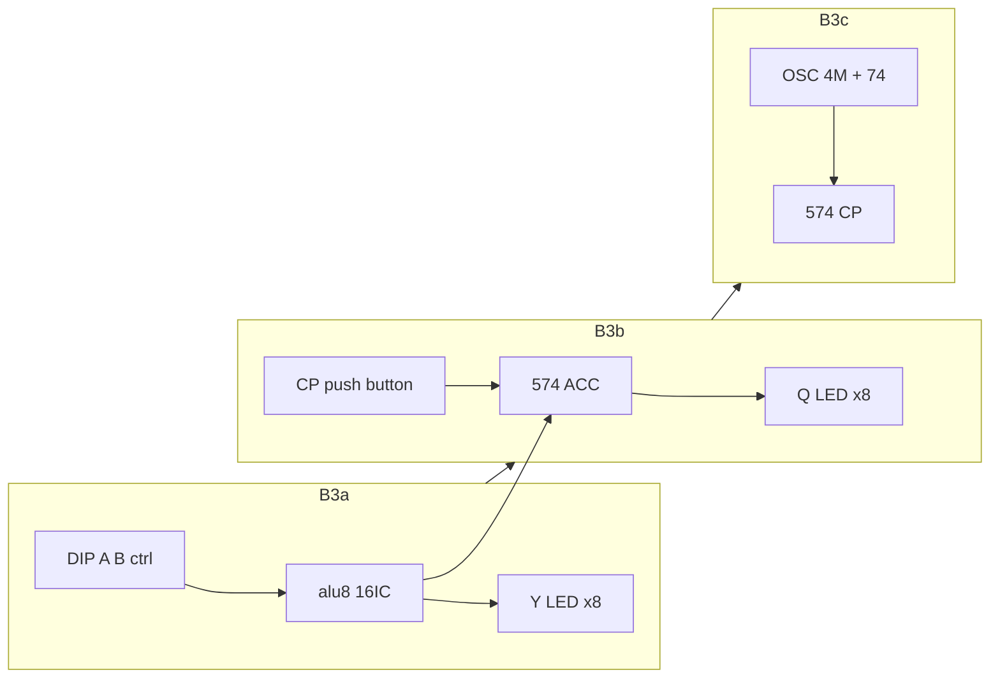

# B3a/b/c 실기 브링업 + hwsim 계획

## 현재 기준선

| 항목 | 상태 |
|------|------|
| ALU 12 opcode | hwsim PASS — [`hw/tests/alu8_full.yaml`](hw/tests/alu8_full.yaml) |
| B3 통합 (574) | hwsim PASS — [`hw/netlist/blocks/alu_b3.yaml`](hw/netlist/blocks/alu_b3.yaml), 4종 `alu_b3_*` 테스트 |
| 실기 가이드 | 단일 문서 — [`docs/archive/bringup-legacy/hw-bringup-b3.md`](docs/archive/bringup-legacy/hw-bringup-b3.md) (단계 미분리) |
| opcode 입력 | **`net_alu_sel` 없음** — 14개 제어선을 DIP로 직접 설정 ([`alu8.md`](hw/netlist/blocks/alu8.md) 표) |
| 클록 블록 | [`hw/netlist/blocks/clock.yaml`](hw/netlist/blocks/clock.yaml) — `net_clk2` @ 2 MHz, B3의 `net_clk`와 **이름만 다름** |



---

## 산출물 개요

| 파일 | 역할 |
|------|------|
| [`docs/hw-bringup/b3-opcode.md`](docs/hw-bringup/b3-opcode.md) | **opcode → 제어선 치트시트** (12행, 테스트 벡터, LED 비트 패턴) |
| [`docs/archive/bringup-legacy/hw-bringup-b3.md`](docs/archive/bringup-legacy/hw-bringup-b3.md) | **B3a / B3b / B3c** 3절로 재구성 (기존 내용 이전·정리) |
| [`tools/gen_opcode_cheatsheet.py`](tools/gen_opcode_cheatsheet.py) | [`tools/gen_alu8_full_test.py`](tools/gen_alu8_full_test.py) `CASES`에서 치트시트 **자동 생성** (DRY) |
| [`tools/gen_alu_b3_clock_netlist.py`](tools/gen_alu_b3_clock_netlist.py) | `clock.yaml` + `alu_b3.yaml` flat merge → `net_clk2` → `net_clk` |
| [`hw/netlist/blocks/alu_b3_clock.yaml`](hw/netlist/blocks/alu_b3_clock.yaml) | B3c 통합 netlist |
| [`hw/tests/bringup_b3c_clock.yaml`](hw/tests/bringup_b3c_clock.yaml) | 2 MHz recurring toggle + 574 latch + setup/slack |
| [`docs/project/roadmap-next.md`](docs/project/roadmap-next.md) | B3 → **B3a/b/c** 행 분리, 완료 체크리스트 |

코드/netlist 변경은 **문서·생성기·B3c 테스트**에 한정. ALU 로직·기존 9테스트는 유지.

---

## B3a — ALU만, Y LED (클럭 불필요)

**Netlist:** [`hw/netlist/blocks/alu8.yaml`](hw/netlist/blocks/alu8.yaml)  
**hwsim:** `python -m hwsim run hw/tests/alu8_full.yaml`

### 실장
- **14 IC** (574·클록 없음; Phase B2 — [`alu8.md`](../hw/netlist/blocks/alu8.md))
- DIP: `net_a0..7`, `net_b0..7` (INC/DEC는 B DIP 무시 — `153_B` 상수 경로)
- 제어: `cin`, `153_s0/s1`, `b_sel`, `b_const_sel`, `b_const_bit1..7`, `net_lgc0..3` ([치트시트](../hw-bringup/b3-opcode.md); SUB/CMP `b_sel=1`, `cin=1`)
- **Y → LED ×8** (저항 330Ω~1kΩ); carry는 `net_c_hi` LED 1개(선택)

### 치트시트 사용법
- opcode 4비트 대신 **제어선 14비트 패턴**을 표에서 복사
- 상시 0/1인 선은 **GND/VCC 묶음**으로 DIP 개수 축소 (표에 “고정 tie” 열 추가)
- 1차 스모크: **SUB** (`0x12−0x34→0xDE`), **XOR** (`→0x26`), **INC** (`→0x13`) — 치트시트 + [`alu8_full`](hw/tests/alu8_full.yaml) expect와 대조

### 완료 기준
- [ ] 전원·디커플링 14 IC
- [ ] 치트시트 3 opcode Y LED 일치
- [ ] (선택) 12 opcode 전부 Y 확인

---

## B3b — +574 ACC, 수동 CP (1클럭 Q 래치)

**Netlist:** [`hw/netlist/blocks/alu_b3.yaml`](hw/netlist/blocks/alu_b3.yaml) (574만 추가)  
**hwsim:** `python -m hwsim run hw/tests/alu_b3_latch.yaml`

### B3a 대비 추가 배선
| 연결 | 비고 |
|------|------|
| `net_y0..7` → `574 D0..7` | 조합 출력 직결 |
| `574 OE` → GND | 항상 출력 enable |
| `574 CP` ← **푸시 버튼** (10k 풀다운, 5V→CP, 디바운스 0.1µF) | 수동 1클럭 |
| `574 Q0..7` → **Q LED ×8** | Y LED 유지 권장 (Y vs Q 비교) |

### 동작 절차 (1 “사이클”)
1. A, B, 제어선 설정 (B3a와 동일)
2. **Y LED 안정** 확인 (수 ms 대기 — 조합)
3. **CP 버튼 1회** (0→1→0 또는 1 펄스)
4. **Q LED = Y** 확인

### 완료 기준
- [ ] SUB/XOR/INC: latch 후 Q = Y
- [ ] CP를 누르기 **전** Q는 이전 값 유지 (574 동작 확인)

---

## B3c — +2 MHz clk, 타이밍 마진

**Netlist:** [`hw/netlist/blocks/alu_b3_clock.yaml`](hw/netlist/blocks/alu_b3_clock.yaml) (신규)  
**hwsim:** `python -m hwsim run hw/tests/bringup_b3c_clock.yaml`  
**실기 선행:** B1 클록 ([`clock.yaml`](hw/netlist/blocks/clock.yaml)) 또는 동일 보드에 OSC+74HC74

### B3b 대비 변경
| 항목 | 변경 |
|------|------|
| CP | 푸시 버튼 **제거** → `net_clk2` (2 MHz) 연결 |
| 클록 | 4 MHz OSC → 74HC74 ÷2 → `net_clk2` → `574 CP` |
| 측정 | 오실로스코프 또는 hwsim `waves.json` |

### 오실로스코프 (2 MHz, 500 ns 주기)
| 측정 | CH-A | CH-B | Pass |
|------|------|------|------|
| comb settling | `net_y0` | `net_clk` | clk ↑ **전** Y stable |
| 574 setup | `net_d0` | `net_clk` | D stable ≥ 5 ns before ↑ |
| MSB margin | `net_y7` | clk | SUB 후 MSB 여유 |

장비 없을 때: `python -m hwsim run hw/tests/bringup_b3c_clock.yaml --report` → [`hw/viewer/index.html`](hw/viewer/index.html)

### hwsim B3c 테스트 설계
- netlist: `U_CLK_OSC` + `U_CLK_74` + `alu_b3` instances, **`net_clk2` = `net_clk`**
- stimulus: t=0 comb vector (SUB), `schedule_recurring_toggle(net_clk, half=250ns)` 또는 stimulus toggle @ 500 ns period
- expect: posedge 직전 Y stable, posedge 후 Q = Y; `setup_hold` + slack on 574 path
- `run --all` → **10 tests** (기존 9 + bringup_b3c_clock)

### 완료 기준
- [ ] 2 MHz에서 SUB 벡터 Q latch 연속 2주기 이상 OK
- [ ] scope 또는 hwsim으로 setup margin 기록 (실패 시 ~1.7 MHz로 클록 낮추기 — [`hw-bringup-b3.md`](docs/archive/bringup-legacy/hw-bringup-b3.md) 기존 가이드)

---

## opcode 치트시트 생성 (DRY)

[`tools/gen_alu8_full_test.py`](tools/gen_alu8_full_test.py)의 `CASES` + `ctrl()`를 공유:

```
sel | Op   | A    | B    | sub cin b_sel b_const s1 s0 c3 | b_const_hi | Y
 0  | NOP  | 0x00 | 0x00 | 0  0   0     0       0  0  0 | 0          | 0x00
 2  | SUB  | 0x12 | 0x34 | 1  1   1     0       0  0  0 | 0          | 0xDE
 ...
```

- `b_const_bit1..7` = `b_const_hi` (INC=0, DEC=1)
- PASS_A/B: 표에 A 또는 B = 0xFF 명시
- LED 열: y0..y7 비트 (LSB first)

---

## 문서 구조 (hw-bringup-b3.md)

```
# B3 브링업 (개요)
## 공통 — 전원, 디커플링, 치트시트 링크
## B3a — ALU + Y LED
## B3b — +574, 수동 CP
## B3c — +2 MHz, scope/hwsim
## hwsim ↔ 실기 대응표
## 트러블슈팅 (클럭 낮추기, 배선 shorten)
```

[`docs/README.md`](docs/README.md)에 치트시트 링크 추가.

---

## roadmap 갱신

[`docs/project/roadmap-next.md`](docs/project/roadmap-next.md) 트랙 B:

| 단계 | 내용 | hwsim |
|------|------|-------|
| **B3a** | ALU, Y LED, 치트시트 | alu8_full |
| **B3b** | +574, 수동 CP | alu_b3_latch |
| **B3c** | +2 MHz clk | bringup_b3c_clock |

하드웨어 조립: `미착수` → `B3a 준비 완료 (문서)` (실기 완료는 사용자 체크박스).

---

## 구현 순서

1. `gen_opcode_cheatsheet.py` → `docs/hw-bringup/b3-opcode.md`
2. `hw-bringup-b3.md` B3a/b/c 재구성
3. `gen_alu_b3_clock_netlist.py` + `alu_b3_clock.yaml`
4. `bringup_b3c_clock.yaml` + `run --all` 10 PASS
5. roadmap / docs README index

---

## 범위外 (이번 계획)

- `alu_sel` 4비트 → 제어선 **하드웨어 디코더** (후속 H1)
- A/B **레지스터에서** 공급 (574×7, 245/157 버스)
- KiCad `sheet_b3` 동기화
- 브레드보드 기생 C net delay 모델
