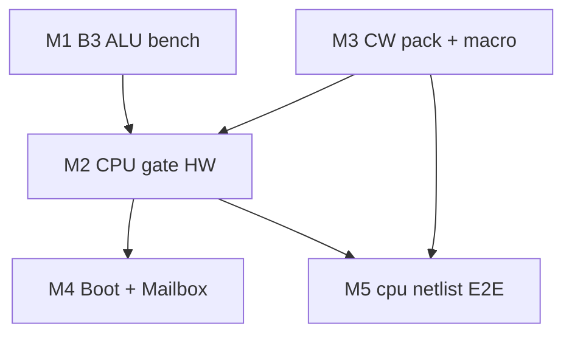

# Plover v0.1 — Implementation Plan

**Version:** 0.1 · **Date:** 2026-06-01  
**Normative:** [system-architecture.md](../hardware/system-architecture.md)

Single active milestone document. Supersedes archived [v0.2 / v1.x plans](../archive/pre-v0.1/README.md).

---

## 1. Goal

Deliver a **breadboard-prototype 8-bit CPU** with:

- CPLD GPR + 138×2 + 10b CW (v1.0 — see [system-architecture.md](../hardware/system-architecture.md); legacy 574 path in [archive/pre-v0.1/](archive/pre-v0.1/README.md))
- Single SST39SF010A (boot + 8b CW + utility)
- 2× IS62C256 (64 KB via A15)
- MMIO Mailbox @ `$FF00` (polling, no IRQ)
- RP2350 coprocessor board (stretch)

**Parallel track (optional):** FPGA / Verilog on education boards or external ROM/RAM — [fpga-target-guide.md](../hardware/fpga-target-guide.md) (planning; RTL not in tree yet).

Verification: `python -m hwsim run --all` (15) · `python -m pytest tests/ -q` · `python tools/verify_control_store.py`

---

## 2. Current status

| Milestone | Status | Evidence |
|-----------|--------|----------|
| ALU bringup hwsim | Done | 17 tests — `alu8_*`, `alu_b3_*`, `cmp_y_oe_bus`; B3c clock = scope only |
| Normative docs v0.1 | Done | 8 unversioned specs + BOM |
| CPU gate hwsim | Done | `cpld_gpr_decode`, `regfile_574`, `mem_decode`, `monitor_poll`, `boot_handoff` |
| Control store pack | Done | `tools/pack_control_store.py` → `cw.hex` (ADD–HALT packed) |
| Logic VM | Done | `plover_vm/` + Fibonacci demos |
| B3 ALU breadboard | Pending | [M1-b3-procedure.md](../hw-bringup/M1-b3-procedure.md) |
| Full `cpu` netlist | Stub | [cpu.yaml](../hw/netlist/blocks/cpu.yaml) composite only |
| CALL/RET/LDIO/STIO CW | Draft in spec | Not in `cw.hex` yet |

---

## 3. Work packages

**Breadboard 시방서 (canonical):** [hw-bringup/README.md](../hw-bringup/README.md)

### M1 — B3 real hardware

- 시방: [hw-bringup/M1-alu.md](../hw-bringup/M1-alu.md) · [alu-opcodes-timing.md](alu-opcodes-timing.md)
- Scope: 12-opcode ALU + 2 MHz clock divider
- Gate: DSO checks on critical paths (SUB, XOR, INC/DEC)

### M2 — CPU gate on breadboard

Split into two bring-up packages:

| Sub | 시방 | Scope |
|-----|------|-------|
| **M2a** | [hw-bringup/M2a-cpld-decode.md](../hw-bringup/M2a-cpld-decode.md) | CPLD ISP·소각, `LOAD_R*`, memory CS, reset `$FFFC` |
| **M2b** | [hw-bringup/M2b-gpr-memory.md](../hw-bringup/M2b-gpr-memory.md) | CPLD GPR, 138×2, SRAM, NOR, MAP_MODE |

- Gate: mem decode matches [memory-map.md](../hardware/memory-map.md); `cpld_gpr_decode` + `regfile_574`

### M3 — Microcode + macro bring-up

| Sub | 시방 | Scope |
|-----|------|-------|
| **M3a** | [hw-bringup/M3a-control-store.md](../hw-bringup/M3a-control-store.md) | CW pack, `cw.hex`, NOR `$4000`, verify |
| **M3b** | [hw-bringup/M3b-fetch-execute.md](../hw-bringup/M3b-fetch-execute.md) | Fetch path, phase counter, first stored program |

- Pack remaining opcodes: CALL, RET ([microcode-spec.md](microcode-spec.md) §3 TBD)
- **Done (partial):** LDIO, STIO, MOV, STA16 (`0x0F`) — [boot-jmp-handoff.md](../boot/boot-jmp-handoff.md)
- Gate: `verify_control_store.py` + `test_engine_parity.py` + M3b bench F6

### M4 — Boot + Mailbox

| Sub | 시방 | Scope |
|-----|------|-------|
| **M4a** | [hw-bringup/M4a-boot-sim.md](../hw-bringup/M4a-boot-sim.md) | JMP handoff sim gates (**done**) |
| **M4b** | [hw-bringup/M4b-boot-hardware.md](../hw-bringup/M4b-boot-hardware.md) | NOR + RP2350 breadboard smoke G1–G5 |

- Normative: [boot-jmp-handoff.md](../boot/boot-jmp-handoff.md) · manual recovery [bootloader.md](../boot/bootloader.md) §3

### M5 — Integrated cpu netlist

- 시방: [hw-bringup/M5-cpu-e2e.md](../hw-bringup/M5-cpu-e2e.md)
- Expand [cpu.yaml](../hw/netlist/blocks/cpu.yaml): ALU + GPR + CPLD + dual SRAM + NOR fetch
- Gate: `hw/tests/cpu_e2e.yaml` (TBD)

---

## 4. Dependency graph

---

## 5. Out of scope (v0.1)

- v0.2 16-bit VLIW CW / ACC-only machine (archived)
- CPLD-internal GPR regfile (v1.3 — archived)
- VM-only fast-path opcodes (`0x0B+`) as hardware ISA

---

## Change log

| Date | Note |
|------|------|
| 2026-06-01 | v0.1 unified plan — rebrand from v2.0 baseline |
| 2026-06-08 | M1–M5 breadboard 시방서 — [hw-bringup/](../hw-bringup/README.md) |
| 2026-06-08 | 상세화 — M1-b3, M2b split, M3b F0–F6, 작업자 워크스루 |
