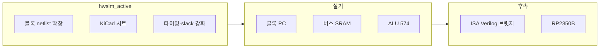

# Plover — 다음 단계 로드맵 (개략)

**버전:** 0.3 (개략) · **기준일:** 2026-05-31  
**전제:** **hwsim** — `python -m hwsim run --all` 통과 (clock, **alu8 12 opcode**, alu283, reg574). Verilog·웹 트랙은 [`archive/verilog-sim/`](../archive/verilog-sim/)에 보관.

---

## 현재까지 (기준선)

| 영역 | 상태 | 비고 |
|------|------|------|
| 설계·BOM | 완료 | [BOM.md](../BOM.md) |
| **hwsim 전기 시뮬** | ALU 12 op + B3 | clock, **alu8**, **alu_b3**, alu283, reg574 — [hw-sim.md](hw-sim.md) |
| KiCad↔YAML | 샘플 | `clock.net` diff; **sheet_alu** 후속 |
| 블록 netlist | 5종 | [hw/netlist/blocks/](../hw/netlist/blocks/) incl. [alu8.yaml](../hw/netlist/blocks/alu8.yaml), [alu_b3.yaml](../hw/netlist/blocks/alu_b3.yaml) |
| 정적 viewer | MVP | [hw/viewer/](../hw/viewer/) |
| Verilog·ISA 시뮬 | archived | [archive/verilog-sim/](../archive/verilog-sim/) |
| 하드웨어 조립 | 미착수 | README 로드맵 B1~B6 |

---

## 전체 흐름

---

## 트랙 H — hwsim 확장 (현재 주력)

| 작업 | 산출 | 우선순위 |
|------|------|----------|
| netlist: PC(161), bus(157/245), decode(138) | `hw/netlist/blocks/*.yaml` | 높음 |
| setup/hold·longest path (574, SUB/XOR) | `hwsim` + `alu_b3_*` tests | **완료** |
| KiCad `sheet_clock`, `sheet_alu` | `hw/kicad/plover/` | 중 |
| Wavedrom critical path | `report` + viewer | 중 |
| 42 IC 통합 netlist `include` | 후속 | 낮음 |

**B3 hwsim 완료:** `python -m hwsim run --all` 9 tests PASS — setup/hold, SUB/XOR slack, 574 latch, INC/DEC 157 B2 cascade.

**완료 기준 (다음 마일스톤):** PC + bus 블록 테스트 PASS, KiCad diff 0 mismatch; **B3 실기** per [hw-bringup-b3.md](hw-bringup-b3.md).

---

## 트랙 B — 하드웨어 브링업 (실기)

hwsim 블록 테스트와 1:1 대응. 각 단계마다 **동일 netlist**를 브레드보드에 실장.

| 단계 | 내용 | hwsim 연계 |
|------|------|------------|
| **B1** | 4 MHz → 2 MHz 분주 | [clock_divider.yaml](../hw/tests/clock_divider.yaml) |
| **B2** | 157/245, SRAM | netlist 추가 후 `run` |
| **B3** | ALU + 574 | [alu_b3_*](../hw/tests/) (4), [hw-bringup-b3.md](hw-bringup-b3.md) |
| **B4** | Flash 프로그래밍 (595) | 별도 `flashprog` 검토 |
| **B5~B6** | 코프로·인터리브 | 후순 |

---

## 트랙 A — Verilog·ISA (archived)

[`archive/verilog-sim/`](../archive/verilog-sim/) — ALU 153 연결, macroasm, 웹 Step·VCD 등. hwsim PASS 후 **선택적** 재개 또는 netlist→Verilog 브릿지.

---

## 트랙 C — 확장 (선택·후순)

| 항목 | 설명 |
|------|------|
| **RP2350B** | 그래픽·I/O |
| **인터리브** | Apple II식 메모리 슬롯 |
| **Flash 프로그래밍** | 아두이노 + 595 |

---

## 권장 우선순위

1. **H** — PC·bus netlist + hwsim 테스트  
2. **B1~B3** — 실기 (부품·오실로스코프)  
3. **H** — KiCad 시트와 YAML 동기화  
4. **C** — 코프로·인터리브  
5. **A (archive)** — ISA·Verilog는 필요 시 복원

---

## 관련 문서

| 문서 | 역할 |
|------|------|
| [README.md](../README.md) | 프로젝트 개요 |
| [hw-sim.md](hw-sim.md) | hwsim CLI·스키마 |
| [hw-schematic.md](hw-schematic.md) | KiCad 네이밍 |
| [archive/README.md](../archive/README.md) | 보관 트랙 |

---

## 변경 이력

| 날짜 | 내용 |
|------|------|
| 2026-05-31 | v0.4 — B3 alu_b3 netlist, setup/hold, 157 B2 INC/DEC, bring-up doc |
| 2026-05-31 | v0.3 — BOM ALU 18 IC, alu8 netlist 12 opcode PASS |
| 2026-05-31 | v0.2 — hwsim MVP 기준선, Verilog 트랙 archive |
| 2026-05-29 | v0.1 — 시뮬 MVP 이후 3트랙 로드맵 |
