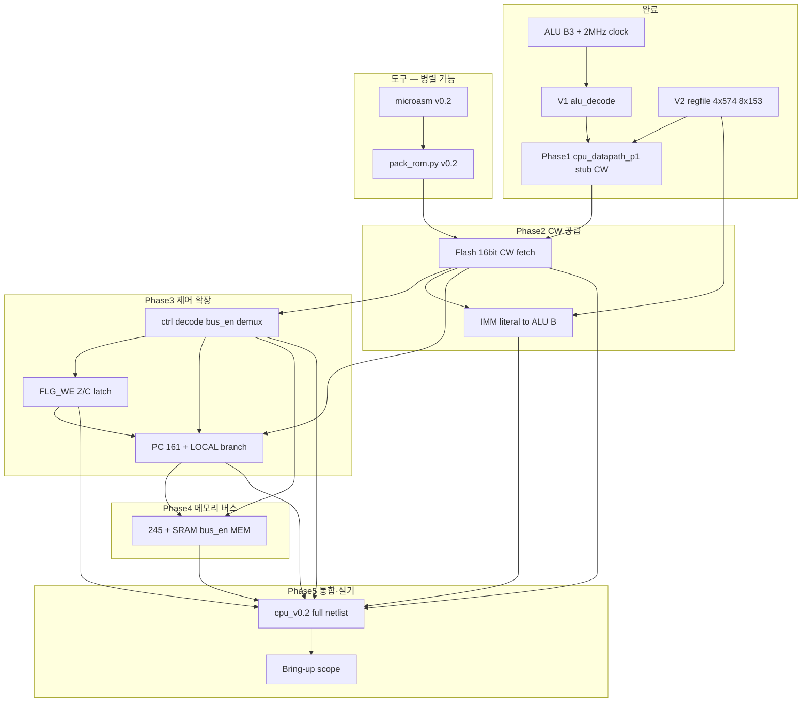

# VLIW v0.2 명세 구현 계획 (전체 단계·의존 관계)

**버전:** 1.0 · **기준일:** 2026-05-31  
**명세:** [microcode-spec-v0.2.md](microcode-spec-v0.2.md) (Frozen)  
**선행 완료:** ALU/B3 · CW 필드 정의 · Phase1 datapath hwsim (V1 decode + V2 regfile)

---

## 목표

**Flash에서 읽은 16비트 CW 한 워드**가 한 `net_clk2` 사이클(2 MHz) 안에 다음을 수행한다.

1. **Reg–ALU–Reg RMW** — `Dst ← Dst OP Src` (2-주소, Implicit B = Dst)  
2. **(후속)** PC 갱신·LOCAL 분기·`bus_en`에 따른 MEM/IMM·플래그 latch

최종 통합 검증: `python -m hwsim run --all` + ROM 이미지 기반 E2E + (선택) 브레드보드 scope.

---

## 전제 (기준선)

| 항목 | 상태 | 근거 |
|------|------|------|
| ALU 12 opcode + B3 | **완료** | [`alu8.yaml`](../hw/netlist/blocks/alu8.yaml), `alu_b3_*`, `bringup_b3c_clock` |
| CW 비트 필드 | **Frozen** | spec §16비트 CW — 변경 시 ROM·도구 전부 재생성 |
| V1 `alu_op` 디코드 | **완료** | [`alu_decode.yaml`](../hw/netlist/blocks/alu_decode.yaml) |
| V2 regfile 4×153 | **완료** | E2E 228 ns, slack 22 ns; `regfile_*`, `p1_rmw_*` |
| Phase1 통합 | **완료** | [`cpu_datapath_p1.yaml`](../hw/netlist/blocks/cpu_datapath_p1.yaml) — **CW 스텁 net** |
| Phase2 ROM CW | **완료** | [`cpu_datapath_p2_clock.yaml`](../hw/netlist/blocks/cpu_datapath_p2_clock.yaml), `p2_rom_*`, `pack_rom.py` — [hw-bringup-p2-rom.md](hw-bringup-p2-rom.md) |
| Phase3 LOCAL+PC | **완료** | [`cpu_datapath_p3.yaml`](../hw/netlist/blocks/cpu_datapath_p3.yaml), `p3_*`, `pc_*`, `local_ctrl_*` — [hw-bringup-p3-ctrl-pc.md](hw-bringup-p3-ctrl-pc.md) |

Phase1 상세: [hw-bringup-p1-datapath.md](hw-bringup-p1-datapath.md)

---

## 전체 의존 관계



**읽는 법:** 위쪽·왼쪽이 먼저; `pack_rom` / `microasm`는 명세가 고정된 뒤 **ROM fetch hwsim과 병렬**로 진행 가능하나, **E2E 바이너리 검증**은 `cpu_v0.2` 통합 이후.

---

## 단계 요약표

| ID | 단계 | 핵심 산출 | 선행 | hwsim 게이트 |
|----|------|-----------|------|----------------|
| **0** | B3 + Phase1 | `alu8`, `alu_decode`, `regfile`, `cpu_datapath_p1` | — | **PASS** (22 tests) |
| **2** | ROM CW + IMM | `rom_fetch`, `cpu_datapath_p2`, `pack_rom.py` | Phase1 | **PASS** (27 tests) |
| **2A** | Flash CW fetch | `rom_fetch.yaml`, CW bus → stub 대체 | 0 | `rom_fetch_*` |
| **2B** | IMM 경로 완성 | `ctrl[5:0]`+`dst` → ALU B, R2 CP | 0, 2A | `imm_load.yaml` |
| **3A** | `ctrl` LOCAL 디코드 | `FLG_WE`, IRQ mask 등 | 2A | `local_ctrl_*` |
| **3B** | 플래그 latch | Z/C from ALU, `Z_prev` | 3A | `flg_we_*.yaml` |
| **3C** | PC + LOCAL 분기 | 161, BEQ/BNE, JMP/INC PC | 2A, 3B | `pc_branch_*` |
| **4** | MEM 버스 | 245, SRAM, `bus_en` 01/10 | 2A, 3C | `mem_rd/wr_*` |
| **T** | ROM 도구 | `pack_rom.py`, microasm v0.2 | spec frozen | hex ↔ CW round-trip |
| **5** | CPU 통합 | `cpu_v0.2.yaml` | 2A–4, (T) | `v0.2_e2e_*.yaml` |
| **B** | 브레드보드 | 1면 U-routing, Flash prog | 5 | scope = hwsim 경로 |

---

## Phase 0 — 완료 (기준선)

| 서브 | 내용 | 산출 |
|------|------|------|
| B3 | ALU + 574 + 2 MHz | `alu_b3_clock`, `bringup_b3c_clock` |
| V1 | `alu_op[3:0]` → 14선 + `net_cmp_n` | `alu_decode`, `alu8_decode` |
| V2 | 4×574, 8×153, CP·CMP mask, IMM dst override | `regfile` |
| P1 | 스텁 CW + 통합 RMW | `cpu_datapath_p1`, `p1_rmw_*` |

**불변:** [`alu8.yaml`](../hw/netlist/blocks/alu8.yaml) netlist diff 없음.

---

## Phase 2 — CW 공급 (Flash → 내부 버스)

**목표:** 테스트·시뮬에서 **수동 `net_alu_op*` 스텁 제거** → ROM에서 매 사이클 16비트 CW 로드.

### 2A — Flash 16비트 fetch

| 항목 | 규격 |
|------|------|
| ROM | SST39SF010A ×2: `rom_low[addr]`, `rom_high[addr]` → `CW[15:0]` |
| 주소 | Phase2 초기: **외부 스텁 `net_pc*`** 또는 고정 카운터 → Phase3에서 161 출력으로 교체 |
| 타이밍 | CW **setup**이 `net_clk2` 상승 전에 안정 (comb ≤250 ns 예산 내) |

**산출 (예정):**

- `hw/netlist/blocks/rom_fetch.yaml` (behavioral ROM16 + CW field split)
- `tools/gen_rom_fetch_netlist.py`, `tools/pack_rom.py` v0.2
- `hw/tests/rom_fetch_word.yaml` — 주소 N → CW 비트 일치
- `cpu_datapath_p2.yaml` = rom_fetch + Phase1 blocks (PC manual or PC8)

**완료 (2026-05-31):** [`hw-bringup-p2-rom.md`](hw-bringup-p2-rom.md)

**선행:** Phase1 PASS.

### 2B — IMM (`bus_en = 11`)

| 항목 | 규격 |
|------|------|
| IMM[7:0] | `{ dst_reg[9:8], ctrl[5:0] }` → ALU B (PASS_B / ADD+Src=R2) |
| CP | **R2 고정** (regfile `U_DST*_MUX` 이미 Phase1에 골격) |
| 연결 | `ctrl[5:0]` → B 상수/157 경로 (미배선 비트는 Phase1 스텁과 동일) |

**산출:** `p2_imm_load.yaml`, regfile B측 8×157 IMM literal MUX.

**완료 (2026-05-31):** `p2_imm_load` PASS; ADD+Src=R2 encoding in `pack_rom.py`.

**선행:** 2A (동일 CW 버스), V2 regfile.

**병렬:** 2A와 독립 착수 가능하나, 통합 테스트는 2A 후.

---

## Phase 3 — `ctrl[5:0]` 시간 다중화 + PC

**명세:** `bus_en`에 따라 `ctrl` 의미 변경 — [spec §ctrl](microcode-spec-v0.2.md).

### 3A — LOCAL (`bus_en = 00`)

| 비트 | 기능 (우선순위) |
|------|-----------------|
| bit3 | `FLG_WE` — Z/C latch 허용 |
| bit5/4 | PC·분기 인코딩 (§ LOCAL) |
| bit0–2 | 보조 (IRQ mask 등, V2+ 옵션) |

**산출:** `local_ctrl_decode.yaml`, `local_ctrl_*.yaml`.

**선행:** 2A (CW 필드 실제 구동).

### 3B — 플래그 (Z/C)

| 항목 | 규격 |
|------|------|
| 소스 | ALU SUB/CMP 경로 또는 dedicated flag net |
| latch | `FLG_WE=1` **이번 사이클**; `Z_prev`는 다음 사이클 분기용 |
| CMP | Dst CP 억제 (V2 완료) + 플래그만 갱신 |

**산출:** `flg_latch.yaml`, `p1_cmp` 확장 → `cmp_flg_we.yaml`.

**선행:** 3A.

### 3C — PC 161 + LOCAL 분기

| 항목 | 규격 |
|------|------|
| PC | `74HC161` chain → ROM 주소 |
| 분기 | BEQ/BNE → `Z_prev`; JMP/REL — spec § bit5/bit4 |
| 제약 | **MEM 사이클과 PC 변경 동시 금지** (spec) |

**산출:** `pc.yaml`, `pc_inc.yaml`, `pc_branch_beq.yaml`.

**선행:** 2A, 3B. **후행:** Phase4 (MEM 시 PC 정지 규칙 검증).

---

## Phase 4 — MEM 버스 (`bus_en` 01 / 10)

| `bus_en` | 동작 |
|----------|------|
| `01` | MEM_RD — `{R1,R0}` → 주소, 245 → SRAM → (Dst 경로는 spec § MEM) |
| `10` | MEM_WR — `src_reg` → 245 → SRAM WE |
| `00` | LOCAL — Phase3 |
| `11` | IMM — Phase2B |

**산출:** `bus_mem.yaml`, `mem_rd.yaml`, `mem_wr.yaml`.

**선행:** 2A, 3C (PC·주소 레지 일관성).

**hwsim:** MEM CW 단독 + “분기+MEM 동시” **무시/미정의** 벡터 1건.

---

## Phase T — 도구 (명세 병렬)

| 도구 | 갱신 내용 | 소비자 |
|------|-----------|--------|
| [`pack_rom.py`](../archive/verilog-sim/tools/pack_rom.py) | v0.2 필드 `{alu_op,src,dst,bus,ctrl}` → `rom_*.hex` | hwsim ROM, Flash 프로그래밍 |
| `microasm.py` | v0.2 mnemonics (`alu`, `src`, `dst`, `bus`, `ctrl`) | 개발 루프 |

**완료 기준:** spec 예제 CW 3–5개 round-trip; `inc_r1` 류 macro **2 CW** spill 문서화.

**선행:** spec frozen (완료). **통합 E2E:** Phase 5.

---

## Phase 5 — CPU 통합 netlist

```
cpu_v0.2 = clock + rom_fetch + alu_decode + regfile + alu8
         + local_ctrl + flg + pc + bus_mem
```

| 테스트 | 시나리오 |
|--------|----------|
| `v0.2_rmw_rom.yaml` | ROM 1워드 ADD, R2←R2+R0 |
| `v0.2_pc_loop.yaml` | PC++, ROM 순차 fetch |
| `v0.2_mem_ld_st.yaml` | zero-page LOAD/STORE 2 CW |
| `v0.2_branch_slot.yaml` | CMP → BEQ (Z_prev 1-delay) |

**완료 기준:** `python -m hwsim run --all` — 기존 21 + 신규 **전부 PASS**; spec § 구현 게이트 V3·Tool **완료** 표기.

**선행:** 2A–4, ROM hex (T).

---

## Phase B — 브레드보드 bring-up

| 단계 | 내용 | hwsim 대응 |
|------|------|------------|
| B-P1 | regfile 1면 U-routing, decoupling | `regfile`, slack |
| B-ROM | 아두이노 + 595 Flash 프로그래밍 | `pack_rom` hex |
| B-CPU | CW scope: ROM → decode → A/B → Y → CP | `cpu_v0.2` critical path |
| B-MEM | 245/SRAM, MEM_RD 1바이트 | `mem_rd` |

문서: [hw-bringup-p1-datapath.md](hw-bringup-p1-datapath.md) 확장 → `hw-bringup-v0.2-cpu.md` (후속 작성).

**선행:** Phase 5 권장 (실기 디버그 비용 절감).

---

## 권장 작업 순서 (크리티컬 패스)

```text
[완료] 0  B3 + V1 + V2 + Phase1
        │
        ├─► 2A  ROM 16b CW fetch ─────────────┐
        │                                    │
        ├─► 2B  IMM B + R2 CP (병렬 가능)     │
        │                                    ▼
        ├─► T   pack_rom / microasm (병렬)   3A LOCAL ctrl
        │                                    │
        │                                    ▼
        │                               3B FLG Z/C
        │                                    │
        │                                    ▼
        │                               3C PC + branch
        │                                    │
        │                                    ▼
        │                               4   MEM 245/SRAM
        │                                    │
        └────────────────────────────────────┴─► 5  cpu_v0.2 + E2E
                                                 │
                                                 ▼
                                            B   breadboard
```

**최단 실행 RMW-only 경로 (Flash 1워드 목표만):** `0 → 2A → 5(축소)` — PC/MEM/분기 없이 ROM→datapath 동일 벡터.

**풀 v0.2 CPU:** `0 → 2A → 2B → 3A → 3B → 3C → 4 → T → 5 → B`.

---

## 리스크·완화

| 리스크 | 완화 |
|--------|------|
| ROM→CW comb 지연 | Phase1과 동일 250 ns 예산; fetch를 clk **하강** 구간에 배치 |
| `ctrl` 디코드 폭발 | `bus_en` 2→4 디코드 후 6bit 필드별 블록 분리 생성기 |
| 분기 1-delay 혼동 | `v0.2_branch_slot` 고정 2-CW 시퀀스 테스트 |
| MEM+분기 동시 | spec **금지** — hwsim negative test 1건 |
| decode IC 수 (V1) | BOM §V1 별도; CPU 면적과 분리 실장 |

---

## spec 구현 게이트 (추적)

| 게이트 | Phase | 상태 |
|--------|-------|------|
| B3 | 0 | **완료** |
| V1 alu_decode | 0 | **완료** |
| V2 regfile | 0 | **완료** |
| V3 PC + LOCAL | 3C | **완료** — [`cpu_datapath_p3.yaml`](../hw/netlist/blocks/cpu_datapath_p3.yaml), `p3_branch_slot`, `pc_*` |
| ROM fetch | 2A | **완료** |
| MEM bus | 4 | TODO |
| Tool pack_rom | T | **완료** (LOCAL helpers + branch_slot fixture) |
| Bring-up | B | TODO |

갱신 위치: [microcode-spec-v0.2.md § 구현 게이트](microcode-spec-v0.2.md).

---

## 관련 문서

| 문서 | 역할 |
|------|------|
| [microcode-spec-v0.2.md](microcode-spec-v0.2.md) | CW·RMW·bus·ctrl **명세** |
| [hw-bringup-p1-datapath.md](hw-bringup-p1-datapath.md) | Phase1 hwsim·스텁 |
| [hw-bringup-b3-opcode.md](hw-bringup-b3-opcode.md) | `alu_op` 테이블 |
| [roadmap-next.md](roadmap-next.md) | 프로젝트 로드맵 changelog |
| [BOM.md](../BOM.md) | V1 decode + V2 153 구매 |
| [archive/verilog-sim/tools/](../archive/verilog-sim/tools/) | pack_rom·microasm (갱신 대상) |

---

## 변경 이력

| 날짜 | 내용 |
|------|------|
| 2026-05-31 | v1.0 — Phase0 완료 전제, Phase2–5·T·B 의존 관계 초안 |
