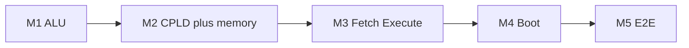
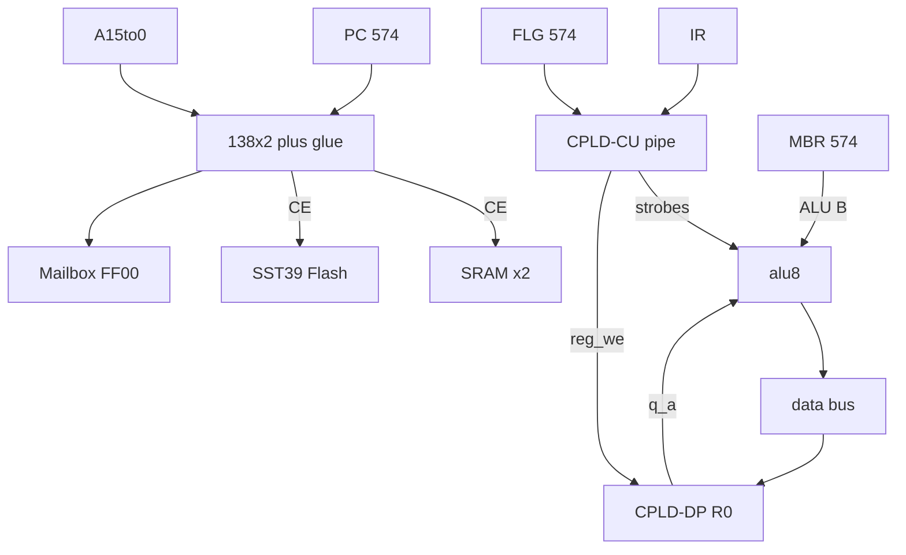

# Plover 프로젝트 백서

**Version:** 1.0 P12 · **Date:** 2026-07-13  
**Status:** Normative overview — **v1.0 P12** (IF|EX pipe CU + R0/MBR datapath)  
**Audience:** 교육 설계자, 학습자, 기여자, 외부 검토자

**관련 정본:** [system-architecture.md](reference/hardware/system-architecture.md) · [cpld-pipe-cu.md](reference/hardware/cpld-pipe-cu.md) (Active CU) · [software-roadmap.md](reference/software/software-roadmap.md) (S0–S7) · [hw-bringup/README.md](reference/hw-bringup/README.md) (M1–M5) · [reference/README.md](reference/README.md) (L0–L10 ladder)

---

## 1. 이 문서가 하는 일

Plover는 **74HC 디스크리트 로직으로 만드는 8비트 CPU** 프로젝트입니다. 하드웨어 명세, 소프트웨어 로드맵, 부트 체인이 여러 문서에 나뉘어 있어 **한눈에 보기 어렵습니다.** 본 백서는 다음을 **한 문서**에 정리합니다.


| 주제            | 본 문서 § | 세부 정본                                                                                                                             |
| ------------- | ------ | --------------------------------------------------------------------------------------------------------------------------------- |
| 교육 목적·목표      | §2     | [compiler-isa-audit-v1.0.md](reference/software/compiler-isa-audit-v1.0.md) §10                                                   |
| ALU           | §4     | [alu-opcodes-timing.md](reference/hardware/alu-opcodes-timing.md)                                                                 |
| 컴퓨터 구조 (조직)   | §5     | [cpld-system-controller.md](reference/hardware/cpld-system-controller.md) · [cpld-pipe-cu.md](reference/hardware/cpld-pipe-cu.md) |
| 컴퓨터 아키텍처      | §6     | [microcode-spec.md](reference/hardware/microcode-spec.md) · [cpld-pipe-cu.md](reference/hardware/cpld-pipe-cu.md)                 |
| 어셈블러          | §7     | [plover-asm.md](reference/software/plover-asm.md)                                                                                 |
| 인터프리터         | §8     | [forth-system.md](reference/software/forth-system.md)                                                                             |
| OS            | §9     | [software-roadmap.md](reference/software/software-roadmap.md)                                                                     |
| 검증 (bring-up) | §10    | [hw-bringup/README.md](reference/hw-bringup/README.md)                                                                            |


**본 문서가 하지 않는 일:** 핀 배선표, BOM 수량, 마이크로코드 비트 필드, 개별 테스트 케이스 — 각 정본 문서를 따릅니다.

---

## 2. 교육 목적과 목표

### 2.1 프로젝트가 존재하는 이유

Plover는 **“컴퓨터가 어떻게 동작하는가”를 손으로 만지며 배우는** 것을 목표로 합니다. 현대 PC·스마트폰은 수억 게이트와 수십 년의 추상화 위에 있어, Fetch–Decode–Execute, ALU, 메모리 맵, MMIO, 부트로더, OS가 **관측 가능한 형태**로 남아 있지 않습니다.

Plover는 의도적으로 다음을 선택합니다.


| 원칙                 | 교육적 의미                                          |
| ------------------ | ----------------------------------------------- |
| **디스크리트 TTL + 빵판** | 논리 게이트·래치·버스를 눈과 멀티미터로 추적                       |
| **단일 클럭·결정적 동작**   | IRQ 없음 — 타이밍과 시퀀스를 스코프로 검증                      |
| **얇은 추상화 계층**      | Hex → Asm → Forth → Subset C → OS를 **단계적으로** 도입 |
| **현대 주변기기**        | RP2350 copro — **HDMI·USB HID·Micro SD**        |


### 2.2 학습 목표 (역량)

학습자가 프로젝트를 끝까지 밟으면 다음을 **설명하고 실증**할 수 있어야 합니다.

1. **디지털 논리:** 조합 회로 지연, 래치 setup/hold, 2 MHz 전주기(500 ns) 예산
2. **ALU 설계:** 산술·논리 연산을 MUX·283 가산기·플래그로 구현
3. **컴퓨터 구조:** PC/MBR/레지스터 파일·데이터 버스·메모리 디코드
4. **컴퓨터 아키텍처:** ISA, IF|EX pipe 스케줄, 분기, MMIO
5. **시스템 소프트웨어:** 어셈블러, 스택 인터프리터(Forth), 호출 규약, 커널, 셸
6. **검증:** 실기 bring-up 게이트(M1–M5), 오실로스코프·LED 관측

### 2.3 교육 커리큘럼 (하드웨어 ↔ 소프트웨어 정렬)

두 축 — **실기 bring-up (M1–M5)** 와 **소프트웨어 스택 (S0–S7)** — 은 같은 ISA를 공유하되 **각각 독립 트랙**입니다. 소프트웨어는 하드웨어가 **한 단계 이상 앞선 뒤**에 시작합니다 (정렬은 아래 표).

**하드웨어 (M1–M5)**




**소프트웨어 (S0–S7)**


| 교육 단계             | 하드웨어 (먼저)             | 소프트웨어 (뒤따름)               | 관측 가능한 결과              |
| ----------------- | --------------------- | ------------------------- | ---------------------- |
| **1. Bare metal** | M1 ALU                | S0 · Hex·수동 버스            | LED/스코프로 Y, C, Z       |
| **2. Datapath**   | M2 R0·SRAM·ROM CE     | S1 `plover_asm`           | ADD/LDA/STA on wire    |
| **3. Control**    | M3 pipe fetch/execute | S2 CALL/RET → S3 Forth    | BEQ, MMIO poll         |
| **4. System**     | M4 boot·Mailbox       | S4 Forth OS → S5 Subset C | 부트 POST, Micro SD/vFDD |
| **5. OS**         | M5 통합 CPU             | S6 C 커널 → S7 PL-DOS       | `.PLR` 실행, 쉘           |


**언어 진화 경로 (로드맵 채택안):**

```
기계어/Hex → Plover Assembly → Forth (인터프리터) → Subset C (컴파일) → PL-DOS (C 커널 + Forth 쉘)
```

### 2.3.1 S5/S6와 하드웨어 제약 (Subset 조건)

하드웨어에 **SP/프레임 포인터 데이터패스가 없으므로** 상위 소프트웨어는 아래 부분 집합을 따릅니다. (그 밖의 제외 항목은 §2.4.)


| 마일스톤                 | 설계 선택                                                                                                            |
| -------------------- | ---------------------------------------------------------------------------------------------------------------- |
| **S5 Subset C**      | **정적 할당(Static Allocation)** — 재귀·가변 스택 없음; 지역 변수·매개변수는 고정 RAM 셀 ([subset-c.md](reference/software/subset-c.md)) |
| **S6 C microkernel** | **협력형** 스케줄 + Mailbox **폴링** I/O ([os-kernel.md](reference/software/os-kernel.md))                               |


### 2.4 의도적으로 넣지 않은 것

교육 범위를 지키기 위해 **v1.0 normative**에서 제외된 항목:


| 항목                   | 이유                                        |
| -------------------- | ----------------------------------------- |
| **IRQ / 선점형 스케줄**    | 컨텍스트 저장·벡터 설계 부담; 협력형(Forth)으로 OS 입문      |
| **MMU / 페이징**        | 미채택 — flat 64 KiB only                    |
| **범용 3-address ALU** | 8비트 ACC형 + **RAM 변수**; ADD→R0 |
| **C 전체**             | Subset C(C0)로 커널·컴파일러 교육 목표 달성            |


---

## 3. 프로젝트 한눈에 보기

### 3.1 v1.0 시스템 스펙

| 항목 | 내용 |
|------|------|
| **CPU** | 8-bit TTL datapath: **alu8** (12×74HC DIP) + **ATF1504** 내부 **R0 (AC) only** |
| **제어** | **CPLD pipe CU** (`IF|EX`); ALU strobes from CU |
| **Opcode field** | 프로그램 바이트 `opcode[7:0]`; **CU 키 = `opcode[4:0]`** (5비트) |
| **IR** | **574 IR → CPLD `OPC[4:0]`** |
| **ISA** | Core `0x01–0x0F`; **`0x10–0x1F`**, `0x0C` reserved |
| **메모리** | 64 KiB flat (2×32K SRAM, A15 뱅크); Flash = boot/program ([rom-architecture.md](reference/hardware/rom-architecture.md)) |
| **I/O** | MMIO Mailbox `@$FF00–$FFFB` (폴링만) |
| **Copro** | RP2350 (별도 보드) — HDMI / USB 키보드·마우스 / Micro SD |
| **클럭** | 2 MHz normative (`CLK_SYS`); desk `IF|EX` 전주기 500 ns |

**CPLD 핀·pipe CU 정본:** [cpld-system-controller.md](reference/hardware/cpld-system-controller.md) · [cpld-pipe-cu.md](reference/hardware/cpld-pipe-cu.md) · [cpld-dual-routing.md](reference/hardware/cpld-dual-routing.md)

### 3.2 제어·데이터경로 (pipe CU)

v1.0 P12는 **PROG IF + DATA EX** 를 CPLD pipe FSM으로 겹칩니다 ([cpld-pipe-cu.md](reference/hardware/cpld-pipe-cu.md)).

**IF:** PC → PROG Flash → **IR** / operand latch.  
**EX:** ALU / DATA SRAM / MMIO / stack; stall·bubble·stretch는 시트에 표시.

**Operand 라우팅:**


| 매크로                       | 오퍼랜드 출처                                           |
| ------------------------- | ------------------------------------------------- |
| LDA, STA, CMP, LDIO, STIO | imm8/abs16 — **MBR** (IF 래치)                      |
| ADD                       | imm8 → **MBR** → ALU B (`net_mbr`); result **R0** |
| BEQ, JMP                  | abs16 — MBR / operand latch                       |
| CALL                      | abs16 target; **return PC** push on **STACK_EX**  |
| RET                       | **popped return PC** → PC (not MBR); **STACK_EX** |


**분기:** ALU가 **Z/C** 설정 → **574 FLG** → taken이면 `PC_LOAD_EN` + **BRANCH_BUBBLE**.

**CPLD 핀 요약** (상세: [cpld-system-controller.md](reference/hardware/cpld-system-controller.md)):


| 칩 | In | Out SoC | Out G-IC / datapath |
|----|-----|---------|---------------------|
| **CPLD-CU** | `OPC[4:0]`, `FLG_Z`, `CLK_SYS` | strobes → ALU/MEM/PC/PROG | G-IC **`reg_we`** → DP |
| **CPLD-DP** | `d_in[7:0]`, G-IC, `CLK` | `q_a[7:0]` → ALU A | MBR→`net_b` (off-chip) |

**G-IC:** `reg_we` only (CU→DP).

### 3.3 검증 (학습자 경로)


| 계층          | 방법                     | 검증 대상                                                  |
| ----------- | ---------------------- | ------------------------------------------------------ |
| **실기**      | M1–M5 bring-up, 오실로스코프 | [hw-bringup/README.md](reference/hw-bringup/README.md) |
| **Pipe CU** | 상태·SYS 시트·Design fits  | [cpld-pipe-cu.md](reference/hardware/cpld-pipe-cu.md)  |


---

## 4. ALU (Arithmetic Logic Unit)

### 4.1 역할

ALU는 CPU의 **순수 조합 데이터패스**입니다. 두 8비트 피연산자 A, B와 제어 신호(`cin`, `net_bctrl0..3`, `lgc`, `y_mux`)를 받아 결과 Y와 carry를 만듭니다. SoC에서는 **CPLD가 ALU 제어를 직접** 냅니다 ([control-and-decode.md](reference/hardware/control-and-decode.md)). M1 벤치는 DIP로 `alu_sel`을 고를 수 있습니다.

### 4.2 연산 집합

12개 `alu_sel` 연산 (요약):


| Mnemonic          | 동작                  | 플래그  |
| ----------------- | ------------------- | ---- |
| NOP               | Y = 0               | 유지   |
| ADD               | Y = A + B           | C, Z |
| SUB               | Y = A − B (2의 보수)   | C, Z |
| AND, OR, XOR, NOT | 비트 논리               | Z    |
| PASS_A, PASS_B    | 버스 통과               | Z    |
| INC, DEC          | A ± 1               | C, Z |
| CMP               | SUB와 동일 (결과 버스 미구동) | C, Z |


정본: [alu-opcodes-timing.md](reference/hardware/alu-opcodes-timing.md) · 실기 치트시트: [b3-opcode.md](reference/hw-bringup/b3-opcode.md).

### 4.3 타이밍과 교육 포인트

- **Worst-case:** INC **153 ns** @ 74HC max — 500 ns `CLK_SYS` 전주기 내 **347 ns slack**; SUB/CMP **136 ns** (**364 ns** slack)
- **교육:** 학습자가 opcode별 경로(가산기 vs 논리)를 M1 스코프·[b3-opcode.md](reference/hw-bringup/b3-opcode.md)로 확인
- **Bring-up:** M1에서 ALU만 단독 조립·검증 후 M2에서 CPLD와 결선

### 4.4 ISA와의 연결


| 매크로 | ALU 사용                              |
| --- | ----------------------------------- |
| ADD | R0→A, MBR→B, ADD→**R0** (packed EX) |
| CMP | CMP 연산, flags_only                  |
| BEQ | EX에서 SUB로 Z 설정; taken → bubble      |


---

## 5. 컴퓨터 구조 (Computer Organization)

**컴퓨터 구조**는 “부품과 배선” — 데이터가 **어디를 지나가는가**에 초점을 둡니다.

### 5.1 주요 블록



### 5.2 레지스터 파일 (R0 + MBR)


| 레지스터        | 읽기 포트                          | 쓰기                        |
| ----------- | ------------------------------ | ------------------------- |
| **R0 (AC)** | 고정 → ALU A (`q_a`)             | CU `reg_we` (ADD, LDA, …) |
| **MBR 574** | 고정 → ALU B (`net_mbr`→`net_b`) | IF operand latch only     |


ALU A는 CPLD **R0**; ALU B는 **MBR**. 변수·스크래치는 **RAM** ([calling-convention-v0.1.md](reference/software/calling-convention-v0.1.md)).

### 5.3 메모리·디코드


| 범위            | Boot 모드  | Run 모드  |
| ------------- | -------- | ------- |
| `$0000–$07FF` | Boot ROM | RAM     |
| `$0800–$FEFF` | RAM      | RAM     |
| `$FF00–$FFFB` | Mailbox  | Mailbox |
| `$FFFC–$FFFF` | ROM 벡터   | RAM 벡터  |


물리: **74HC138×2** + 08/32/04 glue — CPLD는 주소 디코드에 관여하지 않음 ([memory-map.md](reference/hardware/memory-map.md)).

### 5.4 시퀀서 하드웨어


| 부품            | 역할                                      |
| ------------- | --------------------------------------- |
| **574×3**     | PC, MBR, FLG                            |
| **161**       | PC 상위 비트 확장                             |
| **ATF1504×2** | pipe CU + DP (R0); `PC_LOAD_EN`, ALU 제어 |


---

## 6. 컴퓨터 아키텍처 (Computer Architecture)

**컴퓨터 아키텍처**는 “프로그래머가 보는 기계” — **ISA, 명령 형식, 제어 흐름**에 초점을 둡니다.

### 6.1 명령 집합 (v1.0)

**Opcode 인코딩 (5비트 FSM 필드):**


| Class              | Opcode range             | 길이    | Operand                            |
| ------------------ | ------------------------ | ----- | ---------------------------------- |
| Core macro | `0x01–0x0F` | 1–3 B | imm8 / abs16 / implied (RET, HALT) |
| Reserved | `0x10–0x1F`, `0x20+` | — | reserved |


**코어 매크로 (`0x01–0x0F`):**


| Opcode        | Mnemonic  | 요약                          |
| ------------- | --------- | --------------------------- |
| `0x01`        | ADD       | R0 ← R0 + imm               |
| `0x02`        | LDA       | mem → R0                    |
| `0x03`        | STA       | R0 → mem                    |
| `0x04`        | BEQ       | Z이면 분기                      |
| `0x05`        | JMP       | 무조건 점프                      |
| `0x06`        | CALL      | 서브루틴 (abs16; 리턴 PC 스택 push) |
| `0x07`        | RET       | 복귀 (스택 pop → PC)            |
| `0x08`/`0x09` | LDIO/STIO | MMIO load/store             |
| `0x0A`        | HALT      | 정지                          |
| `0x0D`        | CMP       | R0 − imm, 플래그만              |
| `0x0F`        | STA16     | 16-bit 절대 저장                |


`0x0C` 및 **`0x10–0x1F`** 는 **reserved**.

**물리 디코드:** IR[4:0] → **CPLD pipe CU** ([cpld-pipe-cu.md](reference/hardware/cpld-pipe-cu.md)).

정본: [microcode-spec.md](reference/hardware/microcode-spec.md) · [cpld-pipe-cu.md](reference/hardware/cpld-pipe-cu.md).

### 6.2 제어: Pipe CU (IF|EX)

v1.0 P12는 **CPLD pipe FSM**으로 fetch와 execute를 겹칩니다. Lab 실패 시 stretch; ports 실패 시 named FE2 fallback.

스케줄: IF_EX / MEM_STALL / BRANCH_BUBBLE / STACK_EX 등 — [cpld-pipe-cu.md](reference/hardware/cpld-pipe-cu.md). CALL/RET는 **STACK_EX** ([microcode-spec.md](reference/hardware/microcode-spec.md) §2.3).

CPLD bitstream: pipe CU **Design fits pending**.

### 6.3 실행 모델

1. **IF** — PROG port: PC → Flash → IR / operand latch (다음 매크로와 겹칠 수 있음)
2. **Decode** — opcode → pipe 상태 / strobe
3. **EX** — ALU / DATA / PC_LOAD; stall·bubble은 프로그래머 시트에 표시
4. **Commit** — retire; taken 분기는 bubble 후 refetch

### 6.4 부트·모드

1. Power-on — `MAP_MODE=Boot`
2. RESET — fetch `@$FFFC` → ROM 벡터 → boot @ `$0000`
3. Bootloader — POST, (선택) vFDD load, kernel → RAM `$0800+`, `JMP`
4. Run — 운영자 DIP 전환 + RESET

[bootloader.md](reference/boot/bootloader.md) · [rom-architecture.md](reference/hardware/rom-architecture.md).

### 6.5 Coprocessor 아키텍처

RP2350을 넣는 목적은 **TTL CPU에 현대 주변기기를 붙이기 위함**입니다 — **HDMI**, **USB 키보드·마우스**, **Micro SD** 로 콘솔·저장·프로그램 로드를 처리합니다.

TTL CPU ↔ RP2350 경계는 **Mailbox MMIO** (`$FF00–$FFFB`, 폴링)입니다 ([mailbox-protocol.md](reference/copro/mailbox-protocol.md)).

---

## 7. 어셈블러 (Assembler)

### 7.1 Plover Assembly (`plover_asm`)


| 항목       | 내용                                                |
| -------- | ------------------------------------------------- |
| **마일스톤** | S1                                                |
| **역할**   | ISA 1:1 니모닉 → 기계어; 라벨·`.ORG`                      |
| **출력**   | `.hex` / 시나리오용 바이너리                               |
| **정본**   | [plover-asm.md](reference/software/plover-asm.md) |


### 7.2 교육적 위치

- **Phase 2 (Architecture):** 2-pass 어셈블러 개념 — 심볼 테이블, 재배치
- **Phase 3 (Interface):** 부트로더·드라이버를 asm으로 작성 — MMIO `LDIO`/`STIO`
- **호출 규약:** `CALL`/`RET` + [calling-convention-v0.1.md](reference/software/calling-convention-v0.1.md) · [microcode-spec.md](reference/hardware/microcode-spec.md) §2.3

### 7.3 예시 (개념)

```asm
        .ORG $0800
START:  LDA $42
        ADD $10        ; imm from MBR → R0 = R0 + imm
        STA $80
        HALT
```

---

## 8. 인터프리터 (Interpreter)

### 8.1 Forth — 1차 인터프리터


| 항목            | 내용                                                    |
| ------------- | ----------------------------------------------------- |
| **마일스톤**      | S3 (core), S4 (OS services)                           |
| **왜 Forth인가** | 8비트에 맞는 스택 머신; 컴파일러·OS가 KB 단위; C 프롤로그 부담 없음           |
| **구현**        | `forth/interpreter.py`, `crates/plover_forth`         |
| **정본**        | [forth-system.md](reference/software/forth-system.md) |


**S3 범위:** `DUP DROP SWAP`, `+ - *`, `.`, `:` … `;`, `eval_line`.

---

## 9. 운영체제 (OS)

### 9.1 소프트웨어 스택 개요


| Phase | 마일스톤          | 산출물                                                                                        |
| ----- | ------------- | ------------------------------------------------------------------------------------------ |
| S4    | Forth OS      | 블록 디바이스, 기본 I/O 서비스 — [forth-os-services.md](reference/software/forth-os-services.md)      |
| S5    | `plover_cc`   | **정적 할당 Subset C** — [subset-c.md](reference/software/subset-c.md)                         |
| S6    | C microkernel | **협력형·폴링** 커널 — [os-kernel.md](reference/software/os-kernel.md)                            |
| S7    | PL-DOS        | vFDD, PLFS, `.PLR` 로더, Forth 쉘 — [pl-dos-roadmap.md](reference/software/pl-dos-roadmap.md) |


**S5 (Subset C):** 재귀·가변 스택 없이 지역 변수·매개변수를 **정적 메모리**에 둔다 ([subset-c.md](reference/software/subset-c.md)).

**S6 (마이크로커널):** Mailbox **폴링**과 **협력형** 스케줄의 베어메탈 커널 ([os-kernel.md](reference/software/os-kernel.md)).

### 9.2 PL-DOS 목표 구조

```text
  Boot ROM ($0000)
       │
       ▼
  Bootloader — POST, vFDD에서 커널 로드 (Mailbox)
       │
       ▼
  C microkernel @ RAM $0800+  — 메모리, 프로세스(협력형), FS
       │
       ▼
  Forth shell (S7d) — 대화형 명령, .PLR 실행
```

### 9.3 OS 교육 목표


| 주제            | v1.0에서 다루는 것               |
| ------------- | -------------------------- |
| 부트 체인         | Boot ROM → loader → kernel |
| MMIO 드라이버     | Mailbox poll               |
| 파일 시스템 (PLFS) | Micro SD / vFDD via copro  |
| 협력형 멀티태스킹     | Forth / S6 cooperative     |


### 9.4 메모리 레이아웃 (소프트웨어)

소프트웨어 관점 RAM 사용: [software-memory-layout.md](reference/software/software-memory-layout.md) — SP @ `$0E00`, RP @ `$0F00` 등.

---

## 10. 검증과 품질

### 10.1 하드웨어 게이트 (bring-up)

- M1–M5 체크리스트 Pass ([hw-bringup/README.md](reference/hw-bringup/README.md))
- Pipe CU 상태·SYS 시트·Design fits ([cpld-pipe-cu.md](reference/hardware/cpld-pipe-cu.md))

### 10.2 소프트웨어 게이트

마일스톤별 검증: [software-roadmap.md](reference/software/software-roadmap.md).

### 10.3 문서 정합성


| 버전 라벨             | 의미                                |
| ----------------- | --------------------------------- |
| **v1.0 P12**      | Normative 하드웨어 (pipe CU + R0/MBR) |
| **software v0.1** | S0–S7 소프트웨어 트랙                    |


---

## 11. 문서 맵 (전체 색인)

### 11.1 이 백서에서 다룬 주제 → 정본


| 주제               | 정본 문서                                                                                                                             |
| ---------------- | --------------------------------------------------------------------------------------------------------------------------------- |
| 교육·컴파일러 적합성      | [compiler-isa-audit-v1.0.md](reference/software/compiler-isa-audit-v1.0.md)                                                       |
| 시스템 아키텍처         | [system-architecture.md](reference/hardware/system-architecture.md)                                                               |
| ALU              | [alu-opcodes-timing.md](reference/hardware/alu-opcodes-timing.md)                                                                 |
| CPLD·GPR·pipe CU | [cpld-system-controller.md](reference/hardware/cpld-system-controller.md) · [cpld-pipe-cu.md](reference/hardware/cpld-pipe-cu.md) |
| ISA·제어           | [microcode-spec.md](reference/hardware/microcode-spec.md)                                                                         |
| 메모리 맵            | [memory-map.md](reference/hardware/memory-map.md)                                                                                 |
| Bring-up         | [hw-bringup/README.md](reference/hw-bringup/README.md)                                                                            |
| 소프트웨어 로드맵        | [software-roadmap.md](reference/software/software-roadmap.md)                                                                     |
| BOM              | [BOM.md](reference/project/BOM.md)                                                                                                |


### 11.2 문서 허브

- [reference/README.md](reference/README.md)
- [README.md](README.md) — 저장소 진입점

