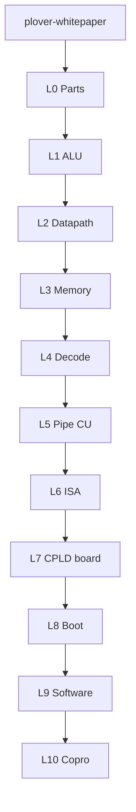

# Plover reference specifications

**Audience:** learners, external reviewers, breadboard builders.

**v1.0 P12** confirmed facts — hardware specs, bring-up, software stack, boot, copro MMIO. No simulators, CI commands, or research history.

## Start here

| Document | Description |
|----------|-------------|
| [plover-whitepaper.md](../plover-whitepaper.md) | **Root** — project overview, ISA, pipe narrative |
| [hw-bringup/README.md](hw-bringup/README.md) | M1–M5 breadboard bring-up |

### Truth cascade (edit order)

| Tier | Path | Role |
|------|------|------|
| **Root** | [plover-whitepaper.md](../plover-whitepaper.md) | ISA / pipe narrative |
| **Reference** | `reference/**` (this tree) | Normative detail; **CU = cpld-pipe-cu** |
| **Machine** | `simulators/cyclesim/` | Pipe golden TBD |
| **CPLD** | pipe CU `.pld` | **Design fits pending** |

ISA or pipe CU changes: **whitepaper first** → reference → machine code → CPLD regen.

---

## Reading ladder (L0→L10)

Read bottom-up. One theme per rung.

| Level | Theme | One job | Primary docs |
|-------|-------|---------|--------------|
| **L0** | Parts | What to buy | [BOM.md](project/BOM.md); skim [system-architecture.md](hardware/system-architecture.md) §1 |
| **L1** | ALU | Comb `Y=f(A,B,ctrl)` only | [alu8-phase-b.md](hardware/alu8-phase-b.md) → [alu-opcodes-timing.md](hardware/alu-opcodes-timing.md) → [M1-alu](hw-bringup/M1-alu.md) / B3 |
| **L2** | Datapath | R0, MBR→B, `reg_we`, D-bus | [cpld-system-controller.md](hardware/cpld-system-controller.md) (DP) → [M2b-gpr-datapath](hw-bringup/M2b-gpr-datapath.md) |
| **L3** | Memory fabric | Map, /CE, SRAM×2, Flash | [memory-map.md](hardware/memory-map.md) → [rom-architecture.md](hardware/rom-architecture.md) → [M2b-memory](hw-bringup/M2b-memory.md) |
| **L4** | Decode ownership | Who drives which nets | [control-and-decode.md](hardware/control-and-decode.md) |
| **L5** | Pipe CU | IF\|EX schedule, bubbles, stretch | **[cpld-pipe-cu.md](hardware/cpld-pipe-cu.md)** |
| **L6** | ISA | Opcodes, stack, SYS sheet | [microcode-spec.md](hardware/microcode-spec.md) |
| **L7** | CPLD boardcraft | Routing + JTAG | [cpld-dual-routing.md](hardware/cpld-dual-routing.md) → [cpld-dual-jtag.md](hardware/cpld-dual-jtag.md) → M2a / Design fits |
| **L8** | Boot | Vectors, fixtures, M4 | [bootloader.md](boot/bootloader.md) → [fixtures](fixtures/) → [M4b](hw-bringup/M4b-boot-hardware.md) |
| **L9** | Software | Asm → ABI → roadmap | [software-roadmap.md](software/software-roadmap.md) → [plover-asm](software/plover-asm.md) / ABI |
| **L10** | Copro | Mailbox / MMIO | [mailbox-protocol.md](copro/mailbox-protocol.md) → remaining `copro/` |

---

## Hardware (v1.0 P12)

| Document | Description |
|----------|-------------|
| [hardware/cpld-pipe-cu.md](hardware/cpld-pipe-cu.md) | **Pipe CU** — states, bubbles, stretch, timing, CALL/RET fit |
| [hardware/microcode-spec.md](hardware/microcode-spec.md) | ISA + pipe SYS sheet |
| [hardware/control-and-decode.md](hardware/control-and-decode.md) | CPLD vs Flash vs ALU decode |
| [hardware/cpld-system-controller.md](hardware/cpld-system-controller.md) | Dual CPLD CU/DP ports |
| [hardware/memory-map.md](hardware/memory-map.md) | Address map |
| [hardware/alu-opcodes-timing.md](hardware/alu-opcodes-timing.md) | ALU comb delay |
| [fixtures/README.md](fixtures/README.md) | Frozen burn images |

## Software, boot, copro

- [software/software-roadmap.md](software/software-roadmap.md) — S0–S7 milestones
- [boot/](boot/) — boot chain
- [copro/](copro/) — RP2350 mailbox, VDU, vFDD
