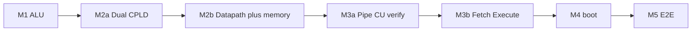

# Plover hardware bring-up index

> **Normative v1.0 P12:** pipe CU — [cpld-pipe-cu.md](../hardware/cpld-pipe-cu.md) · [system-architecture.md](../hardware/system-architecture.md).  
> **실구매 패키지:** [parts-on-hand.md](../project/parts-on-hand.md) · Wiring: [breadboard-wiring.md](breadboard-wiring.md).  
> Reading ladder: [reference/README.md](../README.md) (L0–L10).

초보 작업자도 **문서만 따라** 빵판 CPU를 올릴 수 있도록 단계별 시방서입니다.

---

## 읽는 순서

| 순서 | 할 일 | 시작 문서 |
|------|-------|-----------|
| 1 | ALU 납땜 + Y LED | [M1-alu.md](M1-alu.md) → [M1-b3-procedure.md](M1-b3-procedure.md) |
| 2 | Dual CPLD JED (WinCUPL + Design fits) | [M2a-cpld-decode.md](M2a-cpld-decode.md) |
| 3 | R0/MBR datapath · SRAM/NOR | [M2b-gpr-memory.md](M2b-gpr-memory.md) · [breadboard-wiring.md](breadboard-wiring.md) |
| 4 | Pipe CU verify (no Flash CW) | [M3a-control-store.md](M3a-control-store.md) |
| 5 | PROG fetch + pipe execute | [M3b-fetch-execute.md](M3b-fetch-execute.md) |
| 6 | (PC) 부트 sim | [M4a-boot-sim.md](M4a-boot-sim.md) |
| 7 | 부트 실기 | [M4b-boot-hardware.md](M4b-boot-hardware.md) |
| 8 | netlist 고정 | [M5-cpu-e2e.md](M5-cpu-e2e.md) |

---

## 문서 목록

### M1 — ALU

| 문서 | 내용 |
|------|------|
| [M1-alu.md](M1-alu.md) | 마일스톤 개요 |
| [alu8-assembly-spec.md](alu8-assembly-spec.md) | ALU 12 DIP 단계별 조립 |
| [M1-b3-procedure.md](M1-b3-procedure.md) | B3a/b/c 상세 |
| [b3-opcode.md](b3-opcode.md) | 12 opcode DIP (M1 벤치 전용) |

### M2 — CPU gate

| 문서 | 내용 |
|------|------|
| [M2a-cpld-decode.md](M2a-cpld-decode.md) | Dual CPLD ISP / Design fits |
| [M2b-gpr-memory.md](M2b-gpr-memory.md) | M2b 개요 (datapath + memory) |
| [M2b-gpr-datapath.md](M2b-gpr-datapath.md) | R0 + MBR→ALU B |
| [M2b-memory.md](M2b-memory.md) | SRAM·NOR·MAP_MODE |
| [breadboard-wiring.md](breadboard-wiring.md) | 138×2 · dual CPLD / pipe CU |

### M3 — Control / fetch

| 문서 | 내용 |
|------|------|
| [M3a-control-store.md](M3a-control-store.md) | Pipe CU verify (no Flash CW) |
| [M3b-fetch-execute.md](M3b-fetch-execute.md) | PC · pipe · 첫 ROM 프로그램 |

### M4 / M5

| 문서 | 내용 |
|------|------|
| [M4a-boot-sim.md](M4a-boot-sim.md) | 부트 시뮬 체크리스트 |
| [M4b-boot-hardware.md](M4b-boot-hardware.md) | 빵판 부트 |
| [M5-cpu-e2e.md](M5-cpu-e2e.md) | breadboard composite netlist |

---

## 사전 검증

Use frozen fixtures in [fixtures](../fixtures/) before breadboard burn.

---

## Change log

| Date | Note |
|------|------|
| 2026-07-13 | Pipe CU retarget; M2b hub; no archive banners |
| 2026-06-24 | **v1.0** — CPLD + no alu8_decode in SoC |
| 2026-06-08 | Milestone index M1–M5 |
