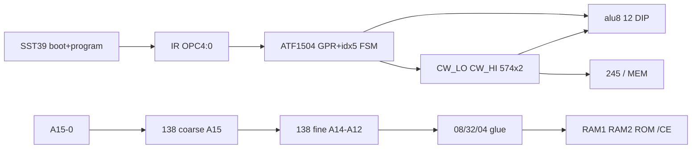

# Breadboard v1.0 wiring reference

**Normative:** [system-architecture.md](../hardware/system-architecture.md) · [memory-map.md](../hardware/memory-map.md) · [cpld-system-controller.md](../hardware/cpld-system-controller.md) · [control-word-latch.md](../hardware/control-word-latch.md)

Single breadboard target — **v1.0 FSM-only (idx5)**. CPLD = **GPR + phase FSM**; CE/mailbox = **138×2 + 08/32/04**; **no Flash CW @ `$4000`**; **no `alu8_decode` block**.

---

## Block placement (logical)

---

## Control path (FSM-only)

| Source | Role |
|--------|------|
| **IR[4:0]** | idx5 FSM decode in CPLD |
| **MBR 574** | Operand imm8 / abs16 from fetch |
| **CPLD FSM** | Phase templates; drives **CW latch** load ([control-word-latch.md](../hardware/control-word-latch.md)) |
| **FLG 574** | Z/C → CPLD branch @ macro_end |

**Not on SoC:** PARAM latch, per-phase Flash addr mux, `alu8_decode` DIP block.

---

## 574 inventory (normative)

| IC | Role |
|----|------|
| PC (+161 high) | Instruction address |
| IR | Opcode → CPLD `OPC[4:0]` |
| MBR | Operand / abs16 low |
| FLG | Z, C |
| **CW_LO** | Bus strobes + ALU low field ([control-word-latch.md](../hardware/control-word-latch.md) §4) |
| **CW_HI** | ALU `lgc*`, `s0`, `s1` |

Tier C **CW_LO/CW_HI** replace per-signal CPLD pads. Flash `$4000` CW fetch remains **unused** in v1.0.

---

## CPLD ↔ ALU

| CPLD direct | ALU / bus |
|-------------|-----------|
| `q_a`, `q_b` | A, B (R0, R1 fixed read) |
| `REG_WE` | GPR write strobe |

| CW latch out | ALU / bus |
|--------------|-----------|
| `cin`, `bctrl0..3`, `lgc*`, `s0`, `s1` | ALU controls |
| `MEM_RD`, `MEM_WR`, `Y_OE`, `FLG_WE`, `PC_LOAD_EN` | Bus / branch strobes |

---

## CE / mailbox (off-CPLD)

Unchanged — [memory-map.md](../hardware/memory-map.md) · [breadboard-wiring detail in M2b](M2b-memory.md).

---

## Bring-up order

See [README.md](README.md): M1 ALU → M2a CPLD FSM → M2b 138×2 + memory → M3a FSM verify → M3b fetch → M4/M5.

---

## Change log

| Date | Note |
|------|------|
| 2026-07-06 | Tier C CW_LO/CW_HI 574 inventory |
| 2026-06-24 | v1.0 FSM idx5 — no hybrid Flash CW |
| 2026-06-10 | Prototype Flash CW → [prototype-flash-cw](../archive/prototype-flash-cw/README.md) |
