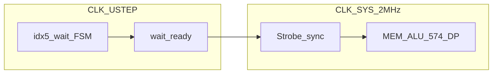

# CPLD µstep — architecture (research)

**Non-normative.** Baseline single-clock CU: [cpld-system-controller.md](../../reference/hardware/cpld-system-controller.md).

## Block diagram

```text
                    CLK_USTEP (4–8 MHz desk)
                           │
                           ▼
                 ┌─────────────────────┐
  OPC[4:0] ─────►│ idx5 / wait FSM     │
  FLG_Z    ─────►│  (internal phases)  │
                 └──────────┬──────────┘
                            │ request bus op
                            ▼
                      wait / ready
                            │
                            ▼
                 ┌─────────────────────┐
                 │ Strobe synchronizer │◄── CLK_SYS (2 MHz)
                 │ (2-FF or pulse to   │
                 │  SYS edge)          │
                 └──────────┬──────────┘
                            │ MEM_RD/WR, REG_WE, …
                            ▼
              SoC: ALU / MEM / PC / MBR / FLG
              CPLD-DP R0  (CLK_SYS only)
```



## Domains

| Domain | Clock | Owns |
|--------|-------|------|
| **USTEP** | `CLK_USTEP` | CU idx5 decode, internal micro-steps, wait loops |
| **SYS** | `CLK_SYS` = 2.0 MHz | Data bus, SRAM/Flash CE timing, ALU settle, 574 PC/MBR/FLG, **CPLD-DP** `reg_we`→R0 |

## wait / ready

1. CU (USTEP) decides a **SYS-visible** op is needed (`MEM_RD`, ALU execute + `REG_WE`, …).
2. Synchronizer arms a strobe for the next safe **SYS** edge.
3. CU **spins on USTEP** until `ready` (SYS cycle complete / ALU window done).
4. CU advances to the next internal step.

Formula for throughput (see [ipc-scenarios.md](ipc-scenarios.md)):

```text
macros/s = f_SYS / sys_cycles_per_macro
```

`CLK_USTEP` only helps when it **removes SYS-visible idle ticks** (e.g. baseline ADD ph0–1 that consumed full SYS phases without bus work).

## Strobe synchronizer

| Approach | Desk note |
|----------|-----------|
| **2-FF sync** + SYS-qualified AND | Safe for level-ish requests; latency +1–2 SYS |
| **Pulse stretch** to one SYS high | Matches today’s “strobe for one phase” habit |

All exported CU pins (`MEM_RD`, `MEM_WR`, `Y_OE`, `FLG_WE`, `PC_LOAD_EN`, ALU nets, `reg_we`) must be **SYS-stable** at the receiving FF setup time.

## Pin / routing delta vs Gi1

Today both CPLDs share **CLK pin 43** in parallel ([cpld-dual-routing.md](../../reference/hardware/cpld-dual-routing.md)).

| Change | Desk |
|--------|------|
| `CLK_SYS` | Keep on CU + DP (bus-aligned) |
| `CLK_USTEP` | **+1 CU input** (new net from ÷N of 4 MHz or second osc) |
| DP | Remains **SYS-only** — no ustep on DP |

Spare CU I/O (~11) can absorb +1 clock input at desk; MC cost is synchronizer FFs + wait state (see [variants/gi1_cu_ustep/](variants/gi1_cu_ustep/)).

## Reuse vs new

| Function | Reuse | New |
|----------|-------|-----|
| idx5 key | `(opcode<<2)\|phase` concept | Internal phase may be finer than 2-bit SYS phase |
| Strobe meanings | Same 14 SoC nets + `reg_we` | Sync wrapper |
| MBR hold / ALU | SYS timing unchanged | CU must not re-fetch MBR during ADD |
| CALL/RET stack | SYS `MEM_*` cycles | Many SYS cycles → little IPC help from ustep |

## Change log

| Date | Note |
|------|------|
| 2026-07-13 | Initial dual-clock CU sketch |
