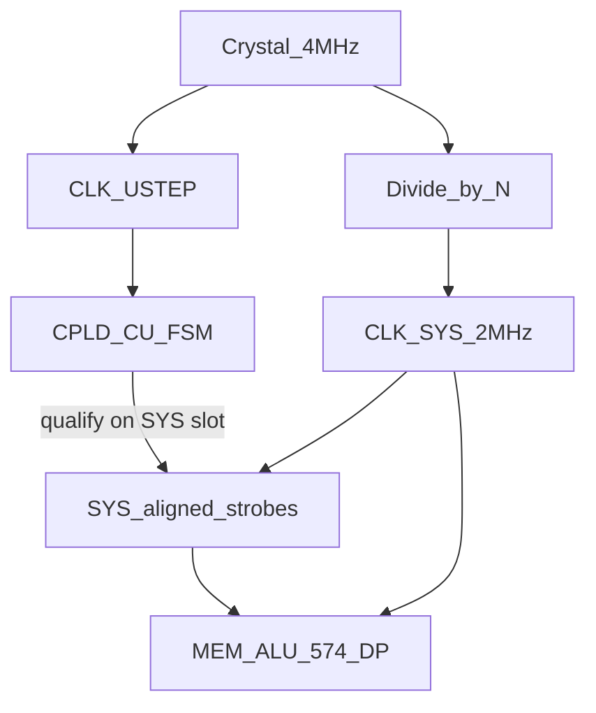

# CPLD µstep — architecture (research)

**Non-normative.** Baseline single-clock CU: [cpld-system-controller.md](../../reference/hardware/cpld-system-controller.md).

## Primary: related clocks (same OSC)

```text
  4 MHz crystal
       │
       ├──► CLK_USTEP (e.g. 4 MHz) ──► CPLD-CU sequencer / wait FSM
       │
       └── ÷2 ──► CLK_SYS (2 MHz) ──► ALU, MEM, 574s, CPLD-DP
                         ▲
                         │ SYS-aligned qualify
              CU strobes ─┘  (assert only on SYS edges)
```



Integer ratios (2×, 3×, 6×, …) keep USTEP and SYS **phase-related**. Strobe generation is **synchronous enable** on SYS slots — not an async CDC path.

**No PLL** — extend the existing 74HC divider chain ([BOM](../../reference/project/BOM.md) clock parts).

## Domains

| Domain | Clock | Owns |
|--------|-------|------|
| **USTEP** | `CLK_USTEP` (related) | CU idx5 / internal steps / wait loops |
| **SYS** | `CLK_SYS` = 2.0 MHz | Data bus, SRAM/Flash, ALU settle, 574s, **CPLD-DP** |

## wait / ready (SYS slots)

1. CU runs bookkeeping on USTEP ticks.
2. When a **datapath** op is needed, CU waits until the next **SYS-aligned** edge, then drives strobes.
3. After the SYS window completes, CU continues on USTEP.

```text
macros/s = f_SYS / sys_cycles_per_macro
IPC      = macros / SYS_cycles     ← teaching denominator
```

USTEP rate does not appear in the IPC formula.

## Teaching intent

- **Keep opcode-varying SYS costs** (MEM vs ALU vs CALL) so learners measure different e-IPC.
- Move only **control bookkeeping** to USTEP — not “make every opcode one SYS tick.”
- Single-clock dead-phase compression is **out of preferred path** (would flatten the e-IPC lesson).

## Pin / routing delta vs Gi1

Today both CPLDs share **CLK pin 43** ([cpld-dual-routing.md](../../reference/hardware/cpld-dual-routing.md)).

| Change | Desk |
|--------|------|
| `CLK_SYS` | CU + DP (bus-aligned) |
| `CLK_USTEP` | **+1 CU input** from undivided (or ÷M) OSC net |
| DP | **SYS-only** |

## Fallback: unrelated clocks

If USTEP and SYS were ever free-running relative to each other, use 2-FF CDC / pulse stretch — that path pays **sync tax** (`sync_latency_sys ≥ 1` in the model). **Not the baseline.**

## Change log

| Date | Note |
|------|------|
| 2026-07-13 | Related-clock primary; async CDC demoted |
| 2026-07-13 | Initial dual-clock CU sketch |
