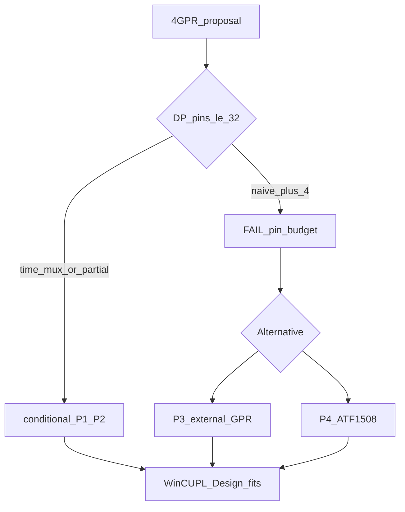

# 4-GPR register file — feasibility study

**Status:** Research (non-normative)  
**Date:** 2026-07-07  
**Device under test:** CPLD-DP **ATF1504AS-10JU44** (rev G breadboard BOM)

This folder studies a **4×8-bit GPR** with **selectable read ports**, **write select**, and **STR** (store from arbitrary register). It does **not** change v1.0 normative specs in `reference/**`.

---

## Executive summary

| Gate | Result |
|------|--------|
| **MC (desk)** | **LIKELY PASS** — ~46–56 MC estimated on DP (64 MC part rating) |
| **Pins (naive P0)** | **FAIL** — 35 user I/O needed vs 32 cap (**+3 overrun**) |
| **v1.0 BOM (2×1504)** | Full 4-GPR + dual `r_sel` on DP alone **does not fit** without scope reduction (P1/P2) or hardware change (P3/P4) |

**Conclusion:** Macrocell budget is probably sufficient; **pin budget is the binding constraint** on the current ATF1504AS-10JU44 CPLD-DP. Promoting to v1.1 requires a separate reference workstream after a WinCUPL **Design fits** gate on the chosen path.

---

## Documents

| File | Content |
|------|---------|
| **[REPORT.md](REPORT.md)** | **종합 리포트 (Korean executive summary)** |
| **[p1-bus-tdm/SUMMARY-REPORT.md](p1-bus-tdm/SUMMARY-REPORT.md)** | **P1 연구만 요약한 별도 리포트** |
| **[p1m1-dual574/SUMMARY-REPORT.md](p1m1-dual574/SUMMARY-REPORT.md)** | **P1M1 (P1 + M1 듀얼 574) 통합 연구 요약** |
| **[gi1-ac-mbr/SUMMARY-REPORT.md](gi1-ac-mbr/SUMMARY-REPORT.md)** | **Gi1 (Gigatron식 AC + MBR) 연구 요약** |
| **[p1-bus-tdm/REPORT.md](p1-bus-tdm/REPORT.md)** | P1 버스 시분할 + 클럭 분주 (상세) |
| [baseline-rev-g.md](baseline-rev-g.md) | Current 3-GPR rev G summary |
| [proposal.md](proposal.md) | 4-GPR + STR target microarchitecture |
| [arch-delta.md](arch-delta.md) | CU/DP/ISA/cyclesim/boot/Fibonacci impact |
| [pin-budget.md](pin-budget.md) | DP/CU/G-IC pin arithmetic (P0 FAIL) |
| [mc-estimate.md](mc-estimate.md) | FF + 4:1 mux desk MC |
| [str-encoding-options.md](str-encoding-options.md) | STR ISA encoding comparison |
| [feasibility-matrix.md](feasibility-matrix.md) | Paths P0–P5 |
| [variants/dp_4reg_rsel/](variants/dp_4reg_rsel/) | PLD fork + desk fit memo |

---

## Prior art (archive only — do not restore into active tree)

| Artifact | Role |
|----------|------|
| [archive/fit-study-gpr-fsm.tar.gz](../../archive/fit-study-gpr-fsm.tar.gz) | GPR/FSM variants A1–G; rev G dual pin budget |
| `fit-study/pin-budget-g-dual.md` (in tarball) | DP 31/32 PASS for 3-GPR |
| `fit-study/tfr-isa-variants.md` | TFR-tmp-2op (hidden 4th reg) — related, not identical |

Normative baseline: [reference/hardware/cpld-system-controller.md](../../reference/hardware/cpld-system-controller.md).

---

## Decision flow

---

## Open items

- [ ] WinCUPL fit on `variants/dp_4reg_rsel/system_ctrl.pld` (local toolchain)
- [ ] P1 time-mux G-IC timing proof vs LDA ph1 `d_in[7:0]`
- [ ] STR encoding pick (see [str-encoding-options.md](str-encoding-options.md))
- [ ] Reference promotion (out of scope for this folder)
