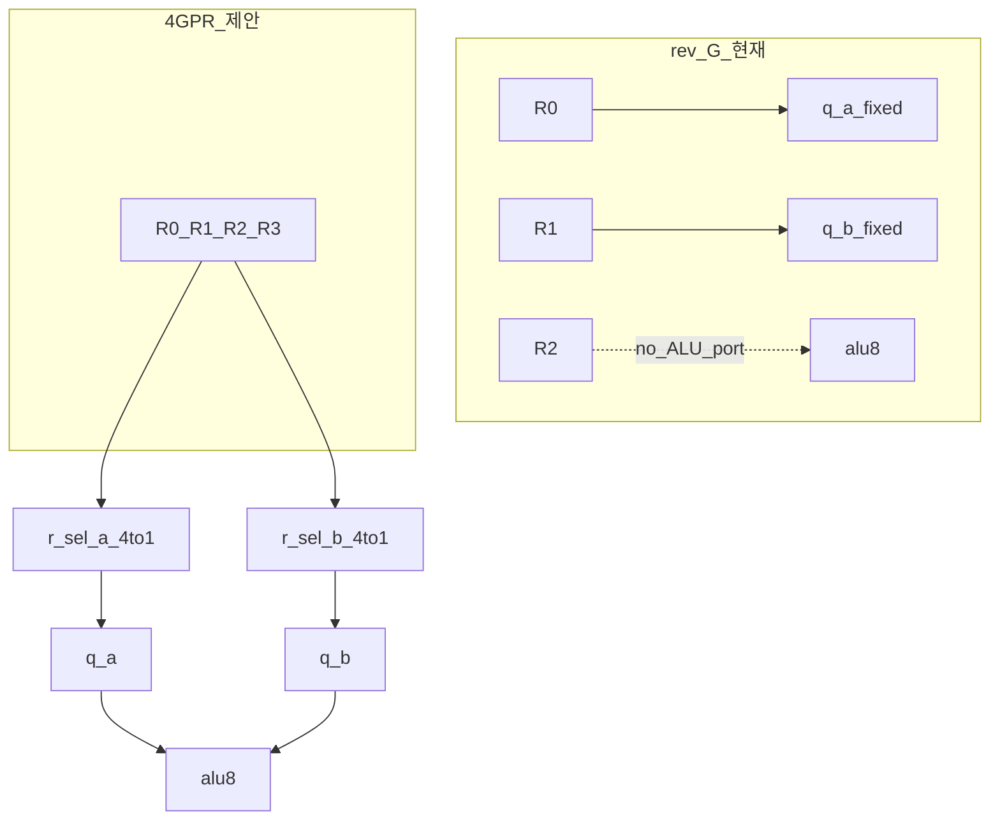
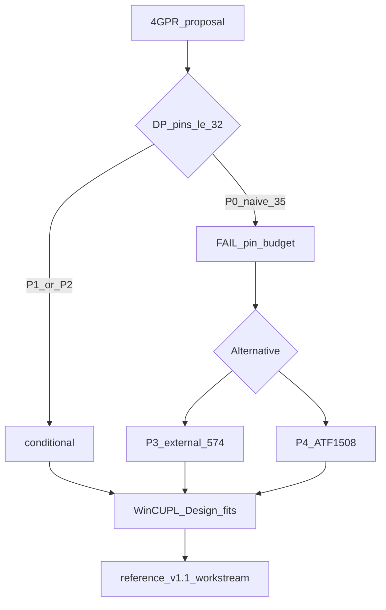

# 4-GPR 레지스터 파일 — 종합 리서치 리포트

**Status:** Research (non-normative)  
**Date:** 2026-07-07  
**대상 칩:** CPLD-DP **ATF1504AS-10JU44** (v1.0 rev G 빵판 BOM)  
**Normative 기준선:** [reference/hardware/cpld-system-controller.md](../../reference/hardware/cpld-system-controller.md) (변경 없음)

---

## 1. 요약 (Executive summary)

4개 GPR, 읽기 포트 선택(`r_sel_a/b`), 쓰기 선택(`w_sel`), TFR, **STR**(임의 레지스터→메모리) 제안을 **현재 rev G 듀얼 CPLD 빵판** 위에서 검토했다.

| 검증 항목 | 결과 |
|-----------|------|
| **매크로셀 (desk)** | **LIKELY PASS** — DP ~46–56 MC / 64 MC 정격 |
| **핀 (P0 직역)** | **FAIL** — 35 user I/O 필요 vs 32 상한 (**+3 초과**) |
| **핀 (P1 bus-TDM)** | **PASS** — [p1-bus-tdm/pin-map.md](p1-bus-tdm/pin-map.md) **28/32** |
| **타이밍 (P1 bus-TDM)** | **조건부** — ADD/INC 단일 250 ns **FAIL**; [M1/M2](p1-bus-tdm/timing-cross-domain.md) 필요 |
| **v1.0 BOM (2×1504) 유지** | P0 직역 **불가**; **P1 bus-TDM**은 핀 **가능** (+1×574) |

**한 줄 결론:** P0에서는 **핀**이 binding constraint였다. **[P1 bus-TDM](p1-bus-tdm/REPORT.md)** 은 `q_bus` 병합으로 핀을 **통과**시키며, 새 binding constraint는 **크로스 도메인 타이밍**(산술 execute)이다. 빠른 소프트 이득만이면 **P2 STR-only**; 완전 비전은 **P1+M1/M2** 또는 **P3/P4**.

최종 bring-up 게이트는 프로젝트 정책과 동일하게 WinCUPL **Design fits**이다 (desk 수치는 normative가 아님).

---

## 2. 배경 — 왜 이 리서치인가

### 2.1 v1.0 rev G의 레지스터 모델

| 항목 | rev G |
|------|-------|
| GPR | R0–R2 (3×8 FF), **CPLD-DP** 내부 |
| ALU A/B | **고정** `q_a←R0`, `q_b←R1` |
| ADD 결과 | **R2**에만 기록 |
| STA | **R0**만 메모리로 (`Y_OE` + 고정 `q_a`) |
| TFR | 6개 implied opcode + G-IC `tfr_valid`/`src` |
| CPLD-DP I/O | **31/32** (spare 1) |

설계 규칙 #1: *Fixed ALU read* ([cpld-system-controller.md](../../reference/hardware/cpld-system-controller.md)).

### 2.2 실제로 겪는 문제 (Fibonacci 사례)

ADD는 합을 **R2**에 두고, STA는 **R0**만 저장한다. 따라서 매 스텝마다:

```text
TFR02    ; R0 ← R2
STA fb   ; 메모리에 기록
```

이 한 쌍은 ALU가 메모리에 직접 쓰지 못해서가 아니라, **저장 경로가 R0(`q_a`)에 하드와이어**되어 있기 때문이다.

### 2.3 제안 (리서치 대상)

| 신호 | 역할 |
|------|------|
| R0–R3 | 4×8-bit GPR |
| `r_sel_a[1:0]`, `r_sel_b[1:0]` | ALU 읽기 포트 A/B 선택 |
| `w_sel[1:0]` | 쓰기 대상 |
| `reg_we` + TFR/xfer | 버스 vs 레지스터 간 이동 |
| **STR** | 선택한 GPR → addr8 메모리 |

---

## 3. 아키텍처 변화 개요



### 3.1 CPLD-DP (데이터패스)

| 블록 | rev G | 4-GPR (P0) |
|------|-------|------------|
| FF | 24 | **32** (+R3) |
| `q_a`/`q_b` | R0/R1 직결 | **4:1 × 8비트 mux × 2** |
| 쓰기 디코드 | `we_r0..r2` | **`we_r3` 추가** |
| TFR mux | 3:1 × 8 | **4:1 × 8** |

### 3.2 CPLD-CU (제어)

- idx5 FSM 키 `(opcode[4:0]<<2)|phase` 는 유지 가능.
- ADD/LDA/CMP/STR 각 phase에 **`r_sel_a/b` LUT 행** 추가.
- TFR 6-opcode OR는 **통합 regfile 쓰기**로 대체 가능 (CU 단순화 여지, DP 핀은 별개).

### 3.3 ISA / 소프트웨어 (v1.1 후보)

| 영역 | v1.0 | 변경 방향 |
|------|------|-----------|
| ADD | R2←R0+R1 고정 | 피연산자/결과 레지스터 가변화 가능 |
| STA | R0만 | **STR0..STR3** 등 |
| TFR | 6 opcode | 축소·일반화·제거 |
| 컴파일러 | R3 미사용 | 4 할당 가능 GPR |
| cyclesim | `dp.py` 3 regs | 4 regs + mux + G-IC 확장 |

`reference/**` 승격은 **별도 워크스트림** — 본 리포트는 research만.

---

## 4. 핀 예산 — 핵심 판정

**Device:** ATF1504AS-10JU44, **32 user I/O** / 칩.

### 4.1 rev G (기준)

| | 개수 |
|---|-----:|
| In: `d_in[8]` + G-IC[6] + `CLK` | 15 |
| Out: `q_a[8]` + `q_b[8]` | 16 |
| **합계** | **31** ✓ |

### 4.2 P0 — 제안 직역 (+`r_sel_a/b`)

| | 개수 |
|---|-----:|
| In: 위 + **`r_sel_a[2]` + `r_sel_b[2]`** | **19** |
| Out: 동일 | 16 |
| **합계** | **35** ✗ |

```text
35 − 32 = +3 핀 초과
rev G spare 1핀으로는 부족
CPLD-CU spare 6핀은 DP 입력 pad를 만들지 못함
```

**P0 판정: FAIL (핀)**

상세: [pin-budget.md](pin-budget.md) · PLD 스파이크: [variants/dp_4reg_rsel/fit-desk.md](variants/dp_4reg_rsel/fit-desk.md)

---

## 5. 매크로셀 예산

| 구성 | Δ MC (desk) |
|------|------------:|
| R3 (+8 FF) | +8 |
| `we_r3` | +1 |
| `q_a` 4:1 mux ×8 | +8~12 |
| `q_b` 4:1 mux ×8 | +8~12 |
| xfer 3:1→4:1 | +3~8 |
| **P0 DP 합계** | **~46–56** / 64 |

**MC 판정: LIKELY PASS** (WinCUPL 미실행 — desk 라벨)

상세: [mc-estimate.md](mc-estimate.md)

---

## 6. 구현 경로 비교 (P0–P5)

| ID | 전략 | DP 핀 | DP MC | ISA 범위 | BOM | 판정 |
|----|------|-------|-------|----------|-----|------|
| **P0** | `r_sel_a/b` G-IC (+4) | 35/32 | ~46–56 | 완전 4-GPR+STR | 2×1504 | **FAIL 핀** |
| **P1** | [Bus-TDM](p1-bus-tdm/REPORT.md) `q_bus` + 574 A + `r_sel` | **28/32 PASS** | ~48–58 | 완전 4-GPR | +1×574 | **핀 PASS; 타이밍 조건부** |
| **P2** | STR만; ALU 읽기 고정 | **31/32** | ~22–32 | 부분 (STR, R3?) | 2×1504 | **조건부 PASS** |
| **Gi1** | [AC+MBR](gi1-ac-mbr/SUMMARY-REPORT.md); R0만; TFR 없음 | **17/32** | ~10–18 | AC 중심 | 3×574 | **250 ns PASS (desk)** |
| **P3** | 외부 574 GPR (A1) | ≤32 | DP 감소 | 완전 | +574×N | **PASS** |
| **P4** | ATF1508 | 여유 | 여유 | 완전 | 칩 교체 | **PASS** |
| **P5** | 숨은 TMP (아카이브) | 31/32 | +8 FF | 3 visible | 2×1504 | PASS이나 목표 불일치 |

### 6.1 현 빵판 BOM 기준 권장 순위

1. **Gi1 AC+MBR** — **250 ns 타이밍 PASS**; 핀/MC 여유; ISA·TFR trade-off ([gi1-ac-mbr/](gi1-ac-mbr/))
2. **P2 + STR0..STR3** — 핀 PASS, Fibonacci에서 `TFR02` 제거, JED 변경 최소
3. **P1 bus-TDM** — 핀 proven; [타이밍 M1/M2](p1-bus-tdm/timing-cross-domain.md) 선택 후 스파이크
3. **P3** — 완전 비전; 배선·BOM 비용
4. **P0** — **기각** (핀)
5. **P4/P5** — BOM 변경 또는 레지스터 모델 불일치

상세: [feasibility-matrix.md](feasibility-matrix.md)

---

## 7. STR ISA 인코딩 (미결정)

리서치 단계에서 **normative 선택은 보류**. 후보만 비교했다.

| 옵션 | 크기 | 핀 부담 (P2) | Fibonacci |
|------|-----:|--------------|-----------|
| **A. STR0..STR3** | 2 B | **0** (`src[1:0]` 재사용) | `STR2 fb`로 TFR 제거 |
| B. 3-byte STR | 3 B | 0~2 | ROM 증가 |
| C. STA 의미 확장 | 2 B | 0~2 | 호환성 리스크 |
| D. STR 없음 (v1.0) | — | 0 | TFR 유지 |

**P2와 궁합이 좋은 비구속 권고:** **옵션 A (STR0..STR3)** — opcode에 src 내장, G-IC 추가 핀 없이 `Y_OE` phase에서 `src[1:0]` 구동.

상세: [str-encoding-options.md](str-encoding-options.md)

### Fibonacci — v1.0 vs STR2

**v1.0 (현재):**

```text
LDA fa; ADD #bb
LDA fb; STA fa
TFR02; STA fb      ; 4 insn / step
```

**STR2 가정 시:**

```text
LDA fa; ADD #bb
LDA fb; STA fa
STR2 fb            ; 3 insn / step (−1 TFR)
```

---

## 8. 선행 연구 (아카이브)

| 아카이브 | 내용 | 본 리서치와 관계 |
|----------|------|------------------|
| [fit-study-gpr-fsm.tar.gz](../../archive/fit-study-gpr-fsm.tar.gz) | A1–G variant, rev G 승격 근거 | G Plan 31/32 PASS 기준선 |
| `tfr-isa-variants.md` | TFR-tmp-2op (숨은 4th) | **P5** — visible R3 아님 |
| `pin-budget-variants.md` | 단일 1504 42핀 갭 | 왜 dual/G가 필요했는지 설명 |
| `variants/g_dual_dp/system_ctrl.pld` | 생산 DP 방정식 | P0 PLD fork 원본 |

아카이브는 **인용만** — active tree에 복원하지 않음.

---

## 9. 검증 현황

| 항목 | 상태 |
|------|------|
| Desk 핀 (P0) | ✓ FAIL 기록 |
| Desk MC (P0) | ✓ ~46–56 |
| PLD 스켈레톤 | ✓ [system_ctrl.pld](variants/dp_4reg_rsel/system_ctrl.pld) |
| WinCUPL fit | ✗ 로컬 미실행 |
| P1 bus-TDM pins | ✓ 28/32 |
| P1 timing desk | ✓ ADD/INC FAIL without M1/M2 |
| P1 PLD skeleton | ✓ [p1_dp_bus_tdm](../variants/p1_dp_bus_tdm/) |
| P1 scope / breadboard | ✗ 미착수 |
| cyclesim / 빵판 | ✗ 미착수 |
| reference 승격 | ✗ 범위 외 |

---

## 10. 권고 사항

### 단기 (현 BOM)

1. **P2 프로토타입** — rev G DP 유지, STR0..STR3 + store mux만 추가하는 방향으로 WinCUPL 스파이크.
2. **STR 인코딩** — 옵션 A 우선 검토; `0x0C` reserved 등 opcode hole 할당.
3. Fibonacci `rom_builder`는 **v1.0 유지**; STR 채택 시 cyclesim·테스트 동시 갱신.

### 중기

4. **P1 bus-TDM** — [clock-topologies.md](p1-bus-tdm/clock-topologies.md) C0 스파이크 + M2 또는 M1 확정
5. 완전 4-GPR 필요 시 **P3** (외부 574) 또는 **P4** (1508) BOM 리뷰.

### 하지 말 것

- P0를 “spare 1핀으로 가능”이라 기술하지 않기.
- desk MC를 normative bring-up gate로 기록하지 않기.
- research 문서를 `reference/**`에 병합하지 않기 (명시 승격 전).

---

## 11. 의사결정 흐름



---

## 12. 문서 인덱스

| 문서 | 역할 |
|------|------|
| **본 리포트** | 종합 요약 |
| **[p1-bus-tdm/REPORT.md](p1-bus-tdm/REPORT.md)** | P1 버스 시분할 + 클럭 분주 |
| [baseline-rev-g.md](baseline-rev-g.md) | v1.0 기준선 |
| [proposal.md](proposal.md) | 제안 microarchitecture |
| [arch-delta.md](arch-delta.md) | 상세 아키텍처 diff |
| [pin-budget.md](pin-budget.md) | 핀 수식 |
| [mc-estimate.md](mc-estimate.md) | MC 수식 |
| [str-encoding-options.md](str-encoding-options.md) | STR 인코딩 |
| [feasibility-matrix.md](feasibility-matrix.md) | P0–P5 매트릭스 |
| [variants/dp_4reg_rsel/](variants/dp_4reg_rsel/) | PLD fork |

---

## 변경 이력

| 날짜 | 내용 |
|------|------|
| 2026-07-07 | 초판 — 분산 리서치 문서 종합 |
