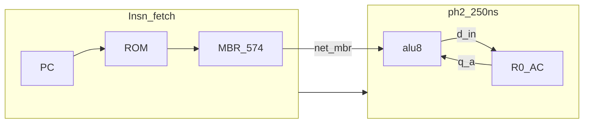

# Gi1 연구 요약 리포트

**제목:** Gigatron식 AC + MBR 피연산자 경로 (Gi1)  
**Status:** Research (non-normative)  
**Date:** 2026-07-07  
**범위:** 2 MHz / **250 ns ph2** 유지; TFR 제거; 4-GPR 연구(P1/P1M1)와 **병렬 대안**.

---

## 1. 연구 목적

[P1 bus-TDM](../p1-bus-tdm/SUMMARY-REPORT.md)은 `r_sel` + `q_bus` TDM으로 핀은 PASS였으나 **ADD가 250 ns에서 FAIL**이었고, [P1M1](../p1m1-dual574/SUMMARY-REPORT.md)은 **574×2 + 500 ns ph2**가 필요했습니다.

**Gi1**은 Gigatron·Isetta에서 쓰는 **AC 중심 + 메모리 변수** 모델을 빌려:

- CPLD GPR를 **R0(AC)만** 남기고
- ALU B는 **기존 MBR 574** (`net_mbr → net_b`)
- **ADD/CMP → R0** writeback, **TFR opcode 폐기**

로 **단일 250 ns execute**를 desk에서 닫는 경로를 정의합니다.

---

## 2. 한 줄 결론

| | |
|---|---|
| **핀 (CPLD-DP)** | **PASS** — desk **17/32** (spare 15) |
| **타이밍 (ph2)** | **PASS** — ADD Y≈**133 ns** @ 250 ns (**+117 ns** slack) |
| **BOM** | **574 ×3** — rev G와 **동일** |
| **ISA** | ADD→**R0**; **TFR 없음**; 4-GPR 비전 **포기** |
| **판정** | **2 MHz 타이밍 확실** — ISA·소프트웨어 비용 감수 |

---

## 3. 아키텍처 도식

**rev G 대비:** `q_b←R1` **제거**; `net_b←net_mbr` **배선 추가**.

---

## 4. ISA 변경 요약

| 명령 | rev G | Gi1 |
|------|-------|-----|
| ADD #imm | R2 ← R0 + imm | **R0 ← R0 + imm** |
| CMP #imm | ph1 imm→R1 | imm는 **MBR**; ph1 **R1 쓰기 없음** |
| TFR `0x11–0x19` | 6개 | **invalid** |
| LDA/STA | R0 | 동일 |

변수 추가는 **RAM** (Gigatron/Isetta 패턴). [isa-delta.md](isa-delta.md)

---

## 5. 타이밍 (ph2 @ 250 ns, max)

| 연산 | Y @ (ns) | Slack |
|------|----------|-------|
| ADD | 133 | **+117** |
| SUB/CMP | 161 | **+89** |
| INC | 178 | **+72** |

상세: [timing-closed.md](timing-closed.md)

---

## 6. rev G / P1 / P1M1 / Gi1 비교

| 변형 | ph2 ADD | DP 핀 | BOM 574 | TFR | 4-GPR |
|------|---------|-------|---------|-----|-------|
| **rev G** | PASS ~168ns | 31/32 | 3 | 예 | 아니오 |
| **P1** | FAIL | 28/32 | 4 | 예 | 목표 |
| **P1M1** | PASS @500ns | 29/32 | 5 | 예 | 목표 |
| **Gi1** | **PASS ~133ns** | **17/32** | **3** | **아니오** | **아니오** |

---

## 7. 리스크·열린 항목

| 항목 | 내용 |
|------|------|
| **MBR hold** | ALU_REG 중 MBR 재로드 금지 — FSM 검증 |
| **소프트웨어** | M3b ROM/테스트 **비호환** |
| **normative** | `reference/**` **미변경** |
| **WinCUPL** | DP/CU Gi1 JED 스파이크 미실행 |
| **Gigatron 동일** | **1 inst/clk 아님** — 2 MHz multi-phase 유지 |

---

## 8. 권고 next steps

1. **MBR→`net_b`** 빵판 배선 + Gi1 DP PLD 스파이크  
2. CU idx5 Gi1 LUT (ph1 R1 제거, ph2 w_sel=R0)  
3. 스코프 V1–V4 ([timing-closed.md](timing-closed.md) §5)  
4. Gi1 전용 ROM + cyclesim fork (별도 작업)

---

## 9. 산출물 인덱스

| 문서·코드 | 역할 |
|-----------|------|
| [architecture.md](architecture.md) | 블록·Gigatron 매핑 |
| [timing-closed.md](timing-closed.md) | ph2 slack |
| [isa-delta.md](isa-delta.md) | opcode·프로그램 모델 |
| [fsm-microcode-delta.md](fsm-microcode-delta.md) | idx5·MBR hold |
| [pin-map.md](pin-map.md) | PLCC-44 |
| [bom-delta.md](bom-delta.md) | FF/MC |
| [gigatron-benchmark.md](gigatron-benchmark.md) | 외부 비교 |
| [../variants/gi1_dp/system_ctrl.pld](../variants/gi1_dp/system_ctrl.pld) | DP PLD |

---

## 변경 이력

| 날짜 | 내용 |
|------|------|
| 2026-07-07 | Gi1 연구 초판 |
