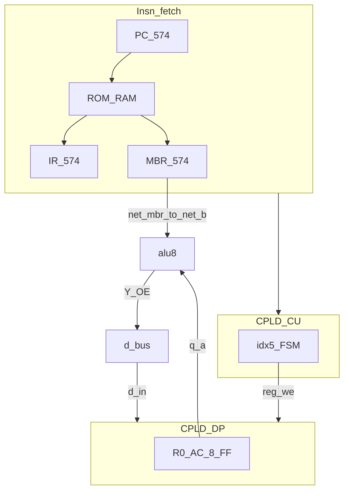

# Gi1 architecture

**Parent:** [README.md](README.md)  
**Baseline:** [../baseline-rev-g.md](../baseline-rev-g.md)  
**Bring-up:** [reference/hw-bringup/M3b-fetch-execute.md](../../../reference/hw-bringup/M3b-fetch-execute.md)

---

## 1. Definition

**Gi1** = rev G clocking (**2 MHz** SoC, **250 ns** execute half) + **Gigatron-style** datapath:

| Layer | Mechanism |
|-------|-----------|
| **AC** | **R0** only inside CPLD-DP; `q_a[7:0]` → ALU A |
| **Operand B** | **`net_mbr[7:0]`** from existing **MBR 574** → ALU B (not CPLD `q_b`) |
| **Writeback** | ALU_REG ph2: **`REG_WE` → R0** (not R2) |
| **TFR** | **Removed** — no register-to-register moves |
| **Extra vars** | **Memory** (Gigatron / Isetta pattern) |

No bus-TDM, no extra operand 574, no 4 MHz DP requirement.

---

## 2. Block diagram



**Removed vs rev G:** `q_b[7:0]` from CPLD; R1/R2 FF; `tfr_valid` / `src` / `w_sel` G-IC (desk: **`reg_we` only**).

---

## 3. Gigatron mapping

| Gigatron | Gi1 / Plover |
|----------|----------------|
| **AC** | **R0** (`q_a` → ALU A) |
| **D** (operand / address helper) | **MBR 574** (imm8 from fetch) |
| **PC** | PC 574 + 161 |
| **IR** | IR 574 |
| **X / Y** (video addr) | *none* — abs16 via MBR for branches |
| **1 inst / clk @ 6.25 MHz** | *not targeted* — **2 MHz multi-phase** retained |

Gi1 matches **programming style** (AC-centric, memory for extra state), not Gigatron **cycle timing**.

---

## 4. Operand path (ALU_REG)

### rev G (ph2)

```text
  ph1: imm → R1 (GPR write)
  ph2: q_a←R0, q_b←R1 → ALU → R2
```

### Gi1 (ph2)

```text
  fetch: PC+1 → MBR (imm already latched)
  ph2:   q_a←R0, net_b←net_mbr (held) → ALU → R0
```

**MBR hold rule:** During ALU_REG macro, nothing may **reload MBR** until ph2 completes. See [fsm-microcode-delta.md](fsm-microcode-delta.md).

### Breadboard wiring delta

| Net | rev G | Gi1 |
|-----|-------|-----|
| `q_b0..7` | CPLD-DP outputs | **disconnected** |
| `net_b0..7` | from `q_b` | from **`net_mbr0..7`** (direct or optional 244) |

---

## 5. Clock

Same as rev G: **2 MHz** `net_clk2` on CU, PC/MBR/FLG 574 CP, R0 FF inside DP.

**No** P1 C0 4 MHz tap required.

---

## 6. Delta summary

| | rev G | Gi1 |
|---|-------|-----|
| CPLD GPR | R0–R2 (24 FF) | **R0 (8 FF)** |
| ALU B source | R1 via `q_b` | **MBR 574** |
| ADD result | R2 | **R0** |
| TFR | 6 opcodes | **none** |
| DP I/O | 31/32 | **~18/32** (desk) |
| ph2 ADD @ max | ~168 ns path, PASS | **~133 ns**, PASS |

---

## Related

- [timing-closed.md](timing-closed.md)
- [isa-delta.md](isa-delta.md)
- [pin-map.md](pin-map.md)
