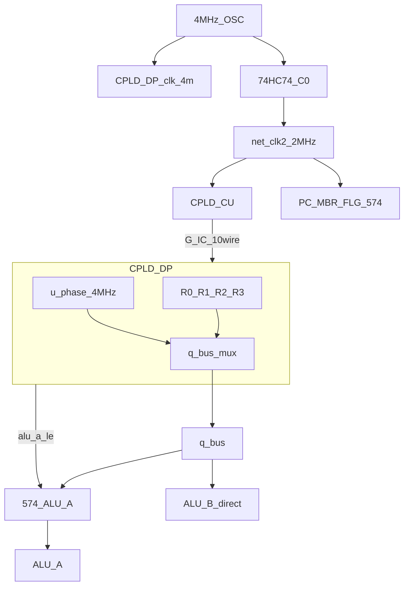

# P1 버스 시분할 + 클럭 분주 — 종합 리서치 리포트

**Status:** Research (non-normative)  
**Date:** 2026-07-07  
**지시서:** 단일 버스 시분할 다중화 및 근원 클럭 분주 아키텍처 (P1)  
**Parent:** [../README.md](../README.md)  
**요약만:** [SUMMARY-REPORT.md](SUMMARY-REPORT.md) (P1 전용 별도 리포트)

---

## 1. 요약

ATF1504 **32핀 한계**로 실패했던 **P0**(16비트 병렬 `q_a`/`q_b` + `r_sel`)를 **단일 `q_bus[7:0]` 시분할**로 우회하는 방안을 검증했다.

| 검증 항목 | 결과 |
|-----------|------|
| **핀 (CPLD-DP)** | **PASS** — **28/32** (spare 4) |
| **매크로셀 (desk)** | **LIKELY PASS** — ~48–58 / 64 |
| **타이밍 (desk)** | **조건부** — T1 래치 **PASS**; ADD/INC **단일 250 ns 내 FAIL** |
| **BOM** | **+1× 574** (ALU A); 클럭 통합 시 **−74HC74** 가능 (C1) |

**한 줄 결론:** P1은 **핀 binding constraint를 해소**한다. **새 binding constraint는 크로스 도메인 타이밍**이며, 산술 execute는 **M1(듀얼 574)** 또는 **M2(FSM 2반주기 확장)** 없이는 2 MHz 예산을 닫기 어렵다.

---

## 2. 연구 목적 대응

| 지시서 요구 | 산출물 | 판정 |
|-------------|--------|------|
| 4 MHz 근원 주입 + 내부 분주 | [clock-topologies.md](clock-topologies.md) C0–C4 | **타당** (C0 권장 스파이크) |
| `q_a`/`q_b` → `q_bus` 병합 | [pin-map.md](pin-map.md) | **핀 PASS** |
| 574 ALU A 래치 + `alu_a_le` | [pin-map.md](pin-map.md) §5, PLD | **정의 완료** |
| T1/T2 125 ns 마이크로페이즈 | [timing-cross-domain.md](timing-cross-domain.md) | **정의 완료**; 산술 **마진 부족** |
| I/O 핀 맵 | [pin-map.md](pin-map.md) | §2–3 |
| WinCUPL 스켈레톤 | [variants/p1_dp_bus_tdm/system_ctrl.pld](../variants/p1_dp_bus_tdm/system_ctrl.pld) | DP + [p1_cu_clkgen](../variants/p1_cu_clkgen/) |
| 크로스 도메인 타이밍 | [timing-cross-domain.md](timing-cross-domain.md) | §3–6 |

---

## 3. 아키텍처

### 3.1 토폴로지

### 3.2 시분할 시퀀스 (250 ns = 1× 2 MHz 반주기)

| 구간 | 시간 | 동작 |
|------|------|------|
| **T1** | 0–125 ns | `r_sel_a` → `q_bus`; `u_phase=0`; **125 ns** `alu_a_le` ↑ → 574에 A 캡처 |
| **T2** | 125–250 ns | `r_sel_b` → `q_bus` → ALU B 직결; ALU 조합 |
| **T3** | 250 ns | `clk_2m` ↑ — CU FSM phase, GPR `reg_we` |

내부 **S-A** 정책: DP가 `u_phase`를 4 MHz에서 토글; CU는 `r_sel_a/b`를 **250 ns 동안 stable** 유지.

---

## 4. 핀 예산

### CPLD-DP (C0)

| | 개수 |
|---|-----:|
| In (`d_in`, G-IC×10, `clk_4m`) | 19 |
| Out (`q_bus`, `alu_a_le`) | 9 |
| **Σ** | **28/32** |

P0 대비: 16 out → 8 out (**−8**); `r_sel` +4 in → **순 −4 I/O**.

### CPLD-CU

- rev G 26 + G-IC `r_sel` **+4** = **30/32** (desk).
- C1 클럭 export 2핀 추가 시 **32/32** 한계 — export 1개만 또는 **C2(DP export)** 검토.

상세: [pin-map.md](pin-map.md).

---

## 5. 클럭 다안 요약

| ID | 요약 | 권장 단계 |
|----|------|-----------|
| **C0** | OSC → DP 4M; 74HC74 → SoC 2M | **1차 스파이크** |
| **C1** | CU ÷2÷2 → 2M/1M export | BOM 정리 (타이밍 PASS 후) |
| **C2** | DP ÷2 export | CU가 DP 슬레이브 |
| **C3** | 2M 유지 + edge doubler 4M | 실측 전제; **PLL 아님** |
| **C4** | 393 외부 트리 | CPLD MC 최소 |

상세: [clock-topologies.md](clock-topologies.md).

---

## 6. 타이밍 결론

### T1 (A 래치)

- `q_bus` 안정 ~40 ns (max) → LE @ 125 ns → **setup 여유 ~77 ns** — **PASS**.

### T2 (B + ALU)

| 연산 | Y 안정 @ max | vs 250 ns |
|------|-------------|-----------|
| AND 등 논리 | ~211 ns | **PASS** |
| ADD | ~273 ns | **FAIL (−23 ns)** |
| INC | ~318 ns | **FAIL** |

### 완화안

| ID | 내용 |
|----|------|
| **M1** | B도 574 래치; 연산은 **다음** 250 ns |
| **M2** | idx5 execute **2반주기** 확장 |
| **M3** | 8 MHz OSC |
| **M4** | TDM은 프리페치만 (부분 P1) |

상세: [timing-cross-domain.md](timing-cross-domain.md).

---

## 7. WinCUPL 스켈레톤

| 파일 | 내용 |
|------|------|
| [p1_dp_bus_tdm/system_ctrl.pld](../variants/p1_dp_bus_tdm/system_ctrl.pld) | 4-GPR, `u_phase`, `q_bus` mux, `alu_a_le`, `clk_sys`÷2 |
| [p1_cu_clkgen/system_ctrl.pld](../variants/p1_cu_clkgen/system_ctrl.pld) | C1 ÷2÷2 (오버레이만) |

로컬 **Design fits** 미실행 — desk 라벨.

---

## 8. 권고

| 우선순위 | 조치 |
|----------|------|
| 1 | **C0** 배선 + DP PLD 스파이크 |
| 2 | 타이밍 **M2** (FSM) 또는 **M1** (듀얼 574) 선택 |
| 3 | WinCUPL fit + scope V1–V5 ([timing-cross-domain.md](timing-cross-domain.md) §9) |
| 4 | 빠른 소프트 이득만 필요 시 **P2 STR-only** ([../feasibility-matrix.md](../feasibility-matrix.md)) 병행 검토 |

`reference/**` 승격은 타이밍 게이트 + ISA 워크스트림 이후.

---

## 9. 문서 인덱스

| 문서 | 역할 |
|------|------|
| [README.md](README.md) | 폴더 개요 |
| [clock-topologies.md](clock-topologies.md) | C0–C4 |
| [pin-map.md](pin-map.md) | PLCC-44 선언 |
| [timing-cross-domain.md](timing-cross-domain.md) | T1/T2, M1–M4 |
| **본 리포트** | 종합 |

---

## 변경 이력

| 날짜 | 내용 |
|------|------|
| 2026-07-07 | 초판 — P1 지시서 대응 |
