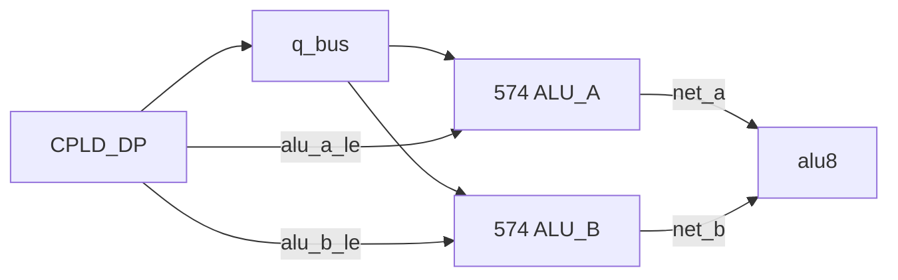

# P1 연구 요약 리포트

**제목:** 단일 버스 시분할 다중화 및 근원 클럭 분주 (P1 bus-TDM)  
**Status:** Research (non-normative)  
**Date:** 2026-07-07  
**범위:** 본 문서는 **P1 연구만** 다룹니다. 상위 [4-GPR 종합 리포트](../REPORT.md)와 별개입니다.

---

## 1. 무엇을 검증했는가

v1.0 rev G **ATF1504AS-10JU44** CPLD-DP는 3-GPR·고정 읽기(`q_a←R0`, `q_b←R1`)로 **31/32핀**을 씁니다.  
4-GPR + 가변 읽기(`r_sel_a/b`)를 **그대로** 넣는 **P0**안은 출력 16 + 입력 증가로 **35/32 → FAIL (+3핀)** 이었습니다.

**P1**은 다음으로 핀 한계를 우회합니다.

| 기법 | 효과 |
|------|------|
| `q_a[8]` + `q_b[8]` → **`q_bus[8]`** 단일 버스 | 출력 **−8핀** |
| 4 MHz 마이크로페이즈로 **T1/T2** 이중 인출 | 한 250 ns 안에 A·B 순차 방출 |
| **74HC574** 1개로 ALU A 래치 | T1 피연산자 보존 |
| `r_sel_a/b` G-IC 4선 | 4-GPR 읽기 선택 |

---

## 2. 한 줄 결론

| | |
|---|---|
| **핀** | **PASS** — CPLD-DP **28/32** (spare 4) |
| **매크로셀** | desk **LIKELY PASS** (~48–58 / 64) |
| **타이밍** | **조건부** — 논리 연산 OK; **ADD/INC는 단일 250 ns 내 FAIL** |
| **판정** | P1은 **핀 문제를 해결**했고, **새 병목은 산술 execute 타이밍**이다 |

---

## 3. 아키텍처 스케치

```text
  4 MHz OSC ──┬──► CPLD-DP (clk_4m, u_phase, q_bus)
              └──► 74HC74 ──► net_clk2 (2 MHz) ──► CPLD-CU, PC/MBR/FLG 574

  CU ── G-IC (r_sel_a/b, w_sel, …) ──► DP ── q_bus[7:0] ──┬──► 574 ──► ALU A
                                                           └──► ALU B (T2 직결)
                                    alu_a_le ──► 574 LE
```

### 250 ns 시퀀스 (2 MHz execute 반주기 = 4 MHz 1주기)

| 구간 | 시간 | 동작 |
|------|------|------|
| **T1** | 0–125 ns | `r_sel_a` → `q_bus` → **574에 A 래치** (`alu_a_le` ↑) |
| **T2** | 125–250 ns | `r_sel_b` → `q_bus` → **ALU B**; 조합 연산 |
| **T3** | 250 ns | `clk_2m` ↑ — FSM phase, GPR 쓰기 |

DP 내부 **S-A:** `u_phase`는 DP가 4 MHz에서 토글; CU는 `r_sel_a/b`를 **250 ns 동안 유지**.

---

## 4. 검증 결과 표

### 4.1 핀 (CPLD-DP, 클럭 C0)

| 방향 | 신호 | 개수 |
|------|------|-----:|
| In | `d_in[8]`, G-IC[10], `clk_4m` | 19 |
| Out | `q_bus[8]`, `alu_a_le` | 9 |
| **합계** | | **28/32** |

상세: [pin-map.md](pin-map.md)

### 4.2 클럭 토폴로지 (다안)

| ID | 요약 | 1차 권고 |
|----|------|----------|
| **C0** | OSC 4M→DP; 74HC74→SoC 2M | **스파이크 우선** |
| **C1** | CU 내부 ÷2÷2 → 2M/1M export | BOM에서 74HC74 제거 가능 |
| **C2** | DP ÷2 export | CU가 DP 2M 슬레이브 |
| **C3** | 2M 유지 + edge doubler 4M | 실측 전제 (PLL 아님) |
| **C4** | 74HC393 외부 분주 트리 | CPLD 부담 최소 |

상세: [clock-topologies.md](clock-topologies.md)

### 4.3 타이밍 (desk, max)

| 연산 | Y 안정 시각 | 250 ns 대비 |
|------|------------|-------------|
| AND 등 논리 | ~211 ns | **PASS** |
| ADD | ~273 ns | **FAIL (−23 ns)** |
| INC | ~318 ns | **FAIL** |
| 574 A 래치 setup | 여유 ~77 ns | **PASS** |

상세: [timing-cross-domain.md](timing-cross-domain.md)

---

## 5. BOM 영향

| 항목 | rev G | P1 |
|------|-------|-----|
| ATF1504 | 2 | 2 |
| 74HC574 | 3 (PC/MBR/FLG) | P1: **4** (+ALU A) / **M1: 5** (+ALU B) |
| 74HC74 | 1 (÷2) | C0: 유지 / C1: **제거 가능** |
| 4 MHz OSC | 1 | 1 |

---

## 6. 완화안 (타이밍)

| ID | 내용 | 트레이드오프 |
|----|------|--------------|
| **M1** | B도 574 래치; 연산은 **다음** 250 ns | +1 DIP, +`alu_b_le` 핀, ISA 지연 |

**P1M1 통합 변형:** M1을 P1과 합친 bring-up 타깃 — [p1m1-dual574/SUMMARY-REPORT.md](../p1m1-dual574/SUMMARY-REPORT.md) (핀 29/32 PASS, desk 타이밍 PASS, 574×5).

### M1 듀얼 574 — 도식



**시간축:** 반주기 N — T1에서 A 래치, T2에서 B 래치 → 반주기 N+1 — 래치된 A·B로 ALU 연산 → `REG_WE` @ 500 ns.

상세 블록도·웨이브폼·P1 대비표: [timing-cross-domain.md §6.1](timing-cross-domain.md#m1--듀얼-574-래치-도식)

| ID | 내용 | 트레이드오프 |
|----|------|--------------|
| **M2** | FSM execute **2반주기** 확장 | idx5 슬롯·phase 수 증가 |
| **M3** | 8 MHz OSC (62.5 ns × 4) | 오실레이터 교체 |
| **M4** | TDM은 프리페치만; ALU는 기존 고정 읽기 | 부분 P1 |

**권고:** 핀 검증 후 **M2**(FSM) 또는 **M1**(듀얼 574) 중 선택 → WinCUPL fit → 스코프. **M1을 P1과 통합한 P1M1**은 별도 연구로 desk 타이밍까지 닫힘 — [p1m1-dual574/SUMMARY-REPORT.md](../p1m1-dual574/SUMMARY-REPORT.md).

---

## 7. 산출물 (P1 전용)

| 문서·코드 | 역할 |
|-----------|------|
| [REPORT.md](REPORT.md) | 상세 종합 (본 요약의 확장판) |
| [pin-map.md](pin-map.md) | PLCC-44 핀 선언 |
| [clock-topologies.md](clock-topologies.md) | C0–C4 |
| [timing-cross-domain.md](timing-cross-domain.md) | T1/T2·M1–M4 |
| [../variants/p1_dp_bus_tdm/system_ctrl.pld](../variants/p1_dp_bus_tdm/system_ctrl.pld) | DP WinCUPL 스켈레톤 |
| [../variants/p1_cu_clkgen/system_ctrl.pld](../variants/p1_cu_clkgen/system_ctrl.pld) | CU 클럭gen (C1) |

---

## 8. 하지 않은 것

- `reference/**` normative 변경 없음
- WinCUPL **Design fits** 미실행 (로컬)
- 빵판 실장·JED burn 없음
- cyclesim 모델 없음

---

## 9. 다음 단계

1. **C0** 배선으로 DP PLD 스파이크  
2. **M1** vs **M2** 결정 — 또는 통합안 **[P1M1](../p1m1-dual574/SUMMARY-REPORT.md)** 검토  
3. 스코프 게이트 V1–V5 ([timing-cross-domain.md](timing-cross-domain.md) §9)  
4. 통과 시 상위 [4-GPR](../REPORT.md) / ISA 워크스트림과 합류  

---

## 10. P0 / P2 / P1 비교 (참고)

| 경로 | 핀 | 가변 ALU 읽기 | 타이밍 | 비고 |
|------|-----|---------------|--------|------|
| **P0** | FAIL | 예 | — | 기각 |
| **P1 bus-TDM** | **PASS** | 예 | 조건부 | **본 연구** |
| **P2 STR-only** | PASS | 아니오 | 양호 | Fibonacci TFR 제거용 최소안 |

---

## 변경 이력

| 날짜 | 내용 |
|------|------|
| 2026-07-07 | P1 전용 요약 리포트 초판 |
