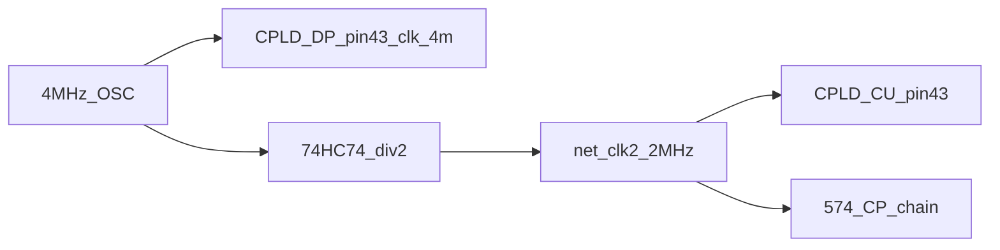

# Clock topologies — P1 bus-TDM

**Parent:** [README.md](README.md)  
**Baseline:** [reference/hw-bringup/M1-b3-procedure.md](../../../reference/hw-bringup/M1-b3-procedure.md) — 4 MHz OSC → **74HC74** ÷2 → `net_clk2` @ 2 MHz

**Constraint:** ATF1504AS-10JU44 has **no hard PLL**. Any “PLL” or 2→4 MHz path is a **discrete or CPLD-synthesized multiplier** (edge doubler, XOR delay line), not a locked loop.

---

## Frequency plan

| Clock | Period | Role in P1 |
|-------|--------|------------|
| **clk_4m** | 250 ns | CPLD-DP root; **T1/T2** micro-phases (125 ns each) |
| **clk_2m** | 500 ns (250 ns half) | idx5 FSM, 574 CP, GPR `reg_we` @ ↑ |
| **clk_1m** | 1 µs | Optional slow-step / debug (not normative v1.0) |

Relationship: **one 2 MHz execute half-cycle = one 4 MHz period = T1 + T2**.

---

## Option matrix

| ID | Name | 4 MHz source | 2 MHz SoC (`net_clk2`) | 1 MHz | BOM Δ vs rev G | CPLD pins | Notes |
|----|------|--------------|------------------------|-------|----------------|-----------|-------|
| **C0** | **OSC tap + 74HC74** | OSC **before** ÷2 → DP pin 43 | 74HC74 Q → 574 CP, CU pin 43 | — | **0** | DP +1 in only | **Lowest risk**; dual CPLD: CU @ 2M, DP @ 4M |
| **C1** | **CU ÷2÷2 chain** | OSC → CU pin 43 | CU export `clk_2m_out` | CU export `clk_1m_out` | **−74HC74** (#21) | CU +2 out | Integrate divider; spare CU pins |
| **C2** | **DP ÷2 export** | OSC → DP pin 43 | DP export `clk_2m_out` → SoC | — | **−74HC74** | DP +1 out | Divider co-located with u_phase |
| **C3** | **2M hold + 4M synthesize** | Edge doubler on `net_clk2` | 74HC74 retained | 393 ÷2 on clk2 | +08/XOR, +393 | glue only | “PLL” label = **doubler**, needs scope validation |
| **C4** | **External divider tree** | OSC → 74HC393 cascade | ÷2 tap | ÷4 tap | +393 (or 161) | minimal CPLD | Cleanest multi-frequency off-chip |

---

## C0 — OSC tap + 74HC74 (recommended first spike)



| Device | Clock pin | Frequency |
|--------|-----------|-----------|
| CPLD-DP | 43 | **4 MHz** |
| CPLD-CU | 43 | **2 MHz** |
| PC / MBR / FLG 574 | CP | **2 MHz** |
| GPR FF inside DP | `clk_sys` (= ÷2 from 4M inside DP) | **2 MHz** |

**Wiring:** Fan OSC output to 74HC74 **and** DP (short stub). CU remains on divided clock — **no FSM rewrite** for 4 MHz.

**JTAG:** TCK/TMS paralleled; both devices programmed with correct clock constraint in fitter.

---

## C1 — CU internal T-FF chain (4→2→1)

```text
OSC 4MHz → CU CLK
  q0 := ÷2 → clk_2m_out (pin export)
  q1 := ÷2 of q0 → clk_1m_out (pin export)
```

| Pros | Cons |
|------|------|
| Remove 74HC74 from BOM | CU MC +2–4; CU must receive **4 MHz** on pin 43 |
| Single clock root | DP still needs **4 MHz** — second wire from OSC or `clk_4m` re-buffer from CU |
| 1 MHz available for bring-up | FSM runs on exported 2 MHz — verify export skew vs DP `clk_sys` |

**DP clocking under C1:** OSC **direct to DP** @ 4 MHz **and** CU generates `net_clk2` for SoC (same as C0 DP clock, C1 SoC clock).

**Pin budget (CU):** 26 + `clk_2m_out` + optional `clk_1m_out` = **27–28/32** — PASS.

---

## C2 — DP internal ÷2 export

DP synthesizes:

```text
clk_4m (pin 43) → TFF → clk_sys (internal 2M, GPR FF)
                  └→ clk_2m_out (pin export) → CU + 574
```

| Pros | Cons |
|------|------|
| `u_phase` and divider in same chip | CU must use **exported** 2 MHz, not OSC÷2 |
| One wire less if CU slaves to DP export | DP +1 output pin; **29/32** desk with full P1 map |

---

## C3 — 2 MHz retained + synthesized 4 MHz

For boards already validated @ 2 MHz only:

1. Keep **74HC74** → `net_clk2`.
2. Build **clk_4m_synth** = XOR(`net_clk2`, delayed `net_clk2`) or 74HC74 configured as edge capture (desk — **not** guaranteed 50% duty).

| Pros | Cons |
|------|------|
| No change to FSM clock during bring-up | Doubler jitter/skew; **scope mandatory** |
| DP micro-sequencer runs on synth 4M | Failure mode if delay drifts |

**1 MHz:** `net_clk2` → 74HC393 ÷2 → optional slow scan.

**Not a PLL:** document as **C3-synth** only.

---

## C4 — External 74HC393 tree

```text
OSC → 393 Q0 (4M buf)
    → 393 ÷2 → clk_2m
    → 393 ÷4 → clk_1m
```

| Pros | Cons |
|------|------|
| Zero CPLD MC for clocks | +1 DIP; routing tree |
| All frequencies phase-aligned at reset | 393 async — align FFs at reset |

---

## Dual-CPLD synchronisation

| Concern | Mitigation |
|---------|------------|
| CU @ 2M, DP @ 4M | `r_sel_a/b` stable full 250 ns; sampled by DP `u_phase` on 4M |
| G-IC skew | Keep **≤8 cm** (fit-study G Plan) |
| GPR write @ 2M ↑ | GPR FF use **`clk_sys` 2M**, not 4M |
| JTAG | CU TDI first; both devices in chain ([cpld-dual-jtag.md](../../../reference/hardware/cpld-dual-jtag.md)) |

---

## Recommendation (research, non-binding)

| Phase | Topology |
|-------|----------|
| **Spike / sim** | **C0** — minimal change from [M1-b3-procedure.md](../../../reference/hw-bringup/M1-b3-procedure.md) |
| **BOM trim** | **C1** after timing PASS with **M1** or **M2** |
| **Avoid until measured** | **C3** edge doubler as sole 4 MHz source |

---

## Related

- [pin-map.md](pin-map.md) — per-topology pin 43 assignment
- [timing-cross-domain.md](timing-cross-domain.md) — cross-domain margins
