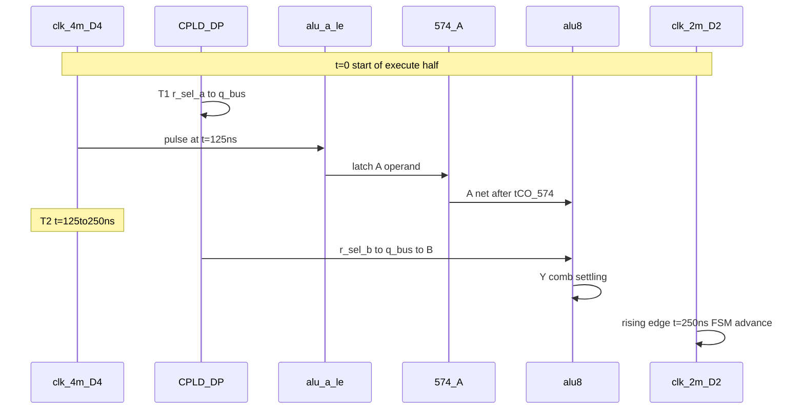
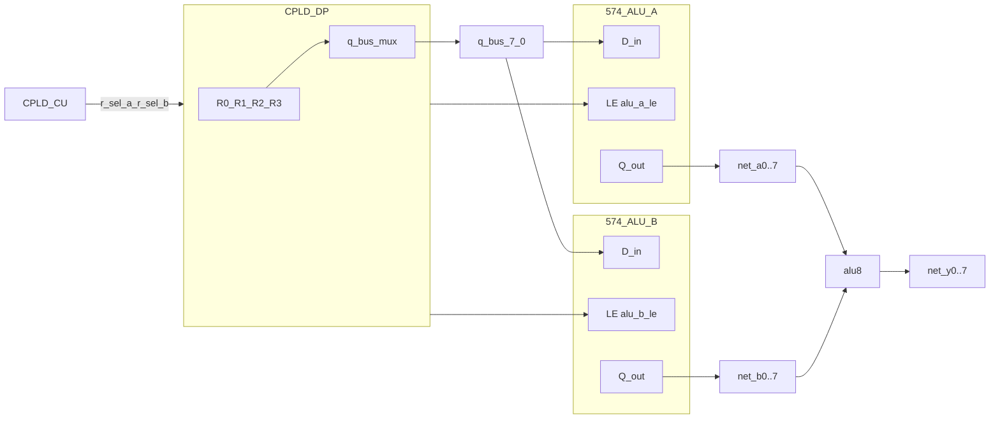
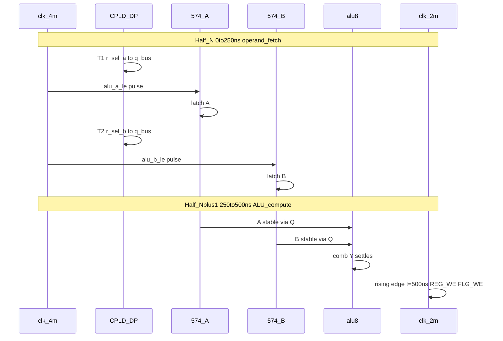
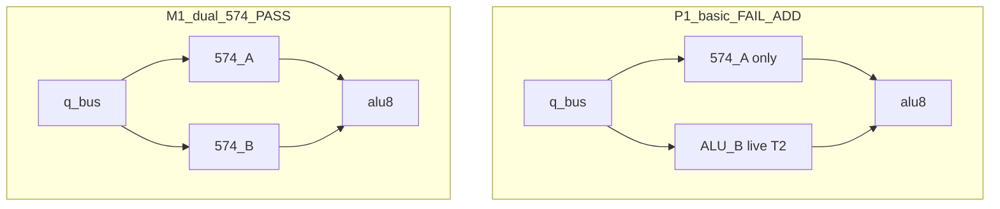

# Cross-domain timing — P1 bus-TDM

**Parent:** [README.md](README.md)  
**Budget reference:** [reference/hardware/alu-opcodes-timing.md](../../../reference/hardware/alu-opcodes-timing.md) — **250 ns** = 2 MHz execute **half-cycle**

**Label:** Desk analysis with breadboard wire inductance allowance; not oscilloscope verified.

---

## 1. Clock domains

| Domain | Frequency | Period | Consumers |
|--------|-----------|--------|-----------|
| **D4** | 4 MHz | 250 ns | DP `u_phase`, `q_bus` mux, `alu_a_le` pulse |
| **D2** | 2 MHz | 500 ns (250 ns half) | CU idx5 FSM, 574 CP, GPR FF `clk_sys` |

**Alignment (C0):** One FSM execute **half** = exactly **one** D4 period. `clk_2m` ↑ at end of T2 (250 ns boundary).



---

## 2. Delay budget table

| Segment | typ (ns) | max (ns) | Notes |
|---------|----------|----------|-------|
| CU → DP G-IC `r_sel` | 15 | 25 | CPLD tCO + wire |
| DP mux → `q_bus` | 15 | 25 | 4:1 comb |
| Breadboard wire | 10 | **15** | parasitic inductance desk allowance |
| 574 `t_SU` before LE ↑ | 5 | **8** | A bus must be stable |
| 574 `t_CO` after latch | 18 | **25** | to `net_a*` |
| ALU ADD A→Y | 108 | 108 | [alu-opcodes-timing.md](../../../reference/hardware/alu-opcodes-timing.md) |
| ALU INC (critical) | 153 | 153 | cin ripple |
| ALU logic (AND) | 46 | 46 | |

---

## 3. T1 — Operand A latch (0–125 ns)

### Timeline (max case)

| Event | Time (ns) |
|-------|-----------|
| `r_sel_a` valid (CU stable @ phase start) | 0 |
| `q_bus` valid | 0 + 25 + 15 = **40** |
| `alu_a_le` ↑ (DP @ 125 ns) | **125** |
| Setup margin | 125 − 40 − 8 = **77 ns** |

**T1 latch setup: PASS** (comfortable).

### Hold

574 hold after LE ↓: desk **0 ns** min @ HC — assume PASS if LE pulse returns low @ 130–140 ns.

---

## 4. T2 — Operand B + ALU (125–250 ns)

### B path to ALU

| Event | Time (ns) |
|-------|-----------|
| `r_sel_b` switch @ 125 | 125 |
| `q_bus` / `net_b*` stable | 125 + 25 + 15 = **165** |

### A path (from 574)

| Event | Time (ns) |
|-------|-----------|
| A stable @ ALU after latch | 125 + 25 = **150** (max) |

ALU evaluation starts when **both** operands stable → **t_start = max(150, 165) = 165 ns**.

### Y settling before 250 ns FSM edge

| Op | t_Y = t_start + path | vs 250 ns | Slack |
|----|----------------------|-----------|-------|
| AND/OR (46 ns) | 165 + 46 = **211** | 250 | **+39** PASS |
| ADD (108 ns) | 165 + 108 = **273** | 250 | **−23 FAIL** |
| SUB (136 ns) | 165 + 136 = **301** | 250 | **−51 FAIL** |
| INC (153 ns) | 165 + 153 = **318** | 250 | **−68 FAIL** |

### Typ-case (wire 10 ns, CPLD 15 ns)

| | t_start | ADD Y | Slack |
|---|---------|-------|-------|
| typ | 125+15+10+18 = **168**? — recalc B: 125+25=150, A: 150 → **150** | 150+108=**258** | **−8 marginal** |

Refined typ: B stable 125+15+10=**150**; A @ 150; ADD Y @ **258 ns** — **−8 ns** vs 250 ns.

**Desk verdict:** Single 250 ns execute half with T1 latch + T2 live B **does not close timing for ADD/INC at max**. Logic ops PASS.

---

## 5. Critical path diagram

```text
  t=0          t=125ns        t=165ns         t=250ns
   |              |              |               |
   r_sel_a        r_sel_b        A&B stable      clk_2m ↑
   q_bus -------- alu_a_le       ALU comb -----> REG_WE?
                  q_bus -> B
```

**Binding path:** `r_sel_b` → `q_bus` → ALU B → Y → (GPR write / flags) before **250 ns**.

---

## 6. Mitigations (M1–M4)

| ID | Mechanism | Timing effect | Pins / BOM | ISA / FSM |
|----|-----------|---------------|------------|-----------|
| **M1** | **Second 574** on B; both operands latched in T1/T2; ALU in **next** 250 ns half | +250 ns for comb | +1 574, +1 LE (`alu_b_le`) | Execute spans **2** half-cycles |

### M1 — 듀얼 574 래치 도식

기본 P1은 T2에서 B를 ALU에 **직결**해 250 ns 안에 조합이 닫히지 않는다. **M1**은 A·B를 각각 574에 캡처한 뒤, **다음 250 ns 반주기** 전체를 ALU 조합에 쓴다.

#### 블록도 (배선)



| 574 | D | LE | Q → |
|-----|---|----|-----|
| **ALU-A** | `q_bus` | `alu_a_le` @ T1 끝 (125 ns) | `net_a0..7` |
| **ALU-B** | `q_bus` | `alu_b_le` @ T2 끝 (250 ns) | `net_b0..7` |

두 574의 **CP**는 `net_clk2` (2 MHz) — LE 펄스만 4 MHz `u_phase`에 맞춰 DP가 발진.

#### 타임라인 (2× 250 ns = 피연산자 페치 + 연산)



```text
  clk_4m   _/‾\_/‾\_/‾\_/‾\_/‾\_/‾\_/‾\_/‾\_
  u_phase  ‾‾‾\___/‾‾‾\___/‾‾‾\___/‾‾‾\___
           | T1  | T2  |     (idle)      |
  q_bus    [ A reg ][ B reg ]
  alu_a_le ____/‾\_______________________
  alu_b_le __________/‾\_________________
  net_a*   --------[ A latched ]------------------> ALU
  net_b*   ----------------[ B latched ]--------> ALU
  ALU Y    ------------------------[ comb ]------>
  clk_2m   ‾‾‾‾‾‾‾‾‾‾‾‾‾‾‾\___________________/‾
           |  fetch 250ns | compute 250ns |↑ WE
```

#### P1 기본 vs M1 비교



| | P1 기본 | M1 듀얼 574 |
|---|---------|-------------|
| 574 개수 | 1 (A만) | **2** (A + B) |
| DP 출력 | `alu_a_le` | `alu_a_le` + **`alu_b_le`** |
| B 경로 | T2 직결 | T2 끝 **래치** |
| ALU 유효 구간 | T2 말 125 ns | **다음 반주기 250 ns** |
| ADD @ max | Y≈273 ns **FAIL** | Y≈383 ns @ 500 ns **PASS** |

**BOM:** 574 **+1** (rev G 3 → P1+M1 **5** total if counting PC/MBR/FLG + A + B).

| **M2** | Extend ALU_REG ph2 into **two** idx5 phases (fetch @ ph2a, compute @ ph2b) | 500 ns for ALU | 0 if FSM only | [microcode-spec.md](../../../reference/hardware/microcode-spec.md) phase count ↑ |
| **M3** | **8 MHz** OSC → 62.5 ns × 4 micro-phases | Halves micro-window budget pressure | OSC + divider change | Full resync |
| **M4** | TDM **prefetch only**; ph2 uses latched A/B from prior macro state (rev G style) | Revert to fixed R0/R1 for ALU | 0 | Partial P1 — loses generic `r_sel` on ALU |

### Recommended pairing

| Goal | Mitigation + clock |
|------|-------------------|
| **Pins proven first** | P1 bus map + **C0** + **M2** (FSM stretch) |
| **Minimal ISA change** | **M1** (dual 574) + C0 |
| **Fastest bring-up** | **P2 STR-only** ([../feasibility-matrix.md](../feasibility-matrix.md)) — skip ALU TDM |

---

## 7. Bus contention (T2)

During T2, `q_bus` drives ALU B while `d_in` may be high-Z from DP perspective.

| Hazard | Rule |
|--------|------|
| `Y_OE` + `q_bus` simultaneously | **Forbidden** — [M2b-gpr-datapath.md](../../../reference/hw-bringup/M2b-gpr-datapath.md) §5 |
| `MEM_RD` during execute half | FSM must keep `MEM_RD=0` when `u_phase` active |
| LDA ph1 | No operand TDM — `d_in` owns bus; DP idles TDM |

---

## 8. Setup/hold summary card

| Check | Requirement | Desk result |
|-------|-------------|-------------|
| 574 A setup @ LE | ≥ 8 ns | **PASS** (~77 ns margin max) |
| ALU ADD Y @ 250 ns | ≤ 250 ns | **FAIL max** (−23 ns); **marginal typ** |
| ALU INC Y @ 250 ns | ≤ 250 ns | **FAIL** |
| FSM `REG_WE` @ 2M ↑ | Y stable | Requires **M1** or **M2** for arithmetic |
| `r_sel` vs `u_phase` | stable ≥ 40 ns before mux switch | CU holds per full half |

---

## 9. Verification gates (breadboard)

| # | Measurement | Pass |
|---|-------------|------|
| V1 | Scope: `clk_4m`, `alu_a_le`, `q_bus0` | LE ↑ after bus stable; period 125 ns |
| V2 | Scope: `net_a0` vs `q_bus0` @ T1 | 574 Q matches selected GPR |
| V3 | Scope: `net_b0` vs `q_bus0` @ T2 | B follows `r_sel_b` |
| V4 | ADD @ 2 MHz | R2 correct with **M2** or **M1** only |
| V5 | `Y_OE`/`MEM_RD` never overlap TDM | bus clean |

---

## Related

- [pin-map.md](pin-map.md)
- [clock-topologies.md](clock-topologies.md)
- [REPORT.md](REPORT.md)
