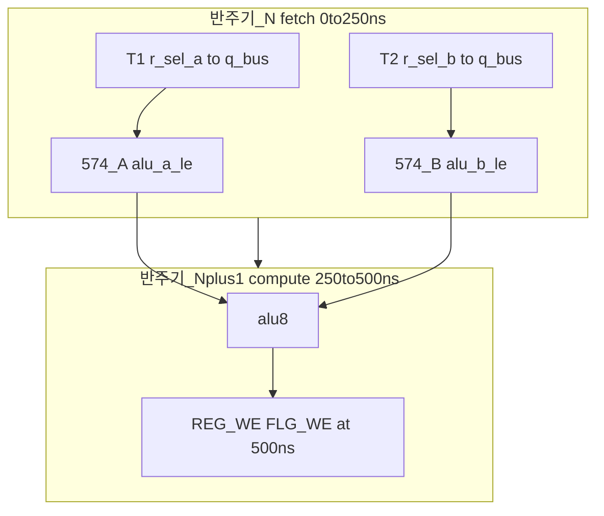

# P1M1 연구 요약 리포트

**제목:** P1 bus-TDM + M1 듀얼 574 통합 변형 (P1M1)  
**Status:** Research (non-normative)  
**Date:** 2026-07-07  
**범위:** [P1](../p1-bus-tdm/SUMMARY-REPORT.md)의 핀 해법과 [M1](../p1-bus-tdm/timing-cross-domain.md#m1--듀얼-574-래치-도식) 타이밍 완화를 **하나의 bring-up 타깃**으로 통합한 연구입니다.

---

## 1. 연구 목적

[P1 bus-TDM](../p1-bus-tdm/SUMMARY-REPORT.md)은 4-GPR + `r_sel` 가변 읽기를 **28/32핀**으로 달성했으나, ALU B를 `q_bus`에 **직결**한 단일 250 ns execute에서 **ADD/INC 타이밍 FAIL**이었습니다.

**P1M1**은 P1 위에 **M1**(ALU B용 574 래치)을 올리고, ph2 execute를 **fetch 250 ns + compute 250 ns** 두 반주기로 나누어 desk 기준 **타이밍을 닫는** 통합안입니다.

---

## 2. 한 줄 결론

| | |
|---|---|
| **핀 (CPLD-DP)** | **PASS** — **29/32** (spare 3) |
| **타이밍 (desk)** | **PASS** — ADD Y≈383 ns @ 500 ns (**+117 ns** slack) |
| **BOM** | **574 ×5** (rev G 대비 **+2**) |
| **ISA opcode** | 변경 없음; ph2 execute **500 ns** (기존 250 ns의 2배) |
| **판정** | P1의 핀 이점 + M1의 타이밍 이점을 **단일 변형**으로 묶음 — WinCUPL·스코프 전 |

---

## 3. 아키텍처 도식

**P1과의 차이:** `q_bus` → ALU B 직결 **제거**; 574 A·B Q가 ALU 피연산자를 공급합니다.

상세: [architecture.md](architecture.md)

---

## 4. 2반주기 시퀀스 (ALU_REG ph2)

| 구간 | 시간 | `op_fetch` | 동작 |
|------|------|------------|------|
| **ph2a (fetch)** | 0–250 ns | 1 | T1: A 래치; T2: B 래치; **REG_WE/FLG_WE 억제** |
| **ph2b (compute)** | 250–500 ns | 0 | `q_bus` TDM 비활성; 574 Q → ALU; **REG_WE/FLG_WE** @ 500 ns |

### 4 MHz 마이크로페이즈 (fetch 반주기 내부)

| 구간 | 시간 | 동작 |
|------|------|------|
| **T1** | 0–125 ns | `r_sel_a` → `q_bus` → **574A** (`alu_a_le` ↑) |
| **T2** | 125–250 ns | `r_sel_b` → `q_bus` → **574B** (`alu_b_le` ↑) |

---

## 5. 핀·BOM·FSM 요약

### 5.1 핀 (CPLD-DP, C0)

| Δ vs P1 | 신호 | Pin |
|---------|------|-----|
| **+1 out** | `alu_b_le` | **33** |
| 배선 | `q_bus` → 574B D only | — |
| **합계** | **29/32** | spare 3 |

CU: P1과 동일 **31/32**.

상세: [pin-map.md](pin-map.md)

### 5.2 BOM

| IC | rev G | P1 | **P1M1** |
|----|-------|-----|----------|
| ATF1504 | 2 | 2 | 2 |
| 74HC574 | 3 | 4 | **5** |
| 74HC74 | 1 | 1 | 1 |

상세: [bom-delta.md](bom-delta.md)

### 5.3 FSM / ISA

| 항목 | rev G | P1M1 |
|------|-------|------|
| ADD mnemonic | `ADD #imm` | 동일 |
| ph2 길이 | 250 ns | **500 ns** |
| 구현 | 단일 ph2 | **ph2a + ph2b** 또는 CU `macro_stretch` |

상세: [fsm-isa-delta.md](fsm-isa-delta.md)

---

## 6. 타이밍 (desk, compute 반주기)

| 연산 | Y @ (ns) | vs 500 ns |
|------|----------|-----------|
| AND | 321 | **PASS +179** |
| ADD | 383 | **PASS +117** |
| SUB | 411 | **PASS +89** |
| INC | 428 | **PASS +72** |

상세: [timing-closed.md](timing-closed.md)

---

## 7. P1 / P1M1 / M2 / rev G 비교

| 변형 | DP 핀 | ADD 타이밍 | 574 (ALU) | ph2 execute | 비고 |
|------|-------|------------|-----------|-------------|------|
| **rev G** | 31/32 | PASS @ 250 ns | 0 | 250 ns | 3-GPR 고정 읽기 |
| **P1** | 28/32 | **FAIL** ~273 ns | 1 (A) | 250 ns | 핀 OK |
| **P1M1** | **29/32** | **PASS** ~383 ns | **2** (A+B) | **500 ns** | **본 연구** |
| **M2** | 28/32 (P1 동일) | PASS @ 500 ns | 0–2 (선택) | 500 ns | FSM row split 중심 |

**구분:** P1M1과 M2는 **동일 500 ns execute**이나, P1M1은 **574 하드웨어 + ph2 stretch**가 정의 특징이고 M2는 **idx5 FSM 분할**이 중심입니다. P1M1은 이후 M2 인코딩을 채택해도 배선은 유지 가능합니다.

---

## 8. 리스크·열린 항목

| 항목 | 내용 |
|------|------|
| **WinCUPL** | `variants/p1m1_dp/system_ctrl.pld` — fit 미실행 |
| **ISA “minimal” 주장** | opcode 수준은 동일하나 **사이클 수준**에서 ph2 2배 — 문서에 명시 |
| **`op_fetch` CU 정책** | DP 자동 토글 vs G-IC `tdm_en` — bring-up 시 확정 |
| **`alu_b_le` @ 250 ns** | fetch half 내 574 setup — desk **PASS**; 스코프 V1–V2 |
| **빵판** | 574×5 면적·전원 — bring-up 메모 |

---

## 9. 권고 next steps

1. **C0** 클럭 + [p1m1_dp PLD](../variants/p1m1_dp/system_ctrl.pld) 스파이크 → WinCUPL **Design fits**
2. 스코프 게이트 V1–V4 ([timing-closed.md](timing-closed.md) §6)
3. CU ph2a/ph2b LUT 또는 `macro_stretch` 프로토타입
4. 통과 시 상위 [4-GPR](../REPORT.md) / ISA 워크스트림과 합류

---

## 10. 산출물 인덱스

| 문서·코드 | 역할 |
|-----------|------|
| [architecture.md](architecture.md) | 블록·`op_fetch`·CU handshake |
| [timing-closed.md](timing-closed.md) | fetch + compute slack |
| [pin-map.md](pin-map.md) | PLCC-44 핀 |
| [fsm-isa-delta.md](fsm-isa-delta.md) | ph2a/ph2b, vs M2 |
| [bom-delta.md](bom-delta.md) | IC 표 |
| [../variants/p1m1_dp/system_ctrl.pld](../variants/p1m1_dp/system_ctrl.pld) | DP WinCUPL 스켈레톤 |

**선행 연구:** [p1-bus-tdm/SUMMARY-REPORT.md](../p1-bus-tdm/SUMMARY-REPORT.md)

---

## 11. 하지 않은 것

- `reference/**` normative 변경 없음
- 빵판 실장·JED burn 없음
- cyclesim 모델 없음

---

## 변경 이력

| 날짜 | 내용 |
|------|------|
| 2026-07-07 | P1M1 통합 연구 요약 초판 |
