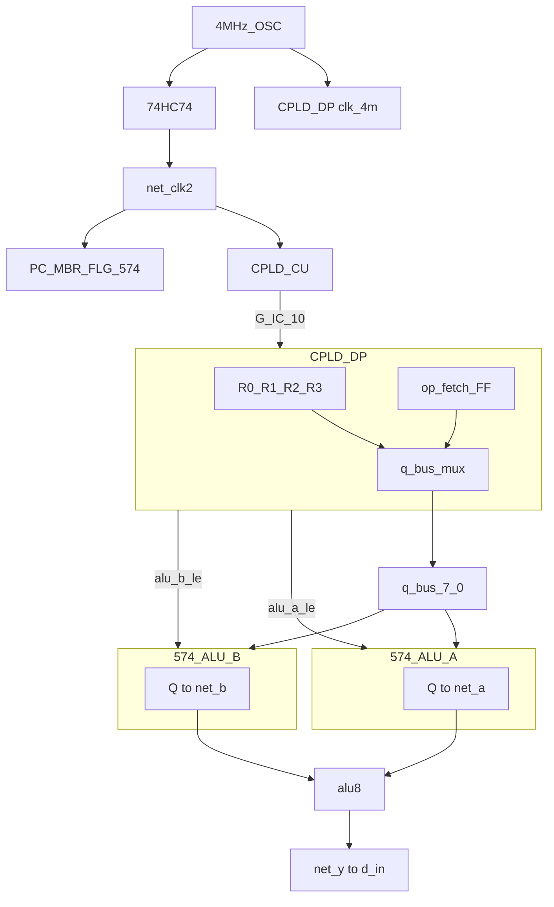
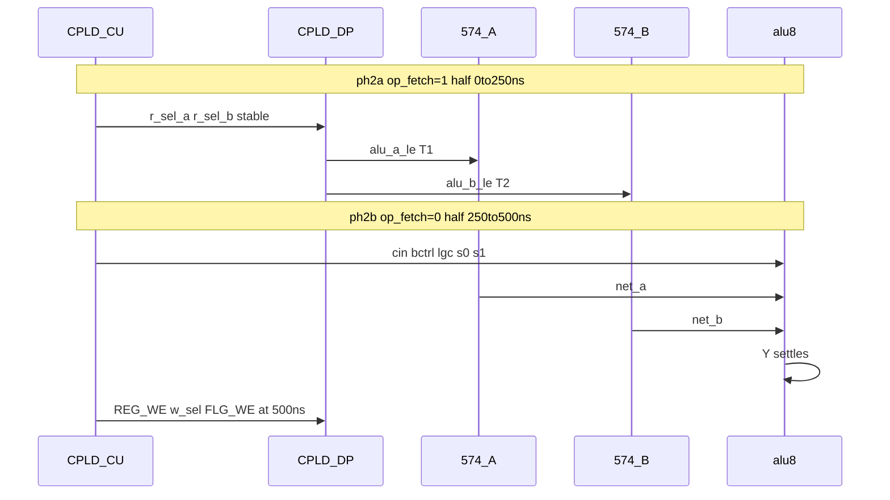

# P1M1 architecture

**Parent:** [README.md](README.md)  
**Baseline P1:** [../p1-bus-tdm/architecture](../p1-bus-tdm/README.md) (implicit in pin-map / REPORT)

---

## 1. Definition

**P1M1** = **P1** (4-GPR, `q_bus` time-division @ 4 MHz) + **M1** (ALU A and B each latched in **74HC574**, ALU comb in **following** 250 ns half-cycle).

| Layer | Mechanism |
|-------|-----------|
| **Pin relief** | P1 `q_bus[8]` replaces 16-bit `q_a`/`q_b` |
| **Operand fetch** | T1: `r_sel_a` → `q_bus` → 574_A; T2: `r_sel_b` → `q_bus` → 574_B |
| **Timing closure** | Compute half uses **latched** `net_a*` / `net_b*` — full 250 ns for ALU |
| **Control** | CU stretches ALU_REG ph2 across **2× `clk_2m` halves** |

---

## 2. Block diagram

**No** `q_bus` → ALU B direct wire (unlike P1 basic).

---

## 3. Clock (topology C0)

Inherited from [clock-topologies.md](../p1-bus-tdm/clock-topologies.md):

| Net | Freq | Consumers |
|-----|------|-----------|
| `clk_4m` | 4 MHz | DP pin 43; `u_phase`, LE pulses |
| `clk_sys` | 2 MHz | GPR FF inside DP (÷2) |
| `net_clk2` | 2 MHz | CU, all 574 CP, `op_fetch` toggle |

One **4 MHz period** = one **T1+T2** fetch window inside **op_fetch=1** half.  
**Next** `clk_2m` half = **op_fetch=0**, compute.

---

## 4. `op_fetch` state (DP desk model)

| `op_fetch` | 2M half | `q_bus` TDM | ALU operands |
|------------|---------|-------------|--------------|
| **1** | Fetch | Active (T1/T2 @ 4M) | 574s capture |
| **0** | Compute | **Tri-state / idle** (mux gated) | 574 Q → ALU |

Toggle: `op_fetch` FF clocks on **`clk_sys` ↑** when CU asserts **`tdm_en`** (desk G-IC wire or decoded from ph2a).

Simplified desk (no extra pin): CU holds ph2 for 2 halves; DP toggles `op_fetch` every `clk_sys` edge while `r_sel_*` valid.

---

## 5. Micro-sequence (ALU_REG ph2)

---

## 6. Delta vs P1 and rev G

| | rev G | P1 | **P1M1** |
|---|-------|-----|----------|
| GPR | 3, fixed read | 4, `r_sel` | 4, `r_sel` |
| ALU feed | `q_a`/`q_b` parallel | `q_bus` TDM; B live | `q_bus` TDM; **both latched** |
| ph2 execute | 250 ns | 250 ns (FAIL ADD) | **500 ns** |
| 574 (ALU) | 0 | 1 (A) | **2** (A+B) |
| DP I/O | 31/32 | 28/32 | **29/32** |

---

## 7. vs M2 (FSM-only stretch)

| | **P1M1** | **M2** |
|---|----------|--------|
| Timing | 2-half execute | 2-half execute |
| Hardware | **+574 B**, `alu_b_le` | Same 574 count if combined with P1 |
| FSM | ph2 **stretch** or ph2a/ph2b rows | Explicit **idx5 row split** |
| Bring-up | Latch + timing proven on scope | LUT table change |

P1M1 can adopt M2 FSM encoding later without changing ALU wiring.

---

## Related

- [timing-closed.md](timing-closed.md)
- [fsm-isa-delta.md](fsm-isa-delta.md)
- [pin-map.md](pin-map.md)
